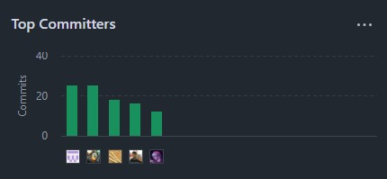
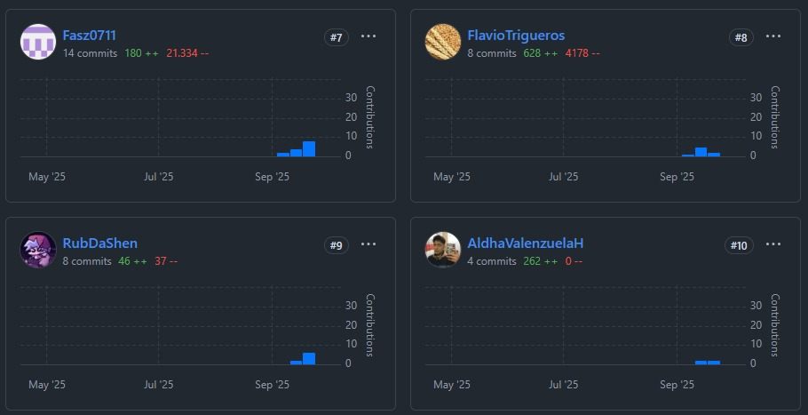
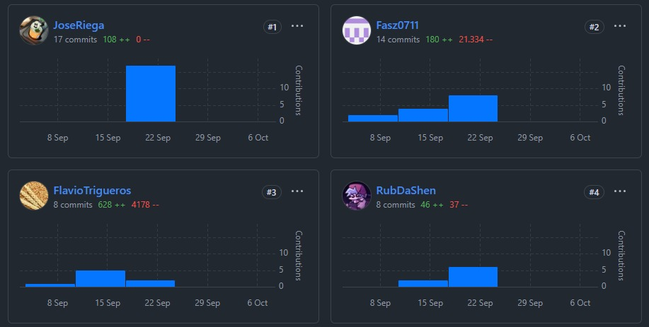
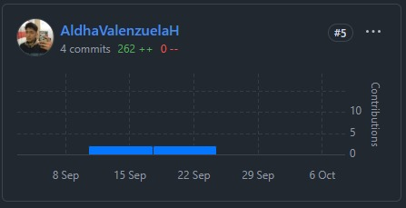

  

## Universidad Peruana de Ciencias Aplicadas

## Ingeniería de Software

## 1ASI0728 Arquitecturas De Software Emergentes 

## 202520

### NRC: 7306

### Profesor: Ernesto Ocampo Tello

### Informe del trabajo final

### Nombre del producto: Mushroom

## Integrantes

- Mallma Quispe, Ruben Elias, u202214234
- Sanchez Zamora, Fabrizio Alessandro, u202213652
- Riega Salas, Jose Miguel, u202211254
- Trigueros Chumacero, Flavio Eduardo, u202210190
- Valenzuela Huillcaya, Aldhair Johan Juan, u20201f572

**Lima, 03 de diciembre**

---

# Registro de Versiones del Informe

<table>
  <thead>
    <tr>
      <th style="background-color: #333; color: #fff;">Versión</th>
      <th style="background-color: #333; color: #fff;">Fecha</th>
      <th style="background-color: #333; color: #fff;">Autor</th>
      <th style="background-color: #333; color: #fff;">Descripción de modificación</th>
    </tr>
  </thead>
  <tbody>
    <tr>
      <td>1.0.0.</td>
      <td>03/09/25</td>
      <td>Riega Salas, Jose Miguel</td>
      <td>Creación del repositorio github de Teemo Solutions junto al modelo de ramas para todos los capítulos, carpetas y documentos a utilizar.</td>
    </tr>
        <tr>
      <td>1.1.0.</td>
      <td>06/09/25</td>
      <td>Riega Salas, Jose Miguel y Trigueros Chumacero, Flavio Eduardo</td>
      <td>Avance capítulo I: redacción del Startup Profile y Solution Profile de Teemo Solutions y Mushroom. Desarrollo del modelo Lean UX con el Problem Statement, Hyphotesis, Assumptions y Lean UX Canvas.</td>
    </tr>
    <tr>
      <td>1.2.0.</td>
      <td>08/09/25</td>
      <td>Riega Salas, Jose Miguel</td>
      <td>Avance capítulo I: Identificación y definición de los segmentos objetivos de Mushroom, junto a sus características.</td>
    </tr>
    <tr>
      <td>1.3.0.</td>
      <td>09/09/25</td>
      <td>Todos los integrantes del equipo</td>
      <td>Avance capítulo II: Búsqueda e identificación de participantes del segmento objetivo: cada integrante contactó y entrevistó a una persona para recopilar información.</td>
    </tr>
    <tr>
      <td>1.4.0.</td>
      <td>12/09/25</td>
      <td>Riega Salas, Jose Miguel y Valenzuela Huillcaya, Aldhair Johan Juan</td>
      <td>Avance capítulo II: Análisis de la información de entrevistas y creación de User Personas. Elaboración de As-Is Scenarios.</td>
    </tr>
    <tr>
      <td>1.5.0.</td>
      <td>13/09/25</td>
      <td>Sanchez Zamora, Fabrizio Alessandro</td>
      <td>Avance capítulo II: Desarrollo de Empathy Maps para cada uno de los User Personas, junto al modelo de Task Matrix.</td>
    </tr>
    <tr>
      <td>1.6.0.</td>
      <td>14/09/25</td>
      <td>Mallma Quispe, Ruben Elias</td>
      <td>Avance capítulo II: Desarrollo de User Journey Mapping para cada uno de los User Persona identificados. Corrección en el desarrollo de User Empathy Mapping.</td>
    </tr>
    <tr>
      <td>1.7.0.</td>
      <td>14/09/25</td>
      <td>Riega Salas, Jose Miguel</td>
      <td>Avance capítulo III: Desarrollo de las historias de usuario de Mushroom junto a su modelo de Impact Mapping y su Product Backlog referente.</td>
    </tr>
    <tr>
      <td>1.8.0.</td>
      <td>14/09/25</td>
      <td>Todos los integrantes del equipo</td>
      <td>Avance capítulo IV: Desarrollo de la sesión de EventStorming con cada uno de los 10 pasos establecidos.</td>
    </tr>
    <tr>
      <td>1.9.0.</td>
      <td>16/09/25</td>
      <td>Trigueros Chumacero, Flavio Eduardo</td>
      <td>Avance capítulo II: Análisis Competitivo junto a identificación de estrategias contra competidores y análisis FODA.</td>
    </tr>
    <tr>
      <td>1.10.0.</td>
      <td>16/09/25</td>
      <td>Trigueros Chumacero, Flavio Eduardo</td>
      <td>Avance capítulo III: Desarrollo de los requisitos funcionales y los requisitos no funcionales de Mushroom</td>
    </tr>
    <tr>
      <td>1.11.0.</td>
      <td>17/09/25</td>
      <td>Valenzuela Huillcaya, Aldhair Johan Juan</td>
      <td>Avance capítulo III: Desarrollo de las historias de usuario junto a los requisitos funcionales y los requisitos no funcionales de Mushroom</td>
    </tr>
     <tr> <td>1.12.0</td> <td>21/09/25</td> <td>Riega Salas, Jose Miguel</td> <td>Avance capítulo IV — formalización de los Bounded Contexts Asset & Resource Management y Notifications tras EventStorming; eliminación y corrección de referencias en Asset & Resource Management (ahora solo puertos y ubicaciones).</td> </tr> <tr> <td>1.13.0</td> <td>22/09/25</td> <td>Mallma Quispe, Ruben Elias</td> <td> Diagrama de Componentes (nivel C4) completo y consecciones divididas para cada Bounded Context. Documentación de cada capa dedicada para Service Operation and Monitoring.</td> </tr> <tr> <td>1.14.0</td> <td>24/09/25</td> <td>Valenzuela Huillcaya, Aldhair Johan Juan</td> <td>Infraestructura: Diseño de esquema MongoDB y notas de implementación para las colecciones `ports` y `ports_read` (índice 2dsphere en location, índice único code, campos createdAt/updatedAt y versión para control optimista). Actualización de contratos de repositorios (IPortRepository).</td> </tr> <tr> <td>1.15.0</td> <td>26/09/25</td> <td>Sanchez Zamora, Fabrizio Alessandro</td> <td>Dominio: Modelado detallado de IncotermAssessment (aggregate), IncotermType y Status; definición de Domain Services (IncotermCalculatorService, CostEstimationService, ValidationService) y eventos (IncotermCalculated / IncotermCalculationFailed). Se documentó idempotencyKey como requisito para el comando de cálculo.</td> </tr> <tr> <td>1.16.0</td> <td>28/09/25</td> <td>Mallma Quispe, Ruben Elias</td> <td>User Stories: Revisión y ampliación de historias de usuario (web y móvil), criterios de aceptación en formato Gherkin (happy / unhappy path), agrupación por épicas alineadas a los 7 bounded contexts y creación de Technical Stories (rol: Developer) para features no expuestos al usuario.</td> </tr> <tr> <td>1.17.0</td> <td>30/09/25</td> <td>Todos los integrantes del equipo</td> <td>Requisitos: Redacción y consolidación de Requisitos Funcionales (RF) y Requisitos No Funcionales (RNF) —incluyendo 15 RNF base y 3 adicionales (eficiencia, compatibilidad, portabilidad)— con métricas, métodos de verificación y prioridad.</td> </tr> <tr> <td>1.18.0</td> <td>02/10/25</td> <td>Riega Salas, Jose Miguel y Trigueros Chumacero, Flavio Eduardo</td> <td>Artefactos técnicos: Creación y actualización del diagrama de clases en PlantUML para IncotermAssessment y Asset & Resource Management; unificación del campo justification (eliminando briefJustification) y eliminación de modelVersion en la entidad, según decisión del equipo.</td> </tr> <tr> <td>1.19.0</td> <td>04/10/25</td> <td>Valenzuela Huillcaya, Aldhair Johan Juan y Sanchez Zamora, Fabrizio Alessandro</td> <td>Arquitectura/Operacional: documentación técnica sobre Outbox (patrón), explicación y ejemplos de idempotencyKey, clarificación de score en justificationItem y reglas de negocio para estados (CALCULATED, FAILED_INSUFFICIENT_DATA, OBSOLETE). Actualización del lenguaje ubicuo (Ubiquitous Language) y tabla Inglés/Español.</td> </tr> <tr> <td>1.20.0</td> <td>06/10/25</td> <td>Mallma Quispe, Ruben Elias y Todos los integrantes</td> <td>UX/UI: Ajustes en Capítulo VI — Style Guidelines y Wireframes; adición de estilos CSS para sangría de primera línea y sangría francesa por sección, y documentación de uso para impresión/formato del informe.</td> </tr> <tr> <td>1.21.0</td> <td>08/10/25</td> <td>Riega Salas, Jose Miguel</td> <td>Solution Profile y ML: Integración del plan de incorporación de Machine Learning (A* + ML híbrido), justificación técnica, métricas objetivo (reducción error medio en predicción de tránsito) y actualización del Solution Profile con estadísticas de impacto operativo y referencias internas.</td> </tr> <tr> <td>1.22.0</td> <td>09/10/25</td> <td>Todos los integrantes del equipo</td> <td>Consolidación final: Correcciones solicitadas por revisión, actualización del registro de versiones (este documento), determinación de entregables pendientes y checklist para la siguiente iteración del roadmap. Aprobación para iniciar la ejecución de las Technical Stories priorizadas.</td> </tr>
     <tr> <td>1.23.0</td> <td>11/10/25</td> <td>Mallma Quispe, Ruben Elias; Valenzuela Huillcaya, Aldhair Johan Juan</td> <td>Documentación del sprint: objetivo, alcance, sprint backlog y Definition of Done. Evidencias de desarrollo: lista de commits y pull requests relevantes, enlaces a PRs y notas de revisión. Evidencia Swagger: colección exportada con endpoints iniciales para Service Operation and Monitoring y contracts básicos. Insight: identificación de dependencias críticas entre bounded contexts y ajuste de prioridades en el backlog.</td> </tr> <tr> <td>1.24.0</td> <td>13/10/25</td> <td>Sanchez Zamora, Fabrizio Alessandro</td> <td>Desarrollo y pruebas: implementación de Domain Services para IncotermCalculatorService (endpoints mock en Swagger) y pruebas unitarias iniciales. Evidencia: reportes de cobertura y logs de pipeline. Entrevistas de validación: resumen de 2 entrevistas con usuarios (planificadores) sobre requisitos de cálculo y formatos de resultado; ajustes solicitados incorporados en technical stories.</td> </tr> <tr> <td>1.25.0</td> <td>15/10/25</td> <td>Riega Salas, Jose Miguel y Trigueros Chumacero, Flavio Eduardo</td> <td>Artefactos de validación: guion y resultados de entrevistas de validación con capitanes y planificadores, retroalimentación sobre prioridad de alertas y formato de reportes. Documentación: acta de reunión de validación y lista de acciones para next sprint. Insight: necesidad de mejorar trazabilidad y justificaciones en justificationItem.</td> </tr> <tr> <td>1.26.0</td> <td>17/10/25</td> <td>Todos los integrantes del equipo</td> <td>Pruebas heurísticas de UX/UI: checklist de heurísticas aplicado a wireframes y prototipos móviles; hallazgos y recomendaciones priorizadas (alta/medio/baja). Evidencias: capturas de pantalla anotadas y registro de issues en el backlog. Sprint backlog: reasignación de tareas UX para TB2 según resultados.</td> </tr> <tr> <td>1.27.0</td> <td>20/10/25</td> <td>Mallma Quispe, Ruben Elias</td> <td>Documentación técnica: actualización del Diagrama de Componentes (C4) con componentes internos para Outbox y repositorios; inclusión de contrato Swagger actualizado y ejemplos de requests/responses para endpoints críticos. Evidencia de desarrollo: snapshot de colección Swagger y Postman con escenarios de integración.</td> </tr> <tr> <td>1.28.0</td> <td>23/10/25</td> <td>Valenzuela Huillcaya, Aldhair Johan Juan</td> <td>Infraestructura y pruebas: despliegue de ambiente de integración (staging) para pruebas end-to-end; scripts de seed y datos de prueba para `ports`/`ports_read`. Evidencias: logs de despliegue, endpoints Swagger disponibles en staging y runbook de pruebas de integración.</td> </tr> <tr> <td>1.29.0</td> <td>26/10/25</td> <td>Sanchez Zamora, Fabrizio Alessandro y Mallma Quispe, Ruben Elias</td> <td>Calidad de software: ejecución de pruebas de integración y contract testing para IPortRepository; reporte de defectos y resolución de issues críticos. Evidencia Swagger: contratos versionados y tests automáticos que validan schema de respuesta. Insight: ajuste en contratos para soportar idempotencyKey en comandos.</td> </tr> <tr> <td>1.30.0</td> <td>29/10/25</td> <td>Riega Salas, Jose Miguel</td> <td>ML / Solution Profile: documentación de experimentos A* + ML (dataset sintético), métricas objetivo y resultados preliminares; registro de notebooks y endpoints de inferencia documentados en Swagger para pruebas controladas. Evidencias: reporte de experimentos, dashboard de métricas y recomendaciones para pipeline de producción.</td> </tr> <tr> <td>1.31.0</td> <td>02/11/25</td> <td>Trigueros Chumacero, Flavio Eduardo</td> <td>Validación de UX técnico: sesiones de prueba con usuarios operativos (usability testing) y registro de tiempos de tarea y errores; ajustes en UI y especificaciones para mensajes de alerta (niveles de confianza). Evidencias: scripts de test, grabaciones y matriz de hallazgos con priorización para backlog.</td> </tr> <tr> <td>1.32.0</td> <td>07/11/25</td> <td>Todos los integrantes del equipo</td> <td>Consolidación de sprint: entrega de artefactos del sprint (documentación, evidencia Swagger, PRs cerrados) y demo interna. Sprint retrospective: lecciones aprendidas documentadas (mejor estimación de tareas, comunicación inter-bounded contexts) y acciones de mejora incorporadas al roadmap. Evidencia: acta de retro y checklist completada.</td> </tr> <tr> <td>1.33.0</td> <td>14/11/25</td> <td>Mallma Quispe, Ruben Elias; Sanchez Zamora, Fabrizio Alessandro</td> <td>Pruebas de aceptación y evidencia de integración: ejecución de Acceptance Tests en staging contra colecciones reales de prueba; reporte de resultados y firma de aceptación parcial por stakeholders. Documentación: guía de uso de endpoints (Swagger + ejemplos) y changelog de contratos. Insight: necesidad de pruebas de carga para endpoints de ruteo.</td> </tr> <tr> <td>1.34.0</td> <td>21/11/25</td> <td>Riega Salas, Jose Miguel y Todos los integrantes</td> <td>Consolidación final de iteración: registro de evidencias de desarrollo (PRs, issues cerrados), colección Swagger finalizada con ejemplos y documentación auto-generada, lista de entrevistas de validación realizadas y resumen de pruebas heurísticas completadas. Sprint backlog actualizado con prioridades para la siguiente iteración y aprobación para despliegue de features no críticas a staging.</td> </tr>
  </tbody>
</table>

---

# Project Report Collaboration Insights
Para este proyecto hemos utilizado las herramientas GitHub para gestionar el progreso grupal. Puede acceder a nuestra organización pulsando sobre el siguiente ícono:

  

## Members of the team on GitHub

<table>
  <thead>
    <tr>
      <th style="background-color: #333; color: #fff;">Apellidos y Nombres</th>
      <th style="background-color: #333; color: #fff;">Github Account</th>
    </tr>
  </thead>
  <tbody>
    <tr>
      <td>Mallma Quispe, Ruben Elias</td>
      <td><a href="https://github.com/RubDaShen">RubDaShen</a></td>
    </tr>
    <tr>
      <td>Sanchez Zamora, Fabrizio Alessandro</td>
      <td><a href="https://github.com/Fasz0711">Fasz0711</a></td>
    </tr>
    <tr>
      <td>Riega Salas, Jose Miguel</td>
      <td><a href="https://github.com/JoseRiega">JoseRiega</a></td>
    </tr>
        <tr>
      <td>Trigueros Chumacero, Flavio Eduardo</td>
      <td><a href="https://github.com/FlavioTrigueros">FlavioTrigueros</a></td>
    </tr>
    <tr>
      <td>Valenzuela Huillcaya, Aldhair Johan Juan</td>
      <td><a href="https://github.com/AldhaValenzuelaH">AldhaValenzuelaH</a></td>
    </tr>
  </tbody>
</table>

## Team Collaborations Insights

A continuación, se presentan los gráficos de colaboración de los integrantes del equipo en el repositorio de nuestro primer sprint. Estos gráficos ofrecen una representación visual de la cantidad de contribuciones realizadas por cada miembro del equipo, junto con la fecha en que se llevaron a cabo. Además, se presenta información sobre la cantidad de líneas de código que se han modificado en cada uno de los commits.

# Tabla de Contenidos

##### [Registro de versiones del informe](#registro-de-versiones-del-informe)
##### [Project Report Collaboration Insights](#project-report-collaboration-insights)
##### [Student Outcome](#student-outcome)

##### [Capítulo I: Introducción](#capítulo-i-introducción)
- [1.1. Startup Profile](#11-startup-profile)
    - [1.1.1. Descripción de la Startup](#111-descripción-de-la-startup)
    - [1.1.2. Perfiles de integrantes del equipo](#112-perfiles-de-integrantes-del-equipo)
- [1.2. Solution Profile](#12-solution-profile)
    - [1.2.1. Antecedentes y problemática](#121-antecedentes-y-problemática)
    - [1.2.2. Lean UX Process](#122-lean-ux-process)
      - [1.2.2.1. Lean UX Problem Statements](#1221-lean-ux-problem-statements)
      - [1.2.2.2. Lean UX Assumptions](#1222-lean-ux-assumptions)
      - [1.2.2.3. Lean UX Hypothesis Statements](#1223-lean-ux-hypothesis-statement)
      - [1.2.2.4. Lean UX Canvas](#1224-lean-ux-canvas)
- [1.3. Segmentos objetivo](#13-segmentos-objetivos)

##### [Capítulo II: Requirements Elicitation & Analysis](#capítulo-ii-requirements-elicitation--analysis)
- [2.1. Competidores](#21-competidores)
  - [2.1.1. Análisis competitivo](#211-análisis-competitivo)
  - [2.1.2. Estrategias y tácticas frente a competidores](#212-estrategias-y-tácticas-frente-a-competidores)
- [2.2. Entrevistas](#22-entrevistas)
  - [2.2.1. Diseño de entrevistas](#221-diseño-de-entrevistas)
  - [2.2.2. Registro de entrevistas](#222-registro-de-entrevistas)
  - [2.2.3. Análisis de entrevistas](#223-análisis-de-entrevistas)
- [2.3. Needfinding](#23-needfinding)
  - [2.3.1. User Persona](#231-user-persona)
  - [2.3.2. User Task Matrix](#232-user-task-matrix)
  - [2.3.3. User Journey Mapping](#233-user-journey-mapping)
  - [2.3.4. Empathy Mapping](#234-empathy-mapping)
  - [2.3.5. As-is Scenario Mapping](#235-as-is-scenario-mapping)
- [2.4. Ubiquitous Language](#236-ubiquitous-language)

##### [Capítulo III: Requirements Specification](#capítulo-iii-requirements-specification)
- [3.1. To-Be Scenario Mapping](#31-to-be-scenario-mapping)
- [3.2. User Stories](#32-user-stories)
- [3.3. Requisitos Funcionales](#33-requisitos-funcionales)
- [3.4. Requisitos No Funcionales](#34-requisitos-no-funcionales)
- [3.5. Impact Mapping](#35-impact-mapping)
- [3.6. Product Backlog](#36-product-backlog)

##### [Capítulo IV: Strategic-Level Software Design](#capítulo-iv-strategic-level-software-design)
- [4.1. Strategic-Level Attribute-Driven Design](#41-strategic-level-attribute-driven-design)
- [4.1.1. Design Purpose](#411-design-purpose)
- [4.1.2. Attribute-Driven Design Input](#412-attribute-driven-design)
- [4.1.2.1. Primary Functionality](#4121-primary-functionality)
- [4.1.2.2. Quality attribute Scenarios](#4122-quality-attribute-scenarios)
- [4.1.2.3. Constraints](#4123-constraints)
- [4.1.3. Architectural Drivers Backlog](#413-architectural-drivers-backlog)
- [4.1.4. Architectural Design Decisions](#414-architectural-drivers-decisions)
- [4.1.5. Quality Attribute Scenario Refinement](#415-quality-attribute-scenario-refinement)
- [4.2. Strategic-Level Domain-Driven Design](#42-strategic-level-domain-driven-design)
- [4.2.1. EventStorming](#421-eventstorming)
- [4.2.2. Candidate Context Discovery](#422-candidate-context-discovery)
- [4.2.3. Domain Message Flows Modeling](#423-domain-message-flows-modeling)
- [4.2.4. Bounded Context Canvases](#424-bounded-context-canvases)
- [4.2.5. Context Mapping](#425-context-mapping)
- [4.3. Software Architecture](#43-software-architecture)
- [4.3.1. Software Architecture System Landscape Diagram](#431-software-architecture-system-landscape-diagram)
- [4.3.2. Software Architecture Context Level Diagrams](#432-sofware-architecture-context-level-diagrams)
- [4.3.3. Software Architecture Container Level Diagrams](#433-software-architecture-container-level-diagrams)
- [4.3.4. Software Architecture Deployment Diagrams](#434-software-architecture-deployment-diagrams)

##### [Capítulo VI: Product Design](#capítulo-iv-product-design)
- [6.1. Style Guidelines](#41-style-guidelines)
    - [6.1.1. General Style Guidelines](#411-general-style-guidelines)
    - [6.1.2. Web Style Guidelines](#412-web-style-guidelines)
    - [6.1.3. Mobile Style Guidelines](#413-mobile-style-guidelines)
        - [6.1.3.1. iOS Mobile Style Guidelines](#4131-ios-mobile-style-guidelines)
        - [6.1.3.2. Android Mobile Style Guidelines](#4132-android-mobile-style-guidelines)
- [6.2. Information Architecture](#42-information-architecture)
    - [6.2.1. Organization Systems](#421-organization-systems)
    - [6.2.2. Labeling Systems](#422-labeling-systems)
    - [6.2.3. SEO Tags and Meta Tags](#423-seo-tags-and-meta-tags)
    - [6.2.4. Searching Systems](#424-searching-systems)
    - [6.2.5. Navigation Systems](#425-navigation-systems)
- [6.3. Landing Page UI Design](#43-landing-page-ui-design)
    - [6.3.1. Landing Page Wireframe](#431-landing-page-wireframe)
    - [6.3.2. Landing Page Mock-up](#432-landing-page-mock-up)
- [6.4. Mobile Applications UX/UI Design](#44-mobile-applications-uxui-design)
    - [6.4.1. Mobile Applications Wireframes](#441-mobile-applications-wireframes)
    - [6.4.2. Mobile Applications Wireflow Diagrams](#442-mobile-applications-wireflow-diagrams)
    - [6.4.3. Mobile Applications Mock-ups](#443-mobile-applications-mock-ups)
    - [6.4.4. Mobile Applications User Flow Diagrams](#444-mobile-applications-user-flow-diagrams)
- [6.5. Mobile Applications Prototyping](#45-mobile-applications-prototyping)
    - [6.5.1. Android Mobile Applications Prototyping](#451-android-mobile-applications-prototyping)
    - [6.5.2. iOS Mobile Applications Prototyping](#452-ios-mobile-applications-prototyping)
- [6.6. Web Applications UX/UI Design](#46-web-applications-uxui-design)
    - [6.6.1. Web Applications Wireframes](#461-web-applications-wireframes)
    - [6.6.2. Web Applications Wireflow Diagrams](#462-web-applications-wireflow-diagrams)
    - [6.6.3. Web Applications Mock-ups](#463-web-applications-mock-ups)
    - [6.6.4. Web Applications User Flow Diagrams](#464-web-applications-user-flow-diagrams)
- [6.7. Web Applications Prototyping](#47-web-applications-prototyping)
- [6.8. Domain-Driven Software Architecture](#48-domain-driven-software-architecture)
    - [6.8.1. Software Architecture Context Diagram](#481-software-architecture-context-diagram)
    - [6.8.2. Software Architecture Container Diagrams](#482-software-architecture-container-diagrams)
    - [6.8.3. Software Architecture Components Diagrams](#483-software-architecture-components-diagrams)
- [6.9. Software Object-Oriented Design](#49-software-object-oriented-design)
    - [6.9.1. Class Diagrams](#491-class-diagrams)
    - [6.9.2. Class Dictionary](#492-class-dictionary)
- [6.10. Database Design](#410-database-design)
    - [6.10.1. Relational/Non-Relational Database Diagram](#4101-relationalnon-relational-database-diagram)

##### [Capítulo VII: Product Implementation](#capítulo-v-product-implementation)
- [7.1. Software Configuration Management](#51-software-configuration-management)
    - [7.1.1. Software Development Environment Configuration](#511-software-development-environment-configuration)
    - [7.1.2. Source Code Management](#512-source-code-management)
    - [7.1.3. Source Code Style Guide & Conventions](#513-source-code-style-guide--conventions)
    - [7.1.4. Software Deployment Configuration](#514-software-deployment-configuration)
- [7.2. Product Implementation & Deployment](#52-product-implementation--deployment)
    - [7.2.1. Sprint Backlogs](#521-sprint-backlogs)
    - [7.2.2. Implemented Landing Page Evidence](#522-implemented-landing-page-evidence)
    - [7.2.3. Implemented Frontend-Web Application Evidence](#523-implemented-frontend-web-application-evidence)
    - [7.2.4. Implemented Native-Mobile Application Evidence](#524-implemented-native-mobile-application-evidence)
    - [7.2.5. Implemented RESTful API and/or Serverless Backend Evidence](#525-implemented-restful-api-andor-serverless-backend-evidence)
    - [7.2.6. RESTful API documentation](#526-restful-api-documentation)
    - [7.2.7. Team Collaboration Insights](#527-team-collaboration-insights)
- [7.3. Video About-the-Product](#53-video-about-the-product)

##### [Conclusiones](#Conclusiones)

##### [Bibliografía](#bibliografía)

- - -
# Student Outcome
El curso tiene el Student Outcome 4:

_ABET – EAC - Student Outcome 4
Criterio: La capacidad de reconocer responsabilidades éticas y profesionales en
situaciones de ingeniería y hacer juicios informados, que deben considerar el
impacto de las soluciones de ingeniería en contextos globales, económicos,
ambientales y sociales._

En la siguiente tabla se visualiza cómo las tareas de cada integrante contribuyen al cumplimiento de los aspectos que maneja el Outcome y las conclusiones realizadas de manera grupal.

<table>
  <thead>
    <tr>
      <th style="background-color: #333; color: #fff;">Criterio Específico</th>
      <th style="background-color: #333; color: #fff;">Acciones Realizadas</th>
      <th style="background-color: #333; color: #fff;">Conclusiones</th>
    </tr>
  </thead>
  <tbody>
    <tr>
      <td>Comunica oralmente sus ideas y/o resultados con objetividad a público de diferentes especialidades y niveles jerarquicos, en el marco del desarrollo de un proyecto en ingeniería</td>
        <td>
        <strong>ENTREGABLE TB1:</strong>
          
        <strong>Mallma Quispe, Rubén Elías - TB1:</strong>
         Expone con objetividad la arquitectura de Mushroom, articulando el System Landscape, los diagramas Context/Container y el Deployment para audiencias técnicas y gerenciales. Demuestra dominio al explicar cómo las decisiones de capas, contenedores y nodos de despliegue soportan el cómputo de rutas con A* e IA, integrando el consumo de APIs de eventos meteorológicos y geopolíticos. Adapta el discurso según el nivel jerárquico, responde preguntas con evidencia y vincula la arquitectura con riesgos, disponibilidad y escalabilidad requeridas por clientes navieros. 
          
          <strong>TP:</strong>
           Comunica con objetividad la estructura y responsabilidades de las capas del bounded context Service Operations and Monitoring, articulando cómo cada componente soporta la observabilidad del sistema y la gestión de métricas de desempeño. Expone la integración entre monitoreo en tiempo real, registro de eventos y actualización de indicadores operativos ante públicos de distintas especialidades, explicando las decisiones técnicas que equilibran precisión de seguimiento y eficiencia en la transmisión de datos. 
          <strong>TB2:</strong>
           Presenta las mejoras a la arquitectura de Mushroom, contrastando explícitamente los cambios respecto a TB1. Comunica con objetividad cómo estas mejoras responden a retroalimentación previa y fortalecen la capacidad del sistema para reducir riesgos operacionales, optimizar consumo de recursos y mitigar impactos ambientales derivados de rutas ineficientes. Adapta su discurso a audiencias técnicas y gerenciales, explicando con claridad las implicancias económicas, regulatorias y de seguridad marítima de las decisiones arquitectónicas. 
          <strong>TF:</strong>
           Demostró la capacidad de reconocer responsabilidades éticas y profesionales al diseñar e implementar los Web Services y el backend de Mushroom, priorizando la seguridad, trazabilidad y disponibilidad de datos en contextos marinos críticos. En sus entregables (TB1/TP/TB2) justificó decisiones técnicas —control de acceso, cifrado, políticas de logging y límites de recursos— con explicaciones claras sobre cómo esas elecciones protegen la confidencialidad de tripulaciones y clientes, minimizan riesgos operativos y cumplen con requisitos regulatorios internacionales. Además evaluó trade-offs económicos (costos de cómputo vs. precisión de ruteo) y ambientales (optimizaciones que reducen consumo de combustible), demostrando juicios informados que integran impactos técnicos, sociales y globales en la solución final. 
          
        <strong>Riega Salas, José Miguel - TB1:</strong>
         Presenta con claridad la organización, el Event Storming y el Domain Message Flow Modeling, destacando cómo los flujos de eventos (clima, incidentes, alertas de piratería) se transforman en comandos y proyecciones útiles para planeamiento de rutas seguras. Comunica a operaciones, data y management usando un lenguaje preciso y objetivos verificables; argumenta el valor del enfoque dirigido por dominio para reducir ambigüedades y alinear negocio-tecnología en el contexto marítimo. 
          
          <strong>TP:</strong>
           Comunica con objetividad la arquitectura de capas del bounded context IAM, vinculando las políticas de autenticación y autorización con los requerimientos de seguridad del sistema. Presenta cómo los mecanismos de control de acceso, cifrado y gestión de roles garantizan confidencialidad y trazabilidad ante audiencias técnicas y gerenciales, explicando los compromisos entre robustez de seguridad y facilidad de uso. 
          
        <strong>TB2:</strong>
           Expone las mejoras en el Event Storming y el Domain Message Flow Modeling, destacando la inclusión de nuevos eventos y flujos excepcionales. Comunica con objetividad cómo los flujos refinados reducen ambigüedades y ayudan a tomar decisiones informadas sobre rutas más seguras y responsables. 
          
                  <strong>TF:</strong>
           Aplicó un enfoque profesional y ético al desarrollar los componentes de IA y el front-end, documentando las implicancias de diseño sobre la transparencia, confiabilidad y sesgo en los algoritmos de ruteo. En presentaciones y entregables (TB1/TP/TB2) comunicó cómo las señales de eventos (clima, incidentes, alertas de seguridad) se transforman en decisiones automáticas y en qué condiciones humanas deben intervenir, defendiendo mecanismos de trazabilidad y control humano para evitar decisiones peligrosas o injustas. También evaluó el impacto social y económico de la interfaz (claridad, carga informativa en el puente de mando) y propuso ajustes que equilibran usabilidad con seguridad y responsabilidad operacional.  
        <strong>Sánchez Zamora, Fabrizio Alessandro - TB1:</strong>
         Sustenta oralmente el Design purpose, los atributos de diseño de entrada, la funcionalidad primaria y los quality attributes, explicando cómo cada atributo (confiabilidad, rendimiento, resiliencia) impacta en la promesa de “ruta más segura y rápida”. Expone con ejemplos comprensibles para distintas especialidades y niveles jerárquicos, y justifica prioridades de diseño frente a restricciones reales (latencia del API, ventanas de actualización de datos, zonas de exclusión). 
          
          <strong>TP:</strong>
           Comunica con objetividad las capas del bounded context Profile and Preferences, mostrando cómo la estructura de datos y servicios permite la personalización de experiencias y configuraciones de usuario. Expone la relación entre modelos de dominio, preferencias almacenadas y comportamiento adaptativo del sistema, atendiendo preguntas de diferentes niveles jerárquicos y justificando el equilibrio entre flexibilidad del perfil y consistencia de la información. 
          
        <strong>TB2:</strong>
           Presenta la versión refinada del Design purpose, la funcionalidad primaria y los quality attributes, enfatizando cómo se ajustaron métricas y escenarios para reflejar mejor el impacto en tiempos de tránsito, costos operativos, emisiones y niveles de riesgo. Comunica con ejemplos concretos para diferentes especialidades cómo los trade-offs entre rendimiento, confiabilidad y seguridad se han reevaluado, argumentando decisiones que priorizan rutas responsables frente a opciones que podrían ser económicamente atractivas pero más riesgosas o ambientalmente costosas.  
                            <strong>TF:</strong>
           Demostró conciencia ética y profesional al diseñar mejoras de UI enfocadas en la claridad operativa y reducción de carga cognitiva en el puente de mando —priorizando la seguridad de la tripulación y la interpretabilidad de alertas críticas—. En TB1/TP/TB2 argumentó cómo la presentación de alertas, niveles de confianza y recomendaciones de ruteo debe balancear precisión informativa y facilidad de uso para evitar errores humanos en decisiones de alto riesgo. Sus propuestas consideraron además efectos sociales (capacitación y accesibilidad) y regulatorios (registro de decisiones), contribuyendo a una solución que integra usabilidad, responsabilidad y mitigación de impactos. 
          
        <strong>Trigueros Chumacero, Flavio Eduardo - TB1:</strong>
         Comunica con objetividad los requisitos funcionales y no funcionales y la sección de Candidate Context Mapping, enlazando necesidades de usuarios (planificadores, capitanes) con capacidades del sistema (cálculo A*, ingestión de eventos, monitor de riesgos). Co-presenta resultados del Event Storming, gestionando preguntas de diversas áreas y jerarquías; explica trade-offs entre precisión de predicción, costo computacional y experiencia de usuario en el puente de mando. 
          
          <strong>TP:</strong>
           Comunica con objetividad las capas del bounded context Notifications, describiendo cómo se orquesta el flujo de alertas proactivas ante eventos críticos del entorno marítimo. Presenta ante públicos de diversa especialidad las decisiones arquitectónicas que aseguran inmediatez, fiabilidad y relevancia de las notificaciones, explicando los compromisos entre frecuencia de envío, consumo de recursos y claridad del mensaje para el usuario. 
          
        <strong>TB2:</strong>
           Comunica oralmente las mejoras en los requisitos funcionales y no funcionales, así como el refinamiento del Candidate Context Mapping. Explica con objetividad cómo se ajustaron historias de usuario, restricciones y dependencias para reflejar nuevos requerimientos de trazabilidad, regulaciones internacionales y alertas tempranas ante eventos de riesgo. Ante audiencias de distintas jerarquías, expone los compromisos entre granularidad de la información, carga de trabajo para la tripulación y claridad operativa en el puente de mando, vinculando estos cambios con una toma de decisiones más segura y responsable. 
          <strong>TF:</strong>
           Mostró juicio informado y responsabilidad profesional al concentrarse en las mejoras de rendimiento del cliente móvil, priorizando latencia, resiliencia y consumo energético para minimizar riesgos en escenarios marinos reales. Sus cambios (TB1 → TB2) consideraron implicancias económicas (costos de transmisión y procesamiento), ambientales (optimización que reduce uso de recursos y emisiones indirectas) y de seguridad (robustez frente a conectividad intermitente), justificando decisiones de diseño técnico con métricas y escenarios de calidad que evidencian un enfoque responsable y orientado al impacto global de la solución. 
          
        <strong>Valenzuela Huillcaya, Aldhair Johan Juan - TB1:</strong>
         Explica con solvencia el Architectural Drivers Backlog, las decisiones de diseño arquitectural y los refinamientos de escenarios de quality attributes, mostrando trazabilidad desde drivers (seguridad, disponibilidad, actualizaciones de riesgo) hasta soluciones concretas (patrones, particionamiento, tolerancia a fallas). Adapta ejemplos y métricas para audiencias mixtas, y concluye con implicancias operativas para empresas navieras y reguladores. 
          
          <strong>TP:</strong>
           Comunica con objetividad la estructura de las capas del bounded context A/AI Process*, enlazando los mecanismos de cálculo de rutas inteligentes con los objetivos de eficiencia y seguridad operacional. Co-presenta los resultados del diseño, explicando ante distintas jerarquías los trade-offs entre precisión del algoritmo A*, costo computacional y capacidad de respuesta en condiciones dinámicas del entorno marítimo. 
          
        <strong>TB2:</strong>
           Presenta las mejoras al Architectural Drivers Backlog y a las decisiones arquitectónicas asociadas, destacando cómo se incorporaron con mayor énfasis drivers relacionados con seguridad, cumplimiento normativo, sostenibilidad y transparencia frente a reguladores. Comunica con objetividad las alternativas consideradas y justifica las decisiones finales, explicando ante públicos técnicos y gerenciales cómo la arquitectura actualizada permite un seguimiento más responsable del riesgo, de las emisiones y de la continuidad operativa en contextos globales complejos. 
          
        <strong>TF:</strong>
           Evidenció responsabilidad profesional y ética en la elaboración de la documentación y los diagramas (System Landscape, Context/Container, Deployment, Candidate Context Mapping), cuidando la objetividad, trazabilidad y verificabilidad de supuestos y criterios de aceptación. Sus entregables presentaron narrativas y tablas que explican cómo decisiones de diseño afectan seguridad operativa, coste y emisiones, facilitando a stakeholders regulatorios y operacionales la evaluación del impacto socio-económico y ambiental. El trabajo de F hizo explícitos los riesgos, dependencias y criterios de testabilidad, permitiendo juicios informados y responsables por parte del equipo y terceros. 
          
      <td>
        <strong>ENTREGABLE TB1:</strong>
          
         El equipo demostró, de forma objetiva y ante públicos de diversa especialidad y jerarquía, dominio integral del proyecto Temmo/Mushroom. La exposición abarcó desde la arquitectura (paisaje de sistema, contextos, contenedores y despliegue) hasta la traducción de eventos del dominio marítimo (meteorológicos y geopolíticos) en decisiones operativas mediante Event Storming y Domain Message Flow Modeling. Se evidenció capacidad para explicar el propósito de diseño, la funcionalidad primaria y los atributos de calidad —confiabilidad, rendimiento, resiliencia—, así como para argumentar drivers arquitecturales, decisiones y escenarios refinados que sustentan el cálculo de rutas óptimas con A* e IA. 
          
        <strong>TP:</strong>
           El equipo de trabajo evidenció una comunicación objetiva y técnica al presentar los resultados y decisiones de diseño de cada bounded context. Cada integrante expuso con claridad la relación entre los requerimientos del usuario y las capacidades arquitectónicas del sistema, manteniendo coherencia conceptual y adecuando su discurso a distintos niveles jerárquicos y especialidades. Esta presentación conjunta reflejó un enfoque integral y colaborativo en el desarrollo del proyecto de ingeniería. 
          
        <strong>TB2:</strong>
           El equipo fortaleció su capacidad de comunicación oral al presentar no solo el estado del proyecto, sino también las mejoras realizadas respecto a TB1 y su justificación frente a responsabilidades profesionales y contextos de impacto. Cada integrante expuso con objetividad cómo los cambios en arquitectura, requisitos, flujos de eventos y drivers arquitecturales responden a riesgos reales del dominio marítimo, a regulaciones internacionales y a la necesidad de operar de manera más segura, eficiente y sostenible. 
            
            <strong>TF:</strong>
           El equipo, en su conjunto, demostró la capacidad de reconocer responsabilidades éticas y profesionales y de tomar juicios informados que consideran impactos globales, económicos, ambientales y sociales. A través de presentaciones orales y documentación técnica (TB1, TP y TB2) se evidenció un enfoque integrado: seguridad y trazabilidad en el backend, documentación transparente y verificable, transparencia y control humano en IA y UI, y optimizaciones de rendimiento con consciencia ambiental y operacional. Las decisiones fueron justificadas con métricas, escenarios de calidad y análisis de trade-offs, mostrando que el equipo no solo desarrolló una solución técnica viable, sino que también incorporó principios profesionales y éticos para minimizar riesgos, cumplir regulaciones y mitigar impactos económicos y ambientales en el dominio marítimo. 
            
          
      </td>
      </tr>
      <tr>
      <td>Comunica en forma escrita ideas y/o resultados con objetividad a público de diferentes especialidades y niveles jerarquicos, en el marco del desarrollo de un proyecto en ingeniería</td>
      <td>
          
        <strong>Mallma Quispe, Rubén Elías - TB1:</strong> message here
         Documenta la arquitectura de Mushroom con System Landscape, Context/Container y Deployment Diagrams, empleando notación consistente, supuestos explícitos y criterios de aceptación. Redacta secciones que conectan la topología de servicios con el algoritmo A* y la integración de APIs climáticas/geopolíticas, asegurando comprensión transversal (desarrollo, operaciones, dirección) y facilitando decisiones de infraestructura. 
          
        <strong>TP:</strong>
           Redacta con precisión técnica los resultados del diseño de las capas del bounded context Service Operations and Monitoring, describiendo el flujo de información y la interacción entre componentes de seguimiento y métricas. Su documentación transmite objetivamente los alcances funcionales y las decisiones arquitectónicas, facilitando la comprensión de lectores con distintos niveles técnicos. 
          
        <strong>TB2:</strong>
           Actualiza la documentación de la arquitectura de Mushroom incorporando comparaciones explícitas entre TB1 y la versión mejorada: se detallan cambios en System Landscape, Context/Container y Deployment Diagrams, así como nuevas decisiones de particionamiento y resiliencia. Redacta secciones que explican por qué estos ajustes son necesarios para mejorar la continuidad operativa, la gestión de fallas y el uso responsable de recursos en entornos marítimos globales. Su escritura mantiene objetividad y precisión, facilitando que lectores de diferentes niveles jerárquicos comprendan cómo la arquitectura refinada contribuye a mitigar impactos económicos y ambientales de rutas subóptimas. 
          
                <strong>TF:</strong>
           Demostró competencia en comunicación escrita al documentar los Web Services y el backend de Mushroom con precisión técnica, empleando System Landscape, diagramas de despliegue y secciones que enlazan la topología de servicios con el algoritmo A* y las integraciones de APIs externas; sus informes (TB1/TP/TB2) incluyen supuestos explícitos, criterios de aceptación y tablas que facilitan la evaluación por parte de desarrolladores, operaciones y dirección, y comunican objetivamente cómo las decisiones de seguridad, logging y escalamiento impactan la confidencialidad, disponibilidad, costes operativos y cumplimiento regulatorio en contextos marítimos. 
          
        <strong>Riega Salas, José Miguel - TB1:</strong> message here
         Elabora documentación de Event Storming y Domain Message Flow Modeling con catálogos de eventos, comandos y políticas, acompañados de glosario de términos del dominio marítimo. Presenta diagramas y narrativas breves que permiten a áreas técnicas y de negocio seguir el flujo de información desde los eventos (tormentas, cierres de rutas) hasta las actualizaciones de la ruta óptima, con criterios de objetividad y verificabilidad. 
          
        <strong>TP:</strong>
           Elabora informes claros y estructurados sobre la arquitectura del bounded context IAM, explicando los mecanismos de autenticación, autorización y control de acceso. Su comunicación escrita destaca por la objetividad con que relaciona los requisitos de seguridad con las soluciones implementadas, dirigiéndose eficazmente a audiencias tanto técnicas como de gestión. 
          
        <strong>TB2:</strong>
           Mejora la documentación de Event Storming y Domain Message Flow Modeling, añadiendo catálogos de eventos extendidos, flujos alternos y condiciones excepcionales. Redacta narrativas claras que muestran cómo estos flujos actualizados permiten una mejor detección de riesgos (tormentas súbitas, zonas restringidas, conflictos geopolíticos) y una reacción más responsable por parte del sistema. Optimiza y mejora el sistema de enrutamiento implementando A/AI Process*. 
                  <strong>TF:</strong>
           Mostró habilidad para escribir informes técnicos y narrativas de diseño que describen el flujo de señales desde eventos del dominio hasta decisiones algorítmicas, documentando catálogos de entradas, métricas y condiciones de intervención humana; en TB1/TP/TB2 redactó secciones que abordan transparencia del modelo, mitigación de sesgos y evaluación de impacto en usabilidad operativa, comunicando con objetividad tanto a equipos de datos como a stakeholders no técnicos las implicancias de diseño sobre confiabilidad, interpretabilidad y responsabilidades profesionales.. 
          
        <strong>Sánchez Zamora, Fabrizio Alessandro - TB1:</strong> message here
         Produce el Design purpose, atributos de diseño de entrada, funcionalidad primaria y quality attributes, organizados en secciones trazables a riesgos y metas del cliente. Redacta tablas de escenarios (estímulo-ambiente-respuesta-métrica) que comunican, para distintos lectores, cómo el sistema mantiene tiempos de cómputo y precisión del ruteo bajo condiciones adversas, manteniendo lenguaje claro y evidencia técnica. 
          
        <strong>TP:</strong>
           Desarrolla documentos explicativos que presentan de manera ordenada la estructura de las capas del bounded context Profile and Preferences, conectando la personalización de usuario con los servicios de dominio. Su redacción combina precisión técnica y lenguaje accesible, lo que permite que distintos especialistas comprendan el propósito y la relevancia de cada componente. 
          
        <strong>TB2:</strong>
           Revisa y refina la documentación de Design purpose, funcionalidad primaria y quality attributes, ajustando escenarios y métricas para reflejar de manera más precisa el impacto de la solución en tiempos de entrega, consumo de combustible, emisiones y exposición al riesgo. Redacta tablas comparativas entre versiones de diseño, justificando por escrito por qué ciertos atributos. Redacción, clara y estructurada, permite que lectores de distintas especialidades comprendan cómo estas decisiones contribuyen a una operación marítima más ética y sostenible. 
          
                <strong>TF:</strong>
           Produjo documentación escrita enfocada en la presentación de alertas, niveles de confianza y flujos UI en el puente de mando, incluyendo tablas de escenarios estímulo-ambiente-respuesta y guías de uso que reducen ambigüedad y carga cognitiva; en TB1/TP/TB2 explicó de forma objetiva cómo las decisiones de diseño de interfaz afectan la toma de decisiones humanas, la formación requerida y la trazabilidad de acciones, comunicando a distintos niveles jerárquicos los compromisos entre claridad, seguridad y accesibilidad. 
          
        <strong>Trigueros Chumacero, Flavio Eduardo - TB1:</strong> message here
         Redacta los requisitos funcionales y no funcionales y la propuesta de Candidate Context Mapping con criterios de completitud, coherencia y testabilidad. Presenta historias de usuario, restricciones y criterios de aceptación que vinculan el cálculo de rutas con fuentes de datos externas, permitiendo a equipos de desarrollo, QA y stakeholders ejecutivos comprender alcance, supuestos y dependencias del sistema. 
          
        <strong>TP:</strong>
           Produce reportes detallados sobre el diseño del bounded context Notifications, destacando la secuencia de procesamiento de alertas y la integración con otros módulos del sistema. Su escritura evidencia objetividad al justificar decisiones sobre frecuencia, prioridad y alcance de notificaciones, adaptando la información según el nivel jerárquico del público lector. 
          
        <strong>TB2:</strong>
           Actualiza los requisitos funcionales y no funcionales y la propuesta de Context Mapping candidatos, reorganizando la documentación para destacar trazabilidad, prioridad y dependencia entre requisitos. Redacta descripciones más precisas de restricciones y criterios de aceptación ligados a normativas internacionales, ventanas de actualización de datos de riesgo y necesidades de notificación oportuna. 
          
                <strong>TF::</strong>
           Evidenció excelencia en comunicación escrita al producir documentación clara y trazable —catálogos de eventos, Context Mapping, requisitos funcionales y no funcionales— empleando plantillas, tablas de criterios y escenarios testables; sus entregables conectan de modo objetivo las historias de usuario y dependencias con el algoritmo de ruteo y las necesidades del cliente, explicando de forma accesible los trade-offs entre precisión, coste y carga operativa, lo que permite a audiencias técnicas y gerenciales comprender riesgos, supuestos y obligaciones regulatorias. 
          
        <strong>Valenzuela Huillcaya, Aldhair Johan Juan - TB1:</strong>
         Compila el Architectural Drivers Backlog, las decisiones de diseño y los refinamientos de escenarios de calidad, registrando alternativas evaluadas, justificaciones y consecuencias. Emplea plantillas estandarizadas y matrices de decisión que permiten a lectores de diferentes especialidades y jerarquías contrastar opciones (p. ej., estrategias de resiliencia, patrones de integración) y entender su impacto en la operación marítima. 
          
        <strong>TP:</strong>
           Redacta con rigor técnico los resultados obtenidos en el diseño de las capas del bounded context A/AI Process*, explicando de forma lógica la aplicación del algoritmo A* y su relación con el rendimiento del sistema. Su comunicación escrita muestra claridad en la exposición de trade-offs y fundamentos de diseño, permitiendo a diferentes áreas comprender el valor técnico del módulo. 
        <strong>TB2:</strong>
           Fortalece la documentación del Architectural Drivers Backlog y de las decisiones arquitectónicas, incorporando matrices que relacionan drivers con tácticas específicas implementadas. Redacta análisis comparativos entre alternativas descartadas y seleccionadas, explicando el impacto esperado de cada decisión en la operación marítima y en la relación con reguladores y clientes. 
                  <strong>TF:</strong>
           Comunicó por escrito las mejoras de rendimiento del cliente móvil mediante reportes que detallan métricas de latencia, consumo energético y tolerancia a fallos, explicando claramente las decisiones de optimización, sus pruebas y sus efectos sobre costos de transmisión y disponibilidad en escenarios marítimos; sus documentos vinculan técnicamente las mejoras con beneficios operativos y ambientales, posibilitando que audiencias técnicas y gerenciales evalúen objetivamente el balance entre inversión de recursos y reducción de impactos. 
          
      <td>
        <strong>ENTREGABLE TB1:</strong>
          
         La documentación producida por el equipo mostró objetividad, trazabilidad y claridad para lectores de distintas áreas y niveles. Se consolidaron entregables coherentes: arquitectura formal (System Landscape, Context/Container, Deployment), catálogos y narrativas de Event Storming y flujos de mensajes, definiciones de propósito de diseño, funcionalidad primaria y atributos de calidad, además de requisitos funcionales/no funcionales y Context Mapping candidatos. El backlog de drivers, las decisiones arquitecturales y los escenarios de calidad quedaron registrados con alternativas, justificaciones y consecuencias, empleando plantillas, tablas y métricas verificables que vinculan el algoritmo A*, la integración con APIs externas y las necesidades del cliente marítimo. 
          
        <strong>TP:</strong>
           El grupo demostró solidez en la comunicación escrita al expresar con objetividad los resultados y decisiones técnicas de cada bounded context. La redacción fue coherente, precisa y adaptada a diversos niveles jerárquicos, reflejando madurez profesional y capacidad de documentación en el ámbito de la ingeniería. 
          
        <strong>TB2:</strong>
           La comunicación escrita del equipo mostró un avance significativo en objetividad, profundidad y vinculación explícita con las responsabilidades profesionales del proyecto. Las actualizaciones de arquitectura, requisitos, flujos de eventos, propósito de diseño y drivers arquitecturales no solo corrigieron y ordenaron la información de TB1, sino que también incorporaron con mayor claridad los impactos económicos, ambientales, operativos y regulatorios de la solución. 
          
                <strong>TF:</strong>
           El equipo, colectivamente, demostró la capacidad de comunicar por escrito ideas y resultados con objetividad y adaptabilidad: la documentación técnica abarcó arquitectura, flujos de dominio, requisitos, quality attributes y decisiones de diseño con trazabilidad, criterios de aceptación y métricas verificables (TB1, TP, TB2). Esta escritura permitió a públicos con distintas especialidades y jerarquías —desde desarrolladores hasta gerencia y reguladores— entender supuestos, trade-offs y consecuencias operativas, económicas y ambientales, evidenciando madurez profesional y cumplimiento de la competencia en el marco del proyecto de ingeniería. 
          
      </td>
</tr>
</tbody>
</table>

