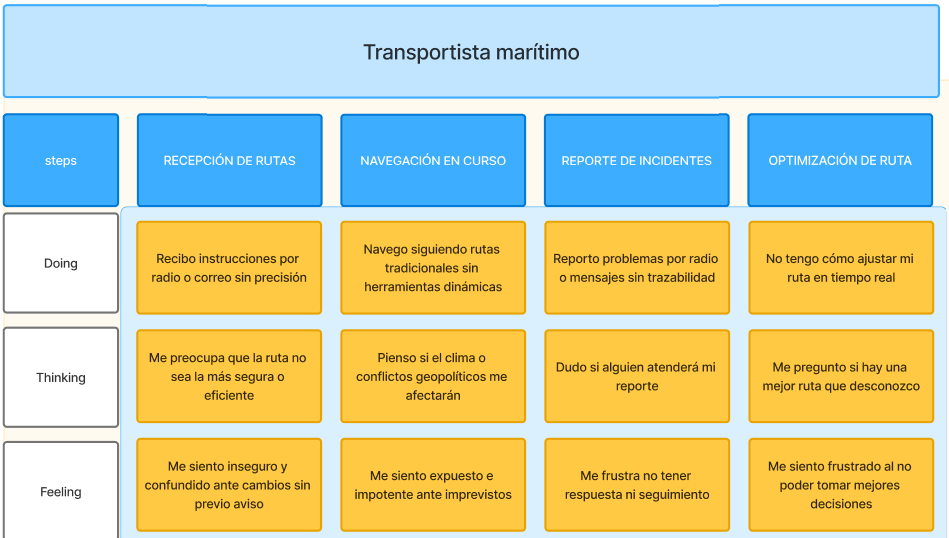

# UNIVERSIDAD PERUANA DE CIENCIAS APLICADAS

---

  

# DISEÑO DE EXPERIMENTOS DE INGENIERÍA DE SOFTWARE - 1ASI0732 - 4441

---

## INFORME DEL TRABAJO FINAL

### PROFESOR: Noriega Melendez, Julio Manuel
### START UP: Teemo Solutions
### PRODUCTO: Mushroom

## INTEGRANTES:

<table>
  <thead>
    <tr>
      <th style="background-color: #333; color: #fff;">Apellidos y Nombres</th>
      <th style="background-color: #333; color: #fff;">Código de Alumno</th>
    </tr>
  </thead>
  <tbody>
    <tr>
      <td>Aru Acevedo, Yair Christofer</td>
      <td>u202125984</td>
    </tr>
    <tr>
      <td>Lizano Coll Cardenas, Fernando Jesus</td>
      <td>u202214522</td>
    </tr>
    <tr>
      <td>Pescorán Angulo, Juan Fabritzzio</td>
      <td>u20221c936</td>
    </tr>
    <tr>
      <td>Riega Salas, Jose Miguel</td>
      <td>u202211254</td>
    </tr>
    <tr>
      <td>Vasquez Requejo, Augusto Mathias Leonardo</td>
      <td>u20221a955</td>
    </tr>
  </tbody>
</table>

--- 

2025 - 01

---

# Registro de Versiones del Informe

<table>
  <thead>
    <tr>
      <th style="background-color: #333; color: #fff;">Versión</th>
      <th style="background-color: #333; color: #fff;">Fecha</th>
      <th style="background-color: #333; color: #fff;">Autor</th>
      <th style="background-color: #333; color: #fff;">Descripción de modificación</th>
    </tr>
  </thead>
  <tbody>
    <tr>
      <td>TB1</td>
      <td>26/04/25</td>
      <td> Todos los miembros del equipo. </td>
      <td>Avance del capítulo I, II, III y IV, creando las bases mediante los Lean Ux Problem Statements reuniendolos en un Lean Ux Canvas, luego cada integrante tuvo la misión de encontrar una persona que pertenece a nuestro segmento objetivo para entrevistar y recopilar información para convertirlos en User Personas, luego se crearon las historias de usuario a partir de las necesidades encontradas en la información recopilada, lo que llevó a la creación del Product Backlog. Finalmente, en el capítulo IV, se eligieron los styleguidelines para el diseño de las futuras aplicaciones, junto a los mockups y wireframes correspondientes.</td>
    </tr>
    <tr>
      <td>TP1</td>
      <td>10/05/25</td>
      <td> Todos los miembros del equipo. </td>
      <td>En esta entrega se mejoró muchos aspectos con respecto al TB1, como el product Backlog, aspectos generales que faltaban agregar, refactorización de History Users, entre otros. Tambien se hizo la adición de lo requerido dentro del project statement, en este caso, las pruebas unitarias pertenecientes al capítulo VI y la implementación de prácticas DevOps sobre el trabajo en el apartado del Capítulo VII.</td>
    </tr>
    <tr>
      <td>TB2</td>
      <td>21/06/25</td>
      <td> Todos los miembros del equipo. </td>
      <td>En esta entrega se mejoró el frontend tanto web como móvil, además de resaltar nuevos puntos que no habían sido agregados anteriormente. Se volvió a desplegar el frontend, backend y landing page para el correcto funcionamiento.</td>
    </tr>
    <tr>
      <td>TF1</td>
      <td>12/07/25</td>
      <td> Todos los miembros del equipo. </td>
      <td>En esta entrega se han desarrollado los pasos finales del proyecto, comenzando con la implementación de los detalles en el frontend, conforme a las recomendaciones brindadas por el profesor durante la retroalimentación de la TB2. Asimismo, se desplegó la versión final del backend para asegurar su correcta conexión con el frontend. Adicionalmente, se formularon las hipótesis de validación, basadas en lo planteado en la entrega anterior. A partir de estas, se inició la elaboración de formularios para la recolección de estadísticas, con el objetivo de contrastar nuestras primeras suposiciones y obtener datos empíricos que respalden o refuten los planteamientos realizados.</td>
    </tr>
  </tbody>
</table>

---

# Project Report Collaboration Insights
Para este proyecto hemos utilizado las herramientas GitHub para gestionar el progreso grupal.

Puede acceder a nuestra organización pulsando sobre el siguiente ícono:

  

## Members of the team on GitHub

<table>
  <thead>
    <tr>
      <th style="background-color: #333; color: #fff;">Apellidos y Nombres</th>
      <th style="background-color: #333; color: #fff;">Github Account</th>
    </tr>
  </thead>
  <tbody>
    <tr>
      <td>Aru Acevedo, Yair Christofer</td>
      <td><a href="https://github.com/Yair360">Yair360</a></td>
    </tr>
    <tr>
      <td>Lizano Coll Cardenas, Fernando Jesus</td>
      <td><a href="https://github.com/GuardianDeity">GuardianDeity</a></td>
    </tr>
    <tr>
      <td>Pescorán Angulo, Juan Fabritzzio</td>
      <td><a href="https://github.com/JuanPescoran">JuanPescoran</a></td>
    </tr>
    <tr>
      <td>Riega Salas, Jose Miguel</td>
      <td><a href="https://github.com/JoseRiega">JoseRiega</a></td>
    </tr>
    <tr>
      <td>Vasquez Requejo, Augusto Mathias Leonardo</td>
      <td><a href="https://github.com/Mathifaa519">Mathifaa519</a></td>
    </tr>
  </tbody>
</table>

### Team Collaborations Insights

A continuación, se presentan los gráficos de colaboración de los integrantes del equipo en el repositorio de nuestro primer sprint. Estos gráficos ofrecen una representación visual de la cantidad de contribuciones realizadas por cada miembro del equipo, junto con la fecha en que se llevaron a cabo. Además, se presenta información sobre la cantidad de líneas de código que se han modificado en cada uno de los commits.

- **ENTREGABLE TF:**

# Tabla de Contenidos

## [Registro de versiones del informe](#registro-de-versiones-del-informe)
## [Project Report Collaboration Insights](#project-report-collaboration-insights)
## [Student Outcome](#student-outcome)

## Part I: As-Is Software Project

### [Capítulo I: Introducción]()
- [1.1. Startup Profile](#11-startup-profile)
    - [1.1.1. Descripción de la Startup](#111-descripción-de-la-startup)
    - [1.1.2. Perfiles de integrantes del equipo](#112-perfiles-de-integrantes-del-equipo)
- [1.2. Solution Profile](#12-solution-profile)
    - [1.2.1. Antecedentes y problemática](#121-antecedentes-y-problemática)
    - [1.2.2. Lean UX Process](#122-lean-ux-process)
      - [1.2.2.1. Lean UX Problem Statements](#1221-lean-ux-problem-statements)
      - [1.2.2.2. Lean UX Assumptions](#1222-lean-ux-assumptions)
      - [1.2.2.3. Lean UX Hypothesis Statements](#1223-lean-ux-hypothesis-statement)
      - [1.2.2.4. Lean UX Canvas](#1224-lean-ux-canvas)
- [1.3. Segmentos objetivo](#13-segmentos-objetivos)

### [Capítulo II: Requirements Elicitation & Analysis](#capítulo-ii-requirements-elicitation--analysis)
- [2.1. Competidores](#21-competidores)
  - [2.1.1. Análisis competitivo](#211-análisis-competitivo)
  - [2.1.2. Estrategias y tácticas frente a competidores](#212-estrategias-y-tácticas-frente-a-competidores)
- [2.2. Entrevistas](#22-entrevistas)
  - [2.2.1. Diseño de entrevistas](#221-diseño-de-entrevistas)
  - [2.2.2. Registro de entrevistas](#222-registro-de-entrevistas)
  - [2.2.3. Análisis de entrevistas](#223-análisis-de-entrevistas)
- [2.3. Needfinding](#23-needfinding)
  - [2.3.1. User Persona](#231-user-persona)
  - [2.3.2. User Task Matrix](#232-user-task-matrix)
  - [2.3.3. User Journey Mapping](#233-user-journey-mapping)
  - [2.3.4. Empathy Mapping](#234-empathy-mapping)
  - [2.3.5. As-is Scenario Mapping](#235-as-is-scenario-mapping)
- [2.4. Ubiquitous Language](#236-ubiquitous-language)

### [Capítulo III: Requirements Specification](#capítulo-iii-requirements-specification)
- [3.1. To-Be Scenario Mapping](#31-to-be-scenario-mapping)
- [3.2. User Stories](#32-user-stories)
- [3.3. Impact Mapping](#33-impact-mapping)
- [3.4. Product Backlog](#34-product-backlog)

### [Capítulo IV: Product Design](#capítulo-iv-product-design)
- [4.1. Style Guidelines](#41-style-guidelines)
    - [4.1.1. General Style Guidelines](#411-general-style-guidelines)
    - [4.1.2. Web Style Guidelines](#412-web-style-guidelines)
    - [4.1.3. Mobile Style Guidelines](#413-mobile-style-guidelines)
        - [4.1.3.1. iOS Mobile Style Guidelines](#4131-ios-mobile-style-guidelines)
        - [4.1.3.2. Android Mobile Style Guidelines](#4132-android-mobile-style-guidelines)
- [4.2. Information Architecture](#42-information-architecture)
    - [4.2.1. Organization Systems](#421-organization-systems)
    - [4.2.2. Labeling Systems](#422-labeling-systems)
    - [4.2.3. SEO Tags and Meta Tags](#423-seo-tags-and-meta-tags)
    - [4.2.4. Searching Systems](#424-searching-systems)
    - [4.2.5. Navigation Systems](#425-navigation-systems)
- [4.3. Landing Page UI Design](#43-landing-page-ui-design)
    - [4.3.1. Landing Page Wireframe](#431-landing-page-wireframe)
    - [4.3.2. Landing Page Mock-up](#432-landing-page-mock-up)
- [4.4. Mobile Applications UX/UI Design](#44-mobile-applications-uxui-design)
    - [4.4.1. Mobile Applications Wireframes](#441-mobile-applications-wireframes)
    - [4.4.2. Mobile Applications Wireflow Diagrams](#442-mobile-applications-wireflow-diagrams)
    - [4.4.3. Mobile Applications Mock-ups](#443-mobile-applications-mock-ups)
    - [4.4.4. Mobile Applications User Flow Diagrams](#444-mobile-applications-user-flow-diagrams)
- [4.5. Mobile Applications Prototyping](#45-mobile-applications-prototyping)
    - [4.5.1. Android Mobile Applications Prototyping](#451-android-mobile-applications-prototyping)
    - [4.5.2. iOS Mobile Applications Prototyping](#452-ios-mobile-applications-prototyping)
- [4.6. Web Applications UX/UI Design](#46-web-applications-uxui-design)
    - [4.6.1. Web Applications Wireframes](#461-web-applications-wireframes)
    - [4.6.2. Web Applications Wireflow Diagrams](#462-web-applications-wireflow-diagrams)
    - [4.6.3. Web Applications Mock-ups](#463-web-applications-mock-ups)
    - [4.6.4. Web Applications User Flow Diagrams](#464-web-applications-user-flow-diagrams)
- [4.7. Web Applications Prototyping](#47-web-applications-prototyping)
- [4.8. Domain-Driven Software Architecture](#48-domain-driven-software-architecture)
    - [4.8.1. Software Architecture Context Diagram](#481-software-architecture-context-diagram)
    - [4.8.2. Software Architecture Container Diagrams](#482-software-architecture-container-diagrams)
    - [4.8.3. Software Architecture Components Diagrams](#483-software-architecture-components-diagrams)
- [4.9. Software Object-Oriented Design](#49-software-object-oriented-design)
    - [4.9.1. Class Diagrams](#491-class-diagrams)
    - [4.9.2. Class Dictionary](#492-class-dictionary)
- [4.10. Database Design](#410-database-design)
    - [4.10.1. Relational/Non-Relational Database Diagram](#4101-relationalnon-relational-database-diagram)

### [Capítulo V: Product Implementation](#capítulo-v-product-implementation)
- [5.1. Software Configuration Management](#51-software-configuration-management)
    - [5.1.1. Software Development Environment Configuration](#511-software-development-environment-configuration)
    - [5.1.2. Source Code Management](#512-source-code-management)
    - [5.1.3. Source Code Style Guide & Conventions](#513-source-code-style-guide--conventions)
    - [5.1.4. Software Deployment Configuration](#514-software-deployment-configuration)
- [5.2. Product Implementation & Deployment](#52-product-implementation--deployment)
    - [5.2.1. Sprint Backlogs](#521-sprint-backlogs)
    - [5.2.2. Implemented Landing Page Evidence](#522-implemented-landing-page-evidence)
    - [5.2.3. Implemented Frontend-Web Application Evidence](#523-implemented-frontend-web-application-evidence)
    - [5.2.4. Implemented Native-Mobile Application Evidence](#524-implemented-native-mobile-application-evidence)
    - [5.2.5. Implemented RESTful API and/or Serverless Backend Evidence](#525-implemented-restful-api-andor-serverless-backend-evidence)
    - [5.2.6. RESTful API documentation](#526-restful-api-documentation)
    - [5.2.7. Team Collaboration Insights](#527-team-collaboration-insights)
- [5.3. Video About-the-Product](#53-video-about-the-product)

---

## Part II: Verification, Validation & Pipeline

### [Capítulo VI: Product Verification & Validation](#capitulo-vi-product-verification--validation)
- [6.1. Testing Suites & Validation](#61-testing-suites--validation)
    - [6.1.1. Core Entities Unit Tests](#611-core-entities-unit-tests)
    - [6.1.2. Core Integration Tests](#612-core-integration-tests)
    - [6.1.3. Core Behavior-Driven Development](#613-core-behavior-driven-development)
    - [6.1.4. Core System Tests](#614-core-system-tests)
- [6.2. Static testing & Verification](#62-static-testing--verification)
    - [6.2.1. Static Code Analysis](#621-static-code-analysis)
        - [6.2.1.1. Coding standard & Code conventions](#6211-coding-standard--code-conventions)
        - [6.2.1.2. Code Quality & Code Security](#6212-code-quality--code-security)
    - [6.2.2. Reviews](#622-reviews)
- [6.3. Validation Interviews](#63-validation-interviews)
    - [6.3.1. Diseño de Entrevistas](#631-diseo-de-entrevistas)
    - [6.3.2. Registro de Entrevistas](#632-registro-de-entrevistas)
    - [6.3.3. Evaluaciones según heurísticas](#633-evaluaciones-segn-heursticas)
- [6.4. Auditoría de Experiencias de Usuario](#64-auditoria-de-experiencias-de-usuario)
    - [6.4.1. Auditoría realizada](#641-auditoria-realizada)
        - [6.4.1.1. Información del grupo auditado](#6411-informacion-del-grupo-auditado)
        - [6.4.1.2. Cronograma de auditoría realizada](#6412-cronograma-de-auditoria-realizada)
        - [6.4.1.3. Contenido de auditoría realizada](#6413-contenido-de-auditoria-realizada)
    - [6.4.2. Auditoría recibida](#642-auditoria-recibida)
        - [6.4.2.1. Información del grupo auditor](#6421-informacion-del-grupo-auditor)
        - [6.4.2.2. Cronograma de auditoría recibida](#6422-cronograma-de-auditoria-recibida)
        - [6.4.2.3. Contenido de auditoría recibida](#6423-contenido-de-auditoria-recibida)
        - [6.4.2.4. Resumen de modificaciones para subsanar hallazgos](#6424-resumen-de-modificaciones-para-subsanar-hallazgos)

### [Capítulo VII: DevOps Practices](#capítulo-vii-devops-practices-1)
- [7.1. Continuous Integration](#71-continuous-integration)
    - [7.1.1. Tools and Practices](#711-tools-and-practices)
    - [7.1.2. Build & Test Suite Pipeline Components](#712-build--test-suite-pipeline-components)
- [7.2. Continuous Delivery](#72-continuous-delivery)
    - [7.2.1. Tools and Practices](#721-tools-and-practices)
    - [7.2.2. Stages Deployment Pipeline Components](#722-stages-deployment-pipeline-components)
- [7.3. Continuous Deployment](#73-continuous-deployment)
    - [7.3.1. Tools and Practices](#731-tools-and-practices)
    - [7.3.2. Production Deployment Pipeline Components](#732-production-deployment-pipeline-components)
- [7.4. Continuous Monitoring](#74-continuous-monitoring)
    - [7.4.1. Tools and Practices](#741-tools-and-practices)
    - [7.4.2. Monitoring Pipeline Components](#742-monitoring-pipeline-components)
    - [7.4.3. Alerting Pipeline Components](#743-alerting-pipeline-components)
    - [7.4.4. Notification Pipeline Components](#744-notification-pipeline-components)

---

## Part III: Experiment-Driven Lifecycle

### [Capítulo VIII: Experiment-Driven Development](#captulo-viii-experiment-driven-development)
- [8.1. Experiment Planning](#81-experiment-planning)
    - [8.1.1. As-Is Summary](#811-as-is-summary)
    - [8.1.2. Raw Material: Assumptions, Knowledge Gaps, Ideas, Claims](#812-raw-material-assumptions-knowledge-gaps-ideas-claims)
    - [8.1.3. Experiment-Ready Questions](#813-experiment-ready-questions)
    - [8.1.4. Question Backlog](#814-question-backlog)
    - [8.1.5. Experiment Cards](#815-experiment-cards)
- [8.2. Experiment Design](#82-experiment-design)
    - [8.2.1. Hypotheses](#821-hypotheses)
    - [8.2.2. Measures](#822-measures)
    - [8.2.3. Conditions](#823-conditions)
    - [8.2.4. Scale Calculations and Decisions](#824-scale-calculations-and-decisions)
    - [8.2.5. Methods Selection](#825-methods-selection)
    - [8.2.6. Data Analytics: Goals, KPIs and Metrics Selection](#826-data-analytics-goals-kpis-and-metrics-selection)
    - [8.2.7. Web and Mobile Tracking Plan](#827-web-and-mobile-tracking-plan)
- [8.3. Experimentation](#83-experimentation)
    - [8.3.1. To-Be User Stories](#831-to-be-user-stories)
    - [8.3.2. To-Be Product Backlog](#832-to-be-product-backlog)
    - [8.3.3. Pipeline-supported, Experiment-Driven To-Be Software Platform Lifecycle](#833-pipeline-supported-experiment-driven-to-be-software-platform-lifecycle)
        - [8.3.3.1. To-Be Sprint Backlogs](#8331-to-be-sprint-backlogs)
        - [8.3.3.2. Implemented To-Be Landing Page Evidence](#8332-implemented-to-be-landing-page-evidence)
        - [8.3.3.3. Implemented To-Be Frontend-Web Application Evidence](#8333-implemented-to-be-frontend-web-application-evidence)
        - [8.3.3.4. Implemented To-Be Native-Mobile Application Evidence](#8334-implemented-to-be-native-mobile-application-evidence)
        - [8.3.3.5. Implemented To-Be RESTful API and/or Serverless Backend Evidence](#8335-implemented-to-be-restful-api-andor-serverless-backend-evidence)
        - [8.3.3.6. Team Collaboration Insights](#8336-team-collaboration-insights)
    - [8.3.4. To-Be Validation Interviews](#834-to-be-validation-interviews)
        - [8.3.4.1. Diseño de Entrevistas](#8341-diseo-de-entrevistas)
        - [8.3.4.2. Registro de Entrevistas](#8342-registro-de-entrevistas)
- [8.4. Experiment Aftermath & Analysis](#84-experiment-aftermath--analysis)
    - [8.4.1. Analysis and Interpretation of Results](#841-analysis-and-interpretation-of-results)
    - [8.4.2. Re-scored and Re-prioritized Question Backlog](#842-re-scored-and-re-prioritized-question-backlog)
- [8.5. Continuous Learning](#85-continuous-learning)
    - [8.5.1. Shareback Session Artifacts: Learning Workflow](#851-shareback-session-artifacts-learning-workflow)
- [8.6. To-Be Software Platform Pre-launch](#86-to-be-software-platform-pre-launch)
    - [8.6.1. About-the-Product Intro Video](#861-about-the-product-intro-video)

### [Conclusiones](#conclusiones)
- [Conclusiones y recomendaciones](#conclusiones-y-recomendaciones)
- [Video About-the-Team](#video-about-the-team)

### [Bibliografía](#bibliografia)
- [Referencias bibliográficas](#referencias-bibliogrficas)

### [Anexos](#anexos)
- [Anexos](#anexos)

- - -
# Student Outcome
El curso tiene el Student Outcome 4:

_ABET – EAC - Student Outcome 4
Criterio: La capacidad de reconocer responsabilidades éticas y profesionales en
situaciones de ingeniería y hacer juicios informados, que deben considerar el
impacto de las soluciones de ingeniería en contextos globales, económicos,
ambientales y sociales._

En la siguiente tabla se visualiza cómo las tareas de cada integrante contribuyen al cumplimiento de los aspectos que maneja el Outcome y las conclusiones realizadas de manera grupal.

<table>
  <thead>
    <tr>
      <th style="background-color: #333; color: #fff;">Criterio Específico</th>
      <th style="background-color: #333; color: #fff;">Acciones Realizadas</th>
      <th style="background-color: #333; color: #fff;">Conclusiones</th>
    </tr>
  </thead>
  <tbody>
    <tr>
      <td>4.c.1 Reconoce responsabilidad ética y profesional en situaciones de ingeniería de software </td>
        <td>
        <strong>ENTREGABLE TB1:</strong>
          
        <strong>Aru Acevedo, Yair Christofer - TB1:</strong> message here
          
        <strong>Lizano Coll Cardenas, Fernando Jesus - TB1:</strong> message here
          
        <strong>Pescorán Angulo, Juan Fabritzzio - TB1:</strong> message here
          
        <strong>Riega Salas, Jose Miguel - TB1:</strong> message here
          
        <strong>Vasquez Requejo, Augusto Mathias Leonardo - TB1:</strong> Aportes a lo largo de los capitulos, principalmente en el capitulo 2 y 4.
      <td>
        <strong>ENTREGABLE TB1:</strong>
          
        <strong>Aru Acevedo, Yair Christofer - TB1:</strong> message here
          
        <strong>Lizano Coll Cardenas, Fernando Jesus - TB1:</strong> message here
          
        <strong>Pescorán Angulo, Juan Fabritzzio - TB1:</strong> message here
          
        <strong>Riega Salas, Jose Miguel - TB1:</strong> message here
          
        <strong>Vasquez Requejo, Augusto Mathias Leonardo - TB1:</strong> Aportes a lo largo de los capitulos, aportando a la realizacion eficiente del trabajo grupal.
      </td>
      </tr>
      <tr>
      <td>4.c.2 Emite juicios informados considerando el impacto de las soluciones de ingeniería de software en contextos globales, económicos, ambientales y sociales</td>
      <td>
        <strong>ENTREGABLE TB1:</strong>
          
        <strong>Aru Acevedo, Yair Christofer - TB1:</strong> message here
          
        <strong>Lizano Coll Cardenas, Fernando Jesus - TB1:</strong> message here
          
        <strong>Pescorán Angulo, Juan Fabritzzio - TB1:</strong> message here
          
        <strong>Riega Salas, Jose Miguel - TB1:</strong> message here
          
        <strong>Vasquez Requejo, Augusto Mathias Leonardo - TB1:</strong> Aportes a lo largo de los capitulos, principalmente en el capitulo 2 y 4.
      <td>
        <strong>ENTREGABLE TB1:</strong>
          
        <strong>Aru Acevedo, Yair Christofer - TB1:</strong> message here
          
        <strong>Lizano Coll Cardenas, Fernando Jesus - TB1:</strong> message here
          
        <strong>Pescorán Angulo, Juan Fabritzzio - TB1:</strong> message here
          
        <strong>Riega Salas, Jose Miguel - TB1:</strong> message here
          
        <strong>Vasquez Requejo, Augusto Mathias Leonardo - TB1:</strong> Esta solucion tecnologica que se propone será util para resolver una problematica actual que se presenta.
      </td>
</tr>
</tbody>
</table>

# **CAPÍTULO I: INTRODUCCIÓN**

## 1.1. Startup Profile

En un contexto global afectado por tensiones geopolíticas y disrupciones logísticas, la industria naviera enfrenta retos críticos. Como señala Crédito y Caución (2024):

> _“Si la crisis se prolonga, es posible que aumenten los tiempos de espera, los precios y la congestión en los puertos_”  
> Crédito y Caución, 2024

### 1.1.1. Descripción de la Startup

Teemo Solutions nace como respuesta a esta realidad, con el objetivo de optimizar rutas marítimas mediante tecnología inteligente. Su producto, Mushroom, es una solución de software que calcula la mejor ruta entre puertos, considerando condiciones climáticas, cierres, conflictos y otros factores disruptivos.

Según ABC International (2024), entre el 10% y 15% del comercio mundial depende del transporte marítimo. Con rutas clave como el Mar Rojo afectadas por conflictos, muchas navieras se ven obligadas a tomar desvíos costosos. Esto ha impactado incluso a grandes empresas como Tesla, que ha suspendido operaciones por interrupciones logísticas.

- **Misión:** Desarrollar soluciones tecnológicas innovadoras que optimicen la logística marítima global, brindando a las navieras herramientas inteligentes para enfrentar los desafíos del comercio internacional en tiempo real.

- **Visión:** Ser la plataforma líder en gestión inteligente de rutas navieras a nivel mundial, reconocida por su capacidad de adaptación, precisión y aporte a la eficiencia del transporte marítimo en entornos complejos y cambiantes.
  

- **Valores** En Teemo Solutions, nos guiamos por una serie de valores fundamentales que definen nuestra cultura organizacional y nuestra manera de actuar como equipo. Estos principios representan nuestro compromiso con la excelencia, la integridad y la innovación en el sector objetivo:
  1. **Innovación continua:** Impulsamos soluciones creativas y tecnológicas frente a los desafíos dinámicos del comercio marítimo.
  2. **Resiliencia:** Nos adaptamos a escenarios cambiantes para mantener la operatividad de las rutas marítimas globales.
  3. **Sostenibilidad:** Priorizamos rutas que optimicen el uso de recursos y reduzcan el impacto ambiental del transporte marítimo.
  4. **Transparencia:** Brindamos información clara, en tiempo real, para una toma de decisiones basada en datos.
  5. **Colaboración:** Facilitamos la cooperación entre puertos, navieras y operadores logísticos para construir un ecosistema más eficiente.
  6. **Compromiso con la seguridad:** Aseguramos el tránsito de mercancías minimizando riesgos derivados de conflictos o condiciones climáticas adversas.

  

### 1.1.2. Perfiles de Integrantes del equipo

<table>
  <tr>
  <th colspan="2">Aru Acevedo, Yair Christofer</th>
  </tr>
  <tr>
    <td></td>
    <td>Soy Yair Christofer Aru Acevedo, actualmente me encuentro cursando el 7mo ciclo de la carrera de Ingeniería de Software en la UPC. Tengo conocimientos en el lenguaje de C++, Python, Javascript, Typescript y HTML5. Me encuentro interesado en las tecnologías que se utilizan en las áreas de ciberseguridad y bases de datos. </td>
  </tr>

  <tr>
  <th colspan="2">Lizano Coll Cardenas, Fernando Jesus</th>
  </tr>
  <tr>
    <td></td>
    <td>Me llamo Fernando Jesus Lizano Coll Cardenas. A mis 20 años me considero un apasionado por el mundo de la programación y aprendizaje constante. Actualmente tengo conocimientos en el lenguaje de C++, HTML, CSS, JavaScript y Python. Aunque mis conocimientos son todavía básicos. Me identifico como alguien de pensamiento de superación. Busco crecer en cada aspecto de mi vida y enfrentar desafíos con una actitud positiva y resoluta. Espero poder aportar y motivar a mis compañeros durante la elaboración de este proyecto.</td>
  </tr>

  <tr>
  <th colspan="2">Pescorán Angulo, Juan Fabritzzio</th>
  </tr>
  <tr>
    <td></td>
    <td>Hola que tal, soy Juan Pescoran, tengo 19 años, estoy llevando la carrera de Ingenieria de Software en la UPC, voy en el 7mo ciclo. Me considero una persona responsable, puntual y comprometida con mis estudios. Me gusta aprender cosas nuevas y siempre estoy dispuesto a ayudar a mis compañeros.</td>
  </tr>

  <tr>
    <th colspan="2">Riega Salas, Jose Miguel</th>
  </tr>
  <tr>
    <td></td>
    <td>Estudiante de 7mo ciclo de ingeniería de software en la UPC. Autopercibido como polivalente y responsable con aprendizaje continuo.

Poseo conocimientos en C + +, HTML, Javascript, Python, desarrollo de aplicaciones web y metodologías ágiles. Mis objetivos son concretarse y seguir aprendiendo y ejerciendo mi carrera desarrollándome a nivel personal y profesional.</td>
  </tr>

  <tr>
    <th colspan="2">Vasquez Requejo, Augusto Mathias Leonardo</th>
  </tr>
  <tr>
    <td></td>
    <td>Soy estudiante de Ingeniería de Software en el 6to ciclo en la Universidad Peruana de Ciencias Aplicadas. Cuento con conocimientos en lenguajes de programación como C++, JavaScript, HTML y CSS, y me destaco por mi responsabilidad y dedicación en los trabajos grupales, siempre buscando contribuir al logro de los objetivos del equipo.</td>
  </tr>
</table>

## 1.2. Solution Profile

### 1.2.1. Antecedentes y Problemática

Los antecedentes son esenciales para una comprensión profunda de la problemática que Teemo Solutions busca abordar. Para ello, se ha aplicado la técnica de análisis "5W 2H" (Who, What, Where, When, Why, How & How Much), que permite estructurar el diagnóstico de la situación desde distintas perspectivas clave:

1. **What (¿Qué está ocurriendo?):**
El comercio marítimo global se encuentra en una situación crítica debido a crecientes tensiones geopolíticas, especialmente en el corredor del Mar Rojo. Esta inestabilidad ha generado interrupciones severas en las rutas tradicionales, ocasionando incrementos en los costos logísticos, tiempos de entrega impredecibles y una sobrecarga significativa en rutas alternativas, como la que rodea el Cabo de Buena Esperanza. Las empresas se ven obligadas a replantear sus estrategias de inventario, distribución y planificación operativa.

2. **Why (¿Por qué está ocurriendo?):**
La causa principal es la escalada del conflicto en Medio Oriente, particularmente los ataques de los hutíes en el Mar Rojo, que han transformado esta vía comercial en una zona de alto riesgo. Esta situación ha generado desvíos masivos de embarcaciones, falta de visibilidad sobre las condiciones en tiempo real y una carencia de herramientas inteligentes para la toma de decisiones logísticas ante escenarios de emergencia.

3. **When (¿Cuándo sucede?):**
El conflicto ha escalado desde finales de 2023 y continúa afectando al comercio internacional durante 2024. Al no existir una fecha de resolución clara, se ha creado un entorno de incertidumbre permanente que demanda soluciones tecnológicas ágiles y adaptables para el corto y mediano plazo.

4. **Where (¿Dónde ocurre?):**
La problemática se concentra en el Mar Rojo, una vía estratégica que conecta Europa, Asia y África. Sin embargo, el impacto se extiende a puertos en ambos continentes, generando cuellos de botella logísticos en zonas clave como el Mediterráneo, el Golfo de Adén y el Canal de Suez.

5. **Who (¿Quiénes están involucrados o afectados?):**  
   - Capitanes de embarcaciones y jefes de ruta, responsables de la seguridad y eficiencia del tránsito marítimo.

   - Agencias navieras y operadoras logísticas, que deben ajustar operaciones y comunicaciones en tiempo real.

   - Empresas exportadoras/importadoras, cuya competitividad depende de entregas puntuales y costos controlados.

   - Industria tecnológica, llamada a ofrecer soluciones para afrontar esta nueva realidad.

6. **How (¿Cómo está afectando?):** La inestabilidad ha obligado a adoptar rutas más largas y costosas, lo que incrementa significativamente los precios del transporte, retrasa entregas y congestiona corredores alternativos. Esta situación disminuye la eficiencia operativa del sector y revela una necesidad crítica de herramientas de análisis predictivo que faciliten decisiones logísticas fundamentadas y rápidas.

7. **How much (¿Cuánto cuesta o impacta?):**
   - Se estima que el comercio entre España y Asia podría perder más de 135.000 millones de euros debido a la interrupción de rutas (ABC International, 2024).

   - Empresas como Tesla han detenido su producción en Alemania por problemas de suministro derivados del conflicto.
 
   - Para Teemo Solutions, esta problemática representa una oportunidad estratégica: desarrollar soluciones tecnológicas que minimicen los impactos financieros, mejoren la resiliencia de la cadena logística y mantengan la competitividad en entornos altamente volátiles.

### 1.2.2. Lean UX Process

En esta etapa damos inicio al enfoque Lean UX, una metodología que nos permitirá construir y afinar la visión del modelo de negocio que respaldará nuestra solución digital. Gracias a este enfoque, podremos centrar el diseño de nuestro producto en resolver necesidades concretas y generar valor real para los usuarios.

#### 1.2.2.1 Lean Ux Problem Statements

- **Domain**

La solución se ubica dentro del dominio de la logística marítima global, un sector clave para el comercio internacional, actualmente impactado por conflictos geopolíticos, variabilidad climática y congestión en rutas estratégicas como el Mar Rojo o el Canal de Suez.

- **Customer Segments**
  - Empresas Navieras y Operadoras Logísticas: Gestionan flotas y rutas internacionales de carga.

  - Exportadores e Importadores de Alta Rotación: Empresas industriales con alta dependencia de rutas marítimas estables.

   
- **Pain Points**
  - Rutas tradicionales interrumpidas o congestionadas por conflictos o clima.

  - Falta de visibilidad y datos confiables en tiempo real.

  - Decisiones reactivas y no optimizadas ante desvíos o cierres portuarios.

  - Aumento en los costos operativos y pérdida de competitividad.

- **Gap (Brecha Identificada)**

Actualmente, no existe una herramienta accesible y especializada que integre datos geopolíticos, climáticos y logísticos para ofrecer rutas óptimas, confiables y actualizadas para embarcaciones comerciales. Las decisiones se toman con herramientas fragmentadas, informes desactualizados o sistemas poco adaptables.

- **Vision / Strategy**

Desarrollar Mushroom, una solución SaaS que proporcione recomendaciones de rutas marítimas óptimas, basadas en algoritmos predictivos que combinan inteligencia climática, cierres portuarios, tráfico marítimo y factores geopolíticos. La estrategia es entregar una interfaz intuitiva, modular e integrable con otros sistemas logísticos.

- **Initial Segment (Primer Segmento a Impactar)**

Empresas navieras con operaciones activas en el corredor del Mar Rojo y el Océano Índico, donde las tensiones actuales han forzado desvíos frecuentes. Este segmento tiene alta urgencia, capacidad de adopción tecnológica y un impacto directo en costos operativos si se mejora la eficiencia de sus rutas.

#### 1.2.2.2 Lean Ux Assumptions 

**Users**:

- Empresas Navieras y Operadoras Logísticas: responsables del trazado y la ejecución de rutas marítimas seguras y eficientes, así como de la optimización de recursos operativos.
- Exportadores e Importadores: empresas que dependen del transporte marítimo para movilizar productos y materias primas, afectadas por retrasos, cambios de ruta y falta de información confiable.

**User Outcomes:** Para ambos segmentos se espera que 

- Reduzcan los tiempos de planificación de rutas ante eventos inesperados.
- Accedan a información integrada, confiable y actualizada en tiempo real.
- Tomen decisiones informadas que reduzcan costos logísticos.
- Aumenten la previsibilidad de sus operaciones marítimas.
- Refuercen la resiliencia de su cadena de suministro ante conflictos geopolíticos y eventos climáticos extremos.

**Business Assumptions**

**Creemos que** los actores de la cadena logística marítima están buscando soluciones proactivas para enfrentar la incertidumbre global.

**Asumimos que** la propuesta de valor de Mushroom atraerá a empresas con operaciones críticas en zonas sensibles como el Mar Rojo.

**Consideramos que** la adopción inicial estará motivada por la necesidad urgente de reducir pérdidas financieras por desvíos y retrasos no planificados.

**Creemos que** el diferencial de Teemo Solutions es la integración de múltiples variables (clima, conflictos, capacidad portuaria) en una sola plataforma visual.

**Asumimos que** nuestros usuarios valorarán especialmente las funcionalidades predictivas y la capacidad de simular escenarios logísticos.

- - - 

**User Assumptions:**

**¿Quién utiliza nuestra plataforma?:**
Planificadores de rutas, analistas logísticos, gerentes de operaciones en navieras, y responsables de logística internacional en empresas exportadoras/importadoras.

**¿Cómo se integra en su rutina?:**
Como herramienta de consulta diaria para el trazado de rutas, evaluación de riesgos y toma de decisiones estratégicas.

**¿Qué desafíos resuelve?**

- Falta de datos unificados en un solo sistema.
- Toma de decisiones basadas en información obsoleta o parcial.
- Aumento de costos por desvíos no anticipados.

**¿Qué imagen queremos proyectar?:** Una solución confiable, especializada en inteligencia logística marítima, robusta pero simple de usar.

**¿Propósito fundamental?:** Optimizar las decisiones de navegación y logística para mantener cadenas de suministro estables y rentables.

**¿Qué funcionalidades destacan?**

- Simulación de rutas con condiciones dinámicas.
- Alertas automatizadas por cambios climáticos o conflictos.
- Comparación de tiempos y riesgos entre rutas.
- Integración con plataformas de gestión logística (TMS, ERP).

#### 1.2.2.3 Lean Ux Hypothesis Statement

- Hipótesis 1: 
**Creemos que** las empresas navieras y operadoras logísticas adoptarán una plataforma que les permita visualizar, simular y ajustar rutas marítimas en tiempo real, considerando condiciones climáticas y geopolíticas.  
**Esto logrará** una toma de decisiones más rápida, reducción de costos imprevistos y mayor eficiencia operativa.  
**Sabremos que** esto es cierto cuando al menos el 70% de los usuarios realicen simulaciones de ruta y registren un ahorro operativo en los primeros 3 meses.  

- Hipótesis 2: 
**Creemos que** los exportadores e importadores utilizarán Mushroom para anticiparse a interrupciones logísticas y ajustar sus decisiones comerciales.   
**Esto logrará** una mejor gestión de inventario, reducción de retrasos y mejora en la coordinación con clientes y proveedores.   
**Sabremos que** esto es cierto cuando los usuarios reporten una disminución del 20% en retrasos logísticos y una mejora en la previsión de entregas dentro de los primeros 2 meses.  

- Hipótesis 3: 
**Creemos que** integrar fuentes de datos confiables y en tiempo real (meteorología, conflictos, estado portuario) será un valor diferencial clave para los usuarios.   
**Esto logrará** una mayor confianza en la herramienta frente a soluciones genéricas del mercado.   
**Sabremos que** esto es cierto cuando el 80% de los usuarios destaque esta funcionalidad en encuestas de satisfacción y repita su uso semanalmente. 

-  Hipótesis 4: 
**Creemos que** ofrecer una interfaz visual e intuitiva, adaptable a distintos niveles técnicos, aumentará la adopción de la plataforma.   
**Esto logrará** que tanto técnicos como directivos puedan tomar decisiones basadas en los mismos datos.   
**Sabremos que** esto es cierto cuando al menos 3 perfiles distintos dentro de cada empresa usen la plataforma con frecuencia mensual. 

#### 1.2.2.4. Lean UX Canvas

- Mediante la realización Lean UX Canvas podemos mostrar toda información anterior pero de una manera resumida, didáctica y más accesible al lector. También se resume la problemática que estamos abordando y la solución que proponemos, junto con los supuestos de las hipótesis y los puntos más importantes de las mismas.

  

## 1.3. Segmentos Objetivos

El producto Mushroom, desarrollado por Teemo Solutions, está dirigido a actores clave del ecosistema logístico y naviero internacional, especialmente aquellos que se ven directamente afectados por disrupciones en las rutas marítimas. Los segmentos objetivos se definen de la siguiente manera:

1. **Empresas Navieras y Operadoras Logísticas Globales:** Compañías multinacionales que operan rutas marítimas internacionales, con flotas activas en zonas como el Mar Rojo, Mediterráneo, Canal de Suez y el Océano Índico.

2. **Exportadores e Importadores de Alta Rotación:** Empresas industriales y comerciales que dependen de entregas constantes y puntuales, como fabricantes de vehículos, tecnología, farmacéuticas y bienes de consumo masivo.

<table>
  <thead>
    <tr>
      <th>Característica</th>
      <th>Empresas Navieras y Operadoras Logísticas</th>
      <th>Exportadores e Importadores de Alta Rotación</th>
    </tr>
  </thead>
  <tbody>
    <tr>
      <td><strong>Demografía</strong></td>
      <td>+500 empleados, flotas de +50 embarcaciones, presencia intercontinental.</td>
      <td>Ubicadas principalmente en Europa, Asia y América, con alto volumen de exportación/importación.</td>
    </tr>
    <tr>
      <td><strong>Necesidades</strong></td>
      <td>Optimización de rutas, reducción de costos, gestión de riesgos logísticos.</td>
      <td>Visibilidad en tiempo real, planificación de entregas, reducción de impacto por interrupciones.</td>
    </tr>
    <tr>
      <td><strong>Impacto esperado</strong></td>
      <td>Mayor eficiencia operativa, mejor adaptabilidad a crisis geopolíticas.</td>
      <td>Menores pérdidas económicas, continuidad de la cadena de suministro.</td>
    </tr>
    <tr>
      <td><strong>Ejemplo o Dato</strong></td>
      <td>El 80% del comercio mundial se mueve por vía marítima (UNCTAD, 2023).</td>
      <td>Tesla paralizó producción en Alemania por bloqueos en el Mar Rojo (2024).</td>
    </tr>
  </tbody>
</table>

# Capítulo II: Requirements Elicitation & Analysis

## 2.1. Competidores

### 2.1.1 Análisis Competitivo
<table>
  <tr>
    <th colspan="22">Competitive Analysis Landscape</th>
  </tr>
  <tr>
    <td colspan="1">¿Por qué llevar a cabo el análisis?</td>
    <td colspan="17">Este análisis nos ayuda a entender las particularidades de cada sitio web o aplicación, identificar la competencia en el mercado y planificar cómo abordar las oportunidades. También nos permite trabajar en la mejora continua de nuestras áreas de desarrollo.</td>
  </tr>
  <tr>
    <td colspan="2">(En la cabecera colocar por cada competidor su nombre )</td>
    <td>MarineTraffic  </td>
    <td>Windward </td>
    <td>FleetMon </td>
</tr>
  <tr>
    <td rowspan="2">Perfil</td>
    <td>Overview</td>
    <td>MarineTraffic es una plataforma global de seguimiento de embarcaciones en tiempo real basada en datos AIS. Permite visualizar la posición de barcos, itinerarios, historial de rutas, y datos portuarios. Se usa ampliamente por operadores logísticos, agencias navieras y entusiastas del sector marítimo.</td>
    <td>	Windward es una solución avanzada de inteligencia marítima que utiliza inteligencia artificial para evaluar riesgos, prever comportamientos sospechosos y optimizar operaciones navieras. Sus clientes incluyen gobiernos, aseguradoras y grandes navieras.</td>
    <td>FleetMon ofrece datos AIS en tiempo real y servicios de análisis para rastreo de flotas, predicción de llegadas a puerto, y documentación logística. Su interfaz está dirigida tanto a usuarios corporativos como a operadores individuales.
  </td>
  </tr>
  <tr>
  <td>Ventaja Competitiva</td>
  <td>Alta cobertura AIS global, interfaz amigable, muy popular en el sector, especialmente para monitoreo pasivo de tráfico.</td>
    <td>Potente capacidad analítica predictiva, análisis de riesgos en profundidad, clientes de alto nivel institucional.</td>
    <td>Versatilidad en el rastreo de flotas con herramientas personalizadas y buena documentación para desarrolladores.</td>
    </tr>
<tr>
    <td rowspan="2">Perfil de Marketing</td>
    <td>Mercado Objetivo</td>
    <td>Agencias logísticas, operadores portuarios, entusiastas del tracking marítimo.</td>
    <td>Gobiernos, aseguradoras marítimas, grandes navieras.</td>
    <td>Operadores logísticos, navieras pequeñas y medianas, desarrolladores.</td>
  </tr>
  <tr>
  <td>Estrategias de Marketing</td>
  <td>SEO, presencia en ferias marítimas, partnerships con puertos y armadores.</td>
    <td>Relaciones institucionales, ventas B2B, participación en foros de seguridad marítima.</td>
    <td>Marketing técnico, tutoriales API, contenido especializado.</td>
    </tr>
<tr>
    <td rowspan="3">Perfil de Producto</td>
    <td>Productos y Servicios</td>
    <td>Seguimiento AIS global, historial de rutas, tráfico portuario, alertas personalizadas, informes mensuales.</td>
    <td>Análisis de riesgo, predicción de comportamiento de flotas, detección de actividad sospechosa, insights de cumplimiento normativo.
</td>
    <td>Seguimiento de flotas, predicción de ETA, bases de datos de barcos, alertas personalizadas, informes descargables.</td>
  </tr>
  <tr>
  <td>Precios y Costos</td>
  <td>Planes desde $25 al mes hasta más de $250, dependiendo de acceso a datos históricos, API, y cobertura satelital.</td>
    <td>Modelo enterprise, precios personalizados (usualmente desde $1,000+ mensuales). 
-Membresías: desde S/ 15 por mes hasta S/ 120 por año.</td>
    <td>Planes desde €29 por mes hasta más de €150 mensuales. Acceso API premium se cobra adicional.</td>
    </tr>
<td>Canales de distribución (Web y/o Móvil)</td>
  <td>Web, app móvil, API.</td>
    <td>Web, consultoría directa, integración con plataformas empresariales.</td>
    <td>Web, app móvil, API para integración.</td>
    </tr>
<tr>
    <td rowspan="4">Análisis SWOT</td>
    <td>Fortalezas</td>
    <td>Cobertura global, interfaz intuitiva, alta adopción.</td>
    <td>Inteligencia predictiva avanzada, prestigio institucional.</td>
    <td>Flexibilidad, personalización, buen soporte para desarrolladores.</td>
  </tr>
  <tr>
  <td>Debilidades</td>
  <td>Menor enfoque analítico, poco personalizable.</td>
    <td>Precio alto, no enfocado en usuarios operativos.</td>
    <td>Menor alcance global que MarineTraffic.</td>
    </tr>
<td>Oportunidades</td>
  <td>Expansión de APIs e integración con puertos.</td>
    <td>Colaboraciones con aseguradoras y gobiernos.</td>
    <td>Expansión hacia soluciones logísticas especializadas.</td>
    </tr>
<td>Amenazas</td>
  <td>Saturación de plataformas similares.</td>
    <td>Alto costo de entrada limita adopción.</td>
    <td>Competencia con MarineTraffic y VesselFinder.</td>
</table>

### 2.1.2. Estrategias y tácticas frente a competidores.

Teemo puede diferenciarse de sus competidores enfocándose en rutas críticas como el Mar Rojo, ofreciendo visualizaciones específicas, mapas de riesgo interactivos y alertas geopolíticas en tiempo real. A diferencia de herramientas reactivas, Teemo puede adoptar un enfoque proactivo con simuladores de rutas seguras y predicción de congestión mediante algoritmos inteligentes. Además, al priorizar una experiencia de usuario simplificada y localizada para capitanes y agencias pequeñas, con soporte offline y en idiomas clave como árabe e inglés, puede ganar terreno donde otros no llegan. Su modelo de precios accesible, con planes escalables y pruebas gratuitas, lo hace ideal para PYMEs del sector. Complementariamente, Teemo puede fortalecer su propuesta con alianzas en puertos estratégicos del Mar Rojo, una comunidad colaborativa estilo “Waze marítimo” para reportes en tiempo real, e integrar contexto geopolítico explicativo con fuentes verificadas, generando así una plataforma marítima más segura, útil y centrada en los usuarios más afectados por las crisis actuales.

## 2.2. Entrevistas
Las entrevistas buscan entender mejor a los usuarios y cómo usan la tecnología. Queremos saber qué piensan sobre los servicios en línea, los problemas que han tenido y qué esperan sobre nuestro proyecto.

### 2.2.1 Diseño de entrevistas 

**Preguntas para ambos segmentos**

- Presentación:
    - ¿Cual es su nombre?
    - ¿Que edad tiene?
    - ¿En qué Distrito vive?
    - ¿Estado Civil?
    - ¿Cual es su ocupación? ¿Estudia y/o trabaja?

**Preguntas para Empresas Navieras y Operadoras Logísticas Globales**
- ¿Cuál es su rol a bordo o dentro del equipo de planificación de rutas del crucero?
- ¿Cuántos años de experiencia tiene navegando o coordinando rutas internacionales?
- ¿Qué tipo de cruceros opera actualmente (turísticos, de lujo, rutas regionales, etc.)?
- ¿Con qué frecuencia transitan por el Mar Rojo o rutas cercanas?
- ¿Qué herramientas o sistemas utilizan para planificar y monitorear rutas en tiempo real?
- ¿Quién toma la decisión final cuando se necesita desviar una ruta por razones de seguridad?
- ¿Cómo acceden a información meteorológica, geopolítica o logística antes de cada travesía?

**Preguntas para el segmento: Exportadores e Importadores de Alta Rotación**
- ¿Cuál es su rol dentro de la agencia naviera?
- ¿Cuántos barcos o rutas supervisa actualmente su agencia?
- ¿Qué tipos de embarcaciones manejan con más frecuencia (mercantes, petroleros, cruceros, etc.)?
- ¿Cómo han afectado las tensiones geopolíticas en el Mar Rojo (por ejemplo, los ataques hutíes) a la planificación de sus rutas?
- ¿Qué decisiones operativas han debido tomar como resultado de los desvíos alrededor del Cabo de Buena Esperanza?
- ¿Han experimentado demoras o incrementos en los costos de transporte en los últimos meses debido a esta situación?
- ¿Qué tan difícil ha sido acceder a información confiable y oportuna sobre riesgos en rutas específicas?

### 2.2.2. Registro de entrevistas 
En el proceso de investigación para nuestro proyecto, se llevaron a cabo entrevistas del público objetivo. Cada entrevista se documentó en video y se registraron los siguientes detalles:

Link de la entrevista: https://upcedupe-my.sharepoint.com/:v:/g/personal/u20221a955_upc_edu_pe/ERshpHqBeD1Btquo46R2npsBg3-ZqoIrr90kLY8Ix_a4qw?e=brkSf8&nav=eyJyZWZlcnJhbEluZm8iOnsicmVmZXJyYWxBcHAiOiJTdHJlYW1XZWJBcHAiLCJyZWZlcnJhbFZpZXciOiJTaGFyZURpYWxvZy1MaW5rIiwicmVmZXJyYWxBcHBQbGF0Zm9ybSI6IldlYiIsInJlZmVycmFsTW9kZSI6InZpZXcifX0%3D

**Segmento 1: Empresas Navieras y Operadoras Logísticas Globales**

#### Entrevista 1:

**Nombre y Apellido:** Patricia Salas

**Edad:** 45 años

**Distrito:** Callao

**Screenshot de la Entrevista:** 

**Timelapse:** [Inicio: 14:45, Fin: 20:19]

**Resumen de la Entrevista:**

Patricia ocupa el rol de directora de planificación de rutas en una empresa de cruceros turísticos de alta gama. Cuenta con 22 años de experiencia coordinando rutas internacionales, especialmente en itinerarios de lujo por el Mediterráneo, Caribe y algunas travesías transatlánticas. Actualmente opera cruceros turísticos de lujo que ocasionalmente incluyen tramos por el Mar Rojo, aunque enfatizó que debido a los riesgos geopolíticos actuales, las rutas por esa zona han sido reducidas significativamente.
Para la planificación y monitoreo en tiempo real, su equipo utiliza una combinación de plataformas AIS, mapas satelitales interactivos y un software interno de optimización de rutas que les permite ajustar trayectos en función de condiciones climáticas y alertas de seguridad. En cuanto a decisiones de desvío, Patricia explicó que, aunque el capitán tiene la última palabra a bordo, todas las decisiones importantes se toman en coordinación con el centro de control en tierra, donde ella participa directamente.
El acceso a información crítica antes de cada travesía se realiza a través de briefings diarios, reportes meteorológicos internacionales, alertas geopolíticas emitidas por agencias de seguridad marítima y consultores externos especializados en riesgos marítimos. Patricia resaltó la importancia de mantener un flujo constante de información actualizada para garantizar tanto la seguridad de los pasajeros como la eficiencia de las operaciones.

**Segmento 2: Exportadores e Importadores de Alta Rotación**

#### Entrevista 1:

**Nombre y Apellido:** Arwen Vasquez

**Edad:** 40 años

**Distrito:** Callao

**Screenshot de la Entrevista:** 

**Timelapse:** [Inicio: 00:00, Fin: 05:01]

**Resumen de la Entrevista:**

Arwen es capitana de embarcaciones pesqueras industriales. Tiene 20 años de experiencia en navegación de alta mar, en especial en el Pacífico Sur. Actualmente no trabaja con cruceros turísticos; opera embarcaciones de pesca de altura, pero conoce bien la planificación de rutas. No transita por el Mar Rojo, ya que su zona de operación está en aguas sudamericanas, pero comentó que entiende la importancia de esa región para el comercio mundial. Para planificar rutas, se apoya en sonares marinos avanzados, cartografía electrónica y informes de corrientes oceánicas. Ella misma, como capitana, decide cambios de ruta si la seguridad de la tripulación está en riesgo, actuando de forma autónoma en alta mar. Accede a informes meteorológicos de alta frecuencia, alertas de fenómenos climáticos, y a redes de información marina compartida entre capitanes pesqueros.

#### Entrevista 2:

**Nombre y Apellido:** Mariela Sanchez

**Edad:** 40 años

**Distrito:** Callao

**Screenshot de la Entrevista:** 

**Timelapse:** [Inicio: 05:01, Fin: 10:45]

**Resumen de la Entrevista:**

Mariela es jefa de operaciones navieras encargada de coordinar rutas para cruceros turísticos regionales. Tiene 16 años de experiencia en logística marítima. Actualmente opera principalmente cruceros turísticos y de lujo, orientados a recorridos en Sudamérica y el Caribe. Aunque su operación no es frecuente en el Mar Rojo, explicó que en temporadas especiales coordinan rutas alternativas que bordean África.
Utiliza plataformas de monitoreo AIS (Automatic Identification System) junto con softwares propios de planificación naviera. En caso de desvíos por riesgos, el capitán del barco tiene la última palabra, pero siempre con el respaldo del equipo de tierra. Mariela recurre a boletines meteorológicos internacionales, reportes de situación política y consultores de riesgos marítimos para cada travesía.

#### Entrevista 3:

**Nombre y Apellido:** Alejandro Rivas

**Edad:** 40

**Distrito:** Callao

**Screenshot de la Entrevista:** 

**Timelapse:** [Inicio: 10:45, Fin: 14:45]

**Resumen de la Entrevista:**

Alejandro es capitán de buque de carga internacional. Lleva 18 años navegando rutas tanto regionales como de larga distancia. Actualmente, opera principalmente cruceros de carga pesada, no turísticos. Respecto al Mar Rojo, comentó que transita la zona aproximadamente dos veces al año, y que debido a la situación geopolítica reciente, deben extremar precauciones. Para la planificación y monitoreo de rutas, utiliza sistemas ECDIS (Electronic Chart Display and Information System) combinados con radar de alta precisión. Cuando hay necesidad de desviar la ruta por seguridad, él mismo toma la decisión final, pero siempre consultando previamente con la compañía naviera. Sobre la información previa al viaje, accede a informes meteorológicos satelitales, briefings de inteligencia marítima y actualizaciones de tráfico marítimo en tiempo real.

### 2.2.3. Análisis de entrevistas

**_Segmento 1: Empresas Navieras y Operadoras Logísticas Globales_**

Patricia Salas, con 22 años de experiencia en la coordinación de rutas internacionales, actualmente se desempeña como directora de planificación de rutas en una empresa de cruceros turísticos de lujo. Su rol consiste en diseñar y supervisar las rutas de los cruceros, asegurando la optimización de los trayectos y la seguridad de los pasajeros. Aunque sus cruceros transitan ocasionalmente por el Mar Rojo, destacó que debido a la situación geopolítica reciente han disminuido considerablemente sus pasos por esa zona. Para planificar y monitorear en tiempo real, Patricia y su equipo utilizan plataformas AIS, mapas satelitales interactivos y un software interno especializado en optimización de rutas, lo que les permite realizar ajustes inmediatos ante cualquier alerta. En cuanto a las decisiones de desvío por seguridad, explicó que, aunque el capitán a bordo tiene la decisión final, todo se coordina estrechamente con el centro de control en tierra, donde ella participa directamente en la evaluación de riesgos. Para mantenerse actualizados antes de cada travesía, acceden a briefings diarios, reportes meteorológicos, alertas geopolíticas de agencias internacionales y consultorías externas de seguridad marítima, demostrando un enfoque sistemático y multidisciplinario en la gestión de riesgos y planificación estratégica.

**_Segmento 2: Exportadores e Importadores de Alta Rotación_**

Los capitanes y jefes de embarcaciones entrevistados comparten un perfil de alta experiencia, con entre 16 y 20 años navegando o coordinando rutas internacionales, y todos coinciden en que la decisión final ante un desvío por razones de seguridad siempre recae en el capitán a bordo. También es común el uso de tecnología avanzada para la planificación y monitoreo de rutas, incluyendo sistemas electrónicos como ECDIS, AIS, radares o sonares, así como la consulta regular de información meteorológica y geopolítica antes de cada travesía, aunque las fuentes y herramientas específicas varían según el tipo de operación. A pesar de estos puntos en común, existen diferencias claras: Alejandro opera buques de carga, Mariela coordina cruceros turísticos y de lujo, y Arwen lidera embarcaciones pesqueras industriales. Asimismo, mientras Alejandro transita rutas internacionales incluyendo el Mar Rojo, Mariela solo ocasionalmente se acerca a esta zona y Arwen opera exclusivamente en el Pacífico Sur. En cuanto a la obtención de información crítica, Alejandro depende de informes internos de inteligencia marítima, Mariela trabaja con consultores de riesgos externos, y Arwen se apoya en redes informales entre capitanes. A pesar de las diferencias en el tipo de embarcación y las zonas de operación, todos destacan que la seguridad de la tripulación y la actualización tecnológica constante son elementos fundamentales en su labor diaria.

## 2.3. Needfinding
Posteriormente a las entrevistas, pudimos obtener la información sobre sus deseos, frustraciones, situación y múltiples datos que nos van a servir para satisfacer sus necesidades, mejorando la experiencia a nuestros usuarios. 
Esta información también nos ayudará a realizar los esquemas para las secciones de User Personas, User Task Matrix, User Journey Maps y el Empathy Mapping.

### 2.3.1. User Persona
Para desarrollar Mushroom, hemos entrevistado una persona que trabaja en una empresa de navieras. Estos datos nos permiten crear "User Personas" detalladas, que guiarán el diseño y desarrollo de nuestra plataforma para satisfacer las necesidades específicas de nuestros usuarios, ofreciendo una solución de movilidad eficiente y sostenible.

**_Segmento 1: Empresas Navieras y Operadoras Logísticas Globales_**

**_Segmento 2: Exportadores e Importadores de Alta Rotación_**

### 2.3.2. User Task Matrix

Elaboramos los User Task Matrix  del Usuario con el propósito de determinar la frecuencia con la que los usuarios llevan a cabo diversas actividades, lo que nos permite visualizar la importancia de ciertas tareas.

**_Segmento 1: Empresas Navieras y Operadoras Logísticas Globales_**

| Tareas                                                        |  Importancia   |  Frecuencia               |
|---------------------------------------------------------------|--------------------------|--------------------------
| Evaluar rutas marítimas antes de cada embarque.	                        |Alta                     | Siempre
| Reprogramar rutas en tiempo real	 |Media                 | Siempre                  
| Estimar tiempos de llegada y retrasos potenciales |Alta         | Siempre           
| Coordinar logística con puertos alternos                   |Media                   | A veces                  
| Acceder a reportes de riesgos marítimos |Media            | A veces                  
| Comunicar cambios de ruta con embarcaciones        |Alta                     | Diaria/Semanal                  
| Simular rutas con menor riesgo y costo     |Baja                    | Diaria                 
| Generar informes para clientes o directivos                    |Media                     | Ocasionalmente    

**_Segmento 2: Exportadores e Importadores de Alta Rotación_**

| Tareas                                                        |  Importancia   |   Frecuencia               |
|---------------------------------------------------------------|--------------------------|--------------------------
| Planificar rutas seguras antes de cada viaje		                        |Alta                     | Diaria
| Monitorear en tiempo real cambios meteorológicos y riesgos geopolíticos	 |Media                 | Semanal/Mensual                  
| Comunicar emergencias y desvíos con su equipo en tierra |Media         | Diaria/Semanal
| Asegurar cumplimiento del itinerario turístico                 |Alta                 | Diaria               
| Verificar acceso a puertos alternativos en tiempo de crisis	 |Alta            | Semanal                  
| Tomar decisiones de desvío inmediato        |Media                     | Diaria/Semanal                              
| Realizar reportes post-ruta o bitácoras                    |Media                     | Ocasionalmente    

**Analisis y Explicación:**

Las Empresas Navieras y Operadoras Logísticas Globales, al estar centradas en la planificación estratégica y la gestión logística, suelen actuar con un enfoque preventivo: evalúan rutas con antelación, generan reportes para toma de decisiones y necesitan simular escenarios posibles ante amenazas geopolíticas. Son usuarios que valoran la precisión, confiabilidad y anticipación, y que trabajan en horarios más estables pero bajo alta presión institucional. En contraste, los capitanes de crucero y sus jefes de ruta operan en un entorno de alta inmediatez, con necesidad de información clara y decisiones rápidas. Su comportamiento es más reactivo y está marcado por la necesidad de flujo continuo de datos en tiempo real, comunicación ágil con tierra y facilidad para adaptarse en situaciones críticas, como desvíos urgentes o interrupciones portuarias. 

### 2.3.3. User Journey Mapping

Creamos los User Journey Maps con el objetivo de comprender la experiencia de nuestro cliente al utilizar nuestra aplicación. Por ende, cada paso que el cliente realiza se detalla minuciosamente, incluyendo el proceso, los obstáculos encontrados y los pensamientos o emociones que surgen a raíz de ello.

**_Segmento 1: Empresas Navieras y Operadoras Logísticas Globales_**

**_Segmento 2: Exportadores e Importadores de Alta Rotación_**

### 2.3.4. Empathy Mapping
Para el desarrollo de los Empathy Map hemos utilizado la información recopilada en base a nuestros dos User Personas que representan nuestro segmento.

**_Segmento 1: Empresas Navieras y Operadoras Logísticas Globales_**

**_Segmento 2: Exportadores e Importadores de Alta Rotación_**

### 2.3.5. As-is Scenario Mapping
Realizamos una lluvia de ideas e identificamos las fases de acorde a lo propuesto en los User Persona. De tal modo, hemos conseguido realizar los As-Is mapping para los segmentos dados.

**_Segmento 1: Empresas Navieras y Operadoras Logísticas Globales_**

<td></td>

**_Segmento 2: Exportadores e Importadores de Alta Rotación_**

<td></td>

### 2.3.6. Ubiquitous Language

- **Ruta Segura**:	Trayectoria marítima recomendada basada en criterios de seguridad actualizados, incluyendo riesgos geopolíticos.

- **Simulador de Ruta**:	Herramienta que permite visualizar, comparar y proyectar diferentes rutas posibles considerando variables críticas.

- **Alerta en Tiempo**: Real	Notificación automatizada que informa sobre amenazas o cambios relevantes (clima, ataques, cierre de puertos, etc).

- **Capitán**:	Usuario operativo que navega en el mar y requiere decisiones inmediatas sobre navegación y seguridad.

- **Jefe de Ruta**:	Perfil que acompaña o asiste al capitán en la planificación y monitoreo de trayectos marítimos.

- **Agencia Naviera**:	Organización encargada de coordinar, planificar y aprobar rutas y operaciones logísticas de embarcaciones.

- **Punto Crítico**:	Zona geográfica de alto riesgo para embarcaciones, ya sea por conflicto armado, condiciones climáticas o congestión.

- **Panel de Monitoreo**:	Vista centralizada de la ubicación de embarcaciones, rutas activas y condiciones del entorno.

- **Reporte de Ruta**:	Documento generado automáticamente o a solicitud, que resume el estado de una ruta, riesgos y alternativas sugeridas.

# Capítulo III: Requirements Specification
##### 3.1. To-Be Scenario Mapping.
###### Segmento 1: Agencia de embarcaciones navieras

<td></td>

###### Segmento 2: Transportista marítimo

<td></td>

##### 3.2. User Stories.

Tabla de épicas establecidas para las historias de usuarios de TeemoSolutions

| **Epic / Story ID** | **Título**                                   | **Descripción**                                                                                                                                  | 
|---------------------|----------------------------------------------|--------------------------------------------------------------------------------------------------------------------------------------------------|
| EPIC001             | Planificación Inteligente de Rutas Marítimas | Como desarrollador, quiero implementar un sistema que calcule rutas seguras y eficientes usando A*, considerando clima, cierres y peligrosidad. | 
| EPIC002             | Monitoreo en Tiempo Real y Gestión Dinámica  | Como desarrollador, quiero permitir a los usuarios seguir sus rutas en tiempo real y adaptar el trayecto ante eventos inesperados.              | 
| EPIC003             | Visualización y Reporte de Información       | Como desarrollador, quiero que los usuarios puedan ver y descargar métricas operativas como tiempo, emisiones y consumo por viaje.              |
| EPIC004             | Interacción del Usuario en Aplicación        | Como desarrollador, quiero diseñar una interfaz web/móvil que permita a los capitanes y empresarios interactuar intuitivamente con Teemo.       |
| EPIC005             | Notificaciones y Gestión de Riesgos          | Como desarrollador, quiero implementar un sistema de alertas proactivas sobre riesgos marítimos o cierres de rutas, basado en eventos reales.   |

Las User Stories son una herramienta fundamental para definir los requisitos del proyecto. Cada User Story incluye criterios de aceptación que deben ser comprobables y redactados en tiempo presente, tercera persona, siguiendo la estructura de Gherkin (Given-When-Then). Además, se consideran User Stories para el sitio web estático (Landing Page) y Technical Stories para los features del RESTful API.

| **Epic / Story ID** | **Título**                                                | **Descripción**                                                                                                                                             | **Criterios de Aceptación**                                                                                                                                                         | **Relacionado con (Epic ID)** |
|---------------------|-----------------------------------------------------------|-------------------------------------------------------------------------------------------------------------------------------------------------------------|--------------------------------------------------------------------------------------------------------------------------------------------------------------------------------------|-------------------------------|
| US001               | Sugerir ruta óptima                                 | Como capitán, quiero que el sistema sugiera automáticamente la ruta más corta y segura según el algoritmo, para llegar eficientemente al puerto destino. | El sistema debe sugerir una ruta válida basada en los nodos del grafo considerando peligrosidad, clima y distancia.                                                                 | EPIC001                       |
| US002               | Notificar eventos que afecten la ruta                     | Como capitán, quiero recibir alertas si una ruta se vuelve no viable, para evitar zonas bloqueadas o peligrosas.                                           | Si una arista del grafo cambia a estado no viable, debe generarse una notificación y recalcular ruta automáticamente.                                                               | EPIC005                       |
| US003               | Mostrar clima proyectado en ruta                          | Como capitán, quiero ver la información climática relevante en mi ruta, para anticipar condiciones que puedan retrasar el viaje.                           | El sistema debe integrar datos climáticos externos y mostrarlos como superposición o información por tramo de ruta.                                                                  | EPIC005                       |
| US004               | Guardar datos del viaje completado                        | Como capitán, quiero que se guarden los datos del viaje realizado, para poder revisarlos o reportarlos al finalizar.                                       | El sistema debe registrar tiempo, puerto de salida y llegada, consumo estimado y eventos ocurridos.                                                                                  | EPIC003                       |
| US005               | Recalcular ruta dinámicamente                             | Como capitán, quiero que el sistema recalcule la ruta si hay cambios inesperados durante la navegación.                                                    | Ante cambio de estado en una arista del grafo (por cierre o clima), debe generarse una nueva ruta sin intervención manual.                                                           | EPIC002                       |
| US006               | Visualizar posición actual del buque                      | Como empresario, quiero poder ver en tiempo real la ubicación del barco, para tener visibilidad del estado del envío.                                      | La app debe mostrar la posición actual del buque usando coordenadas GPS integradas.                                                                                                  | EPIC002                       |
| US007               | Comprender la lógica detrás de la ruta seleccionada       | Como empresario, quiero entender por qué se eligió una ruta determinada, para asegurarme de que se tomó una decisión eficiente y segura.                   | El sistema debe mostrar justificaciones como menor tiempo, menos emisiones, o evitar zonas bloqueadas.                                                                               | EPIC001                       |
| US008               | Recibir notificaciones de cambios en la entrega           | Como empresario, quiero recibir alertas si hay desvíos o retrasos, para poder informar a mi equipo o ajustar operaciones.                                  | Si el sistema recalcula la ruta, debe notificarse al usuario mediante la plataforma con motivo y nuevo ETA.                                                                          | EPIC005                       |
| US009               | Obtener reporte del envío                                 | Como empresario, quiero ver un informe al final del envío con los datos operativos, para evaluar el desempeño del servicio contratado.                     | El sistema debe generar un reporte descargable con tiempo total, ruta usada, eventos registrados y emisiones estimadas.                                                              | EPIC003                       |
| US010               | Visualizar historial de rutas contratadas                 | Como empresario, quiero ver un historial de rutas utilizadas en envíos pasados, para poder tomar decisiones basadas en evidencia.                          | El sistema debe listar todos los envíos previos con sus datos asociados, y permitir filtrado por fecha, destino o tipo de embarcación.                                               | EPIC003                       |

## 3.3. Impact Mapping.

- Segmento 1: 
<td></td>

- Segmento 2: Capitán o Jefe de Navegación
<td></td>

## 3.4. Product Backlog.
# **Product Backlog - Funcionalidades de Teemo**

| **ID** | **Título** | **Descripción (Formato User Story)** | **Story Points** |
|-------|-------------|---------------------------------------|------------------|
| US01 | Visualizar lista de puertos disponibles | Como usuario, quiero visualizar una lista de puertos disponibles para poder saber por donde no puedo navegar. | 8 |
| US02 | Mostrar ruta más corta entre dos puertos | Como usuario, quiero que el sistema calcule y muestre la ruta más corta entre dos puertos, para optimizar el tiempo de viaje. | 8 |
| US03 | Permitir seleccionar puerto de origen y destino | Como usuario, quiero seleccionar manualmente el puerto de salida y el de llegada para personalizar mi trayecto. | 8 |
| US04 | Mostrar información básica del viaje | Como usuario, quiero visualizar información básica del viaje como tiempo estimado y cantidad de nodos recorridos para tener control de mi navegación. | 2 |
| US05 | Reporte de navegación | Como usuario, quiero recibir un reporte final de mi viaje para analizar la ruta tomada, eventos ocurridos y tiempos de recorrido. | 3 |
| US06 | Visualizar mapa esquemático de los puertos | Como usuario, quiero ver un mapa esquemático de los puertos para entender gráficamente el trayecto. | 3 |
| US07 | Guardar último viaje realizado | Como usuario, quiero guardar el último viaje realizado para poder revisarlo posteriormente y evaluar mi desempeño. | 2 |
| US08 | Ver información del puerto actual | Como capitán, quiero ver información de los puertos, para evaluar si puedo detenerme.El sistema debe mostrar nombre, país y estado (abierto/cerrado) de los puertos. | 5 |
| US09 | Iniciar sesión | Como usuario registrado, quiero iniciar sesión para acceder a mi cuenta para usar el programa | 2 |
| US10 | Registrar un usuario | Como nuevo usuario, quiero registrarme en la plataforma para poder acceder a todas sus funcionalidades | 2 |
| US11 | Puertos intermedios | Como capitan, quiero  poder añadir puertos intermedios a la ruta para poder redirigirme correctamente a el por si existe alguna emergencia. | 8 |
| US12 | Historial de rutas |  Como capitán, quiero guardar una ruta personalizada después de calcularla, para reutilizarla en futuros viajes similares. | 5 |
| US13 | Rutas más Buscadas |  Como usuario, quiero poder visualizar las rutas mas buscadas entre los demas usuarios, para para ver si una coincide con la que estoy buscando. | 5 |
| US14 | Cálculo de Incoterms |  Como usuario, quiero poder calcular el monto total que me costará una importacion o exportacion, para poder armar un presupuesto acorde a la operación. | 8 |
| US15 | Cálculo de distancia |  Como usuario, quiero poder visualizar la distancia total que se recorre entre los puertos de origen, intermedios, y destino, para poder tomar dimension del tiempo que llevará el trayecto. | 3 |
| US16 | Preferencia de notificaciones |  Como usuario, quiero poder elegir las notificaciones que me interesan recibir, como cierres de ruta o alertas de clima en distintas zonas, para poder tener en cuenta estos factores al elegir la ruta que quiero seguir. | 3 |

# **CAPÍTULO IV: PRODUCT DESIGN**

## 4.1. Style Guidelines

En esta seccion definiremos los estilos de diseño frontend que serán la base para dar forma a nuestro producto, utilizando patrones que consideren los aspectos de arquitectura de la información y accesibilidad necesarios para la implementación exitosa de UrProvider tanto en una Landing Page como en una Aplicación Web.

### 4.1.1. General Style Guidelines

**Branding:** El branding del logo de nuestra plataforma “Mushroom” es una combinación de elementos que transmiten una imagen sólida y confiable. Nos enfocamos en la confianza de nuestro clientes al momento de tomar un servicio prestado. El nombre “Mushroom” se presenta en una tipografía elegante y profesional, mientras que la paleta de colores crea un contraste visual claro y transmite una sensación de miminalismo y profesionalismo. En resumen, este logo tiene un enfoque clásico y profesional, y podría ser un elemento distintivo en nuestro sitio web.

**Typography:** Al seleccionar la tipografía para nuestro proyecto, hemos optado por utilizar Roboto siguiendo las pautas de estilo general. Ya que ofrece una combinación única de legibilidad, versatilidad y modernidad que se alinea perfectamente con la identidad visual y los objetivos de Mushroom. Su diseño limpio y contemporáneo proporciona una excelente lectura en una amplia gama de dispositivos, lo que garantiza una experiencia de usuario óptima para nuestros clientes, que incluyen tanto agencias de embarcaciones navieras como exportadores e importadores de alta rotacion.

**Colors:** Hemos escogido una paleta basada en colores suaves y elegantes, algo fríos para dar sensación de premium . De tal modo, estos generan un ambiente profesional y acogedor para el usuario final.
Los tonos más claros pueden ser utilizados para fondos o elementos de diseño amplios, mientras que los colores más oscuros serán para textos o detalles más específicos asegurando legibilidad y contraste entre ellos.

### 4.1.2. Web Style Guidelines

Para el Web Style Guidelines del sitio web "Mushroom" se utilizó con mayor presencia los colores pasteles en base a una paleta de colores que genere confianza y un ambiente acogedor para el usuario. El logo genera presencia por la combinación de elementos que transmiten una imagen sólida y confiable. A su vez, se ideó un estilo minimalista en el desarrollo del Landing Page para que el usuario tenga la facilidad de navegar y pueda observar las secciones con mayor orden. El tipo de Roboto combina con los colores anteriormente seleccionados, ya que brinda mayor flexibilidad y versatilidad. Para el desarrollo de los mockups y wireframes se utilizó en base a desarrollo web para pantallas de escritorio.

### 4.1.3. Mobile Style Guidelines

El diseño móvil debe mantener la identidad visual y la experiencia de usuario definidas en la guía de marca. La prioridad en plataformas móviles es la legibilidad, accesibilidad y rendimiento, garantizando una experiencia coherente tanto en iOS como en Android.

Los principios clave incluyen:

- Uso predominante de Roboto en todas las pantallas para una lectura limpia y moderna.

- Aplicación estratégica de la paleta de colores:

  - #10BEAE para elementos interactivos y destacados.

  -  #FFFFFF como fondo principal para asegurar limpieza y claridad.

  -  #000000 para textos principales y detalles de alto contraste.

- Espaciados amplios y márgenes consistentes para facilitar la navegación táctil.

- Iconografía clara y minimalista, preferentemente en línea con los colores definidos

#### 4.1.3.1. iOS Mobile Style Guidelines

En iOS se deben seguir los principios de Apple Human Interface Guidelines adaptados a la marca:

- **Tipografía:** Roboto Regular para cuerpo de texto, Roboto Medium para encabezados.

- **Tamaño de fuente recomendado:**

  - Título: 24 pt

  - Subtítulo: 18 pt

  - Cuerpo: 14-16 pt

- **Colores:**

  - Botones primarios: fondo #10BEAE con texto #FFFFFF.

  - Fondo general: #FFFFFF.

  - Textos: principalmente #000000.

- **Espaciado táctil:**  mínimo de 44x44 pt por elemento interactivo.

- **Esquinas redondeadas:** usar bordes suaves (4-8 pt) para botones y tarjetas, manteniendo la estética moderna.

- **Navegación intuitiva** con barras inferiores o pestañas según jerarquía de contenido.

#### 4.1.3.2. Android Mobile Style Guidelines

En Android se deben seguir las Material Design Guidelines personalizadas con el estilo propuesto por la empresa:

- **Tipografía:** Roboto Regular para cuerpo de texto, Roboto Medium para encabezados.

- **Tamaño de fuente recomendado:**

  - Título: 22-24 sp

  - Subtítulo: 16-18 sp

  - Cuerpo: 14-16 sp

- **Colores:**

  - Botones primarios: fondo #10BEAE con texto #FFFFFF.

  - Fondo general: #FFFFFF.

  - Textos: principalmente #000000.

- **Espaciado táctil:**  mínimo de 44x44 pt por elemento interactivo.

- **Elevaciones y sombras:** utilizar sombras sutiles para elementos flotantes como botones de acción (FAB).

- **Esquinas redondeadas:** usar bordes suaves (4-8 pt) para botones y tarjetas, manteniendo la estética moderna.

- **Navegación intuitiva** con barras inferiores o pestañas según jerarquía de contenido.

- **Seguir patrones de navegación** como Drawer, Bottom Navigation o Tabs dependiendo de la complejidad de la app.

## 4.2. Information Architecture
### 4.2.1. Organization Systems

- Sistemas de Organización Visual:
    - Organización secuencial: Se utilizará para explicar de manera consecutiva, la información sobre la plataforma web. De esta manera, el usuario podrá ir conociendo paso a paso el funcionamiento de la aplicación. Esto conectando desde la introducción de la aplicación web hasta la manera de contactarnos con nosotros mostrando información relevante como los beneficios que proporcionamos a partir de nuestros planes, e incluso una breve explicación del uso de la aplicación con testimonios de usuarios que ya la utilizaron. 
- Esquemas de Categorización de Contenido:
    - Por tópicos: Se utilizará para distribuir los diferentes temas a tratar de nuestra plataforma, presentando cada tópico de manera separada como una sección en donde se explicará de manera más detallada la información necesaria para el uso de la plataforma en diferentes aspectos. Esto permitira que los usuarios solo deban buscar el tópico en el que tienen dudas o directamente buscar la sección donde puede realizar estas mismas consultas con un contacto directo.

### 4.2.2. Labeling Systems

En la Landing Page, se hace uso de etiquetas que son cortas e indican con claridad al usuario la sección que van a ingresar para ver la información. Siendo las siguientes etiquetas:
- Home: Esta etiqueta indica la sección inicial donde está la información introductoria de la plataforma web.
- About: Esta etiqueta indica la sección donde se habla sobre quienes somos, nuestra misión, introducción a las suscripciones y miembros que conforman el startup.
- Subscriptions: Esta etiqueta indica la sección donde se muestra los planes disponibles para el uso de la plataforma web y sus beneficios.
- Customers: Esta etiqueta indica la sección donde se muestra los testimonios que iran haciendo los usuarios con respecto a nuestra aplicación.
- Contact: Esta etiqueta indica la sección donde se informará las maneras en las que nos pueden contactar para el feedback o por el plan Enterprise.
- Log In: Esta etiqueta indica la opción que permitirá a los usuarios ingresar a nuestra plataforma. 

### 4.2.3. SEO Tags and Meta Tags

Para la búsqueda eficiente de nuestra plataforma en los buscadores web se emplearon las siguientes tags:
- Title: Mushroom
- Meta Tags:
    - Description: Plataforma de optimización de rutas marítimas mediante tecnología inteligente.
    - Keywords: rutas marítimas, transporte de carga maritima, viajes maritimos, contenedores en embarcaciones de carga
    - Author: TEEMO-SOLUTIONS

### 4.2.4. Searching Systems

En esta parte, se indicarán los sistemas de búsqueda que se implementaran en la Landing Page, Web Applications y Mobile.

Landing Page:
- Para la búsqueda en esta sección, se utilizan las etiquetas y los sistemas de navegación que permiten la búsqueda de la información que requieren los posibles usuarios para la explicación de la misma. Esto mostrando un texto que redirige a la sección seleccionada facilitando la búsqueda.

Web Applications:
- Para la búsqueda en esta sección, se utilizan:
    - Las etiquetas y los sistemas de navegacion para la busqueda de la sección con la información que necesitan o la característica que necesitan utilizar accediendo a ellos mediante los textos.
    - La búsqueda de rutas utiliza el algoritmo de búsqueda A* para encontrar las rutas más cortas de recorrer en el medio marítimo. Esto se reflejará al momento de utilizar la búsqueda de rutas y mostrar los posibles caminos a recorrer.
    - El historial de rutas utilizadas en la aplicación permitirá llevar un registro de los recorridos que se pueden volver a utilizar. En esta sección, se puede realizar una búsqueda por fechas.

### 4.2.5. Navigation Systems

En esta parte, se indicará los sistemas de navegación que se utilizaron para la búsqueda rápida de las secciones que son de interés para los usuarios para el la landing page y la aplicación web.

Landing Page:
- Home: En esta sección, se lleva al usuario a la presentación de Mushroom.
- About: En esta sección, se lleva al usuario a la presentación del equipo, nuestra misión y una explicación breve de las suscripciones.
- Subscriptions: En esta sección, se lleva al usuario a los planes disponibles para el uso de la aplicación web.
- Customers: En esta sección, se lleva al usuario a los testimonios de usuarios que utilizaron la aplicación web.
- Contact: En esta sección, se lleva al usuario a las maneras en que puede contactarnos.
- Log In: Este botón cumple la función de ser un Call to Action que redirige a la aplicación web.

## 4.3. Landing Page UI Design

El desarrollo del UI Design de la Landing Page está en el siguiente link: https://www.figma.com/design/fRCN5nwxmvlgyTYYHrenag/TEEMOSolutions---Figma?node-id=0-1&p=f&t=xftwdiVWdTtj2j2G-0

### 4.3.1. Landing Page Wireframe

### 4.3.2. Landing Page Mock-up

## 4.4. Mobile Applications UX/UI Design
### 4.4.1. Mobile Applications Wireframes

- **El login y registro de usuarios:**

- **Todas los servicios que ofrece nuestra aplicacion:**

- **Todos los testimonios de otros usuarios:**

- **Seccion de contacto para con los administradores de la aplicacion:**

### 4.4.2. Mobile Applications Wireflow Diagrams

- **Usuario que desea saber en tiempo real cual será la mejor ruta para el viaje que desea hacer**

- **Usuario que desea saber algunas predicciones a posibles contratiempos que pueda sufrir la embarcacion:**
    

- **Usuario que desea recibir notificaciones o alertas de tormenta o problemas con el clima:**

- **Usuario que desea saber el costo posible del viaje para optimizar la ruta en base a costos:**

- **Usuario que ademas de la ruta principal desea una ruta alternativa para poder saber cual es el mejor planteamiento de ruta:**

- **Usuario que desea saber datos estadisticos de sus viajes:**

### 4.4.3. Mobile Applications Mock-ups
 
- **El login y registro de usuarios:**

- **Todas los servicios que ofrece nuestra aplicacion:**

- **Todos los testimonios de otros usuarios:**

- **Seccion de contacto para con los administradores de la aplicacion:**

### 4.4.4. Mobile Applications User Flow Diagrams

- **User Flow Goal 1:** Como capitán, quiero que el sistema sugiera automáticamente la ruta más corta y segura según el algoritmo, para llegar eficientemente al puerto destino.

- **User Flow Goal 2:** Como capitán, quiero recibir alertas si una ruta se vuelve no viable, para evitar zonas bloqueadas o peligrosas.

- **User Flow Goal 3:** Como capitán, quiero que el sistema recalcule la ruta si hay cambios inesperados durante la navegación.

- **User Flow Goal 4:** Como capitán, quiero que se guarden los datos del viaje realizado, para poder revisarlos o reportarlos al finalizar.

- **User Flow Goal 5:** Como empresario, quiero ver un historial de rutas utilizadas en envíos pasados, para poder tomar decisiones basadas en evidencia. 

## 4.5. Mobile Applications Prototyping
### 4.5.1. iOS Mobile Applications Prototyping

https://www.figma.com/proto/fRCN5nwxmvlgyTYYHrenag/TEEMOSolutions---Figma?node-id=180-2173&p=f&t=gTWw4q4ijvLKKjSU-1&scaling=min-zoom&content-scaling=fixed&page-id=0%3A1&starting-point-node-id=206%3A40 

## 4.6. Web Applications UX/UI Design

El desarrollo del UI Design del Web Applications está en el siguiente link: https://www.figma.com/design/fRCN5nwxmvlgyTYYHrenag/TEEMOSolutions---Figma?node-id=0-1&p=f&t=xftwdiVWdTtj2j2G-0

### 4.6.1. Web Applications Wireframes

### 4.6.2. Web Applications Wireflow Diagrams

- Inicio de sesión: El usuario debe ingresar a la plataforma, en esa sección se le muestra la opción de inicio de sesión y registrarse, al iniciar sesión ingresa a la plataforma.

### 4.6.3. Web Applications Mock-ups

### 4.6.4. Web Applications User Flow Diagrams

- Inicio de sesión: El usuario debe ingresar a la plataforma, en esa sección se le muestra la opción de inicio de sesión y registrarse, al iniciar sesión ingresa a la plataforma.

## 4.7. Web Applications Prototyping

## 4.8. Domain-Driven Software Architecture
### 4.8.1. Software Architecture Context Diagram

### 4.8.2. Software Architecture Container Diagrams

### 4.8.3. Software Architecture Components Diagrams

## 4.9. Software Object-Oriented Design
### 4.9.1. Class Diagrams

### 4.9.2. Class Dictionary

## 4.10. Database Design
### 4.10.1. Relational/Non-Relational Database Diagram

# **CAPÍTULO V: PRODUCT IMPLEMENTATION**

## 5.1. Software Configuration Management

En la gestión de la configuración del frontend para la aplicación Teemo, nos enfocamos en el desarrollo de una interfaz de usuario moderna, responsiva e intuitiva, utilizando Angular CLI standalone. Esta arquitectura basada en componentes independientes permite construir aplicaciones más livianas, eficientes y fácilmente escalables, optimizando el tiempo de carga y la experiencia de usuario tanto en desktop como en dispositivos móviles.

La estructura del código se organiza mediante componentes standalone, servicios desacoplados y rutas gestionadas de forma modular. Esta metodología facilita la colaboración entre miembros del equipo, acelera el proceso de desarrollo, y permite iteraciones rápidas sobre nuevas funcionalidades. Además, se siguen las mejores prácticas de Angular como el uso de Lazy Loading, Reactive Forms y RxJS para el manejo de datos asíncronos.

El control de versiones se gestiona a través de Git, aplicando flujos de trabajo basados en branches feature, merge requests y revisiones de código para mantener una alta calidad y cohesión entre los cambios. Asimismo, se ha integrado un pipeline de CI/CD (Integración Continua y Despliegue Continuo) que ejecuta automáticamente pruebas unitarias y pruebas de integración antes de cualquier despliegue, asegurando que las nuevas funcionalidades cumplan con los estándares de calidad establecidos.

### 5.1.1. Software Development Environment Configuration

En esta sección, el equipo de desarrollo detallará las herramientas de software esenciales para el frontend de la aplicación web de **Teemo**, especificando el nombre de cada producto, su propósito dentro del proyecto y el método de acceso o instalación. Para las herramientas basadas en SaaS (Software como Servicio), se proporcionará la URL de acceso a sus respectivas páginas web, mientras que para aquellas que requieren instalación local, se indicará la ruta de descarga adecuada.

Las herramientas seleccionadas abarcan actividades críticas para el desarrollo del frontend, incluyendo la gestión de componentes de interfaz de usuario, el control de versiones, el desarrollo y la prueba de aplicaciones. Cada herramienta ha sido cuidadosamente elegida para optimizar el flujo de trabajo del equipo, asegurando una colaboración efectiva y un desarrollo ágil. Estas herramientas no solo facilitan la implementación de una interfaz de usuario atractiva y funcional, sino que también permiten realizar pruebas exhaustivas y automatizar procesos repetitivos, lo que contribuye a una mayor eficiencia en el ciclo de desarrollo.

**Project Management:** Esta sección aborda la planificación y supervisión del proyecto durante todo su ciclo de vida, incluyendo la coordinación del equipo, la gestión de sus tareas y colaboraciones, así como la asignación de responsabilidades previamente establecidas. Para estructurar esta gestión, hemos dividido el enfoque en métodos distintos de comunicación y administración del equipo.

**Reuniones de Trabajo:** Para la coordinación de las tareas del equipo de frontend, utilizamos **Discord** como nuestra plataforma principal de comunicación. Esta elección se fundamenta en la familiaridad del equipo con la herramienta, lo que permite una comunicación ágil y efectiva para la discusión de temas técnicos relacionados con el desarrollo de la interfaz de usuario y la experiencia del usuario. A pesar de que Discord puede no contar con ciertas características avanzadas que ofrecen otras plataformas, su interfaz intuitiva y la posibilidad de realizar reuniones sin restricciones de tiempo nos facilitan la planificación detallada de los componentes de la aplicación y la resolución de problemas complejos relacionados con el frontend. Además, los canales temáticos en Discord permiten organizar conversaciones específicas sobre desarrollo de UI, pruebas de usabilidad, optimización del rendimiento y gestión de bibliotecas y frameworks, lo que mejora significativamente el seguimiento de los temas relevantes al frontend.

- **Página oficial de Discord:** [https://discord.com/](https://discord.com/)

**Control de Versiones:** Para la gestión del control de versiones del frontend, utilizamos las herramientas integradas de **GitHub**. Esta plataforma permite al equipo colaborar de manera eficiente a través de commits y pull requests específicos para el código de la interfaz de usuario. Los commits documentan detalladamente los cambios realizados en la lógica del cliente, así como en los componentes visuales y estilos CSS, proporcionando un historial claro que facilita la revisión y el seguimiento de las modificaciones en el frontend. Los pull requests permiten una revisión exhaustiva y discusión de los cambios propuestos antes de su integración en la rama principal, asegurando que las nuevas funcionalidades y mejoras en la interfaz se implementen de forma controlada y sin comprometer la estabilidad y la usabilidad de la aplicación. Además, el uso de GitHub como herramienta de control de versiones facilita la implementación de estrategias de ramificación, lo que permite a los miembros del equipo trabajar en características individuales o mejoras sin afectar el flujo de trabajo general.

- **Página oficial de GitHub:** [https://github.com/](https://github.com/)

**Requirements Management:** Para asegurar una organización efectiva del trabajo en nuestro equipo de frontend, en esta sección hemos implementado una metodología que utiliza herramientas específicamente diseñadas para la asignación y seguimiento de tareas relacionadas con el desarrollo de la interfaz de usuario. Estas herramientas no solo facilitan la gestión de los requisitos del proyecto, sino que también permiten una comunicación fluida entre los miembros del equipo, asegurando que cada uno esté alineado con los objetivos y plazos establecidos.

**Organización de tareas:** Hemos adoptado **ClickUp** como nuestra herramienta principal para la gestión de tareas del frontend. La plataforma ofrece una interfaz amigable que facilita la división de las actividades relacionadas con el diseño y desarrollo de la interfaz de usuario entre los miembros del equipo. Al crear tableros personalizados y asignar tareas específicas del frontend, podemos establecer plazos, designar responsables y monitorear el progreso de cada tarea técnica de manera eficiente. Esta configuración nos permite evaluar el avance en la implementación de componentes de interfaz, pruebas de usabilidad y optimización del rendimiento, así como analizar el desempeño general del equipo de frontend. ClickUp también proporciona la capacidad de revisar las contribuciones individuales y el trabajo realizado en la parte visual de la aplicación, promoviendo la transparencia y la colaboración efectiva.

- **Página oficial de ClickUp:** [https://clickup.com/](https://clickup.com/)

**Product Architecture Design:** Esta sección se centra en el desarrollo y diseño de las diferentes capas de la arquitectura del producto a lo largo de su ciclo de vida. Las herramientas seleccionadas deben ofrecer una amplia gama de funcionalidades y estilos, permitiendo la creación de diagramas complejos que capturen de manera precisa cada componente de la arquitectura, incluidos los frameworks, IDEs y lenguajes de programación utilizados. La capacidad para diagramar de manera clara y detallada es crucial para identificar cada una de las capas que componen nuestra solución.

**Diagramas C4:** Para la creación de los diagramas C4 relacionados con la arquitectura del producto, el equipo ha optado unánimemente por la plataforma **Visual Paradigm**. Esta elección se fundamenta en varios aspectos clave que consideramos esenciales para un modelado claro, comprensible y efectivo, dirigido tanto a miembros técnicos como no técnicos del proyecto. Visual Paradigm se distingue por ofrecer modelos optimizados y especializados para el desarrollo de diagramas C4, que permiten una representación clara de los sistemas complejos del FrontEnd. Su enfoque en la arquitectura y la visualización facilita la creación de diagramas que no solo son comprensibles para los desarrolladores, sino también para otros stakeholders, lo que es fundamental para alinear a todo el equipo en la evolución del proyecto.

- **Página oficial de Visual Paradigm:** [https://www.visual-paradigm.com/](https://www.visual-paradigm.com/)

**Diagramas UML:** Para abordar el diseño de todos los diagramas UML relacionados con el frontend de nuestro proyecto y asegurar una representación precisa y detallada de la estructura de la interfaz y la interacción entre los componentes, nuestro equipo ha decidido utilizar **LucidChart**. Esta plataforma es reconocida por su especialización en la creación de diagramas UML, lo que la convierte en la herramienta perfecta para nuestras necesidades de modelado de la interfaz de usuario y flujo de datos en el frontend.

- **Página oficial de LucidChart:** [https://lucidchart.com/](https://lucidchart.com/)
**Product UX/UI Design:** Esta sección respecta al desarrollo y diseño de las secciones basadas en el UX y UI correspondientes a nuestro proyecto durante todo su ciclo de vida. Las herramientas utilizadas deben estar compuestas de varias aplicaciones con estilos variados que permitan modificar la estética de todas las páginas que vamos a programar y cómo estas se verían para nuestros clientes finales, siguiendo las historias de usuario y toda metodología de desarrollo web. Asimismo, estas herramientas también deben permitir la estructuración y diagramación de todas las tablas y organizadores necesarios.

**Mapas de guía:** En relación con el diseño de los diagramas necesarios para el frontend de la aplicación, como el Empathy Map, el Journey Map y el Impact Map, hemos llegado a la conclusión unánime de que la plataforma **UXPressia** es la opción más adecuada para llevar a cabo esta tarea. Esta decisión se fundamenta en varios aspectos que consideramos esenciales para un proceso de diseño eficaz y colaborativo en el desarrollo de la interfaz de usuario. UXPressia se destaca por ofrecer un entorno de diseño más cómodo y accesible en comparación con otras soluciones disponibles en el mercado. Su interfaz intuitiva y herramientas integradas simplifican la creación de mapas de experiencia de usuario de manera rápida y precisa, lo cual es clave para el diseño centrado en el usuario. Además, la plataforma soporta un flujo de trabajo colaborativo, lo que permite que nuestro equipo de frontend trabaje de forma coordinada y eficiente en la creación de los mapas.

**User Personas:** En cuanto al diseño de User Personas para cada segmento objetivo identificado en nuestra startup y producto, hemos decidido utilizar también la plataforma **UXPressia**. Aunque somos conscientes de que existen otras herramientas que ofrecen características más avanzadas, consideramos que UXPressia proporciona modelos predefinidos y formatos visualmente atractivos que nos permiten crear User Personas de manera eficaz y comprensible. Si bien reconocemos que la plataforma presenta algunas limitaciones en cuanto al desarrollo de gráficos más grandes y diagramas complejos, las ventajas que ofrece en términos de usabilidad, simplicidad y diseño compensan estos aspectos. Además, su interfaz amigable nos permite trabajar de manera ágil, enfocándonos en la creación de perfiles que reflejen con precisión los comportamientos, necesidades y objetivos de nuestros usuarios, facilitando así el desarrollo de una estrategia más centrada en el usuario.

- **Página oficial de UXPressia:** [https://uxpressia.com/](https://uxpressia.com/)

**Escenarios:** Para la creación de escenarios correspondientes al AS-IS y TO-BE para nuestros segmentos de mercado, hemos seleccionado la plataforma web **Miro** como nuestra herramienta principal. Miro es una solución extremadamente versátil que ofrece una amplia gama de funcionalidades para el modelado de escenarios, tanto del estado actual (AS-IS) como del estado ideal o futuro (TO-BE). La plataforma permite visualizar y mapear fácilmente todos los puntos de contacto y acciones que el cliente realiza, ayudando a identificar las áreas de mejora y potenciales innovaciones en nuestro producto. Asimismo, la usabilidad de las plantillas de Miro permite a los diseñadores concentrarse en el análisis y la resolución de problemas sin tener que preocuparse por las cuestiones técnicas o de diseño que puedan surgir durante el modelado. Además, la función de trabajo colaborativo de Miro ofrece una ventaja significativa. Varios miembros del equipo pueden trabajar de manera simultánea y en tiempo real sobre un mismo tablero, lo que favorece la participación activa.

- **Página oficial de Miro:** [https://miro.com/](https://miro.com/)

**Wireframes, Mock-ups y Prototypes:** Para el desarrollo de wireframes, mock-ups y prototipos relacionados con la landing page de nuestra startup y todas las secciones de la aplicación web orientadas al frontend, hemos decidido utilizar la plataforma **Figma**. Esta herramienta ha sido seleccionada por su especialización en el diseño de interfaces de usuario para aplicaciones móviles y sitios web, ofreciendo un conjunto robusto de características que abordan las necesidades tanto de diseñadores como de desarrolladores de productos digitales. Su capacidad para crear prototipos interactivos y simular experiencias reales de usuario nos permite probar y validar conceptos antes de pasar al desarrollo final. Otra de las razones clave para esta elección es el enfoque colaborativo de Figma, que permite que múltiples miembros del equipo trabajen simultáneamente en un mismo diseño. Otro aspecto importante de Figma es su vasta biblioteca de recursos y modelos predefinidos. Estos recursos proporcionan a nuestro equipo una base sólida sobre la cual construir los wireframes iniciales, mock-ups visuales y prototipos interactivos. Por último, la capacidad de Figma para simular la experiencia del usuario final en dispositivos móviles y navegadores es fundamental para garantizar que la aplicación web y la landing page proporcionen una experiencia de usuario óptima en todos los dispositivos y plataformas.

- **Página oficial de Figma:** [https://figma.com/](https://figma.com/)

### 5.1.2. Source Code Management

En esta sección, se definirá la estrategia para utilizar GitHub como plataforma de control de versiones y colaboración durante el ciclo de vida del desarrollo del frontend. Se emplearán todas las herramientas proporcionadas por GitHub para garantizar una gestión eficaz del código fuente, incluyendo el seguimiento de versiones y la colaboración entre miembros del equipo. Se mantendrá un registro exhaustivo de las versiones del frontend, permitiendo rastrear cambios, identificar nuevos desarrollos y corregir errores de manera precisa.

Se establecerán ramas específicas para diferentes etapas del desarrollo, tales como la integración continua, las pruebas y la producción. Además, se implementarán políticas de pull requests y revisiones de código para asegurar la calidad y coherencia del frontend. Esta metodología permitirá un control riguroso del ciclo de vida del desarrollo, facilitando la colaboración y asegurando que todos los cambios se registren de forma clara y ordenada.

A continuación, se proporciona una lista con los enlaces a la organización de GitHub de WHAI y a los repositorios específicos relacionados con el desarrollo del frontend dentro de esta organización:

Repositorios en GitHub

- **Organización:** [TEEMO-SOLUTIONS](https://github.com/1ASI0732-2510-4441-TEEMO-SOLUTIONS)

- **Report** [upc-pre-202501-cc-1asi0732-4441-TeemoSolutions-Report](https://github.com/1ASI0732-2510-4441-TEEMO-SOLUTIONS/upc-pre-202501-cc-1asi0732-4441-TeemoSolutions-Report)

- **Mobile Application:** [upc-pre-202501-cc-1asi0732-4441-TeemoSolutions-MobileApplication](https://github.com/1ASI0732-2510-4441-TEEMO-SOLUTIONS/upc-pre-202501-cc-1asi0732-4441-TeemoSolutions-mobile)

- **Landing Page:** [upc-pre-202501-cc-1asi0732-4441-TeemoSolutions-LandingPage](https://github.com/1ASI0732-2510-4441-TEEMO-SOLUTIONS/upc-pre-202501-cc-1asi0732-4441-TeemoSolutions-LandingPage)

- **Front End:** [upc-pre-202501-cc-1asi0732-4441-TeemoSolutions-FrontEnd](https://github.com/1ASI0732-2510-4441-TEEMO-SOLUTIONS/upc-pre-202501-cc-1asi0732-4441-TeemoSolutions-Front-End)

- **Front End - Staging** [upc-pre-202501-cc-1asi0732-4441-TeemoSolutions-Frontend-Staging](https://github.com/1ASI0732-2510-4441-TEEMO-SOLUTIONS/Teemo-FrontEnd-Staging)

- **Back End** [upc-pre-202501-cc-1asi0732-4441-TeemoSolutions-BackEnd](https://github.com/1ASI0732-2510-4441-TEEMO-SOLUTIONS/upc-pre-202501-cc-1asi0732-4441-TeemoSolutions-Back-End)

- **Back End - Staging** [upc-pre-202501-cc-1asi0732-4441-TeemoSolutions-BackEnd-Staging](https://github.com/1ASI0732-2510-4441-TEEMO-SOLUTIONS/Teemo-Backend-Staging)

- - -

- Integrantes de la organización

En esta sección, se presentarán todos los usuarios que forman parte de la organización de GitHub del proyecto WHAI, junto con sus nombres de usuario correspondientes. El objetivo es evitar confusiones sobre los autores de los commits en GitHub y facilitar la identificación de los colaboradores al revisar y analizar el reporte y el código desarrollado por nuestro equipo.

# Modelo de integrantes del equipo dentro de la página de organización de Github

<table>
  <thead>
    <tr>
      <th style="background-color: #333; color: #fff;">Apellidos y Nombres</th>
      <th style="background-color: #333; color: #fff;">Github Account</th>
    </tr>
  </thead>
  <tbody>
    <tr>
      <td>Aru Acevedo, Yair Christofer</td>
      <td><a href="https://github.com/Yair360">Yair360</a></td>
    </tr>
    <tr>
      <td>Lizano Coll Cardenas, Fernando Jesus</td>
      <td><a href="https://github.com/GuardianDeity">GuardianDeity</a></td>
    </tr>
    <tr>
      <td>Pescorán Angulo, Juan Fabritzzio</td>
      <td><a href="https://github.com/JuanPescoran">JuanPescoran</a></td>
    </tr>
    <tr>
      <td>Riega Salas, Jose Miguel</td>
      <td><a href="https://github.com/JoseRiega">JoseRiega</a></td>
    </tr>
    <tr>
      <td>Vasquez Requejo, Augusto Mathias Leonardo</td>
      <td><a href="https://github.com/Mathifaa519">Mathifaa519</a></td>
    </tr>
  </tbody>
</table>

- **GitFlow Workflow**

En nuestro proyecto, implementaremos el modelo **GitFlow** para el control de versiones, el cual está estructurado en torno a ramas principales y secundarias. Las ramas principales actúan como las bases fundamentales para el desarrollo y la implementación final del frontend. La rama **master** representa la versión estable y en producción, mientras que **develop** se utiliza para integrar todas las características y correcciones que se encuentran en desarrollo.

Las ramas secundarias se utilizan para gestionar desarrollos específicos y modificaciones puntuales. Estas ramas se crean para el desarrollo de nuevas funcionalidades, para abordar errores críticos en producción y para preparar la versión para su liberación final. Cada una de estas ramas se fusiona con **develop** a través de pull requests, los cuales son revisados por el equipo para asegurar la calidad y coherencia del código. Este enfoque asegura que cada cambio se maneje de manera organizada y que los errores críticos se aborden de forma eficiente, manteniendo la estabilidad del proyecto en todo momento.

Esta metodología garantiza una organización efectiva del flujo de trabajo, facilita la colaboración entre los miembros del equipo y optimiza la gestión de versiones del frontend, asegurando que todos los cambios se integren de manera controlada y que el historial del proyecto sea claro y manejable. A continuación, se detallan las convenciones para nombrar las ramas dentro de nuestra organización:

- **Ramas Principales**

- **master:** Esta rama contiene la versión final y estable del frontend, lista para su despliegue en el entorno de producción. Las integraciones a esta rama deben pasar por una revisión exhaustiva por parte del equipo técnico para asegurar la calidad y estabilidad del código del frontend. 
- **develop:** Esta rama agrupa los elementos en desarrollo relacionados con el frontend, que han sido aprobados por al menos un miembro del equipo diferente del autor de las modificaciones. Sirve como etapa de integración y prueba de nuevas funcionalidades del frontend antes de ser fusionadas con master.

- **Ramas Individuales**

Estas ramas se utilizan para desarrollos individuales realizados por los miembros del equipo en el frontend.  
Los cambios se integran a las ramas principales mediante pull requests, que deben ser aprobados por el líder del equipo.  
Una vez que los cambios han sido completados y fusionados, estas ramas se eliminan para mantener un repositorio limpio y organizado.

- **Formato de Commit**

**Formato Estándar:**

- `"branch"` debe indicar la rama en la que se realizaron los cambios.
- La descripción debe iniciar con un verbo en inglés que refleje el cambio realizado.

- **Modelo de escritura de verbos para todos los commits realizados en el proyecto de GitHub**

| **Verbo** | **Traducción** | **Uso en el proyecto de programación** |
|-----------|----------------|----------------------------------------|
| Add       | Añadir          | Para añadir nuevas funcionalidades, componentes o módulos al frontend. |
| Create    | Crear           | Para crear nuevos componentes, estilos o rutas en el frontend. |
| Update    | Actualizar      | Para modificar ligeramente funcionalidades existentes, optimizando o ajustando comportamientos. |
| Modify    | Modificar       | Para cambios significativos en la lógica o arquitectura del frontend. |
| Correct   | Corregir        | Para corregir errores menores sin gran impacto. |
| Fix       | Arreglar        | Para solucionar bugs críticos que afectan la funcionalidad principal. |
| Delete    | Borrar          | Para eliminar código obsoleto o recursos no necesarios. |
| Drop      | Tirar           | Para eliminar rutas, configuraciones o estilos de forma crítica y controlada. |

Esta norma sigue los principios de **Conventional Commits**, permitiendo:

- Un historial de cambios más claro y ordenado.
- Automatización de procesos como el **versionado semántico** y el **seguimiento de cambios**.
- Mayor facilidad en la trazabilidad, revisiones y transparencia en el control de versiones.

- - -

- Estructura del Mensaje de Commit

type: description
Donde `type` es uno de los verbos recomendados.

- **Versionado Semántico**

Se aplicará el **Versionado Semántico 2.0.0** siguiendo la estructura:

Major.Minor.Patch

- **Patch**: Correcciones de errores compatibles con versiones anteriores.
- **Minor**: Nuevas funcionalidades compatibles con versiones anteriores.
- **Major**: Cambios importantes que pueden romper la compatibilidad.

Fuente: (GitHub & Netlify, 2024)

### 5.1.3. Source Code Style Guide & Conventions

En esta sección, nuestro equipo explicará y establecerá las referencias que adoptaremos para nombrar, estructurar, organizar y programar en los lenguajes de programación que se utilizarán en el desarrollo de nuestra solución de software, con un enfoque exclusivo en la implementación del frontend.

Se detallarán las convenciones y mejores prácticas que se seguirán para asegurar un código coherente y eficiente en el uso de **Flutter**, **Dart**, **CSS**, **HTML** y **JavaScript**, principales herramientas del proyecto. Estas convenciones garantizarán la claridad, mantenibilidad y escalabilidad del código, facilitando la colaboración entre los diferentes miembros del equipo de desarrollo frontend.

Asimismo, también investigaremos y presentaremos las directrices para la interacción con las interfaces de usuario y la implementación de una experiencia de usuario fluida y atractiva. Esto incluirá:

- La gestión adecuada de los componentes visuales.
- La optimización del rendimiento en la renderización.
- El manejo efectivo de la interacción del usuario con la aplicación.

---

# Guías de Estilo y Referencias

- [Guía de Estilos y Convenciones de Código para HTML (W3Schools)](https://www.w3schools.com/html/html5_syntax.asp)
- [Guía de Estilos de Google para HTML y CSS](https://google.github.io/styleguide/htmlcssguide.html)
- [Convenciones de Gherkin para especificaciones legibles](https://specflow.org/gherkin/gherkin-conventions-for-readable-specifications/)
- [Guía de Google para el Estilo de JavaScript](https://google.github.io/styleguide/jsguide.html)
- [Guía de Pautas de JavaScript de MDN (Mozilla)](https://developer.mozilla.org/en-US/docs/MDN/Writing_guidelines/Writing_style_guide/Code_style_guide/JavaScript)
- [Guía de Estilos de JavaScript de W3Schools](https://www.w3schools.com/js/js_conventions.asp)
- [Guía Oficial del Framework de Flutter](https://docs.flutter.dev/get-started/learn-flutter)
- [Conjunto de Datos con Recursos de Aprendizaje de Flutter](https://github.com/rafathefull/flutterverso)
- [Guía Oficial de Dart](https://dart.dev/language)
- [Guía de Librerías Oficiales de Dart](https://dart.dev/libraries)

---

# HTML

**Estructura Semántica**
Al construir una página web, es crucial utilizar etiquetas HTML semánticas como `<header>`, `<footer>`, `<article>`, `<section>`, y `<aside>` para reflejar el significado del contenido. Esto mejora la accesibilidad y optimiza el SEO.

**Uso de Atributos "Alt" en Imágenes**
Cada imagen debe tener un atributo `alt` breve y descriptivo para accesibilidad y SEO.

**Uso Adecuado de Encabezados**
Utilizar jerarquías correctas: `<h1>` para el título principal, seguido por `<h2>`, `<h3>`, etc., sin saltar niveles.
**Validación del Código HTML**
Utilizar el validador de HTML del W3C para detectar errores y garantizar compatibilidad entre navegadores.

**Evitar Inline CSS y JavaScript**
Separar los estilos y scripts en archivos externos para mejorar la organización, mantenibilidad y carga de la página.

**Comentarios Claros y Concisos**
Agregar comentarios que expliquen secciones relevantes del código, sin exceso.

**Uso de Clases e IDs Descriptivos**
Usar nombres descriptivos siguiendo una convención coherente como BEM (Block Element Modifier).

**Mantenimiento de la Accesibilidad**
Aplicar prácticas como uso de etiquetas `<label>`, atributos ARIA y cumplir con WCAG.

**Evitación de Elementos Obsoletos**
Evitar elementos obsoletos como `` y `
`, utilizando CSS moderno.

**Minimización de Redundancias**
Evitar duplicaciones usando clases, listas y componentes reutilizables.

---

- **CSS**

**Estructura Modular y Organizativa**
Dividir los estilos en módulos o componentes específicos para facilitar mantenimiento y reutilización.

**Uso de Nombres Descriptivos en Clases**
Adoptar convenciones como BEM para nombrar clases de manera clara y coherente.

**Uso Eficiente de Selectores**
Preferir clases sobre IDs o selectores descendientes complejos para mantener flexibilidad.

**Incorporación de Comentarios Claros**
Comentar secciones de código complejas para facilitar su comprensión.

**Uso de Variables y Preprocesadores**
Utilizar variables (por ejemplo, en SASS o LESS) para colores, fuentes y tamaños.

**Consistencia en Espaciado y Alineación**
Aplicar un sistema de espaciado coherente utilizando unidades relativas (`rem`, `em`).

**Optimización del Rendimiento CSS**
Minificar archivos y evitar propiedades costosas como `box-shadow` y `opacity` excesivo.

**Evitar el Uso de `!important`**
Estructurar correctamente el CSS para minimizar o eliminar el uso de `!important`.

**Responsividad y Diseño Adaptable**
Utilizar Media Queries y diseño fluido para garantizar compatibilidad en diferentes dispositivos.

**Pruebas y Validación del CSS**
Validar regularmente con herramientas automáticas y realizar pruebas en múltiples navegadores.

---

**JavaScript:**

**Uso de let y const en lugar de var:**  
Es fundamental adoptar el uso de let y const para declarar variables en lugar de var, ya que esto ayuda a evitar confusiones relacionadas con el alcance de las variables y la hoisting (elevación). let permite declarar variables con un alcance de bloque, lo que significa que su visibilidad está limitada al bloque en el que se define, mientras que const se utiliza para declarar constantes que no deben cambiar su valor. Al emplear const para valores que no se reasignarán, y let para aquellos que lo harán, se mejora la claridad del código y se previene la re-declaración accidental de variables. Esta práctica también fomenta un estilo de programación más predecible y controlado, lo cual es vital en proyectos de gran escala.

**Nomenclatura Consistente y Descriptiva:**  
Adoptar una convención de nomenclatura clara y consistente para las variables, funciones y clases es crucial para mantener la legibilidad del código. Los nombres deben ser descriptivos y reflejar claramente la función o el propósito de la variable o función. Esto no solo facilita la comprensión del código, sino que también ayuda a los desarrolladores a identificar rápidamente la funcionalidad sin necesidad de leer toda la implementación. Mantener esta consistencia a lo largo del proyecto asegura que el equipo pueda trabajar de manera más eficiente y reduzca la posibilidad de errores.

**Funciones Puramente Declarativas:**  
Escribir funciones puras que no dependan de estados externos ni causen efectos secundarios facilita la depuración y el mantenimiento. Las funciones puras toman una entrada y producen una salida sin modificar datos externos, lo que las hace predecibles y más fáciles de probar.

**Uso de Promesas y async/await para Manejo de Asincronía:**  
El uso de promesas y la sintaxis async/await mejora la gestión de operaciones asincrónicas en JavaScript. Esto facilita la lectura del código, mejora la captura de errores mediante bloques try/catch, y evita el "callback hell" (infierno de callbacks) que puede ocurrir con funciones anidadas.

**Validación de Datos y Manejo de Errores:**  
Siempre validar los tipos y formatos de datos recibidos antes de operar sobre ellos ayuda a evitar errores de ejecución. Además, implementar un manejo adecuado de errores, como usar bloques try/catch, garantiza que las excepciones se capturen y gestionen de manera controlada, mejorando la robustez de las aplicaciones.

**Modularización del Código:**  
Dividir el código en módulos separados facilita la organización, el mantenimiento y la reutilización. Utilizar ES6 Modules (import/export) o herramientas como Webpack o Rollup para estructurar el código en pequeños componentes hace que el proyecto sea más escalable y permite un trabajo colaborativo más eficiente.

**Uso de Comentarios Efectivos:**  
Los comentarios deben utilizarse para explicar el "por qué" detrás de decisiones complejas en el código, no para describir lo obvio. Comentarios efectivos y bien ubicados mejoran la comprensión y facilitan futuras modificaciones.

**Consistencia en la Formateación del Código:**  
Mantener un estilo de codificación consistente en todo el proyecto es vital. Herramientas como Prettier o configuraciones de ESLint ayudan a aplicar reglas uniformes de estilo de código, como sangrías, uso de comillas, longitud de línea, entre otros.

**Optimización del Rendimiento:**  
Optimizar el rendimiento implica evitar operaciones innecesarias dentro de bucles, minimizar accesos al DOM y usar técnicas como delegación de eventos. También es importante utilizar estructuras de datos adecuadas y escribir código eficiente para tareas intensivas.

**Implementación de Pruebas Automatizadas:**  
Implementar pruebas unitarias e integración utilizando frameworks como Jest o Mocha asegura que el código funcione como se espera y facilita la detección de errores tempranos. Esto también promueve la confianza al realizar cambios o agregar nuevas funcionalidades.

---

**Dart:**

**Uso de final y const:**  
Utilizar final para variables cuyo valor no cambiará después de su asignación inicial y const para valores que son constantes en tiempo de compilación ayuda a mejorar la claridad del código y optimizar el rendimiento.

**Nomenclatura Clara y Descriptiva:**  
Aplicar nombres claros y descriptivos a clases, funciones y variables mejora la legibilidad del código y facilita su mantenimiento. Seguir las convenciones de estilo de Dart, como usar lowerCamelCase para variables y funciones, y UpperCamelCase para clases y enums.

**Evitar el Uso de dynamic:**  
Preferir tipos de datos específicos en lugar de dynamic reduce errores en tiempo de ejecución y facilita la documentación automática del código.

**Organización en Módulos y Paquetes:**  
Organizar el código en módulos y paquetes separados por funcionalidad mejora la estructura del proyecto. En Dart, se acostumbra a usar minúsculas y guiones bajos (_) para los nombres de archivos y carpetas.

**Uso de Métodos y Clases de Extensión:**  
Dart permite crear extensiones que agregan funcionalidades a clases existentes sin modificar su código fuente. Esto mejora la modularidad y la reutilización del código.

**Implementación de Manejo de Errores:**  
Utilizar bloques try-catch para capturar y manejar excepciones asegura que la aplicación pueda responder de manera adecuada ante fallos, mejorando la experiencia de usuario.

**Uso de async y await para Operaciones Asincrónicas:**  
Utilizar async y await proporciona un manejo de asincronía más claro y fácil de leer, evitando el uso excesivo de callbacks anidados.

**Utilización de pubspec.yaml para la Gestión de Dependencias:**  
Mantener actualizado el archivo pubspec.yaml asegurando versiones compatibles de las dependencias y utilizando la sección dev_dependencies para herramientas de desarrollo.

**Implementación de Pruebas Unitarias y de Integración:**  
Desarrollar pruebas unitarias e integraciones utilizando el paquete de pruebas de Dart ayuda a validar la funcionalidad de forma temprana y mejora la calidad del código.

**Documentación Clara y Consistente:**  
Utilizar comentarios de documentación (///) para describir clases, métodos y funciones permite la generación automática de documentación y facilita la comprensión del código.

---

**Flutter:**

**Estructura de Proyecto Modular:**  
Organizar el proyecto en carpetas como lib/models, lib/views, lib/widgets, y lib/services facilita la escalabilidad y el mantenimiento del proyecto. Esto permite una separación clara de responsabilidades y mejora la colaboración en equipo.

**Uso de Widgets Compuestos y Personalizados:**  
Crear widgets reutilizables y configurables permite mantener la DRY principle (Don’t Repeat Yourself) y facilita el mantenimiento del código, ya que los cambios se aplican en un solo lugar.

**Adopción del Patrón BLoC para Gestión de Estado:**  
El patrón BLoC (Business Logic Component) separa la lógica de negocio de la UI utilizando Streams y eventos. Esto resulta en un código más organizado y testeable, además de mejorar la escalabilidad de la aplicación.

**Optimización del Rendimiento con ListViews y Grids:**  
Utilizar ListView.builder y GridView.builder para listas largas permite que solo se rendericen los elementos visibles en pantalla, reduciendo el uso de memoria y mejorando el rendimiento.

**Gestión de Rutas con Navigator y Rutas Nombradas:**  
Centralizar la gestión de rutas utilizando rutas nombradas definidas en el MaterialApp facilita la navegación entre pantallas y el paso de argumentos entre ellas.

**Uso de pubspec.yaml para Gestionar Dependencias:**  
Gestionar correctamente las dependencias declaradas en pubspec.yaml garantiza la compatibilidad y evita conflictos en el proyecto. Es importante documentar el propósito de cada dependencia agregada.

**Implementación de Pruebas de Widget y de Integración:**  
Escribir pruebas para widgets individuales y flujos de interacción asegura la estabilidad y calidad de la aplicación, además de permitir la detección temprana de errores.

**Adopción de Temas Globales para Consistencia Visual:**  
Definir un ThemeData global en el MaterialApp permite mantener una apariencia coherente en toda la aplicación en cuanto a colores, tipografías y estilos de botones.

**Documentación y Comentarios Claros:**  
Utilizar comentarios de documentación ayuda a que otros desarrolladores comprendan fácilmente la lógica detrás de cada widget, función o clase, facilitando el mantenimiento y escalabilidad.

**Adopción de Prácticas de Accesibilidad:**  
Implementar buenas prácticas de accesibilidad, como utilizar widgets Semantics y realizar pruebas de accesibilidad, garantiza que la aplicación pueda ser utilizada por personas con discapacidades.

### 5.1.4. Software Deployment Configuration

En esta sección, procederemos a detallar de manera exhaustiva la configuración necesaria para implementar y desplegar nuestra solución, centrándonos específicamente en las áreas del FrontEnd. A lo largo de este análisis, enfatizaremos las mejores prácticas que deben seguirse, así como las herramientas más adecuadas a utilizar y los flujos de trabajo recomendados para garantizar una implementación eficaz y coordinada de ambas partes de nuestra solución. Además, discutiremos cómo cada decisión técnica impacta en la funcionalidad y la experiencia del usuario, proporcionando así un enfoque integral para el desarrollo de nuestras aplicaciones.

**Landing Page:**

## 5.2. Product Implementation & Deployment

A continuación, describimos en detalle el enfoque técnico que adoptaremos para la implementación, pruebas y despliegue de nuestra infraestructura FrontEnd, centrado en la creación y gestión de los componentes de la interfaz de usuario, así como en la integración con los servicios externos y el manejo eficiente de las API necesarias para el correcto funcionamiento de la aplicación. Este proceso abarca el desarrollo de interfaces FrontEnd escalables, el diseño de la Landing Page, la validación exhaustiva mediante pruebas unitarias y de integración, y la optimización del rendimiento antes de cada ciclo de despliegue en el entorno de producción. Durante esta fase, nos aseguraremos de que cada componente se alinee con las mejores prácticas de desarrollo y diseño, garantizando así una experiencia de usuario fluida y atractiva. Además, se prestará especial atención a la accesibilidad y la compatibilidad en diferentes navegadores, asegurando que nuestra aplicación sea inclusiva y utilizable por la mayor cantidad de usuarios posible.

### 5.2.1. Sprint Backlogs

En esta sección se explicarán los detalles presentados y analizados durante la reunión del Sprint Planning para el Sprint número 1 de la implementación del FrontEnd. El objetivo principal de esta reunión es establecer un plan claro y realista que guíe el desarrollo de la interfaz de usuario, identificando las tareas específicas a realizar y comprometiéndose con un conjunto de entregables concretos que contribuyan al avance del proyecto por el lado de las funcionalidades principales de generación y edición de TeemoSolution. Este enfoque permite asegurar que todos los miembros del equipo tengan una comprensión compartida de los objetivos y las expectativas del sprint, lo que resulta esencial para la coordinación y efectividad en el trabajo colaborativo.

Durante esta reunión, se abordarán las características a desarrollar, los plazos para cada tarea y los criterios de aceptación correspondientes. Además, se fomentará un diálogo abierto entre los integrantes del equipo para identificar posibles desafíos y oportunidades de mejora, asegurando que cada aspecto del desarrollo del FrontEnd esté alineado con las metas del proyecto. 

<table>
        <tr>
            <td colspan="1">Sprint #</td>
            <td colspan="1">Sprint 1</td>
        </tr>
        <tr>
            <td colspan="2">Sprint Planning Background</td>
        </tr>
        <tr>
            <td>Date</td>
            <td>2025-04-24</td>
        </tr>
          <tr>
            <td>Time</td>
            <td>16:34</td>
        </tr>
            <tr>
            <td>Location</td>
            <td>Discord</td>
        </tr>
            <tr>
            <td>Prepared by</td>
            <td>Riega Salas, José Miguel</td>
        </tr>
            <tr>
            <td>Attendees (to planning meeting)</td>
            <td>Pescorán Angulo, Juan Fabritzzio; Riega Salas, José Miguel; Lizano Coll Cardenas, Fernando Jesus; Vasquez Requejo, Augusto Mathias Leonardo</td>
        </tr>
            <tr>
            <td>Sprint 1 Review Summary</td>
            <td>Al finalizar el Sprint 1, se llevó a cabo la reunión de Sprint Review para evaluar el avance logrado en el desarrollo del FrontEnd de nuestra aplicación. Durante este sprint, el trabajo se enfocó principalmente en la creación de la Landing Page del proyecto, así como en funciones clave de la aplicación, incluyendo la generación y edición de TeemoSolutions y las secciones de inicio de sesión y registro.
                La reunión fue productiva tanto en términos de progreso en el software como de colaboración del equipo. Se presentaron las funcionalidades implementadas, se realizaron demostraciones de la interfaz y se recogieron aportes constructivos de los miembros del equipo y otros interesados. Estos comentarios fueron fundamentales para detectar oportunidades de mejora y ajustar la planificación para el siguiente sprint. La comunicación efectiva y el trabajo en equipo durante la revisión fortalecieron la cohesión del grupo y aseguraron que el desarrollo del FrontEnd siguiera alineado con los objetivos del proyecto.</td> 
        </tr>
            <tr>
            <td>Sprint 1 Retrospective Summary</td>
                <td>Durante el Sprint Retrospective del Sprint 1, el equipo se enfocó en analizar a fondo toda la
                    retroalimentación obtenida tras la finalización de este primer sprint. Esta evaluación detallada del
                    rendimiento tanto grupal como individual nos ayudó a identificar áreas clave de mejora,
                    fundamentales para perfeccionar nuestra aplicación móvil desde el enfoque del FrontEnd.

En este espacio de reflexión, surgieron varias estrategias orientadas a mejorar la calidad del trabajo entregado y asegurar que el producto final cumpla con las expectativas de los usuarios. Se abordaron temas como la usabilidad de la interfaz, la coherencia en el diseño y la adopción de mejores prácticas en el desarrollo FrontEnd. Este intercambio de ideas no solo fortaleció la colaboración entre los miembros del equipo, sino que también estableció una base sólida para un enfoque más eficiente en los próximos sprints, garantizando que nuestro producto sea funcional, intuitivo y atractivo para nuestros clientes. </td>
        </tr>
            <tr>
            <td colspan="2">Sprint Goal & User Stories</td>
        </tr>
              <tr>
            <td>Sprint 1 Goal</td>
            <td>Alcanzar una métrica de cumplimiento del 100%, lo que indicará que se ha logrado todos los objetivos del sprint 1 con todas las historias de usuario y otros materiales necesarios.</td>
        </tr>
              <tr>
            <td>Sprint 1 Velocity</td>
            <td>Con el equipo para este sprint 1 decidimos aceptar 3 Story Points</td>
        </tr>
              <tr>
            <td>Sum of Story Points</td>
            <td>La suma de los Story Points para los User Stories que se están incluyendo en este Sprint 1 es 21</td>
        </tr>
    </table>

### 5.2.2. Implemented Landing Page Evidence

El despliegue de la Landing Page fue realizado a través de GitHub Pages y este se encuentra en el siguiente link: https://1asi0732-2510-4441-teemo-solutions.github.io/upc-pre-202501-cc-1asi0732-4441-TeemoSolutions-LandingPage/

Las evidencias del funcionamiento del despliegue de la Landing Page se mostrarán a continuación:

 

### 5.2.3. Implemented Frontend-Web Application Evidence

El despliegue del Front End se encuentra en el siguiente enlace: https://teemosolutions-mushroom.firebaseapp.com

Las evidencias del funcionamiento del despliegue se mostrarán a continuación:

### 5.2.4. Acuerdo de Servicio - SaaS

Este acuerdo regula el uso de la plataforma Mushroom, una solución SaaS desarrollada por Teemo Solutions para optimizar rutas marítimas frente a disrupciones logísticas globales. Al registrarse o usar el servicio, el usuario acepta expresamente los siguientes términos clave:

1. Licencia de Uso

Se otorga una licencia no exclusiva y limitada para el uso del servicio, exclusivamente con fines comerciales/logísticos. No se permite sublicenciar, copiar o interferir con el software.

2. Obligaciones del Usuario

- Usar la plataforma legalmente.

- Mantener la confidencialidad de sus credenciales.

- No manipular el sistema ni violar la propiedad intelectual.

3. Obligaciones del Proveedor

- Garantizar alta disponibilidad del servicio (≥98% mensual).

- Proteger los datos del cliente bajo estándares de seguridad internacional.

- Brindar soporte técnico durante horarios establecidos.

4. Propiedad Intelectual

- El código fuente, diseño, algoritmos y demás componentes de Mushroom son propiedad exclusiva de Teemo Solutions.

5. Privacidad y Datos

- Los datos personales y logísticos serán tratados conforme a normativas como el GDPR, respetando la confidencialidad, integridad y trazabilidad de la información.

6. Limitación de Responsabilidad

- Mushroom se ofrece "tal cual", sin garantías absolutas. Teemo Solutions no es responsable de pérdidas indirectas derivadas de decisiones operativas basadas en la plataforma.

7. Duración y Terminación

- El contrato comienza al registrarse y puede finalizarse con 15 días de aviso. El incumplimiento grave habilita la suspensión inmediata del servicio.

8. Cambios al Acuerdo

- Teemo Solutions puede modificar este acuerdo. Los cambios se notifican en la web y entran en vigor tras 10 días calendario.

9. Jurisdicción

- Este acuerdo se rige por las leyes del Perú, y cualquier controversia será resuelta por los tribunales de Lima Metropolitana.

10. Delimitaciones de alcance 

- Por parte de Teemo Solutions en nuestra aplicacion "Mushroom" delimitamos como alcance solo los puertos presentados en nuestra Database, cualquier puerto nacional o internacional que no aparezca en dicha base de datos esta fuera de los servicios que ofrecemos.

### 5.2.5. Implemented Native-Mobile Application Evidence

### 5.2.6. Implemented RESTful API and/or Serverless Backend Evidence

El despliegue del back-end se encuentra en el siguiente enlace: https://my-spring-app-shk7.onrender.com/swagger-ui/index.html
La evidencias del funcionamiento se mostrarán a continuación:

### 5.2.7. RESTful API Documentation

El repositorio del back-end se encuentra en el siguiente enlace: https://github.com/1ASI0732-2510-4441-TEEMO-SOLUTIONS/Teemo-Backend

| **Método** | **Endpoint**                        | **Descripción**                                               |
|------------|-------------------------------------|---------------------------------------------------------------|
| POST       | /api/authentication/sign-in         | Inicia de sesión del usuario con una cuenta ya creada.        |
| POST       | /api/authentication/sign-up         | Registra un nuevo usuario con un usuario, contraseña y un rol |
| POST       | /api/ports                          | Registra un nuevo puerto                                      |
| GET        | /api/ports/{portId}                 | Devuelve el puerto solicitado por Id.                         |
| DELETE     | /api/ports/{portId}                 | Elimina el puerto solicitado por Id.                          |
| GET        | /api/ports/all-ports                | Devuelve todos los puertos creados.                           |
| GET        | /api/ports/name/{name}              | Devuelve el puerto solicitado por nombre.                     |
| GET        | /api/roles                          | Devuelve los roles creados.                                   |
| GET        | /api/routes/all-routes              | Devuelve todas las rutas creadas.                             |
| POST       | /api/routes/calculate-optimal-route | Crea una nueva ruta optima para el viaje.                     |
| GET        | /api/routes/distance-between-ports  | Devuelve la distancia entre los puertos.                      |
| GET        | /api/v1/users                       | Devuelve los usuarios registrados.                            |
| GET        | /api/v1/users/{userId}              | Devuelve el usuario solicitado por Id.                        |

### 5.2.8. Team Collaboration Insights

## 5.3. Video About-the-Product

# **CAPÍTULO VI: PRODUCT VERIFICATION & VALIDATION**

## 6.1. Testing Suites & Validation
### 6.1.1. Core Entities Unit Tests

Los Core Entities Unit Tests son esenciales en el desarrollo de software, ya que garantizan la calidad y correcto funcionamiento de las entidades centrales, previniendo errores y facilitando el mantenimiento del código.

### 6.1.2. Core Integration Tests

Las pruebas de integración central (Core Integration Tests) son esenciales para verificar que los controladores se comuniquen de forma adecuada con otros elementos del sistema, como los servicios y las bases de datos. Al analizar situaciones de error, estas pruebas aseguran que el sistema responda correctamente ante eventos imprevistos, utilizando los códigos de estado apropiados. Esto no solo optimiza la experiencia del usuario, sino que también simplifica la depuración y favorece la creación de un software robusto y de calidad.

### 6.1.3. Core Behavior-Driven Development

### 6.1.4. Core System Tests

US01

US02

US03

US04

US05

US06

US07

US08

US09

US10

## 6.2. Static Testing & Verification
### 6.2.1. Static Code Analysis
Esta sección aborda las técnicas de prueba y verificación estática del código, con el objetivo de garantizar que el software cumpla con los criterios de calidad y seguridad antes de su ejecución. Estos métodos permiten detectar fallos desde las primeras etapas del ciclo de desarrollo.

El análisis estático consiste en examinar el código fuente sin necesidad de ejecutarlo, mediante herramientas automáticas y revisiones manuales. Este procedimiento facilita la identificación de errores, vulnerabilidades de seguridad y áreas de mejora, lo que favorece una mayor calidad del software y disminuye los costos asociados a correcciones en fases más avanzadas del proyecto.

#### 6.2.1.1. Coding Standard & Code Conventions
En el desarrollo de software moderno, mantener un código claro, coherente y alineado con los objetivos del negocio es esencial para asegurar la escalabilidad, la mantenibilidad y la colaboración efectiva entre equipos. Para lograrlo, es indispensable adoptar buenas prácticas de codificación que garanticen tanto la calidad técnica como la comprensión funcional del sistema. Dos enfoques fundamentales que contribuyen a este propósito son Clean Code y Domain-Driven Design (DDD).

- **Clean Code:**

El concepto de Clean Code se basa en escribir código que sea fácil de leer, entender y modificar. Esto implica utilizar nombres claros y significativos para variables, funciones y clases, escribir funciones cortas que cumplan con una única responsabilidad, y eliminar el código muerto y los comentarios innecesarios. Un código limpio no solo facilita el mantenimiento, sino que también mejora la colaboración entre desarrolladores, reduce la probabilidad de errores y acelera los procesos de revisión y depuración.

- **Domain-Driven Design (DDD):**

Domain-Driven Design es un enfoque centrado en modelar el software según el dominio del negocio. Para ello, se recomienda el uso de un lenguaje ubicuo que refleje con precisión los términos y conceptos del negocio en el código. El sistema debe dividirse en bounded contexts, lo que permite separar claramente diferentes áreas funcionales y evitar ambigüedades. Dentro de cada contexto, se utilizan entidades y objetos de valor de forma adecuada para representar los conceptos clave del dominio. Además, la lógica del negocio se organiza mediante servicios de dominio y repositorios, promoviendo una arquitectura más estructurada, comprensible y alineada con las necesidades reales del negocio.

#### 6.2.1.2. Code Quality & Code Security
La calidad del código y la seguridad son pilares fundamentales para garantizar el desarrollo de software confiable y sostenible.

- **Calidad del Código:**
La evaluación de la calidad del código debe apoyarse en métricas objetivas como la cobertura de pruebas y la complejidad ciclomática. Para ello, es recomendable emplear herramientas como SonarQube, que permite realizar un monitoreo continuo de la calidad del código. Esta herramienta proporciona un análisis detallado, identifica defectos potenciales y ofrece sugerencias para optimizar el rendimiento y la mantenibilidad del software, asegurando el cumplimiento de los estándares definidos.

- **Seguridad del Código:**
La protección del sistema requiere detectar y prevenir vulnerabilidades comunes, como inyecciones SQL y cross-site scripting (XSS), mediante revisiones constantes del código fuente. Aplicar prácticas de codificación segura y validar correctamente las entradas del usuario son medidas clave para minimizar riesgos y fortalecer la integridad del software.

- **Herramienta de Apoyo – SonarLint:**
Para reforzar el enfoque en calidad y seguridad, se recomienda el uso de SonarLint, una herramienta que realiza análisis de código en tiempo real dentro del entorno de desarrollo. SonarLint se integra con IDEs populares como IntelliJ IDEA, Eclipse y Visual Studio, ayudando a los desarrolladores a detectar errores y vulnerabilidades mientras programan. Ofrece recomendaciones inmediatas, promoviendo una cultura de mejora continua desde las primeras etapas del desarrollo y evitando que los problemas lleguen a fases críticas como revisión o pruebas.

### 6.2.2. Reviews
Las revisiones de código representan una práctica esencial para asegurar tanto la calidad como la alineación del software con las normas definidas. Este proceso debe combinar revisiones manuales y automáticas, siguiendo una serie de lineamientos bien establecidos.

- **Tipos de Revisiones:**
  - Revisión por Pares: Un desarrollador examina el código de otro para verificar su claridad, funcionalidad y cumplimiento de los estándares del equipo.
  - Revisión Formal: Se realiza en un entorno más estructurado, a través de reuniones donde se analiza el código utilizando listas de verificación detalladas, lo que permite una evaluación grupal más rigurosa.
  - Revisión Automatizada: Herramientas como SonarLint y SonarQube se emplean para detectar fallos de calidad y errores en tiempo real, facilitando una revisión técnica continua.
 

- **Proceso de Revisión:**
  - Generación de Pull Requests: Los desarrolladores deben presentar sus cambios mediante un PR, describiendo de forma clara qué se modificó y qué pruebas se realizaron.
  - Lista de Verificación: Es indispensable utilizar un checklist que incluya criterios como legibilidad del código, cobertura de pruebas y tratamiento de errores.
  - Retroalimentación y Comentarios: Los revisores deben brindar observaciones precisas y útiles. Los problemas identificados deben ser resueltos antes de dar paso a la integración.
  - Validación del PR: Toda solicitud de incorporación de código debe ser aprobada por al menos un revisor antes de ser fusionada con la rama principal.
 

- **Criterios de Aceptación:**

  - Calidad y Seguridad: El código debe respetar los estándares definidos y no introducir riesgos de seguridad.
  - Cobertura de Pruebas: Se debe cumplir con una cobertura mínima de pruebas automatizadas (por ejemplo, al menos un 80%) para garantizar la confiabilidad del nuevo código.
 

- **Frecuencia de Revisión:**
  - Las revisiones deben llevarse a cabo de manera periódica, idealmente al final de cada sprint o en ciclos definidos, para evitar acumulaciones de código sin revisar y preservar la calidad del proyecto en el tiempo.

## 6.3. Validation Interviews
### 6.3.1. Diseño de Entrevistas

A continuación, se presentan las preguntas que se aplicarán durante las entrevistas de validación con el objetivo de evaluar la usabilidad de la aplicación. Estas interrogantes están orientadas a explorar principios clave de usabilidad y a recopilar información significativa sobre la experiencia del usuario.

1. ¿La aplicación te comunica claramente lo que está ocurriendo mientras la utilizas?
2. ¿Percibes de forma clara el avance de las acciones que realizas, como cargar información o enviar formularios?
3. ¿El lenguaje utilizado en la aplicación (palabras, frases, etiquetas) te resulta comprensible y natural?
4. ¿Has tenido problemas al intentar retroceder a una pantalla anterior o al cancelar una operación?
5. ¿Detectaste diferencias o incoherencias en el lenguaje, diseño o flujo de interacción a lo largo de la app?
6. ¿Hay elementos visuales o funciones que te generen confusión o no se comporten como esperabas?
7. ¿Te encontraste con fallos o errores durante el uso de la aplicación? ¿Podrías describir qué tipo fueron?
8. ¿Qué tipo de mensajes de advertencia o ayudas consideras útiles para prevenir errores al interactuar con la app?
9. ¿Puedes ubicar fácilmente las funciones de la aplicación sin necesidad de memorizar dónde están?
10. ¿Consideras que el diseño de la aplicación es organizado, simple y libre de elementos innecesarios?

Estas preguntas permitirán obtener una evaluación detallada sobre la experiencia de uso y señalar posibles oportunidades de mejora. Es importante fomentar un ambiente de confianza durante las entrevistas, donde los participantes se sientan cómodos para expresar sus opiniones y sugerencias con libertad.
### 6.3.2. Registro de Entrevistas

**Segmento 1: Empresas Navieras y Operadoras Logísticas Globales**

- **Entrevista 1:**

**Nombre y Apellido:** Patricia Salas

**Edad:** 45 años

**Distrito:** Callao

**Screenshot de la Entrevista:** 

**Timelapse:** [Inicio: 14:45, Fin: 20:19]

**Resumen de la Entrevista:**

Patricia ocupa el rol de directora de planificación de rutas en una empresa de cruceros turísticos de alta gama. Cuenta con 22 años de experiencia coordinando rutas internacionales, especialmente en itinerarios de lujo por el Mediterráneo, Caribe y algunas travesías transatlánticas. Actualmente opera cruceros turísticos de lujo que ocasionalmente incluyen tramos por el Mar Rojo, aunque enfatizó que debido a los riesgos geopolíticos actuales, las rutas por esa zona han sido reducidas significativamente.
Para la planificación y monitoreo en tiempo real, su equipo utiliza una combinación de plataformas AIS, mapas satelitales interactivos y un software interno de optimización de rutas que les permite ajustar trayectos en función de condiciones climáticas y alertas de seguridad. En cuanto a decisiones de desvío, Patricia explicó que, aunque el capitán tiene la última palabra a bordo, todas las decisiones importantes se toman en coordinación con el centro de control en tierra, donde ella participa directamente.
El acceso a información crítica antes de cada travesía se realiza a través de briefings diarios, reportes meteorológicos internacionales, alertas geopolíticas emitidas por agencias de seguridad marítima y consultores externos especializados en riesgos marítimos. Patricia resaltó la importancia de mantener un flujo constante de información actualizada para garantizar tanto la seguridad de los pasajeros como la eficiencia de las operaciones.

**Segmento 2: Exportadores e Importadores de Alta Rotación**

- **Entrevista 1:**

**Nombre y Apellido:** Arwen Vasquez

**Edad:** 40 años

**Distrito:** Callao

**Screenshot de la Entrevista:** 

**Timelapse:** [Inicio: 00:00, Fin: 05:01]

**Resumen de la Entrevista:**

Arwen es capitana de embarcaciones pesqueras industriales. Tiene 20 años de experiencia en navegación de alta mar, en especial en el Pacífico Sur. Actualmente no trabaja con cruceros turísticos; opera embarcaciones de pesca de altura, pero conoce bien la planificación de rutas. No transita por el Mar Rojo, ya que su zona de operación está en aguas sudamericanas, pero comentó que entiende la importancia de esa región para el comercio mundial. Para planificar rutas, se apoya en sonares marinos avanzados, cartografía electrónica y informes de corrientes oceánicas. Ella misma, como capitana, decide cambios de ruta si la seguridad de la tripulación está en riesgo, actuando de forma autónoma en alta mar. Accede a informes meteorológicos de alta frecuencia, alertas de fenómenos climáticos, y a redes de información marina compartida entre capitanes pesqueros.

- **Entrevista 2:**

**Nombre y Apellido:** Mariela Sanchez

**Edad:** 40 años

**Distrito:** Callao

**Screenshot de la Entrevista:** 

**Timelapse:** [Inicio: 05:01, Fin: 10:45]

**Resumen de la Entrevista:**

Mariela es jefa de operaciones navieras encargada de coordinar rutas para cruceros turísticos regionales. Tiene 16 años de experiencia en logística marítima. Actualmente opera principalmente cruceros turísticos y de lujo, orientados a recorridos en Sudamérica y el Caribe. Aunque su operación no es frecuente en el Mar Rojo, explicó que en temporadas especiales coordinan rutas alternativas que bordean África.
Utiliza plataformas de monitoreo AIS (Automatic Identification System) junto con softwares propios de planificación naviera. En caso de desvíos por riesgos, el capitán del barco tiene la última palabra, pero siempre con el respaldo del equipo de tierra. Mariela recurre a boletines meteorológicos internacionales, reportes de situación política y consultores de riesgos marítimos para cada travesía.

- **Entrevista 3:**

**Nombre y Apellido:** Alejandro Rivas

**Edad:** 40

**Distrito:** Callao

**Screenshot de la Entrevista:** 

**Timelapse:** [Inicio: 10:45, Fin: 14:45]

**Resumen de la Entrevista:**

Alejandro es capitán de buque de carga internacional. Lleva 18 años navegando rutas tanto regionales como de larga distancia. Actualmente, opera principalmente cruceros de carga pesada, no turísticos. Respecto al Mar Rojo, comentó que transita la zona aproximadamente dos veces al año, y que debido a la situación geopolítica reciente, deben extremar precauciones. Para la planificación y monitoreo de rutas, utiliza sistemas ECDIS (Electronic Chart Display and Information System) combinados con radar de alta precisión. Cuando hay necesidad de desviar la ruta por seguridad, él mismo toma la decisión final, pero siempre consultando previamente con la compañía naviera. Sobre la información previa al viaje, accede a informes meteorológicos satelitales, briefings de inteligencia marítima y actualizaciones de tráfico marítimo en tiempo real.
### 6.3.3. Evaluaciones según heurísticas

- Escala de Severidad

| Escala | 1             | 2     | 3         | 4     | 5         |
|--------|---------------|-------|-----------|-------|-----------|
| Nivel  | No tan grave  | Leve  | Moderado  | Grave | Muy grave |

--------------------------------------------------------

| #Orden | Problema                                                                                         | Escala de Severidad | Heurística / Principio violado(a) |
|--------|--------------------------------------------------------------------------------------------------|---------------------|------------------------------------|
| #1     | No se muestra retroalimentación visual clara al iniciar sesión (ej. “Cargando” o validación visible).           | 4                   | Eficiencia de retroalimentación                  |
| #2     | La interfaz presenta botones sin etiquetas claras o íconos sin descripción visible. | 3                   | Eficiencia de reconocimiento visual             |
| #3     | No hay opción inmediata para deshacer acciones como cancelación o cambio de ruta.       | 3                   | Eficiencia de control del usuario                  |
| #4     | No se presenta resumen comprensible del motivo por el que se eligió una ruta sobre otra.           | 4                   | Eficiencia de interpretación de decisiones                  |
| #5     | Ausencia de mensajes proactivos o alertas sobre condiciones climáticas o bloqueos | 5                 | Eficiencia de prevención de errores
| #6     | 	No hay acceso claro o visual a un historial de rutas anteriores desde la interfaz inicial. | 3                  | 	Eficiencia de recuperación de información

**Heurísticas y Recomendaciones:**

- **Problema #1: Falta de retroalimentación al iniciar sesión**
  - *Heurística:* Visibilidad del estado del sistema
  - *Recomendación:* Agregar un spinner o mensaje tipo “Verificando credenciales…” durante el login. Esto evita que el usuario piense que la app está congelada o fallando.
 

- **Problema #2: Botones e íconos sin etiquetas claras**
  - *Heurística:* Reconocimiento antes que recuerdo
  - *Recomendación:* Añadir etiquetas debajo o junto a los íconos, especialmente en funciones críticas como recalcular ruta o ver reportes. También aplicar tooltips si es web.
 

- **Problema #3: No se puede deshacer acciones fácilmente**
  - *Heurística:* Control y libertad del usuario
  - *Recomendación:* Incorporar botones de "Deshacer" o "Confirmar antes de proceder" para evitar errores graves, especialmente en funciones de recalculo de ruta o cierre de sesión.
 

- **Problema #4: Ruta seleccionada sin justificación visible**
  - *Heurística:* Diagnóstico de errores
  - *Recomendación:* Mostrar siempre un resumen breve del porqué de la ruta seleccionada (Ejem: “ruta óptima por menor tiempo estimado y condiciones climáticas favorables”).
 

- ¨**Problema #5: Falta de alertas proactivas visibles**
  - *Heurística:* Prevención de errores
  - *Recomendación:* Implementar un panel o ícono de alerta que indique eventos en tiempo real (cierres de puertos, tormentas, etc.) y permita actuar de inmediato.
 

- **Problema #6: Historial de rutas poco accesible**
  - *Heurística:* Flexibilidad y eficiencia
  - *Recomendación:* Añadir en el menú principal un acceso directo a “Historial de rutas” con filtrado por fecha, destino y embarcación.
 
- - -

  # **CAPÍTULO VII: DEVOPS PRACTICES**
  
  ## 7.1. Continuous Integration
  ### 7.1.1. Tools and Practices
  
  En el contexto del desarrollo y las pruebas de software, resulta fundamental disponer de herramientas y enfoques que garanticen tanto la calidad del código como la eficiencia del equipo de trabajo. Dentro de nuestro flujo de desarrollo, utilizamos diversas herramientas que facilitan la construcción, verificación y validación del funcionamiento esperado de la aplicación. Estas soluciones cubren múltiples etapas del ciclo de vida del software, desde la codificación hasta la ejecución de pruebas automatizadas.
  
  Adoptamos metodologías como el Desarrollo Guiado por Pruebas (TDD) y el Desarrollo Basado en Comportamiento (BDD), lo que nos permite asegurar que nuestros productos no solo respondan a los requerimientos funcionales del cliente, sino que también mantengan estándares elevados de calidad técnica. A continuación, se detallan algunas de las herramientas clave que empleamos:
  
  | Herramienta | Tipo                              | Descripción                                                                                          | Propósito                                                                                          |
  |-------------|-----------------------------------|------------------------------------------------------------------------------------------------------|----------------------------------------------------------------------------------------------------|
  | J Unit      | Herramienta para pruebas (TDD)    | Es un programa que ayuda a probar pequeñas partes de aplicaciones en Java.                          | Hace más fácil crear y ejecutar pruebas para asegurarse de que las funciones de los componentes funcionen como deberían. |
  | Mockito     | Herramienta de simulaciones (TDD) | Permite crear versiones simuladas de otros componentes para hacer pruebas sin usar las versiones reales. | Imitar cómo se comportan objetos externos, lo cual es útil para hacer pruebas de forma efectiva.   |
  | Cucumber    | Herramienta de BDD                | Ayuda a desarrollar programas centrándose en el comportamiento, usando un lenguaje simple llamado Gherkin para escribir ejemplos que todos entienden. | Crea y prueba ejemplos basados en cómo debería comportarse el sistema, asegurando que el desarrollo esté alineado con lo que necesita el negocio. |
  
  ### 7.1.2. Build & Test Suite Pipeline Components
  
  
  
  ## 7.2. Continuous Delivery
  Su propósito es automatizar la integración y validación del código, asegurando que el sistema esté siempre en condiciones óptimas para ser desplegado en cualquier momento.
  
  ### 7.2.1. Tools and Practices
  
  **Tools**:
  
    - *GitHub Actions / GitLab CLI:*
      - Permiten automatizar todo el flujo de trabajo del pipeline CI/CD. En el caso de Continuous Delivery, es posible configurar una etapa de despliegue final que se ejecute solo tras una intervención manual. Esto garantiza que el software esté listo para producción, pero sin que se despliegue automáticamente, ya que esa acción corresponde al enfoque de Continuous Deployment.
  
    - *Trello:*
      - Se utiliza como sistema de gestión para controlar la aprobación de despliegues. Puede integrarse de forma que, luego de la validación del pipeline, un gerente de proyecto o administrador deba revisar y autorizar el paso a producción.
  
    - *Docker:*
      - Al igual que en Continuous Deployment, Docker se emplea para contenerizar la aplicación y asegurar entornos consistentes entre desarrollo, staging y producción. Esto simplifica la validación previa y reduce errores durante los cambios de ambiente.
  
  **Prácticas**
  
  - *Feature Branching y Merge Requests:*
    - Las nuevas funciones se desarrollan en ramas independientes. En Continuous Delivery, dichas ramas se integran a una versión estable una vez que superan las pruebas automatizadas, aunque el despliegue a producción queda sujeto a aprobación manual.
  
  - *Pipeline de Validación en Staging:*
    - Antes de pasar a producción, los cambios son desplegados en un entorno de staging, lo cual permite validar su funcionamiento bajo condiciones similares a las reales. Este entorno puede utilizarse para ejecutar pruebas manuales o recibir comentarios de usuarios clave.
  
  - *Despliegue Semiautomático:*
    - El pipeline deja la aplicación lista para producción, pero el despliegue solo se realiza si un miembro del equipo lo aprueba explícitamente. Esto otorga mayor control y reduce la posibilidad de errores en entornos críticos.
  
  - *Aprobación Manual:*
    - Previo al despliegue final, es necesario que un responsable revise los resultados de las pruebas y dé el visto bueno para avanzar. Esta etapa es crucial para prevenir la liberación de código inadecuado.
  
  - *Rollback Manual:*
    - Aunque algunos pipelines permiten realizar reversiones automáticas ante fallos graves, en Continuous Delivery los rollbacks suelen ser gestionados manualmente por el equipo de desarrollo u operaciones, brindando mayor control sobre las acciones correctivas.
  
  ### 7.2.2. Stages Deployment Pipeline Components
  
  **Integración Continua (CI):**
    - Cada vez que se realiza un commit en una rama de desarrollo, se activa el pipeline para ejecutar pruebas automáticas que verifican la estabilidad y funcionamiento del código. Este proceso asegura que el código esté siempre en condiciones óptimas para un eventual despliegue.
  
  **Validación en Staging:**
  
    - Antes de llevar el código a producción, se valida en un entorno de staging que simula condiciones reales. Esta etapa permite ejecutar pruebas adicionales —como pruebas manuales, de carga o seguridad— para detectar posibles fallos antes del lanzamiento.
  
  **Despliegue Manual:**
  
    - Aunque el sistema puede dejar el código listo para su liberación, el despliegue final requiere una acción humana. Esta aprobación manual brinda un mayor nivel de control y evita errores que puedan impactar a los usuarios finales.
  
  **Monitoreo y Retroalimentación:**
  
    - El pipeline incorpora herramientas de observabilidad que permiten analizar el comportamiento del sistema con los nuevos cambios. Esto incluye métricas de rendimiento, estabilidad y errores, lo cual permite tomar decisiones informadas antes de activar el despliegue completo.
  
  **Aprobación del Despliegue:**
  
    - En este punto, el pipeline queda en pausa hasta que un miembro del equipo (como un desarrollador, administrador o responsable de operaciones) valide los resultados previos y autorice el paso final hacia producción.
  
  ## 7.3. Continuous Deployment
  
  El propósito de Continuous Deployment (CD) es permitir que los cambios en el código, una vez validados, se publiquen automáticamente en producción sin requerir intervención manual. Siempre que el código supere todas las pruebas establecidas, cada nueva versión puede ser desplegada de forma continua y confiable desde el entorno de desarrollo hasta el usuario final.
  
  ### 7.3.1. Tools and Practices
  En esta sección se describen las herramientas y metodologías implementadas para asegurar un despliegue continuo, automatizado y confiable hacia entornos productivos.
  
  - **Tools (Herramientas):**
    - GitHub Actions / GitLab CI:
  Se utilizan para automatizar el pipeline completo de CI/CD. Permiten definir workflows que ejecutan pruebas, construyen la aplicación y gestionan el despliegue automático en entornos como desarrollo, staging y producción.
  
    - Docker:
  Se emplea para contenerizar el backend desarrollado en Spring Boot, empaquetando la aplicación junto con sus dependencias. Esto asegura que los entornos de desarrollo, pruebas y producción sean uniformes y reproducibles.
  
    - Railway:
  Es la plataforma usada para alojar y automatizar la base de datos MySQL. Ofrece soporte para migraciones de esquema y backups automáticos, simplificando la gestión del entorno de datos.
  
    - Render:
  Plataforma destinada al despliegue automático del backend en Spring Boot. Brinda capacidades de monitoreo, escalabilidad y administración del entorno de ejecución con mínima intervención manual.
  
    - Firebase Hosting:
  Se encarga del despliegue del frontend construido en Angular. Esta herramienta facilita un despliegue rápido, seguro y automatizado de la aplicación web.
   
  
  - **Prácticas**
    - Feature Branching:
  Los desarrolladores trabajan en nuevas funcionalidades dentro de ramas específicas. Una vez que se completan y validan, estas se integran a la rama develop, la cual está configurada para gestionar los despliegues hacia producción.
  
    - Despliegue basado en commits:
  Cada vez que se realiza un commit en la rama develop, se activa automáticamente el pipeline de CI/CD, que ejecuta los procesos de construcción, validación y despliegue. Este flujo garantiza que los cambios pasen de forma continua y eficiente al entorno productivo.
  
    - Rollback automático:
  En caso de detectar fallos luego del despliegue en producción, el sistema está configurado para revertir automáticamente a la versión estable anterior. Además, se notifica al equipo sobre el incidente, permitiendo una rápida respuesta y asegurando la estabilidad del sistema.
  
  ### 7.3.2. Production Deployment Pipeline Components
  En esta sección se detallan los elementos que componen el pipeline de despliegue hacia producción, así como la forma en que se interconectan para lograr una automatización completa del proceso.
  
  **Componentes del Pipeline de la Base de Datos (Railway)**
  En esta sección se explican los elementos clave que integran el pipeline de despliegue a producción de la base de datos MySQL, administrada mediante la plataforma Railway.
  
  1. **Migraciones Automáticas:**
  Cada vez que se realizan modificaciones en las entidades del backend (desarrollado con Spring Boot), el sistema aplica automáticamente los cambios al esquema de la base de datos en Railway. Esto garantiza que la estructura de datos se mantenga alineada con la lógica del código fuente.
  
  2. **Copias de Seguridad Previas:**
  Railway genera backups automáticos de la base de datos antes de ejecutar cualquier migración relevante. Esta medida preventiva permite restaurar el estado anterior en caso de que la migración cause errores o pérdida de información.
  
  3. **Supervisión Activa del Estado de la Base de Datos:**
  La plataforma ofrece herramientas de monitoreo que permiten analizar el comportamiento de la base de datos tras cada migración. Si se detectan fallos o caídas en el rendimiento, se generan alertas automáticas para que el equipo pueda intervenir oportunamente.
  
  4. **Validación del Esquema Migrado:**
  Una vez aplicadas las migraciones, es recomendable ejecutar pruebas automatizadas que verifiquen la integridad del nuevo esquema. Esto incluye la validación de tablas, relaciones y campos recientemente añadidos o modificados mediante scripts específicos.
  
  5. **Despliegue Automatizado a Producción:**
  Tras confirmar que todas las migraciones han sido aplicadas y validadas correctamente, los cambios se actualizan automáticamente en el entorno productivo, lo cual favorece un flujo de desarrollo y entrega continuo, estable y eficiente.
  
  
  
  **Componentes del Pipeline del Backend (Render para Spring Boot):**
  A continuación, se detallan los pasos que conforman el pipeline de despliegue automatizado del backend desarrollado con Spring Boot, utilizando la plataforma Render.
  
  1. **Integración continua:**
  Cada vez que se realiza un commit en la rama develop, Render detecta los cambios y obtiene el código actualizado. A continuación, inicia el proceso de construcción del proyecto utilizando Maven.
  
  2. **Generación de Imagen Docker:**
  Render crea automáticamente una imagen Docker del backend, incluyendo todas las dependencias necesarias para su ejecución. Esto garantiza que el entorno de producción sea consistente y replicable.
  
  3. **Despliegue Automatizado:**
  Una vez construida la imagen, Render despliega la nueva versión del backend directamente en el servidor de producción, asegurando una actualización fluida y sin intervención manual.
  
  4. **Monitoreo y Alertas:**
  Tras el despliegue, Render activa sus herramientas de monitoreo para supervisar el estado y rendimiento de la aplicación. Si se detectan errores o anomalías, el sistema emite alertas automáticas al equipo técnico para una pronta respuesta.
  
  
  
   
  
  **Componentes del Pipeline del Frontend (Firebase para Angular):**
  A continuación, se describen los pasos clave que conforman el pipeline automatizado para el despliegue del frontend desarrollado en Angular, utilizando Firebase Hosting.
  
  1. **Compilación del Proyecto:**
  Al detectar un nuevo commit, Firebase CLI inicia automáticamente el proceso de compilación de la aplicación Angular en modo producción, optimizando los recursos para su ejecución en entornos reales.
  
  2. **Ejecución de Pruebas Automatizadas:**
  Se llevan a cabo pruebas unitarias y de extremo a extremo (E2E) con el objetivo de verificar que la interfaz funcione correctamente y cumpla con los requisitos funcionales establecidos.
  
  3. **Despliegue en Producción:**
  Si todas las pruebas se completan con éxito, Firebase realiza el despliegue automático de la nueva versión del frontend en Firebase Hosting, distribuyéndola a través de una red CDN global para garantizar alta disponibilidad y rendimiento.
  
  4. **Actualización de Caché:**
  Una vez desplegada la nueva versión, Firebase invalida la caché anterior para asegurar que todos los usuarios accedan de inmediato a la versión más reciente de la aplicación web.
  
  
  
  
  ## 7.4. Continuous monitoring
  
  Algunas herramientas y prácticas que se emplearán para llevar a cabo un monitoreo continuo y eficaz en nuestra aplicación, son las siguientes:
  
  ### 7.4.1. Tools and Practices
  
  En esta sección se describen las herramientas y metodologías implementadas para asegurar un monitoreo continuo, automatizado y confiable hacia entornos productivos.
  
  - **Tools (Herramientas):**
    - Pruebas de carga y estrés: JMeter facilita la simulación de múltiples usuarios y escenarios de alta exigencia, garantizando que la aplicación conserve un buen desempeño incluso bajo condiciones de gran demanda.
  
  
  
    - Monitoreo de la Experiencia del Usuario: Para analizar cómo los usuarios interactúan con una aplicación, se emplean herramientas como Google Analytics, que recopilan información sobre el comportamiento y la navegación, ayudando a los equipos a optimizar la usabilidad y el desempeño de la interfaz. Asimismo, Datadog permite supervisar en tiempo real la experiencia del usuario; su versión gratuita es especialmente útil al ofrecer el seguimiento de métricas clave como la latencia y los tiempos de respuesta, así como el registro de eventos del usuario, incluyendo los tiempos de carga. Esto brinda a los equipos una visión clara de cómo el rendimiento afecta la experiencia, permitiendo detectar y solucionar problemas al instante.
  
  
  
    - Supervisión de APIs: Monitorear la disponibilidad y tiempo de respuesta de APIs externas o internas es esencial, y herramientas como Postman y Pingdom ofrecen métricas en tiempo real para verificar su correcto funcionamiento.
  
  
  
  - Auditorías de Calidad Web: Google Lighthouse y Catchpoint permiten auditar la calidad y el rendimiento de las aplicaciones web. Lighthouse analiza accesibilidad, SEO y rendimiento para mejorar la experiencia del usuario, mientras que Catchpoint realiza pruebas de rendimiento desde diversas ubicaciones y dispositivos para asegurar una experiencia de usuario uniforme en diferentes entornos.
  
  
  ### 7.4.2. Monitoring Pipeline Components
  
  Un pipeline de monitoreo continuo se compone de varias fases destinadas a preservar la calidad y el rendimiento de una aplicación. Estas fases abarcan la recopilación, almacenamiento, análisis y visualización de datos. En este contexto, herramientas como Google Lighthouse y Catchpoint resultan clave, ya que ofrecen evaluaciones complementarias que permiten comprender y optimizar la experiencia del usuario.
  Google Lighthouse es especialmente útil para llevar a cabo auditorías de calidad en sitios web, proporcionando informes detallados sobre aspectos como accesibilidad, buenas prácticas, SEO y rendimiento. Gracias a esta herramienta, los equipos pueden detectar fallos que afectan la experiencia del usuario, como los tiempos de carga prolongados o las variaciones en el diseño.
  
  
  
  Catchpoint se enfoca en supervisar la experiencia digital desde múltiples ubicaciones y tipos de dispositivos, brindando información en tiempo real sobre la latencia de red, tiempos de respuesta del servidor, disponibilidad y rendimiento en distintos escenarios. Gracias a este enfoque centrado en la experiencia del usuario, los equipos pueden identificar y corregir fallos antes de que impacten al usuario final.
  
  
  
  
  ### 7.4.3. Alerting Pipeline Components
  
  El sistema de alertas dentro de un pipeline de monitoreo cumple un rol esencial en la detección oportuna y en la reacción rápida frente a fallos de rendimiento o interrupciones en la disponibilidad de la aplicación. Este mecanismo asegura que el equipo reciba notificaciones instantáneas ante eventos críticos o comportamientos inusuales que necesiten intervención. Para lograr una implementación efectiva de alertas, se emplean herramientas como Prometheus junto con Alertmanager y Grafana.
  
  
  1. **Prometheus junto con Alertmanager:** Prometheus es una herramienta de monitoreo que recolecta y guarda métricas de rendimiento en tiempo real. Permite establecer límites específicos para indicadores como el uso de CPU, memoria o latencia de red, y cuando estos se sobrepasan, se generan alertas. Dichas alertas son gestionadas por Alertmanager, un componente especializado de Prometheus que se encarga de distribuir las notificaciones. Alertmanager posibilita configurar el envío de alertas a distintos canales de comunicación (como correo electrónico, Slack o Microsoft Teams), ajustándose a la severidad del evento y a las preferencias del equipo. Además, permite agrupar alertas similares, silenciarlas temporalmente durante tareas de mantenimiento o redirigirlas adecuadamente, mejorando así la eficiencia en la gestión de incidentes.
  
  
  
  2. **Grafana:** Es una herramienta orientada a la visualización avanzada de métricas, que permite crear paneles personalizados con alertas visuales. Facilita la definición de umbrales y el envío de notificaciones ante eventos críticos o comportamientos inusuales. Gracias a su capacidad de integrarse con Prometheus y diversas fuentes de datos, Grafana ofrece una interfaz visual clara e intuitiva para el monitoreo y la recepción de alertas en tiempo real sobre el rendimiento del sistema.
  
  
  
  La combinación de Prometheus, Alertmanager y Grafana permite al equipo contar con alertas en tiempo real, lo que favorece una detección temprana y una resolución ágil de problemas antes de que impacten al usuario final. Un sistema de alertas correctamente configurado garantiza una intervención rápida ante incidentes, reduciendo al mínimo los periodos de inactividad y elevando la calidad de la experiencia del usuario.
  
  ### 7.4.4. Notification Pipeline Components
  
  Un pipeline de notificaciones cumple un rol clave al transmitir automáticamente los resultados de las pruebas y el estado general del pipeline. En este contexto, Jenkins es una herramienta central, ya que permite configurar alertas precisas que informan sobre el avance y los resultados de cada etapa del proceso de pruebas.
   
  
  
  Con Jenkins, es posible configurar notificaciones automáticas que se envían al concluir cada build o fase del pipeline, informando si las pruebas fueron exitosas o fallaron, cuánto tiempo tomaron y qué errores se detectaron. Esto permite al equipo estar al tanto en tiempo real de cualquier incidente durante las pruebas, lo que facilita una reacción rápida. Además, Jenkins ofrece la posibilidad de generar informes detallados y enviar resúmenes periódicos de manera automática, brindando una visión integral del estado de calidad del software en cada ciclo de pruebas.

  # **CAPÍTULO VIII: EXPERIMENT-DRIVEN DEVELOPMENT**
  
  ## 8.1. Experiment Planning
  ### 8.1.1. As-Is Summary
  
  La aplicación actual se centra en ofrecer una plataforma para la optimizacion de las rutas marítimas internacionales utilizando datos contextuales en tiempo real, inteligencia predictiva y análisis de riesgos.
  
  Sin embargo, el rendimiento general es inconsistente, con tiempos de carga que a menudo superan los 3 segundos, lo que afecta la experiencia del usuario. La interfaz presenta limitaciones en términos de personalización, y no se adapta adecuadamente a diferentes condiciones de luz.
  
  **Problemas detectados**
  
  - Bajo rendimiento: La aplicación presenta demoras al acceder a distintas funcionalidades, lo que puede generar una experiencia frustrante para el usuario.
  
  - Limitaciones en usabilidad: La ausencia de un modo oscuro reduce la comodidad al utilizar la plataforma en ambientes con poca iluminación.
  
  - Experiencia de usuario inconsistente: La interfaz actual no está adaptada de forma óptima a distintos tipos de dispositivos, lo que provoca variaciones en la experiencia entre smartphones y equipos de escritorio.
  
  - Accesibilidad restringida: No contar con soporte multilingüe impide que usuarios de otros idiomas puedan interactuar adecuadamente con la aplicación, lo que limita su alcance global.
  
  **Objetivos de mejora:**
  
  
  - Mejorar el rendimiento: Optimizar la arquitectura y el uso de recursos para lograr tiempos de carga inferiores a 2 segundos.
  
  - Ampliar la accesibilidad y usabilidad: Incorporar un modo oscuro y rediseñar aspectos clave de la interfaz para facilitar el uso en distintas condiciones y dispositivos.
  
  - Alcanzar nuevos públicos: Integrar traducciones al inglés y al chino con el fin de atraer una audiencia más amplia y diversa.
  
  - Aumentar la interacción: Aplicar estrategias de gamificación para fomentar una mayor participación y fidelización de los usuarios dentro de la plataforma.
  
  
  ### 8.1.2. Raw Material: Assumptions, Knowledge Gaps, Ideas, Claims
  
  **Assumptions (Supuestos):**
  
  - Modo oscuro: Se parte del supuesto de que los usuarios valoran opciones de personalización visual, especialmente cuando trabajan en entornos de baja iluminación, por lo que implementar un modo oscuro podría mejorar la experiencia de navegación.
  
  - Multilingüismo: Se asume que un porcentaje importante de usuarios habla otros idiomas, como inglés o chino, lo cual justifica la necesidad de ofrecer traducciones en la plataforma.
  
  - Espacio colaborativo logístico: Se presupone que los usuarios valoran una sección donde puedan compartir rutas recomendadas, experiencias logísticas y reportes de eventos, lo cual aumentaría la participación activa dentro del sistema.
  
  - Alertas personalizadas: Se considera que los recordatorios e indicadores contextuales pueden mejorar la gestión de rutas y decisiones operativas, elevando la satisfacción del usuario.
  
  - Módulo de oportunidades comerciales: Se asume que existe interés por integrar un espacio donde navieras, brokers logísticos y exportadores puedan intercambiar servicios o asociarse para operaciones compartidas.
  
  **Knowledge Gaps (Vacíos de conocimiento):**
  
  - Preferencias visuales: Se requiere mayor información sobre cómo los usuarios perciben el diseño de la plataforma y si funciones como el modo oscuro realmente impactan en su comodidad.
  
  - Perfil lingüístico de usuarios: Se necesita investigar más sobre la diversidad idiomática de los actuales y potenciales usuarios, para priorizar idiomas en futuras versiones.
  
  - Utilidad de la sección colaborativa: Aún no se cuenta con datos que indiquen qué tipo de contenido (eventos, alertas, rutas alternativas) es más valorado en espacios colaborativos logísticos.
  
  - Impacto de las notificaciones inteligentes: Hace falta evidencia sobre cómo las alertas personalizadas afectan la toma de decisiones o la fidelización del usuario en plataformas similares.
  
  - Demanda de funcionalidades comerciales: No se dispone aún de un análisis profundo sobre la viabilidad e interés real de una sección dedicada a networking logístico o intercambio de servicios en el sector marítimo.
  
  **Ideas (Propuestas de acción):**
  
  - Aplicar encuestas dirigidas: Realizar encuestas y entrevistas a usuarios actuales para conocer su opinión sobre funciones propuestas como modo oscuro, alertas o espacio colaborativo.
  
  - Desarrollar un módulo de comunidad logística: Crear una sección que permita a usuarios compartir experiencias, consejos operativos y rutas recomendadas ante disrupciones.
  
  - Lanzar un estudio de mercado logístico: Investigar la viabilidad y expectativas de los usuarios frente a un marketplace o espacio de colaboración entre operadores logísticos.
  
  - Analizar casos de éxito comparables: Estudiar plataformas del ámbito logístico o marítimo que han integrado características similares, para identificar buenas prácticas y errores a evitar.
  
  **Claims (Afirmaciones):**
  
  - Mejora en usabilidad: Se plantea que la inclusión de un modo oscuro contribuirá a una experiencia más confortable, especialmente para usuarios que operan en ambientes con poca luz.
  
  - Mayor interacción del usuario: Se sostiene que la creación de una sección colaborativa donde se compartan experiencias logísticas puede aumentar el compromiso y la recurrencia en el uso de la plataforma.
  
  - Incremento en satisfacción: Se afirma que las alertas inteligentes y personalizadas mejoran la gestión logística y refuerzan la percepción de valor por parte del usuario.
  
  - Impulso a redes logísticas: Se propone que la integración de un módulo comercial/logístico puede fomentar alianzas, generar nuevas oportunidades de negocio y fortalecer la comunidad de usuarios.
  
  ### 8.1.3. Experiment-Ready Questions
  | **Pregunta**                                                                                              | **Confianza**                                                                     | **Riesgo**                                                                            | **Impacto**                                                                                     | **Interés**                                                                                   | **Total Score** |
  | --------------------------------------------------------------------------------------------------------- | --------------------------------------------------------------------------------- | ------------------------------------------------------------------------------------- | ----------------------------------------------------------------------------------------------- | --------------------------------------------------------------------------------------------- | --------------- |
  | ¿Mejorará la experiencia de los usuarios incorporar un **modo oscuro** en la plataforma web?              | 7 – Es una funcionalidad cada vez más esperada en plataformas modernas.           | 2 – Bajo riesgo técnico; implementación estandarizada.                                | 6 – Mejora la usabilidad, aunque no afecta funciones core del sistema.                          | 5 – Interés moderado, sobre todo en usuarios que operan en condiciones de baja luz.           | **20**          |
  | ¿Se ampliará el alcance de usuarios al añadir **traducciones** (inglés, chino) en la plataforma?          | 6 – Puede captar nuevos mercados, aunque dependerá del perfil real de usuarios.   | 3 – Riesgo medio por la complejidad de mantener versiones multilingües actualizadas.  | 7 – Facilita la internacionalización de la solución.                                            | 6 – Atractivo para usuarios globales y clientes corporativos fuera del mundo hispanohablante. | **22**          |
  | ¿Incrementará la participación de usuarios crear un **foro de eventos y rutas recomendadas**?             | 8 – Experiencias similares en plataformas B2B indican aumento en la interacción.  | 4 – Riesgo medio por la necesidad de moderación y control de calidad del contenido.   | 8 – Puede incentivar la colaboración entre actores del sector logístico.                        | 7 – Probable interés entre operadores y agentes logísticos con experiencia compartida.        | **27**          |
  | ¿Mejorará la satisfacción de usuarios un sistema de **alertas personalizadas sobre disrupciones**?        | 9 – Alta confianza; soluciones similares en logística muestran buena recepción.   | 2 – Bajo riesgo; funcionalidad común en apps empresariales.                           | 9 – Alto impacto en la gestión operativa y toma de decisiones en tiempo real.                   | 8 – Muy relevante para quienes buscan proactividad en la planificación logística.             | **28**          |
  | ¿Fortalecerá el vínculo con el ecosistema global una sección de **oportunidades comerciales/logísticas**? | 7 – Basado en el interés de navieras y exportadores en plataformas colaborativas. | 4 – Riesgo medio por la presencia de competidores ya establecidos en el comercio B2B. | 10 – Potencial alto para abrir nuevas conexiones y generar ingresos por comisiones o servicios. | 6 – Interés moderado al inicio, pero puede crecer con la implementación y campañas asociadas. | **27**          |
  
  ### 8.1.4. Question Backlog
  
  | **Prioridad (1,2,3,5,8)** | **Pregunta**                                                                                                                                          |
  | ------------------------- | ----------------------------------------------------------------------------------------------------------------------------------------------------- |
  | **1**                     | ¿Mejorará la experiencia de los usuarios al incorporar un **modo oscuro** en la plataforma web de *Mushroom*?                                         |
  | **3**                     | ¿Aumentará la audiencia incorporar **traducciones** al inglés, chino u otros idiomas para mejorar la accesibilidad de la plataforma?                  |
  | **3**                     | ¿Fomentará la participación entre usuarios la implementación de un **foro colaborativo** para compartir alertas logísticas, rutas y buenas prácticas? |
  | **5**                     | ¿Incrementará la satisfacción del usuario la integración de un sistema de **notificaciones personalizadas** ante eventos críticos en rutas marítimas? |
  | **5**                     | ¿Fortalecerá la conexión con nuevos mercados una **sección de oportunidades comerciales** para navieras, exportadores y operadores logísticos?        |
  
  ### 8.1.5. Experiment Cards
  
  | **Question** | ¿Mejorará la experiencia de los usuarios al añadir un modo oscuro a la plataforma web de Mushroom? |
  |--------------|-----------------------------------------------------------------------------------------------------------------------------------------|
  | **Why**      | Incluir un modo oscuro puede mejorar la experiencia visual de los usuarios, especialmente para quienes trabajan en turnos nocturnos o en entornos con poca iluminación. Esta funcionalidad reduce la fatiga ocular y puede aumentar el tiempo efectivo de uso, mejorando así el compromiso general. |
  | **What**     | Desarrollar un modo oscuro que pueda activarse fácilmente desde las preferencias del usuario. Esto implica adaptar los colores de fondo, texto e íconos en toda la interfaz para ofrecer una navegación más cómoda sin comprometer la legibilidad o funcionalidad. |
  | **Hypothesis** | Se espera que, tras la implementación del modo oscuro, el 60% de los usuarios reporten una mejor experiencia de uso y que el tiempo promedio de sesión aumente en al menos un 25%. |
  
  | **Question** | ¿Incrementará la participación de los usuarios al implementar un foro logístico para compartir alertas y rutas sugeridas? |
  |--------------|-----------------------------------------------------------------------------------------------------------------------------|
  | **Why**      | Un espacio colaborativo fortalece la comunidad, permite compartir experiencias útiles y genera mayor compromiso entre actores logísticos. |
  | **What**     | Crear un foro moderado dentro de la plataforma donde los usuarios puedan compartir rutas, alertas y recomendaciones prácticas, con funciones de filtrado y control de calidad del contenido. |
  | **Hypothesis** | Se estima que la participación aumente en un 30% respecto al periodo anterior a su implementación, especialmente entre usuarios activos y recurrentes. |
  
  | **Question** | ¿Se expandirá la audiencia de Mushroom con la incorporación de traducciones al inglés, chino u otros idiomas clave? |
  |--------------|-------------------------------------------------------------------------------------------------------------------------|
  | **Why**      | Las traducciones mejoran la accesibilidad global y posicionan la plataforma en mercados internacionales con alto potencial logístico. |
  | **What**     | Traducir la interfaz y contenidos principales a inglés y chino, implementando un sistema automatizado que permita actualizar las traducciones conforme se actualiza la plataforma. |
  | **Hypothesis** | La base de usuarios de habla inglesa o china crecerá un 15% dentro de los tres meses siguientes a la publicación de la versión multilingüe. |
  
  | **Question** | ¿Mejorará la satisfacción de los usuarios la integración de notificaciones personalizadas ante disrupciones logísticas? |
  |--------------|----------------------------------------------------------------------------------------------------------------------------|
  | **Why**      | Las alertas proactivas mejoran la toma de decisiones y la planificación, especialmente ante eventos inesperados como cierres de puertos, tormentas o conflictos en rutas clave. |
  | **What**     | Desarrollar un sistema de notificaciones configurables basado en eventos externos, ubicación geográfica y preferencias del usuario. Las alertas deben ser útiles, oportunas y fáciles de gestionar. |
  | **Hypothesis** | Se proyecta que la tasa de uso de herramientas de planificación aumente un 40% y que la satisfacción general del usuario se eleve en un 20%, especialmente en usuarios operativos. |
  
  | **Question** | ¿Fortalecerá la conexión con otros actores del mercado logístico una sección de oportunidades comerciales dentro de Mushroom? |
  |--------------|----------------------------------------------------------------------------------------------------------------------------------|
  | **Why**      | Permite crear alianzas estratégicas, publicar ofertas y demandas de servicios logísticos, y conectar actores relevantes del ecosistema marítimo. Esto podría convertir a Mushroom en un hub de colaboración sectorial. |
  | **What**     | Implementar una sección tipo marketplace donde operadores, navieras o clientes puedan listar servicios, buscar socios y cerrar tratos. Incluir filtros inteligentes y medidas de seguridad para garantizar transacciones confiables. |
  | **Hypothesis** | Se espera que las conexiones comerciales dentro de la plataforma aumenten un 50% en los primeros seis meses desde el lanzamiento del módulo de comercio colaborativo. |
  
  ## 8.2. Experiment Design
  ### 8.2.1. Hypotheses
  
  | **Question** | ¿Mejorará la experiencia de los usuarios al añadir un modo oscuro a la plataforma web de Mushroom? |
  |--------------|------------------------------------------------------------------------------------------------------|
  | **Belief**   | Al incluir un modo oscuro, se mejora la usabilidad para usuarios que operan en ambientes con poca luz, reduciendo la fatiga visual y aumentando tanto la satisfacción como el tiempo de permanencia en la plataforma. |
  | **Hypothesis** | La implementación de un modo oscuro incrementará el tiempo promedio de uso y la satisfacción del usuario en al menos un 20%. |
  | **Null Hypothesis** | La habilitación del modo oscuro no afectará significativamente el tiempo de uso ni la satisfacción del usuario. |
  
  | **Question** | ¿Aumentará la audiencia al agregar traducciones al sistema en idiomas como inglés o chino? |
  |--------------|----------------------------------------------------------------------------------------------|
  | **Belief**   | Ofrecer la plataforma en múltiples idiomas facilitará el acceso de usuarios internacionales, aumentando la base de clientes y mejorando la aceptación en nuevos mercados logísticos. |
  | **Hypothesis** | La implementación de traducciones al inglés y chino aumentará la cantidad de usuarios de estos mercados en un 15% en los tres meses posteriores al lanzamiento. |
  | **Null Hypothesis** | La inclusión de traducciones no tendrá un impacto significativo en el número de nuevos usuarios de mercados de habla inglesa o china. |
  
  | **Question** | ¿Mejorará la participación de los usuarios la implementación de un foro logístico para compartir alertas y consejos? |
  |--------------|------------------------------------------------------------------------------------------------------------------------|
  | **Belief**   | Un foro de colaboración fomentará la interacción entre operadores logísticos, generando una comunidad activa y más comprometida con la plataforma. |
  | **Hypothesis** | La implementación del foro aumentará la participación de los usuarios en un 30% en comparación con el período anterior a su habilitación. |
  | **Null Hypothesis** | La introducción del foro no tendrá un efecto significativo en la participación de los usuarios. |
  
  | **Question** | ¿Mejorará la satisfacción del usuario la integración de notificaciones personalizadas ante eventos logísticos críticos? |
  |--------------|--------------------------------------------------------------------------------------------------------------------------|
  | **Belief**   | Las notificaciones personalizadas ayudarán a los usuarios a gestionar sus operaciones de forma más organizada y proactiva, mejorando la experiencia general. |
  | **Hypothesis** | La integración de este sistema aumentará la tasa de finalización de tareas o acciones logísticas en un 40% y la satisfacción general del usuario en un 20%. |
  | **Null Hypothesis** | La implementación de notificaciones personalizadas no tendrá un efecto significativo en la tasa de finalización de tareas ni en la satisfacción del usuario. |
  
  | **Question** | ¿Aumentaría la conexión con otros mercados la inclusión de una sección comercial dentro de Mushroom? |
  |--------------|------------------------------------------------------------------------------------------------------------------|
  | **Belief**   | Una sección comercial permitirá a los usuarios publicar servicios, buscar aliados estratégicos y realizar transacciones, fomentando un ecosistema logístico más dinámico. |
  | **Hypothesis** | La implementación de esta sección generará un incremento del 50% en el número de conexiones comerciales o transacciones en los primeros seis meses. |
  | **Null Hypothesis** | La inclusión de la sección comercial no tendrá un efecto significativo en la cantidad de transacciones realizadas. |
  
  ### 8.2.2. Measures
  
  | **Question** | ¿Mejorará la experiencia de los usuarios al añadir un modo oscuro a la plataforma web de Mushroom? |
  |--------------|------------------------------------------------------------------------------------------------------|
  | **Measure**  | Medir la satisfacción de los usuarios a través de encuestas y puntuaciones de experiencia visual antes y después de habilitar el modo oscuro. Esto permitirá evaluar si la nueva funcionalidad mejora la comodidad visual y la percepción general de la plataforma. |
  
  | **Question** | ¿Aumentará la audiencia al agregar traducciones al sistema en idiomas como inglés o chino? |
  |--------------|----------------------------------------------------------------------------------------------|
  | **Measure**  | Analizar la cantidad de usuarios nuevos provenientes de países de habla inglesa y china, así como el tráfico en la plataforma antes y después de implementar las traducciones. Comparar métricas para determinar el impacto en la audiencia internacional. |
  
  | **Question** | ¿Mejorará la participación de los usuarios la implementación de un foro logístico para compartir alertas y consejos? |
  |--------------|------------------------------------------------------------------------------------------------------------------------|
  | **Measure**  | Evaluar la cantidad de publicaciones, comentarios e interacciones dentro del foro. Comparar estos datos con el periodo previo a su lanzamiento. Complementar con encuestas para medir la percepción del valor que aporta esta funcionalidad. |
  
  | **Question** | ¿Mejorará la satisfacción del usuario la integración de notificaciones personalizadas ante eventos logísticos críticos? |
  |--------------|--------------------------------------------------------------------------------------------------------------------------|
  | **Measure**  | Medir la tasa de finalización de tareas o respuestas ante alertas antes y después de implementar el sistema de notificaciones. Complementar con encuestas que evalúen la satisfacción general respecto a la utilidad de esta nueva función. |
  
  | **Question** | ¿Aumentaría la conexión con otros mercados la inclusión de una sección comercial dentro de Mushroom? |
  |--------------|------------------------------------------------------------------------------------------------------------------|
  | **Measure**  | Contar el número de transacciones realizadas dentro del módulo comercial y analizar métricas de uso (visitas, publicaciones, contactos) antes y después de su implementación. Evaluar si se incrementa la actividad comercial dentro del ecosistema de la plataforma. |
  
  ### 8.2.3. Conditions
  
  | **Question** | ¿Mejorará la experiencia de los usuarios al añadir un modo oscuro a la plataforma web de Mushroom? |
  |--------------|-----------------------------------------------------------------------------------------------------|
  | **Condición Experimental** | La satisfacción del usuario aumentará en un 20% después de implementar el modo oscuro, medido a través de encuestas y puntajes de valoración de la experiencia visual. |
  | **Condición de Control**   | No habrá un aumento significativo en la satisfacción del usuario tras la implementación del modo oscuro. |
  
  | **Question** | ¿Aumentará la audiencia al agregar traducciones al sistema en idiomas como inglés o chino? |
  |--------------|---------------------------------------------------------------------------------------------|
  | **Condición Experimental** | Se espera un aumento del 15% en el número de usuarios provenientes de países de habla inglesa y china tras habilitar las traducciones correspondientes. |
  | **Condición de Control**   | No habrá un aumento significativo en el número de usuarios de países de habla inglesa y china tras la implementación de las traducciones. |
  
  | **Question** | ¿Mejorará la participación de los usuarios la implementación de un foro logístico para compartir alertas y consejos? |
  |--------------|-----------------------------------------------------------------------------------------------------------------------|
  | **Condición Experimental** | La participación de los usuarios aumentará en un 30% después de la implementación del foro, medido por el número de interacciones y publicaciones. |
  | **Condición de Control**   | No habrá un aumento significativo en la participación de los usuarios tras la implementación del foro. |
  
  | **Question** | ¿Mejorará la satisfacción del usuario la integración de notificaciones personalizadas ante eventos logísticos críticos? |
  |--------------|---------------------------------------------------------------------------------------------------------------------------|
  | **Condición Experimental** | La tasa de finalización de tareas aumentará en un 25% después de implementar el sistema de notificaciones personalizadas. |
  | **Condición de Control**   | No habrá un aumento significativo en la tasa de finalización de tareas tras la implementación del sistema de notificaciones. |
  
  | **Question** | ¿Fortalecerá la conexión con otros mercados la inclusión de una sección comercial dentro de Mushroom? |
  |--------------|----------------------------------------------------------------------------------------------------------------|
  | **Condición Experimental** | Se espera que el número de transacciones en la nueva sección de comercio aumente en un 50% durante un período específico tras su implementación. |
  | **Condición de Control**   | No habrá un aumento significativo en el número de transacciones en la sección de comercio durante el mismo período. |
  
  ### 8.2.4. Scale Calculations and Decisions
  
  Este modelo se basa en el uso de métricas cuantificables para verificar el cumplimiento de las hipótesis formuladas en el desarrollo del proyecto. A cada hipótesis se le asigna un indicador de éxito que permite clasificar los resultados en distintos niveles de desempeño. Se considera que una hipótesis se valida de forma ideal cuando los resultados alcanzan exactamente el objetivo establecido; aceptable, cuando se sitúan entre el mínimo esperado y el ideal; y desfavorable, si están por debajo del umbral mínimo, lo cual sugiere la necesidad de revisar la funcionalidad o el enfoque aplicado. Adicionalmente, se reconoce un nivel excelente cuando la métrica supera el valor ideal en un 25% o más, lo que representa un logro destacado. Este enfoque facilita la toma de decisiones objetivas, basadas en datos, para validar, ajustar o rediseñar elementos clave dentro del proyecto Mushroom.

  | **Factor** | **Desfavorable** | **Aceptable** | **Ideal** | **Excelente** | **Métrica** | **Decisión / Acción** | **Estado** |
  |-----------|------------------|----------------|-----------|----------------|-------------|------------------------|------------|
  | Modo oscuro mejora la experiencia del usuario en un 30% (satisfacción y tiempo de uso). | <20% de mejora | 20%-29% de mejora | 30% de mejora | >37.5% de mejora | Aumento en puntuación de satisfacción y tiempo de uso promedio | Implementar modo oscuro con alternancia entre claro y oscuro para mejorar comodidad visual. | X |
  | Traducciones aumentan la audiencia internacional en un 15%. | <10% de aumento | 10%-14% de aumento | 15% de aumento | >18.75% de aumento | Nuevos usuarios de países de habla inglesa o china | Traducir la interfaz y contenido clave al inglés y chino. | X |
  | Foro logístico incrementa la participación del usuario en un 30%. | <20% de incremento | 20%-29% de incremento | 30% de incremento | >37.5% de incremento | Número de publicaciones, respuestas e interacciones | Desarrollar foro con categorías temáticas logísticas para facilitar el intercambio entre usuarios. | X |
  | Notificaciones personalizadas mejoran la satisfacción en un 25%. | <15% de mejora | 15%-24% de mejora | 25% de mejora | >31.25% de mejora | Tasa de finalización de tareas y puntaje de satisfacción general | Integrar sistema de alertas configurables sobre eventos críticos y recordatorios. | X |
  | Sección comercial aumenta transacciones y conexiones en un 40%. | <25% de aumento | 25%-39% de aumento | 40% de aumento | >50% de aumento | Cantidad de transacciones realizadas dentro del módulo comercial | Añadir sección de marketplace logístico para facilitar ofertas y demandas de servicios. | X |
  
  ### 8.2.5. Methods Selection
  
  | **Herramienta**   | **Precio**                                      | **Capacidad de Análisis**                                                                                      | **Sencillez**                                                         | **Ventajas**                                                                                                                                   |
  |-------------------|--------------------------------------------------|------------------------------------------------------------------------------------------------------------------|------------------------------------------------------------------------|-----------------------------------------------------------------------------------------------------------------------------------------------|
  | **Google Analytics** | Plan gratuito con opción a créditos ampliables  | Análisis profundo de datos de usuarios, comportamiento y flujos de navegación.                                  | Aprendizaje progresivo y visualización clara de métricas.             | Generación robusta de reportes y gran integración con otros servicios de Google (Ads, Search Console, etc.).                               |
  | **Catchpoint**    | Basado en suscripción, incluye versión de prueba | Monitoreo avanzado de rendimiento y experiencia de usuario desde múltiples ubicaciones y dispositivos.           | Interfaz detallada, dirigida a usuarios técnicos.                      | Ideal para proyectos con alcance global; permite observar desempeño desde diferentes contextos geográficos en tiempo real.                  |
  | **RedLine13**     | Gratuito con limitaciones                        | Plataforma enfocada en pruebas de carga, estrés y rendimiento de aplicaciones web y backend.                    | Información condensada y centrada en simulaciones.                    | Simulación de tráfico masivo, útil para validar la escalabilidad de servicios antes del despliegue en producción.                           |
  | **Lighthouse**    | Gratuito, disponible para ejecución local         | Auditoría de experiencia del usuario: rendimiento, accesibilidad, SEO y buenas prácticas.                        | Información simplificada y puntajes globales por categoría.           | Métricas claras para mejorar la experiencia de usuario, identificar cuellos de botella y optimizar la calidad general de la aplicación web. |
  
  ### 8.2.6. Data Analytics: Goals, KPIs and Metrics Selection
  
  Se llevaron a cabo pruebas de rendimiento, accesibilidad y mejores prácticas con Lighthouse en nuestra aplicación Agro Connect para evaluar su desempeño y optimizar la experiencia de usuario. A continuación, mostramos unos ejemplos de ambos segmentos objetivos.
  
  
  
  
  
  
  
  
  
  
  ### 8.2.7. Web and Mobile Tracking Plan
  
  En Mushroom, nuestro objetivo es monitorear de forma estratégica tanto la versión web como móvil de la plataforma para optimizar la experiencia de los usuarios y mejorar la eficiencia operativa en la toma de decisiones logísticas. A medida que nos acercamos a la fase final del proyecto, se establecerá un plan de seguimiento robusto que permitirá evaluar el impacto real de las funcionalidades desarrolladas.
  
  **Etapa 1: Implementación Inicial**
  
  Durante esta primera fase se enfocará el monitoreo en la incorporación de nuevas funcionalidades clave y en la recolección de datos iniciales que servirán como línea base para futuras comparaciones.
  
  - Recolección de Datos
  Métricas de uso: Se medirá el número de usuarios activos, duración promedio de sesión, y tasa de conversión en funcionalidades críticas como simulación de rutas o recepción de alertas.
  
  - Interacciones del usuario: Se registrarán clics, navegación por secciones específicas (como panel de riesgos o mapa logístico), y participación en el foro colaborativo.
  
  - Feedback directo: A través de encuestas integradas y herramientas de retroalimentación, se recogerán impresiones sobre la usabilidad general y la utilidad de las funcionalidades añadidas.
  
  **Análisis Comparativo**
  
  Los datos recogidos se contrastarán con métricas históricas de la plataforma (previas a la actualización) para medir el impacto inmediato de las mejoras y determinar si se cumplen las hipótesis de valor.
  
  **Etapa 2: Seguimiento Continuo**
  
  Tras la implementación inicial, se establecerá un sistema de monitoreo continuo para mantener el control sobre el rendimiento y adaptar la plataforma a las necesidades cambiantes de los usuarios.
  
  **Recolección de Datos**
  
  - Métricas en tiempo real: Se emplearán herramientas como Google Analytics, Catchpoint o Lighthouse para observar el comportamiento del usuario en tiempo real.
  
  - Segmentación de usuarios: Se analizarán patrones de uso por tipo de actor (navieras, exportadores, operadores logísticos), permitiendo decisiones más focalizadas.
  
  - Tasa de retención: Se evaluará la retención de usuarios tras cada iteración para entender el impacto sostenido de las nuevas funcionalidades.
  
  **Evaluación y Ajustes**
  
  - Informes mensuales: Se elaborarán reportes periódicos con hallazgos clave, métricas de rendimiento y recomendaciones específicas.
  
  - Iteración guiada por datos: Basándose en los resultados cuantitativos y el feedback cualitativo, se realizarán mejoras iterativas que aseguren que Mushroom evoluciona según las necesidades reales del ecosistema logístico.
  
  
  ## 8.3. Experimentation
  ### 8.3.1. To-Be User Stories
  
  | User Story ID | Titulo                             | Descripción                                                                                                  | Criterio de Aceptación                                                                                                                                                                                                                         |
  |---------------|------------------------------------|--------------------------------------------------------------------------------------------------------------|------------------------------------------------------------------------------------------------------------------------------------------------------------------------------------------------------------------------------------------------|
  | BS01          | Implementación del modo oscuro     | Como capitán, quiero utilizar la aplicación en modo oscuro para evitar problemas de visión en la oscuridad.  | Scenario 1: Utilizar la aplicación en un entorno oscuro.  Given el capitan utiliza la aplicación en modo oscuro  When ingresa a la página web  And selecciona el modo oscuro  So la aplicación cambiara los colores de la interfaz |
  | BS02          | Implementación del multilenguaje   | Como empresario, quiero utilizar la aplicación en mi idioma principal para familiarizarme con el contenido.  | Scenario 1: Utilizar la aplicación en ingles. Given el empresario no entiende el idioma principal When selecciona el cambio de idioma And selecciona el ingles So la aplicación cambiara el idioma al ingles                       |
  | BS03          | Interacción en foros colaborativos | Como capitán, quiero interactuar con otros usuarios para intercambiar información relevante de la rutas.     | Scenario 1: Utilizar la aplicacion en ingles. Given el empresario no entiende el idioma principal When selecciona el cambio de idioma And selecciona el ingles So la aplicación cambiara el idioma al ingles                                                                                                                                                                                                                                               |
  | BS04          | Notificaciones personalizadas      | Como capitán, quiero recibir información más especifica para mantenerme informado de manera rápida.          | Scenario 1: Utilizar la aplicacion en ingles. Given el empresario no entiende el idioma principal When selecciona el cambio de idioma And selecciona el ingles So la aplicación cambiara el idioma al ingles                                                                                                                                                                                                                                               |
  | BS05          | Sección Comercial                  | Como empresario, quiero interactuar con otros usuarios para acordar negocios relacionados a la via maritima. | Scenario 1: Negociar en una sección comercial Given el empresario quiere encontrar clientes When selecciona la sección comercial And reciba información de las ofertas o solicitudes So buscara negociar con el cliente.                                                                                                                                                                                                                                               |
  
  ### 8.3.2. To-Be Product Backlog
  
  | # Orden | User Story ID | Titulo                             | Story Point (1,2,3,5,8) |
  |---------|---------------|------------------------------------|-------------------------|
  | 1       | BS01          | Implementación del modo oscuro     | 1                       |
  | 2       | BS02          | Implementación del multilenguaje   | 3                       |
  | 3       | BS03          | Interacción en foros colaborativos | 3                       |
  | 4       | BS04          | Notificaciones personalizadas      | 5                       |
  | 5       | BS05          | Sección Comercial                  | 5                       |
  
  ## Conclusiones
  
  - La aplicación estructurada del enfoque Lean UX en nuestro proyecto Mushroom ha sido clave para definir con claridad los segmentos de usuarios, los competidores directos y las principales demandas del mercado. Desde los problem statements iniciales hasta los hypothesis statements y el desarrollo del Lean UX canvas, cada fase ha fortalecido tanto la agilidad como la precisión en el diseño y evolución de nuestra solución.
   
  - A lo largo del capítulo II se llevó a cabo un análisis integral del entorno competitivo, junto con entrevistas y actividades de needfinding, lo cual permitió una comprensión profunda de los usuarios. Esta investigación fundamentó la propuesta de valor de Mushroom, asegurando que la solución responda directamente a necesidades reales del público objetivo.
   
  - La identificación temprana de los requisitos del proyecto resultó esencial para cimentar una base sólida sobre la cual construir Mushroom. Herramientas como los empathy mappings, impact mappings, user personas, así como los As-Is y To-Be Scenario Mappings, ayudaron a visualizar y comprender los procesos del usuario antes y después de la implementación de nuestra aplicación. A su vez, las user stories detallaron cómo se espera que interactúen los usuarios con la solución, mientras que el product backlog permitió priorizar funcionalidades clave, optimizando el uso de recursos durante el desarrollo.
   
  - La implementación del backend utilizando Spring Boot, junto con la alineación de los bounded contexts bajo la arquitectura DDD, permitió establecer una estructura técnica robusta y escalable. La documentación generada en Swagger fue fundamental para facilitar la comprensión de los distintos módulos del sistema y mejorar la colaboración entre los miembros del equipo. Además, las entrevistas de validación con usuarios proporcionaron retroalimentación valiosa: destacaron aspectos positivos como la utilidad de la Landing Page y la facilidad de navegación en la Web App, pero también señalaron oportunidades de mejora en aspectos como el diseño, la presentación de información y la navegación general. Estos aprendizajes ofrecen una base sólida para futuras iteraciones centradas en elevar la experiencia del usuario y la eficacia del producto final.
  
  ## Bibliografía
  
  1. Lean UX, diseño centrado en el usuario y validación:
  
  - Gothelf, J., & Seiden, J. (2021). Lean UX: Designing Great Products with Agile Teams (3rd ed.). O’Reilly Media.
  - Norman, D. A. (2023). The Design of Everyday Things: Revised and Expanded Edition. Basic Books.
  - Nielsen Norman Group. (2020-2024). UX Research & User-Centered Design.
  
  2. Arquitectura backend, Spring Boot y DDD
  - Evans, E. (2021). Domain-Driven Design: Tackling Complexity in the Heart of Software. Addison-Wesley.
  - Walls, C. (2022). Spring in Action (6th ed.). Manning Publications.
  - Richardson, C. (2019). Microservices Patterns: With examples in Java. Manning Publications.
  
  3. Documentación de API y Swagger
  - SmartBear Software. (2023). OpenAPI Specification (Swagger). https://swagger.io/specification/
  
  4. UX y herramientas de diseño
  - Interaction Design Foundation. (2023). User Personas, Journey Mapping, As-Is & To-Be Scenarios. https://www.interaction-design.org
  
  5. Información de nuestra problematica:
  
  - India Briefing. (2024, enero 10). La actual crisis del Mar Rojo obliga al transporte marítimo mundial a buscar nuevas rutas. https://www.india-briefing.com/news/la-actual-crisis-del-mar-rojo-obliga-al-transporte-maritimo-mundial-a-buscar-nuevas-rutas-31590.html
  
  - El Economista. (2024, enero 12). Tesla y Volvo frenan su producción de autos por la crisis del transporte marítimo en el mar Rojo. https://www.eleconomista.com.mx/empresas/Tesla-y-Volvo-frenan-su-produccion-de-autos-por-la-crisis-del-transporte-maritimo-en-el-mar-Rojo-20240112-0042.html