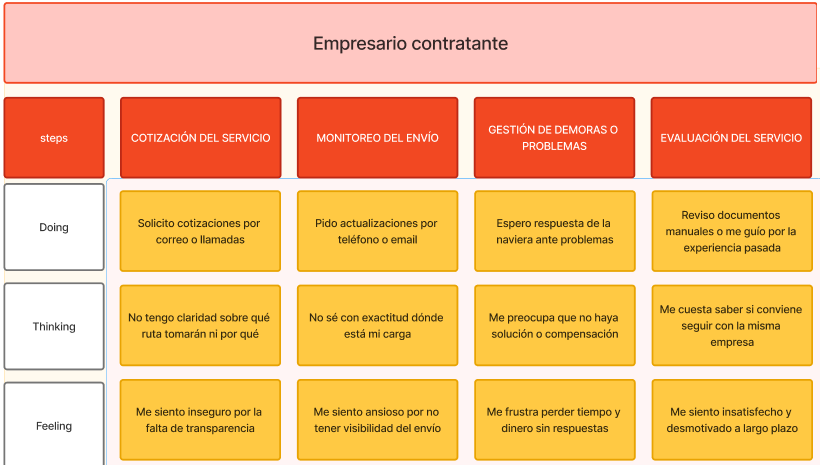
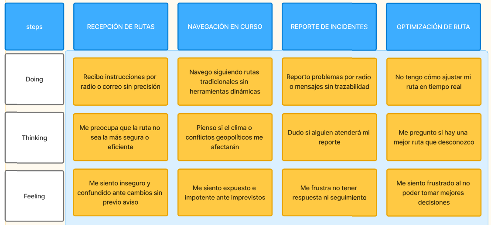

# Capítulo II: Requirements Elicitation & Analysis

## 2.1. Competidores

### 2.1.1 Análisis Competitivo
<table>
  <tr>
    <th colspan="22">Competitive Analysis Landscape</th>
  </tr>
  <tr>
    <td colspan="1">¿Por qué llevar a cabo el análisis?</td>
    <td colspan="17">Este análisis nos ayuda a entender las particularidades de cada sitio web o aplicación, identificar la competencia en el mercado y planificar cómo abordar las oportunidades. También nos permite trabajar en la mejora continua de nuestras áreas de desarrollo.</td>
  </tr>
  <tr>
    <td colspan="2">(En la cabecera colocar por cada competidor nombre y logo)</td>
    <td>MarineTraffic </td>
    <td>Windward </td>
    <td>FleetMon </td>
</tr>
  <tr>
    <td rowspan="2">Perfil</td>
    <td>Overview</td>
    <td>MarineTraffic es una plataforma global de seguimiento de embarcaciones en tiempo real basada en datos AIS. Permite visualizar la posición de barcos, itinerarios, historial de rutas, y datos portuarios. Se usa ampliamente por operadores logísticos, agencias navieras y entusiastas del sector marítimo.</td>
    <td>	Windward es una solución avanzada de inteligencia marítima que utiliza inteligencia artificial para evaluar riesgos, prever comportamientos sospechosos y optimizar operaciones navieras. Sus clientes incluyen gobiernos, aseguradoras y grandes navieras.</td>
    <td>FleetMon ofrece datos AIS en tiempo real y servicios de análisis para rastreo de flotas, predicción de llegadas a puerto, y documentación logística. Su interfaz está dirigida tanto a usuarios corporativos como a operadores individuales.
  </td>
  </tr>
  <tr>
  <td>Ventaja Competitiva</td>
  <td>Alta cobertura AIS global, interfaz amigable, muy popular en el sector, especialmente para monitoreo pasivo de tráfico.</td>
    <td>Potente capacidad analítica predictiva, análisis de riesgos en profundidad, clientes de alto nivel institucional.</td>
    <td>Versatilidad en el rastreo de flotas con herramientas personalizadas y buena documentación para desarrolladores.</td>
    </tr>
<tr>
    <td rowspan="2">Perfil de Marketing</td>
    <td>Mercado Objetivo</td>
    <td>Agencias logísticas, operadores portuarios, entusiastas del tracking marítimo.</td>
    <td>Gobiernos, aseguradoras marítimas, grandes navieras.</td>
    <td>Operadores logísticos, navieras pequeñas y medianas, desarrolladores.</td>
  </tr>
  <tr>
  <td>Estrategias de Marketing</td>
  <td>SEO, presencia en ferias marítimas, partnerships con puertos y armadores.</td>
    <td>Relaciones institucionales, ventas B2B, participación en foros de seguridad marítima.</td>
    <td>Marketing técnico, tutoriales API, contenido especializado.</td>
    </tr>
<tr>
    <td rowspan="3">Perfil de Producto</td>
    <td>Productos y Servicios</td>
    <td>Seguimiento AIS global, historial de rutas, tráfico portuario, alertas personalizadas, informes mensuales.</td>
    <td>Análisis de riesgo, predicción de comportamiento de flotas, detección de actividad sospechosa, insights de cumplimiento normativo.
</td>
    <td>Seguimiento de flotas, predicción de ETA, bases de datos de barcos, alertas personalizadas, informes descargables.</td>
  </tr>
  <tr>
  <td>Precios y Costos</td>
  <td>Planes desde $25 al mes hasta más de $250, dependiendo de acceso a datos históricos, API, y cobertura satelital.</td>
    <td>Modelo enterprise, precios personalizados (usualmente desde $1,000+ mensuales). 
-Membresías: desde S/ 15 por mes hasta S/ 120 por año.</td>
    <td>Planes desde €29 por mes hasta más de €150 mensuales. Acceso API premium se cobra adicional.</td>
    </tr>
<td>Canales de distribución (Web y/o Móvil)</td>
  <td>Web, app móvil, API.</td>
    <td>Web, consultoría directa, integración con plataformas empresariales.</td>
    <td>Web, app móvil, API para integración.</td>
    </tr>
<tr>
    <td rowspan="4">Análisis SWOT</td>
    <td>Fortalezas</td>
    <td>Cobertura global, interfaz intuitiva, alta adopción.</td>
    <td>Inteligencia predictiva avanzada, prestigio institucional.</td>
    <td>Flexibilidad, personalización, buen soporte para desarrolladores.</td>
  </tr>
  <tr>
  <td>Debilidades</td>
  <td>Menor enfoque analítico, poco personalizable.</td>
    <td>Precio alto, no enfocado en usuarios operativos.</td>
    <td>Menor alcance global que MarineTraffic.</td>
    </tr>
<td>Oportunidades</td>
  <td>Expansión de APIs e integración con puertos.</td>
    <td>Colaboraciones con aseguradoras y gobiernos.</td>
    <td>Expansión hacia soluciones logísticas especializadas.</td>
    </tr>
<td>Amenazas</td>
  <td>Saturación de plataformas similares.</td>
    <td>Alto costo de entrada limita adopción.</td>
    <td>Competencia con MarineTraffic y VesselFinder.</td>
</table>

### 2.1.2. Estrategias y tácticas frente a competidores.

Teemo puede diferenciarse de sus competidores enfocándose en rutas críticas como el Mar Rojo, ofreciendo visualizaciones específicas, mapas de riesgo interactivos y alertas geopolíticas en tiempo real. A diferencia de herramientas reactivas, Teemo puede adoptar un enfoque proactivo con simuladores de rutas seguras y predicción de congestión mediante algoritmos inteligentes. Además, al priorizar una experiencia de usuario simplificada y localizada para capitanes y agencias pequeñas, con soporte offline y en idiomas clave como árabe e inglés, puede ganar terreno donde otros no llegan. Su modelo de precios accesible, con planes escalables y pruebas gratuitas, lo hace ideal para PYMEs del sector. Complementariamente, Teemo puede fortalecer su propuesta con alianzas en puertos estratégicos del Mar Rojo, una comunidad colaborativa estilo “Waze marítimo” para reportes en tiempo real, e integrar contexto geopolítico explicativo con fuentes verificadas, generando así una plataforma marítima más segura, útil y centrada en los usuarios más afectados por las crisis actuales.

## 2.2. Entrevistas
Las entrevistas buscan entender mejor a los usuarios y cómo usan la tecnología. Queremos saber qué piensan sobre los servicios en línea, los problemas que han tenido y qué esperan sobre nuestro proyecto.

### 2.2.1 Diseño de entrevistas 

**Preguntas para ambos segmentos**

- Presentación:
    - ¿Cual es su nombre?
    - ¿Que edad tiene?
    - ¿En qué Distrito vive?
    - ¿Estado Civil?
    - ¿Cual es su ocupación? ¿Estudia y/o trabaja?

**Preguntas para Estudiantes Universitarios**
- ¿Cuál es su rol a bordo o dentro del equipo de planificación de rutas del crucero?
- ¿Cuántos años de experiencia tiene navegando o coordinando rutas internacionales?
- ¿Qué tipo de cruceros opera actualmente (turísticos, de lujo, rutas regionales, etc.)?
- ¿Con qué frecuencia transitan por el Mar Rojo o rutas cercanas?
- ¿Qué herramientas o sistemas utilizan para planificar y monitorear rutas en tiempo real?
- ¿Quién toma la decisión final cuando se necesita desviar una ruta por razones de seguridad?
- ¿Cómo acceden a información meteorológica, geopolítica o logística antes de cada travesía?

**Preguntas para el segmento: Agencias de embarcaciones navieras**
- ¿Cuál es su rol dentro de la agencia naviera?
- ¿Cuántos barcos o rutas supervisa actualmente su agencia?
- ¿Qué tipos de embarcaciones manejan con más frecuencia (mercantes, petroleros, cruceros, etc.)?
- ¿Cómo han afectado las tensiones geopolíticas en el Mar Rojo (por ejemplo, los ataques hutíes) a la planificación de sus rutas?
- ¿Qué decisiones operativas han debido tomar como resultado de los desvíos alrededor del Cabo de Buena Esperanza?
- ¿Han experimentado demoras o incrementos en los costos de transporte en los últimos meses debido a esta situación?
- ¿Qué tan difícil ha sido acceder a información confiable y oportuna sobre riesgos en rutas específicas?

### 2.2.2. Registro de entrevistas 
En el proceso de investigación para nuestro proyecto, se llevaron a cabo entrevistas del público objetivo. Cada entrevista se documentó en video y se registraron los siguientes detalles:

Link de la entrevista: 

**Segmento 1: Agencias de embarcaciones navieras**

#### Entrevista 1:

**Nombre y Apellido:** Arwen Vasquez

**Edad:** 21 años

**Distrito:** Callao

**Screenshot de la Entrevista:**

**Timelapse:** [Inicio: 00:00, Fin: 06:53]

**Resumen de la Entrevista:**
El entrevistado es Gabriel García, un estudiante de 21 años que vive en Carabayllo. Usa principalmente su iPhone y prefiere navegadores como Safari, Opera y Chrome. Para comunicarse, prefiere llamadas telefónicas y redes sociales como Instagram, Facebook y WhatsApp. Sus marcas que han influenciado en el son Adidas y Apple ya que han tenido un gran impacto en él.

Entre los desafíos para ir a la universidad menciona el tráfico excesivo, que retrasa su llegada. Aunque no usa bicicletas frecuentemente, estaría dispuesto a suscribirse a un servicio de alquiler de bicicletas para ahorrar tiempo y contribuir al medio ambiente. Considera importantes la calidad de las bicicletas, estaciones bien ubicadas y un precio accesible. Estaría dispuesto a pagar 30 soles al mes por el servicio y valora promociones en alimentos, descuentos en ropa y conexiones con servicios como gimnasios.

#### Entrevista 2:

**Nombre y Apellido:** Mariela Sanchez

**Edad:** 20 años

**Distrito:** Callao

**Screenshot de la Entrevista:**

**Timelapse:** [Inicio: 06:53, Fin: 10:28]

**Resumen de la Entrevista:**
Diego Flores, un estudiante de 20 años que vive en Barranco, utiliza principalmente un iPhone y una PC con Windows, y prefiere navegadores como Chrome y Opera GX. Para comunicarse, opta por redes sociales y encuentros presenciales. Las marcas que más influyen en él son Adidas, Apple y Microsoft. En cuanto a transporte, enfrenta problemas de tráfico y tiempo al desplazarse a la universidad, lo que lo motiva a usar medios alternativos como bicicletas y scooters. Le interesa un servicio de suscripción de bicicletas, considerando cruciales las ubicaciones de las estaciones y un precio accesible, estando dispuesto a pagar 10 soles mensuales. También valora promociones como viajes gratuitos tras un número determinado de viajes, lo que lo haría más atractivo para estudiantes como él.

#### Entrevista 3:

**Nombre y Apellido:** Alejandro Rivas

**Edad:** 20 años

**Distrito:** Callao

**Screenshot de la Entrevista:**

**Timelapse:** [Inicio: 10:28, Fin: 16:46]

**Resumen de la Entrevista:**

Alejandro Rivas, de 20 años y estudiante de ingeniería de software en su sexto ciclo, utiliza principalmente su laptop para sus actividades diarias, llevándola consigo a la universidad y otros lugares. Prefiere navegar con Chrome y Edge y para comunicarse opta por llamadas virtuales a través de Zoom o Meet. En cuanto a transporte, su principal preocupación es el riesgo de robo al llevar su laptop en el transporte público, por lo que usa su carnet universitario para reducir costos. Aunque no tiene bicicleta propia, ocasionalmente utiliza la de su hermano para moverse por su zona. Está interesado en un servicio de suscripción de bicicletas, siempre que las estaciones estén a una distancia conveniente. Le gustan las bicicletas clásicas como las BMX, y estaría dispuesto a pagar entre 20 y 30 soles al mes, ya que actualmente gasta unos 60 soles en pasajes. Además, le gustaría ver promociones como descuentos por meses de uso o sorteos para suscriptores recurrentes, lo cual haría el servicio más atractivo para él y otros estudiantes.

**Segmento 2: Capitanes de crucero o sus jefes de ruta**

#### Entrevista 1:

**Nombre y Apellido:** Patricia Salas

**Edad:** 24 años

**Distrito:** Surquillo

**Screenshot de la Entrevista:**

**Timelapse:** [Inicio: 16:46, Fin: 24:38]

**Resumen de la Entrevista:**

El entrevistado es un joven de 24 años que vive en el distrito de Surquillo. Es soltero pero tiene pareja actualmente. Terminó la universidad hace un par de años y trabaja como analista de datos en Culqui.

En cuanto a herramientas tecnológicas, utiliza una PC con sistema operativo Windows en su trabajo debido a los programas que emplea, como SQL, Visual Code y Trino. Para su uso personal, utiliza un celular con sistema operativo Android. Prefiere el navegador Brave por su eficiencia y menor consumo de datos, aunque en su trabajo usa Google Chrome. Para comunicarse, prefiere los mensajes por WhatsApp porque le permite responder en su propio tiempo.

Las marcas que han tenido mayor impacto en él son Samsung, Microsoft, Xbox y Sennheiser. Estas marcas están relacionadas con sus intereses en tecnología, trabajo y entretenimiento.

Sobre el uso de la bicicleta, la utiliza como medio de transporte dos veces por semana para ir al trabajo, ya que le toma aproximadamente media hora y es más eficiente y económico que otros medios de transporte como el Metropolitano. Las principales barreras que encuentra al usar la bicicleta en la ciudad son la falta de ciclovías y la poca consideración de los conductores hacia los ciclistas.

Le atrae la idea de un servicio de alquiler de bicicletas que permita tomar una bicicleta en un punto y dejarla en otro, con múltiples estaciones disponibles. De igual modo, valora especialmente los descuentos, promociones y planes de suscripción mensual o anual que ofrezcan precios más atractivos. A la vez, considera razonable pagar cinco soles por hora o entre cuarenta y sesenta soles por día para alquilar una bicicleta en buen estado.

#### Entrevista 2:

**Nombre y Apellido:** Mariela Sanchez

**Edad:** 40 años

**Distrito:** Callao

**Screenshot de la Entrevista:**

**Timelapse:** [Inicio: 24:38, Fin: 29:22]

**Resumen de la Entrevista:**
Mariela Sánchez, una mujer de 39 años que vive en el Callao y está casada, nos comenta que trabaja actualmente y usa principalmente su celular Android y una laptop con Windows. Prefiere el navegador Chrome y las reuniones presenciales para comunicarse con sus amistades y en temas de trabajo.

En cuanto a su uso de la bicicleta, Mariela la utiliza 2-3 veces por semana. Prefiere este medio de transporte por su rapidez, los beneficios para la salud y su contribución al medio ambiente. Sin embargo, enfrenta desafíos como la falta de respeto a las ciclovías por parte de algunos conductores y el mal mantenimiento de estas vías.

Respecto al servicio de alquiler de bicicletas, Mariela prefiere alquilar por días y valora la asistencia en caso de problemas mecánicos, como llantas ponchadas o fallos en los cambios. Considera razonable un precio de 5-6 soles por día y sugiere promociones para uso frecuente de lunes a viernes, con la posibilidad de dejar la bicicleta el sábado para mantenimiento.

De tal modo, la entrevista se realizó para entender mejor las preferencias y necesidades de los usuarios y así mejorar el servicio. A su vez, se destacó la importancia de contar con asistencia técnica y precios competitivos, lo cual ayudará a la startup a ofrecer un servicio más atractivo y eficiente para sus clientes.

#### Entrevista 3:

**Nombre y Apellido:** Alejandro Rivas

**Edad:** 45

**Distrito:** Jesus Maria

**Screenshot de la Entrevista:**

**Timelapse:** [Inicio: 29:22, Fin: 33:41]

**Resumen de la Entrevista:**
Miguel Polo es un joven de 19 años que trabaja en Tailoy y está soltero. Vive en Lima y, a pesar de su juventud, muestra una gran responsabilidad y organización en su vida diaria. Utiliza principalmente una computadora con Windows para sus actividades tecnológicas y prefiere los navegadores Opera y Chrome para navegar por Internet. En cuanto a la comunicación, Miguel se inclina por usar WhatsApp para mensajes de texto y Google Meet para videoconferencias, lo que indica su comodidad tanto con la tecnología como con la interacción digital.

Miguel es un usuario frecuente de la bicicleta, utilizándola todos los días para ir y volver del trabajo. Esta elección refleja su preferencia por la eficiencia y la rapidez, ya que considera que la bicicleta es un medio de transporte más rápido y sencillo en comparación con el microbús. Sin embargo, también enfrenta desafíos significativos, como la inseguridad vial y la falta de respeto hacia las ciclovías por parte de algunos conductores, lo que demuestra su conciencia sobre los problemas de infraestructura y seguridad en la ciudad.

En su tiempo libre, es probable que Miguel disfrute de actividades al aire libre, dado su uso diario de la bicicleta. Su elección de herramientas tecnológicas y su preferencia por la comunicación digital sugieren que es una persona adaptada a las nuevas tecnologías y que valora la eficiencia en su vida cotidiana. Además, su disposición a participar en la entrevista y compartir sus opiniones indica que es una persona colaborativa y abierta a contribuir con ideas para mejorar servicios que beneficien a la comunidad.

### 2.2.3. Análisis de entrevistas

**_Segmento 1: Agencias de embarcaciones navieras_**

**_Segmento 2: Transportista Maritimo (Capitan o Jefe de navegación)_**

## 2.3. Needfinding
Posteriormente a las entrevistas, pudimos obtener la información sobre sus deseos, frustraciones, situación y múltiples datos que nos van a servir para satisfacer sus necesidades, mejorando la experiencia a nuestros usuarios. 
Esta información también nos ayudará a realizar los esquemas para las secciones de User Personas, User Task Matrix, User Journey Maps y el Empathy Mapping.

### 2.3.1. User Persona
Para desarrollar Mushroom, hemos entrevistado a estudiantes y usuarios de bicicletas. Estos datos nos permiten crear "User Personas" detalladas, que guiarán el diseño y desarrollo de nuestra plataforma para satisfacer las necesidades específicas de nuestros usuarios, ofreciendo una solución de movilidad eficiente y sostenible.

**_Segmento 1: Agencias de embarcaciones navieras_**

**_Segmento 2: Transportista Maritimo (Capitan o Jefe de navegación)_**

### 2.3.2. User Task Matrix

Elaboramos los User Task Matrix  del Usuario con el propósito de determinar la frecuencia con la que los usuarios llevan a cabo diversas actividades, lo que nos permite visualizar la importancia de ciertas tareas.

**_Segmento 1: Agencias de embarcaciones navieras_**

| Tareas                                                        |  Importancia   |  Frecuencia               |
|---------------------------------------------------------------|--------------------------|--------------------------
| Evaluar rutas marítimas antes de cada embarque.	                        |Alta                     | Siempre
| Reprogramar rutas en tiempo real	 |Media                 | Siempre                  
| Estimar tiempos de llegada y retrasos potenciales |Alta         | Siempre           
| Coordinar logística con puertos alternos                   |Media                   | A veces                  
| Acceder a reportes de riesgos marítimos |Media            | A veces                  
| Comunicar cambios de ruta con embarcaciones        |Alta                     | Diaria/Semanal                  
| Simular rutas con menor riesgo y costo     |Baja                    | Diaria                 
| Generar informes para clientes o directivos                    |Media                     | Ocasionalmente    

**_Segmento 2: Transportista Maritimo (Capitan o Jefe de navegación)_**

| Tareas                                                        |  Importancia   |   Frecuencia               |
|---------------------------------------------------------------|--------------------------|--------------------------
| Planificar rutas seguras antes de cada viaje		                        |Alta                     | Diaria
| Monitorear en tiempo real cambios meteorológicos y riesgos geopolíticos	 |Media                 | Semanal/Mensual                  
| Comunicar emergencias y desvíos con su equipo en tierra |Media         | Diaria/Semanal
| Asegurar cumplimiento del itinerario turístico                 |Alta                 | Diaria               
| Verificar acceso a puertos alternativos en tiempo de crisis	 |Alta            | Semanal                  
| Tomar decisiones de desvío inmediato        |Media                     | Diaria/Semanal                              
| Realizar reportes post-ruta o bitácoras                    |Media                     | Ocasionalmente    

**Analisis y Explicación:**

Las agencias de embarcaciones navieras, al estar centradas en la planificación estratégica y la gestión logística, suelen actuar con un enfoque preventivo: evalúan rutas con antelación, generan reportes para toma de decisiones y necesitan simular escenarios posibles ante amenazas geopolíticas. Son usuarios que valoran la precisión, confiabilidad y anticipación, y que trabajan en horarios más estables pero bajo alta presión institucional. En contraste, los capitanes de crucero y sus jefes de ruta operan en un entorno de alta inmediatez, con necesidad de información clara y decisiones rápidas. Su comportamiento es más reactivo y está marcado por la necesidad de flujo continuo de datos en tiempo real, comunicación ágil con tierra y facilidad para adaptarse en situaciones críticas, como desvíos urgentes o interrupciones portuarias. 

### 2.3.3. User Journey Mapping

Creamos los User Journey Maps con el objetivo de comprender la experiencia de nuestro cliente al utilizar nuestra aplicación. Por ende, cada paso que el cliente realiza se detalla minuciosamente, incluyendo el proceso, los obstáculos encontrados y los pensamientos o emociones que surgen a raíz de ello.

**_Segmento 1: Agencias de embarcaciones navieras_**

**_Segmento 2: Transportista Maritimo (Capitan o Jefe de navegación)_**

### 2.3.4. Empathy Mapping
Para el desarrollo de los Empathy Map hemos utilizado la información recopilada en base a nuestros dos User Personas que representan nuestro segmento.

**_Segmento 1: Agencias de embarcaciones navieras_**

**_Segmento 2: Transportista Maritimo (Capitan o Jefe de navegación)_**

### 2.3.5. As-is Scenario Mapping
Realizamos una lluvia de ideas e identificamos las fases de acorde a lo propuesto en los User Persona. De tal modo, hemos conseguido realizar los As-Is mapping para los segmentos dados.

**_Segmento 1: Agencias de embarcaciones navieras_**

<td></td>

**_Segmento 2: Transportista Maritimo (Capitan o Jefe de navegación)_**

<td></td>

### 2.3.6. Ubiquitous Language

- **Ruta Segura**:	Trayectoria marítima recomendada basada en criterios de seguridad actualizados, incluyendo riesgos geopolíticos.

- **Simulador de Ruta**:	Herramienta que permite visualizar, comparar y proyectar diferentes rutas posibles considerando variables críticas.

- **Alerta en Tiempo**: Real	Notificación automatizada que informa sobre amenazas o cambios relevantes (clima, ataques, cierre de puertos, etc).

- **Capitán**:	Usuario operativo que navega en el mar y requiere decisiones inmediatas sobre navegación y seguridad.

- **Jefe de Ruta**:	Perfil que acompaña o asiste al capitán en la planificación y monitoreo de trayectos marítimos.

- **Agencia Naviera**:	Organización encargada de coordinar, planificar y aprobar rutas y operaciones logísticas de embarcaciones.

- **Punto Crítico**:	Zona geográfica de alto riesgo para embarcaciones, ya sea por conflicto armado, condiciones climáticas o congestión.

- **Panel de Monitoreo**:	Vista centralizada de la ubicación de embarcaciones, rutas activas y condiciones del entorno.

- **Reporte de Ruta**:	Documento generado automáticamente o a solicitud, que resume el estado de una ruta, riesgos y alternativas sugeridas.
