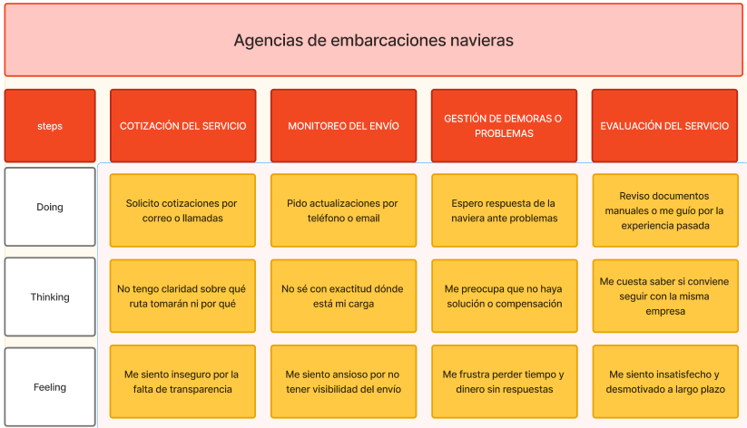

# Capítulo II: Requirements Elicitation & Analysis

La recolección y el análisis de requisitos constituyen la piedra angular de cualquier proyecto exitoso. En esta fase se identifican y documentan, de manera sistemática, las necesidades, expectativas y restricciones de todos los grupos de interés (stakeholders), así como los objetivos de negocio que el proyecto debe cumplir. Para lograrlo, se emplean técnicas como entrevistas individuales, encuestas cuantitativas, talleres colaborativos y análisis de la competencia, que permiten obtener una visión integral y detallada de lo que se desea alcanzar.

Un análisis riguroso de estos requisitos proporciona una base firme para el diseño y desarrollo posteriores, minimiza retrabajos y alineaciones erróneas, y garantiza que la solución final no solo satisfaga las necesidades reales de los usuarios, sino que también aporte valor al negocio. De este modo, se establecen criterios claros de éxito y se facilita la toma de decisiones a lo largo de todo el ciclo de vida del proyecto, optimizando recursos y tiempos.

## 2.1. Competidores

Nuestro proyecto se centra en el desarrollo de Mushroom, una solución centrada en el manejo de rutas entre distintos puertos internacionales con el uso del algoritmo A* y con la revisión de datos en vivo externos como datos metereológicos y oceanográficos. Cuenta tanto con una plataforma web y una plataforma móvil.

Partiendo de estas capacidades innovadoras, hemos identificado y analizado a los principales competidores que podrían desafiar nuestra propuesta en el mercado de la gestión marítima. Estas empresas representan una amenaza potencial para la adopción y crecimiento de Mushroom, ya que cuentan con trayectoria en dispositivos conectados, equipos multidisciplinarios y recursos para escalar rápidamente. A continuación, presentamos los competidores más relevantes y sus puntos fuertes:

### 2.1.1 Análisis Competitivo

El análisis competitivo nos brinda una visión clara de cómo nos comparamos con nuestros competidores en el mercado. Nos ayuda a identificar áreas en las que podemos mejorar, así como oportunidades para diferenciarnos y destacar. Esta comprensión nos permite desarrollar estrategias más efectivas como grupo, lo que nos ayuda a alcanzar nuestros objetivos y mantenernos competitivos en el mercado.

###### Tabla 3
*Análisis Competitivo organizado para todos los competidores potenciales de Mushroom*

<table>
  <tr>
    <th colspan="22">Competitive Analysis Landscape</th>
  </tr>
  <tr>
    <td colspan="1">¿Por qué llevar a cabo el análisis?</td>
    <td colspan="17">Este análisis nos ayuda a entender las particularidades de cada sitio web o aplicación, identificar la competencia en el mercado y planificar cómo abordar las oportunidades. También nos permite trabajar en la mejora continua de nuestras áreas de desarrollo.</td>
  </tr>
  <tr>
    <td colspan="2">(En la cabecera colocar por cada competidor su nombre )</td>
    <td>MarineTraffic  </td>
    <td>Windward </td>
    <td>FleetMon </td>
</tr>
  <tr>
    <td rowspan="2">Perfil</td>
    <td>Overview</td>
    <td>MarineTraffic es una plataforma global de seguimiento de embarcaciones en tiempo real basada en datos AIS. Permite visualizar la posición de barcos, itinerarios, historial de rutas, y datos portuarios. Se usa ampliamente por operadores logísticos, agencias navieras y entusiastas del sector marítimo.</td>
    <td>	Windward es una solución avanzada de inteligencia marítima que utiliza inteligencia artificial para evaluar riesgos, prever comportamientos sospechosos y optimizar operaciones navieras. Sus clientes incluyen gobiernos, aseguradoras y grandes navieras.</td>
    <td>FleetMon ofrece datos AIS en tiempo real y servicios de análisis para rastreo de flotas, predicción de llegadas a puerto, y documentación logística. Su interfaz está dirigida tanto a usuarios corporativos como a operadores individuales.
  </td>
  </tr>
  <tr>
  <td>Ventaja Competitiva</td>
  <td>Alta cobertura AIS global, interfaz amigable, muy popular en el sector, especialmente para monitoreo pasivo de tráfico.</td>
    <td>Potente capacidad analítica predictiva, análisis de riesgos en profundidad, clientes de alto nivel institucional.</td>
    <td>Versatilidad en el rastreo de flotas con herramientas personalizadas y buena documentación para desarrolladores.</td>
    </tr>
<tr>
    <td rowspan="2">Perfil de Marketing</td>
    <td>Mercado Objetivo</td>
    <td>Agencias logísticas, operadores portuarios, entusiastas del tracking marítimo.</td>
    <td>Gobiernos, aseguradoras marítimas, grandes navieras.</td>
    <td>Operadores logísticos, navieras pequeñas y medianas, desarrolladores.</td>
  </tr>
  <tr>
  <td>Estrategias de Marketing</td>
  <td>SEO, presencia en ferias marítimas, partnerships con puertos y armadores.</td>
    <td>Relaciones institucionales, ventas B2B, participación en foros de seguridad marítima.</td>
    <td>Marketing técnico, tutoriales API, contenido especializado.</td>
    </tr>
<tr>
    <td rowspan="3">Perfil de Producto</td>
    <td>Productos y Servicios</td>
    <td>Seguimiento AIS global, historial de rutas, tráfico portuario, alertas personalizadas, informes mensuales.</td>
    <td>Análisis de riesgo, predicción de comportamiento de flotas, detección de actividad sospechosa, insights de cumplimiento normativo.
</td>
    <td>Seguimiento de flotas, predicción de ETA, bases de datos de barcos, alertas personalizadas, informes descargables.</td>
  </tr>
  <tr>
  <td>Precios y Costos</td>
  <td>Planes desde $25 al mes hasta más de $250, dependiendo de acceso a datos históricos, API, y cobertura satelital.</td>
    <td>Modelo enterprise, precios personalizados (usualmente desde $1,000+ mensuales). 
-Membresías: desde S/ 15 por mes hasta S/ 120 por año.</td>
    <td>Planes desde €29 por mes hasta más de €150 mensuales. Acceso API premium se cobra adicional.</td>
    </tr>
<td>Canales de distribución (Web y/o Móvil)</td>
  <td>Web, app móvil, API.</td>
    <td>Web, consultoría directa, integración con plataformas empresariales.</td>
    <td>Web, app móvil, API para integración.</td>
    </tr>
<tr>
    <td rowspan="4">Análisis SWOT</td>
    <td>Fortalezas</td>
    <td>Cobertura global, interfaz intuitiva, alta adopción.</td>
    <td>Inteligencia predictiva avanzada, prestigio institucional.</td>
    <td>Flexibilidad, personalización, buen soporte para desarrolladores.</td>
  </tr>
  <tr>
  <td>Debilidades</td>
  <td>Menor enfoque analítico, poco personalizable.</td>
    <td>Precio alto, no enfocado en usuarios operativos.</td>
    <td>Menor alcance global que MarineTraffic.</td>
    </tr>
<td>Oportunidades</td>
  <td>Expansión de APIs e integración con puertos.</td>
    <td>Colaboraciones con aseguradoras y gobiernos.</td>
    <td>Expansión hacia soluciones logísticas especializadas.</td>
    </tr>
<td>Amenazas</td>
  <td>Saturación de plataformas similares.</td>
    <td>Alto costo de entrada limita adopción.</td>
    <td>Competencia con MarineTraffic y VesselFinder.</td>
</table>

### 2.1.2. Estrategias y tácticas frente a competidores.

Para destacar frente a competidores y consolidar nuestra posición en el mercado de gestión de transporte marítimo, resulta imprescindible diseñar e implementar un conjunto de estrategias y tácticas coordinadas que refuercen nuestra diferenciación y capten la atención de los segmentos objetivo. 

Teemo puede diferenciarse de sus competidores enfocándose en rutas críticas como el Mar Rojo, ofreciendo visualizaciones específicas, mapas de riesgo interactivos y alertas geopolíticas en tiempo real. A diferencia de herramientas reactivas, Teemo puede adoptar un enfoque proactivo con simuladores de rutas seguras y predicción de congestión mediante algoritmos inteligentes. Además, al priorizar una experiencia de usuario simplificada y localizada para capitanes y agencias pequeñas, con soporte offline y en idiomas clave como árabe e inglés, puede ganar terreno donde otros no llegan. Su modelo de precios accesible, con planes escalables y pruebas gratuitas, lo hace ideal para PYMEs del sector. Complementariamente, Teemo puede fortalecer su propuesta con alianzas en puertos estratégicos del Mar Rojo, una comunidad colaborativa estilo “Waze marítimo” para reportes en tiempo real, e integrar contexto geopolítico explicativo con fuentes verificadas, generando así una plataforma marítima más segura, útil y centrada en los usuarios más afectados por las crisis actuales.

## 2.2. Entrevistas

El propósito de las entrevistas personales en Mushroom consiste en profundizar en las experiencias y motivaciones de nuestros usuarios clave para fundamentar el diseño y la optimización de la plataforma y dispositivo de gestión de rutas marítimas. Mediante una guía semiestructurada, buscamos identificar patrones de uso y pain points específicos, de modo que los módulos de identificación de ruta, revisión de información y visualización de grafos se ajusten de forma precisa a las necesidades de los usuarios (Hair Jr. et al., 2023).

Al centrar las conversaciones en la interacción entre el usuario con el uso de distintas rutas marítimas, el uso de tecnología en la gestión de rutas largas y modelos de incoterms, obtenemos información cualitativa y cuantitativa. Esto nos permite validar y refinar nuestras hipótesis de diseño.

Estas entrevistas generan una base de conocimiento que orienta el desarrollo continuo de Mushroom, asegurando que cada nueva funcionalidad responda directamente a los requerimientos y expectativas de nuestros usuarios.

### 2.2.1 Diseño de entrevistas 

**Preguntas para ambos segmentos**

- Presentación:
    - ¿Cual es su nombre?
    - ¿Que edad tiene?
    - ¿En qué Distrito vive?
    - ¿Estado Civil?
    - ¿Cual es su ocupación? ¿Estudia y/o trabaja?

**Preguntas para Empresas Navieras y Operadoras Logísticas Globales**
- ¿Cuál es su rol a bordo o dentro del equipo de planificación de rutas del crucero?
- ¿Cuántos años de experiencia tiene navegando o coordinando rutas internacionales?
- ¿Qué tipo de cruceros opera actualmente (turísticos, de lujo, rutas regionales, etc.)?
- ¿Con qué frecuencia transitan por el Mar Rojo o rutas cercanas?
- ¿Qué herramientas o sistemas utilizan para planificar y monitorear rutas en tiempo real?
- ¿Quién toma la decisión final cuando se necesita desviar una ruta por razones de seguridad?
- ¿Cómo acceden a información meteorológica, geopolítica o logística antes de cada travesía?

**Preguntas para el segmento: Exportadores e Importadores de Alta Rotación**
- ¿Cuál es su rol dentro de la agencia naviera?
- ¿Cuántos barcos o rutas supervisa actualmente su agencia?
- ¿Qué tipos de embarcaciones manejan con más frecuencia (mercantes, petroleros, cruceros, etc.)?
- ¿Cómo han afectado las tensiones geopolíticas en el Mar Rojo (por ejemplo, los ataques hutíes) a la planificación de sus rutas?
- ¿Qué decisiones operativas han debido tomar como resultado de los desvíos alrededor del Cabo de Buena Esperanza?
- ¿Han experimentado demoras o incrementos en los costos de transporte en los últimos meses debido a esta situación?
- ¿Qué tan difícil ha sido acceder a información confiable y oportuna sobre riesgos en rutas específicas?

### 2.2.2. Registro de entrevistas 

El registro sistemático de las entrevistas constituye una herramienta esencial para la recopilación y organización rigurosa de la información obtenida de nuestros usuarios. Al documentar de manera estructurada las respuestas, comentarios y observaciones relevantes, se facilita el análisis cualitativo y la detección de patrones o tendencias que sustentan la toma de decisiones (Hair Jr. et al., 2023). Asimismo, contar con un historial detallado de las interacciones permite asegurar la coherencia en el seguimiento de las necesidades y expectativas del usuario a lo largo de las distintas fases del proyecto.

Para acceder a la grabación completa de las entrevistas realizadas, puede consultarse el siguiente enlace al recurso:

[Entrevistas de Usuario para el Proyecto Mushroom – Equipo de TeemoSolutions](https://upcedupe-my.sharepoint.com/:v:/g/personal/u20221a955_upc_edu_pe/ERshpHqBeD1Btquo46R2npsBg3-ZqoIrr90kLY8Ix_a4qw?e=brkSf8&nav=eyJyZWZlcnJhbEluZm8iOnsicmVmZXJyYWxBcHAiOiJTdHJlYW1XZWJBcHAiLCJyZWZlcnJhbFZpZXciOiJTaGFyZURpYWxvZy1MaW5rIiwicmVmZXJyYWxBcHBQbGF0Zm9ybSI6IldlYiIsInJlZmVycmFsTW9kZSI6InZpZXcifX0%3D)

**Segmento 1: Empresas Navieras y Operadoras Logísticas Globales**

#### Entrevista 1:

**Nombre y Apellido:** Patricia Salas

**Edad:** 45 años

**Distrito:** Callao

**Screenshot de la Entrevista:** 

###### Figura 2
*Captura de pantalla de la primera entrevista realizada al primer segmento objetivo de Mushroom*

**Timelapse:** [Inicio: 14:45, Fin: 20:19]

**Resumen de la Entrevista:**

Patricia ocupa el rol de directora de planificación de rutas en una empresa de cruceros turísticos de alta gama. Cuenta con 22 años de experiencia coordinando rutas internacionales, especialmente en itinerarios de lujo por el Mediterráneo, Caribe y algunas travesías transatlánticas. Actualmente opera cruceros turísticos de lujo que ocasionalmente incluyen tramos por el Mar Rojo, aunque enfatizó que debido a los riesgos geopolíticos actuales, las rutas por esa zona han sido reducidas significativamente.
Para la planificación y monitoreo en tiempo real, su equipo utiliza una combinación de plataformas AIS, mapas satelitales interactivos y un software interno de optimización de rutas que les permite ajustar trayectos en función de condiciones climáticas y alertas de seguridad. En cuanto a decisiones de desvío, Patricia explicó que, aunque el capitán tiene la última palabra a bordo, todas las decisiones importantes se toman en coordinación con el centro de control en tierra, donde ella participa directamente.
El acceso a información crítica antes de cada travesía se realiza a través de briefings diarios, reportes meteorológicos internacionales, alertas geopolíticas emitidas por agencias de seguridad marítima y consultores externos especializados en riesgos marítimos. Patricia resaltó la importancia de mantener un flujo constante de información actualizada para garantizar tanto la seguridad de los pasajeros como la eficiencia de las operaciones.

---

**Segmento 2: Exportadores e Importadores de Alta Rotación**

#### Entrevista 1:

**Nombre y Apellido:** Arwen Vasquez

**Edad:** 40 años

**Distrito:** Callao

###### Figura 3
*Captura de pantalla de la primera entrevista realizada al segundo segmento objetivo de Mushroom*

**Screenshot de la Entrevista:** 

**Timelapse:** [Inicio: 00:00, Fin: 05:01]

**Resumen de la Entrevista:**

Arwen es capitana de embarcaciones pesqueras industriales. Tiene 20 años de experiencia en navegación de alta mar, en especial en el Pacífico Sur. Actualmente no trabaja con cruceros turísticos; opera embarcaciones de pesca de altura, pero conoce bien la planificación de rutas. No transita por el Mar Rojo, ya que su zona de operación está en aguas sudamericanas, pero comentó que entiende la importancia de esa región para el comercio mundial. Para planificar rutas, se apoya en sonares marinos avanzados, cartografía electrónica y informes de corrientes oceánicas. Ella misma, como capitana, decide cambios de ruta si la seguridad de la tripulación está en riesgo, actuando de forma autónoma en alta mar. Accede a informes meteorológicos de alta frecuencia, alertas de fenómenos climáticos, y a redes de información marina compartida entre capitanes pesqueros.

#### Entrevista 2:

**Nombre y Apellido:** Mariela Sanchez

**Edad:** 40 años

**Distrito:** Callao

###### Figura 4
*Captura de pantalla de la segunda entrevista realizada al segundo segmento objetivo de Mushroom*

**Screenshot de la Entrevista:** 

**Timelapse:** [Inicio: 05:01, Fin: 10:45]

**Resumen de la Entrevista:**

Mariela es jefa de operaciones navieras encargada de coordinar rutas para cruceros turísticos regionales. Tiene 16 años de experiencia en logística marítima. Actualmente opera principalmente cruceros turísticos y de lujo, orientados a recorridos en Sudamérica y el Caribe. Aunque su operación no es frecuente en el Mar Rojo, explicó que en temporadas especiales coordinan rutas alternativas que bordean África.
Utiliza plataformas de monitoreo AIS (Automatic Identification System) junto con softwares propios de planificación naviera. En caso de desvíos por riesgos, el capitán del barco tiene la última palabra, pero siempre con el respaldo del equipo de tierra. Mariela recurre a boletines meteorológicos internacionales, reportes de situación política y consultores de riesgos marítimos para cada travesía.

#### Entrevista 3:

**Nombre y Apellido:** Alejandro Rivas

**Edad:** 40

**Distrito:** Callao

###### Figura 5
*Captura de pantalla de la tercera entrevista realizada al segundo segmento objetivo de Mushroom*

**Screenshot de la Entrevista:** 

**Timelapse:** [Inicio: 10:45, Fin: 14:45]

**Resumen de la Entrevista:**

Alejandro es capitán de buque de carga internacional. Lleva 18 años navegando rutas tanto regionales como de larga distancia. Actualmente, opera principalmente cruceros de carga pesada, no turísticos. Respecto al Mar Rojo, comentó que transita la zona aproximadamente dos veces al año, y que debido a la situación geopolítica reciente, deben extremar precauciones. Para la planificación y monitoreo de rutas, utiliza sistemas ECDIS (Electronic Chart Display and Information System) combinados con radar de alta precisión. Cuando hay necesidad de desviar la ruta por seguridad, él mismo toma la decisión final, pero siempre consultando previamente con la compañía naviera. Sobre la información previa al viaje, accede a informes meteorológicos satelitales, briefings de inteligencia marítima y actualizaciones de tráfico marítimo en tiempo real.

---

### 2.2.3. Análisis de entrevistas

En esta sección presentamos el análisis detallado de las entrevistas realizadas a nuestros dos segmentos objetivos. Nuestro objetivo es identificar patrones de comportamiento, motivaciones y necesidades que nos permitan diseñar una solución que combine tecnología web y móvil que resuelva sus necesidades de manera intuitiva. Para ello, recopilamos testimonios, tres para cada segmento, resumimos sus características objetivas y subjetivas, y extraemos implicaciones de diseño concretas. A partir de estos hallazgos, construiremos un arquetipo final que guiará el desarrollo de la interfaz, las funcionalidades clave y la estrategia de adopción de Mushroom.

**Segmento 1: Empresas Navieras y Operadoras Logísticas Globales**

Patricia Salas, con 22 años de experiencia en la coordinación de rutas internacionales, actualmente se desempeña como directora de planificación de rutas en una empresa de cruceros turísticos de lujo. Su rol consiste en diseñar y supervisar las rutas de los cruceros, asegurando la optimización de los trayectos y la seguridad de los pasajeros. Aunque sus cruceros transitan ocasionalmente por el Mar Rojo, destacó que debido a la situación geopolítica reciente han disminuido considerablemente sus pasos por esa zona. Para planificar y monitorear en tiempo real, Patricia y su equipo utilizan plataformas AIS, mapas satelitales interactivos y un software interno especializado en optimización de rutas, lo que les permite realizar ajustes inmediatos ante cualquier alerta. En cuanto a las decisiones de desvío por seguridad, explicó que, aunque el capitán a bordo tiene la decisión final, todo se coordina estrechamente con el centro de control en tierra, donde ella participa directamente en la evaluación de riesgos. Para mantenerse actualizados antes de cada travesía, acceden a briefings diarios, reportes meteorológicos, alertas geopolíticas de agencias internacionales y consultorías externas de seguridad marítima, demostrando un enfoque sistemático y multidisciplinario en la gestión de riesgos y planificación estratégica.

**Segmento 2: Exportadores e Importadores de Alta Rotación**

Los capitanes y jefes de embarcaciones entrevistados comparten un perfil de alta experiencia, con entre 16 y 20 años navegando o coordinando rutas internacionales, y todos coinciden en que la decisión final ante un desvío por razones de seguridad siempre recae en el capitán a bordo. También es común el uso de tecnología avanzada para la planificación y monitoreo de rutas, incluyendo sistemas electrónicos como ECDIS, AIS, radares o sonares, así como la consulta regular de información meteorológica y geopolítica antes de cada travesía, aunque las fuentes y herramientas específicas varían según el tipo de operación. A pesar de estos puntos en común, existen diferencias claras: Alejandro opera buques de carga, Mariela coordina cruceros turísticos y de lujo, y Arwen lidera embarcaciones pesqueras industriales. Asimismo, mientras Alejandro transita rutas internacionales incluyendo el Mar Rojo, Mariela solo ocasionalmente se acerca a esta zona y Arwen opera exclusivamente en el Pacífico Sur. En cuanto a la obtención de información crítica, Alejandro depende de informes internos de inteligencia marítima, Mariela trabaja con consultores de riesgos externos, y Arwen se apoya en redes informales entre capitanes. A pesar de las diferencias en el tipo de embarcación y las zonas de operación, todos destacan que la seguridad de la tripulación y la actualización tecnológica constante son elementos fundamentales en su labor diaria.

## 2.3. Needfinding
En está sección presentamos los artefactos generados a partir del análisis de la información recolectada en las entrevistas: perfiles de User Personas, la User Task Matrix, los User Journey Maps, el Empathy Mapping y el As‑Is Scenario Mapping. Cada uno de estos elementos refleja las necesidades, motivaciones y puntos de dolor identificados y sirve como base para definir soluciones de diseño centradas en el usuario. Al mostrar estos entregables, buscamos garantizar que todas las decisiones de producto se apoyen en datos cualitativos sólidos y en una comprensión profunda de los comportamientos reales de nuestros usuarios.

El proceso de needfinding, según Patnaik (2017), consiste en la investigación y planificación del diseño orientada a descubrir las necesidades latentes y explícitas de los usuarios, más allá de lo que ellos mismos son capaces de articular. A través de técnicas como la observación contextual, la creación de mapas de empatía y la construcción de escenarios “as‑is”, este enfoque permite extraer insights que guían la ideación y la definición de soluciones efectivas. En las secciones siguientes, desplegaremos cómo hemos aplicado el método de needfinding para estructurar cada artefacto y, con ello, sentar las bases de Mushroom como una herramienta verdaderamente alineada con las expectativas y aspiraciones de nuestros segmentos objetivos.

### 2.3.1. User Persona
En esta sección describimos en detalle la construcción de las fichas de User Persona para cada uno de nuestros segmentos objetivo, integrando tanto los insights cualitativos extraídos de las entrevistas como los aprendizajes obtenidos del análisis competitivo en el mercado de jardinería inteligente. Partimos de los patrones de comportamientos, frustraciones y motivaciones identificados y los contrastamos con las propuestas de valor de competidores clave. De este modo, cada ficha de User Persona combina atributos demográficos y psicográficos con las funcionalidades diferenciales que Mushroom deberá ofrecer para cubrir vacíos detectados en otras soluciones.

Siguiendo las mejores prácticas de creación de personas establecidas por Nielsen (2019), cada ficha incluye información sobre metas, escenarios de uso, nivel de competencia tecnológica, canales de interacción preferidos y actitudes emocionales. Además, incorporamos referencias cruzadas entre los artefactos—User Task Matrix, User Journey Maps, Empathy Mapping y As‑Is Scenario Mapping—y las características clave surgidas tanto de las entrevistas como del benchmark competitivo. Esta integración garantiza que las User Personas no solo reflejen quiénes son nuestros usuarios y cómo piensan, sino también cómo Mushroom se posiciona para ofrecerles propuestas de valor únicas frente a las alternativas existentes, cimentando una estrategia de producto centrada en necesidades reales y oportunidades de diferenciación.

###### Figura 6
*User persona de nuestro segmento de Empresas Navieras y Operadoras Logísticas Globales*

###### Figura 7
*User persona de nuestro segmento de Exportadores e Importadores de Alta Rotación*

### 2.3.2. User Task Matrix

En esta sección presentamos el User Task Matrix, una herramienta que sintetiza las acciones clave que nuestros User Personas ejecutan para alcanzar sus objetivos de gestión de rutas, independientemente de la existencia de una solución digital. Para este ejercicio consideramos los dos segmentos definidos. Cada fila del matrix corresponde a una tarea concreta, mientras que las columnas se dividen en sub-columnas que indican la frecuencia y la importancia con que cada segmento realiza dicha tarea. Es fundamental distinguir entre tareas reales del usuario y funcionalidades del software, de modo que el matrix refleje el comportamiento orgánico de nuestros usuarios sin sesgarlo hacia características ya implementadas.

Tras el matrix, describiremos cuáles son las tareas de mayor prioridad, aquellas de alta frecuencia y alta importancia, y compararemos similitudes y diferencias entre los dos perfiles. Esta fase de análisis permitirá enfocar el diseño de Mushroom en soportar de manera óptima las acciones críticas de cada segmento, priorizando funcionalidades que respondan directamente a las necesidades más relevantes y frecuentes de nuestros usuarios (Nielsen, 2019).

###### Tabla 4
*User Task Matrix de los dos segmentos objetivos de Mushroom*

  <table style="text-align: center; width: 100%;">
    <thead>
      <tr>
        <th rowspan="2">Tareas</th>
        <th colspan="2">Empresas Navieras y Operadoras Logísticas Globales</th>
        <th colspan="2">Exportadores e Importadores de Alta Rotación</th>
      </tr>
      <tr>
        <th>Frecuencia</th>
        <th>Importancia</th>
        <th>Frecuencia</th>
        <th>Importancia</th>
      </tr>
    </thead>
    <tbody>
      <tr>
        <td>Evaluar rutas marítimas antes de cada embarque.</td>
        <td>Always</td>
        <td>High</td>
        <td>Rarely</td>
        <td>Low</td>
      </tr>
      <tr>
        <td>Reprogramar rutas en tiempo real</td>
        <td>Always</td>
        <td>Medium</td>
        <td>Rarely</td>
        <td>Low</td>
      </tr>
      <tr>
        <td>Estimar tiempos de llegada y retrasos potenciales</td>
        <td>Often</td>
        <td>High</td>
        <td>Sometimes</td>
        <td>Medium</td>
      </tr>
      <tr>
        <td>Coordinar logística con puertos alternos</td>
        <td>Sometimes</td>
        <td>Medium</td>
        <td>Rarely</td>
        <td>Low</td>
      </tr>
      <tr>
        <td>Acceder a reportes de riesgos marítimos</td>
        <td>Always</td>
        <td>High</td>
        <td>Sometimes</td>
        <td>Medium</td>
      </tr>
      <tr>
        <td>Comunicar cambios de ruta con embarcaciones</td>
        <td>Often</td>
        <td>High</td>
        <td>Rarely</td>
        <td>Low</td>
      </tr>
      <tr>
        <td>Simular rutas con menor riesgo y costo</td>
        <td>Daily</td>
        <td>High</td>
        <td>Rarely</td>
        <td>Low</td>
      </tr>
      <tr>
        <td>Generar informes para clientes o directivos</td>
        <td>Monthly</td>
        <td>Medium</td>
        <td>Weekly</td>
        <td>Medium</td>
      </tr>
      <tr>
        <td>Monitorear en tiempo real cambios meteorológicos y riesgos geopolíticos</td>
        <td>Sometimes</td>
        <td>High</td>
        <td>Sometimes</td>
        <td>High</td>
      </tr>
      <tr>
        <td>Usar apps web o móviles para realizar la gestión de rutas marítima.</td>
        <td>Sometimes</td>
        <td>Medium</td>
        <td>Sometimes</td>
        <td>Low</td>
      </tr>
    </tbody>
  </table>  

**Analisis y Explicación:**

Las Empresas Navieras y Operadoras Logísticas Globales, al estar centradas en la planificación estratégica y la gestión logística, suelen actuar con un enfoque preventivo: evalúan rutas con antelación, generan reportes para toma de decisiones y necesitan simular escenarios posibles ante amenazas geopolíticas. Son usuarios que valoran la precisión, confiabilidad y anticipación, y que trabajan en horarios más estables pero bajo alta presión institucional. En contraste, los capitanes de crucero y sus jefes de ruta operan en un entorno de alta inmediatez, con necesidad de información clara y decisiones rápidas. Su comportamiento es más reactivo y está marcado por la necesidad de flujo continuo de datos en tiempo real, comunicación ágil con tierra y facilidad para adaptarse en situaciones críticas, como desvíos urgentes o interrupciones portuarias. 

### 2.3.3. User Journey Mapping

En esta sección desarrollamos los User Journey Maps As‑Is para cada uno de nuestros User Personas, representando el recorrido completo que los usuarios siguen hoy en la gestión de las rutas marítimas. Comenzaremos con una descripción general del viaje end‑to‑end, destacando los momentos clave de descubrimiento, diagnóstico y acción, así como los puntos de dolor y oportunidades de mejora. A continuación, incluiremos capturas de los diagramas realizados en la herramienta designada, vinculando cada mapa con el User Persona correspondiente para mostrar cómo sus motivaciones y frustraciones influyen en cada etapa del proceso.

El User Journey Mapping permite visualizar de manera holística la experiencia actual del usuario y detectar fricciones ocultas que no siempre emergen en entrevistas o cuestionarios. Según Kalbach (2020), esta técnica facilita la empatía al ilustrar flujos de interacción, puntos de contacto y emociones asociadas en cada fase del viaje del usuario. Por su parte, Walter (2022) destaca que los mapas As‑Is son fundamentales para establecer un punto de partida claro antes de diseñar soluciones, pues revelan prácticas y patrones reales que guían la priorización de mejoras en la propuesta de valor.

###### Figura 8
*User Journey Mapping de nuestro segmento de Empresas Navieras y Operadoras Logísticas Globales*

###### Figura 9
*User Journey Mapping de nuestro segmento de Exportadores e Importadores de Alta Rotación*

### 2.3.4. Empathy Mapping
En esta sección describimos en detalle tanto el proceso como los resultados de nuestros Empathy Maps, creando uno para cada User Persona definido en las secciones previas. Siguiendo el enfoque de Kalbach (2020), comenzamos situando al User Persona en el centro del lienzo y, a partir de las observaciones cualitativas recogidas durante las entrevistas y el análisis de la competencia, organizamos las aportaciones de nuestro equipo en las seis áreas fundamentales:

* ¿Qué ve?
* ¿Qué dice?
* ¿Qué hace?
* ¿Qué escucha?
* ¿Cómo se siente?
* ¿Qué piensa?

Posteriormente, procedimos a identificar los Pains (preocupaciones, frustraciones y riesgos) y los Gains (motivaciones, deseos de solución y factores de decisión) para capturar de manera integral las dimensiones emocionales y cognitivas que moldean la experiencia de cada usuario.

El propósito de este ejercicio es profundizar en la empatía con nuestros usuarios, planteándonos preguntas clave como:

* ¿Con quién estamos empatizando?
* ¿Qué tareas necesita realizar?
* ¿Qué barreras enfrenta?
* ¿Qué incentivos podrían motivarlo a adoptar Mushroom?

Para ello, combinamos los insights del Empathy Mapping con las metas y comportamientos declarados en las entrevistas, siguiendo además las pautas de Nielsen (2019) para asegurar que cada hallazgo sea accionable. De este modo, garantizamos que los futuros diseños de interfaz y las funcionalidades propuestas respondan directamente a las necesidades reales de los jardineros, contribuyendo a una solución verdaderamente centrada en el usuario.

###### Figura 10
*Empathy Mapping de nuestro segmento de Empresas Navieras y Operadoras Logísticas Globales*

###### Figura 11
*Empathy Mapping de nuestro segmento de Exportadores e Importadores de Alta Rotación*

### 2.3.5. As-is Scenario Mapping
El As‑Is Scenario Mapping es una herramienta esencial en el análisis de experiencias de usuario, pues permite desglosar paso a paso cómo interactúan actualmente nuestros segmentos objetivo con las actividades de gestión de rutas marítimas. Mediante esta metodología se registran de forma estructurada los comportamientos (Doing), pensamientos (Thinking) y emociones (Feeling) que los usuarios experimentan en cada fase del proceso (Steps), lo cual facilita la identificación de puntos de dolor, necesidades no cubiertas y oportunidades de mejora antes de diseñar cualquier solución tecnológica.

Para elaborar estos escenarios, el equipo siguió un proceso riguroso que incluyó:

1. Preparación y revisión de perfiles de User Persona
2. Lluvia de ideas individual para recoger insights de cada miembro
3. Consolidación y nombrado de las fases comunes al recorrido de cada segmento
4. Etiquetado de experiencias positivas, negativas y áreas en blanco que requieren mayor investigación.
5. 
A continuación presentamos capturas de los mapas As‑Is generados en la herramienta designada, con las filas Phases, Doing, Thinking y Feeling debidamente organizadas, sirviendo como base empática y detallada para la siguiente etapa de diseño centrado en el usuario (Kalbach, 2020).

###### Figura 12
*As-Is Scenario Mapping de nuestro segmento de Empresas Navieras y Operadoras Logísticas Globales*

<td></td>

###### Figura 13
*As-Is Scenario Mapping de nuestro segmento de Exportadores e Importadores de Alta Rotación*

<td></td>

### 2.3.6. Ubiquitous Language

En esta sección presentamos el glosario de Ubiquitous Language, compuesto por términos y conceptos clave del dominio que utiliza Mushroom. Cada entrada está escrita en inglés, con su equivalente en español y acompañada de una definición clara y sin ambigüedad en español. Mantener un lenguaje ubicuo y bien definido garantiza que todos los miembros del equipo, desde desarrolladores hasta stakeholders, compartan un mismo entendimiento de los conceptos esenciales, evitando malentendidos y facilitando la comunicación efectiva durante el ciclo de vida del proyecto. Este glosario abarca únicamente términos propios del business domain y excluye jerga técnica del área de ingeniería de software.

El concepto de Ubiquitous Language fue formalizado por Eric Evans en su obra principal, donde establece que “el lenguaje ubicuo se modela dentro de un contexto limitado, donde se identifican los términos y conceptos del dominio empresarial y no debe haber ambigüedad.” (Evans, 2003). Según Evans, este lenguaje compartido es fundamental para alinear el modelo de dominio con el código fuente y las discusiones del equipo, reduciendo la brecha entre expertos de negocio y técnicos. Shore y Warden (2021) complementan esta visión al subrayar que en metodologías ágiles el Ubiquitous Language no solo documenta terminología, sino que evoluciona de manera iterativa con el feedback continuo de los usuarios y del propio equipo, convirtiéndose en un cimiento vivo para el desarrollo colaborativo de soluciones centradas en el usuario.

###### Tabla 5
*Listado del lenguaje ubicuo empleado en Mushroom por el equipo de trabajo de TeemoSolutions*

|Term|	Término (Español)	|Descripción|
|-|-|-|
|Admin|	Administrador	|Usuario con permisos para gestionar catálogo de puertos, configuraciones del sistema y roles.|
|AlertSeverity|	SeveridadDeAlerta|	Enum para clasificar la severidad de alertas: INFO, WARNING, CRITICAL.|
|AssessmentStatus	|EstadoDeEvaluación|Enum de estados para EvaluaciónDeIncoterm: IN_PROGRESS, CALCULATED, FAILED_INSUFFICIENT_DATA, OBSOLETE.|
|Captain|	Capitán|	Usuario operativo embarcado responsable de decisiones inmediatas de navegación y seguridad.|
|Command| Comando	|	Intención de cambio en el sistema (por ejemplo: CalculateIncoterm, SuggestRoute).|
|Confidence|	Confianza|	Nivel de confianza del modelo (0..1) asociado a una predicción o score.|
|Coordinates (Point)	|Coordenadas (Punto)	|Value object latitud/longitud validado para ubicar nodos y puertos.|
|CostEstimate / CostBreakdown	|EstimaciónDeCoste / DesgloseDeCoste|	Cálculo monetario con partidas: combustible, demora, tasas portuarias, seguro, etc.|
|Dashboard / MonitoringPanel|	PanelDeMonitoreo / Tablero|	Vista centralizada con ubicación de puertos, mapa mundial, rutas activas, alertas y métricas operativas.|
|Route	|Ruta	|Conexión navegable entre dos nodos con propiedades (distancia, tiempo base, estado).|
|ETAEstimate	|EstimaciónDeLlegada|	Estimación temporal de llegada con intervalo de incertidumbre.|
|IdempotentCommand	|ComandoIdempotente	|Comando diseñado para ser re-ejecutable sin producir efectos duplicados gracias a idempotencia.|
|IdempotencyKey|	ClaveDeIdempotencia	|Token único que evita efectos duplicados al reintentar comandos externos.|
|IncotermAssessment	|EvaluaciónDeIncoterm|	Aggregate que representa el cálculo y recomendación de Incoterm para una operación (routeId, justificación, desglose).|
|IncotermType	|TipoDeIncoterm	|Enum con Incoterms soportados (por ejemplo: FAS, FOB, CFR, CIF).|
|Incoterms	| Definicion Incoterms	|Los Incoterms son un conjunto de reglas internacionales que definen las obligaciones, riesgos y costos entre el comprador y el vendedor en una compraventa internacional. Estas reglas establecen los términos y condiciones de entrega de mercancías en el comercio internacional, regulando las responsabilidades de ambas partes en cada etapa del proceso de entrega.|
|Justification|Justificación	|Explicación puntuable y estructurada de por qué se eligió una recomendación (lista de razones con score).|
|NavigationGraph|	GrafoDeNavegación|	Representación topológica de nodos y aristas utilizada por el algoritmo A* y motores de optimización.|
|Notification|	NotificaciónSaliente	|Mensaje enviado a usuarios con información sobre justificación de una ruta específica. |
|Outbox|	Outbox|	Patrón de persistencia para almacenar eventos antes de su publicación, garantizando entrega.|
|Port	|Puerto|	Ficha del puerto con id, nombre, coordenadas y estado operativo (OPEN / RESTRICTED / CLOSED).|
|PortStatus	|EstadoDelPuerto	|Enum que representa el estado operativo de un puerto: OPEN, RESTRICTED, CLOSED.|
|PortStatusFeed	|FeedEstadoPuerto	|Fuente que entrega actualizaciones oficiales del estado operativo de puertos.|
|PortsRead	|ports_read|	Colección denormalizada con resumen de puertos optimizada para consultas de interfaz.|
|RouteHistory |	HistorialDeRuta |	Registro histórico de travesías con tiempos reales y eventos para auditoría.|
|RouteRecommendation / RouteAlternative|	RecomendaciónDeRuta / AlternativaDeRuta	|Variante propuesta por el motor con métricas comparativas (tiempo, coste, riesgo, emisiones).|
|RiskScore / ProbabilityOfIncident|	PuntuaciónDeRiesgo / ProbabilidadDeIncidente|	Valor numérico que cuantifica la probabilidad de un incidente en un tramo (0..1).|
|SafeRoute	|RutaSegura|	Trayectoria recomendada que prioriza criterios de seguridad actualizados (riesgo geopolítico, avisos).|
|SummaryJustification|	ResumenDeJustificación|	Texto sintético que resume la justificación principal de una recomendación.|
|User / Actor|Usuario / Actor|	Entidad humana que interactúa con el sistema con roles (USER ADMIN).|
|RouteReport	| ReporteDeRuta	|Documento de cierre que resume el viaje: ETA real, desviaciones, eventos y métricas.|
|WeatherFeed	|FeedMeteorológico|	Proveedor de previsiones y condiciones meteorológicas por zona o grilla.|
