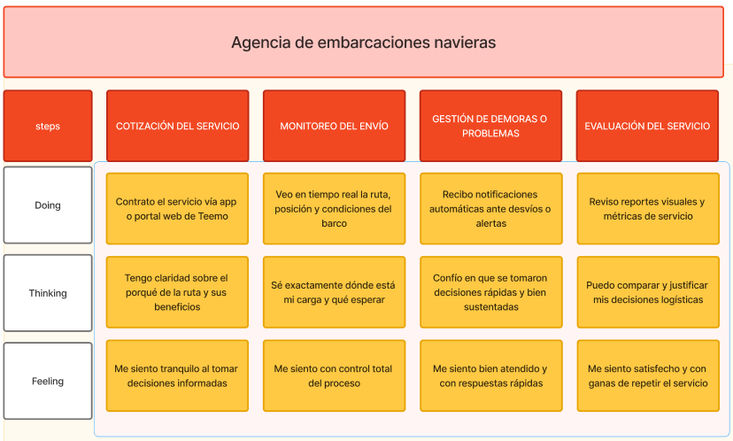
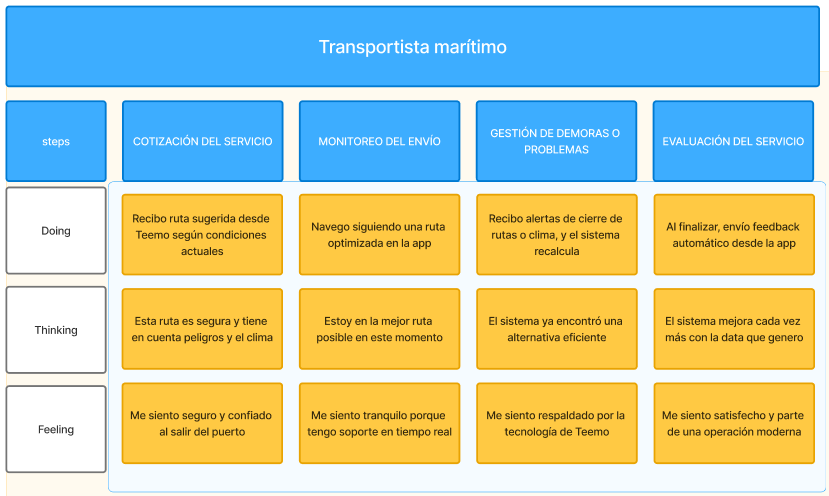
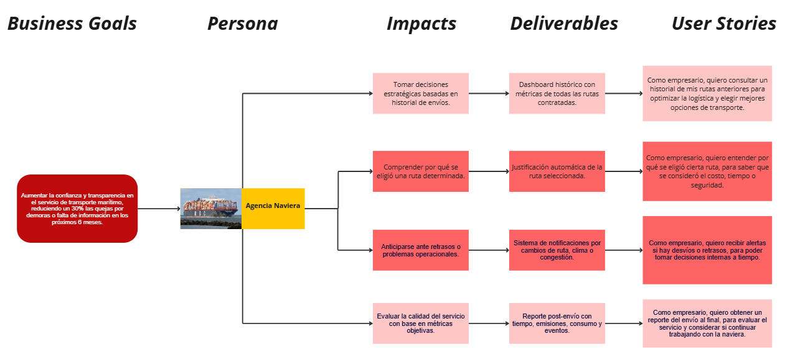
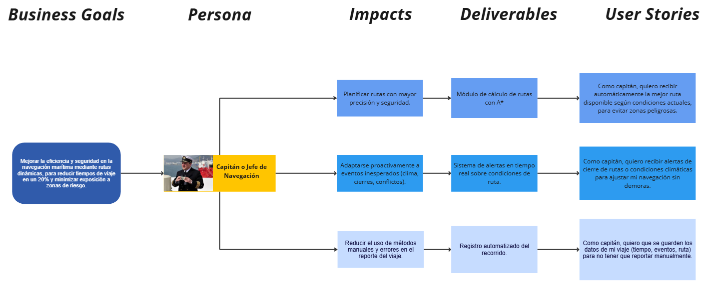

# Capítulo III: Requirements Specification

Este capítulo establece de manera precisa la especificación de requisitos de Macetech, incorporando prácticas consolidadas en el análisis de requisitos. Siguiendo el marco propuesto por Robertson, Robertson y Reed (2024) en Mastering the Requirements Process, se adopta un enfoque estructurado que abarca la obtención, modelado y priorización de necesidades, con el propósito de elaborar un documento de requisitos que cumpla con criterios de claridad, completitud, consistencia, trazabilidad y capacidad de modificación. El punto de partida es un análisis detallado de los resultados obtenidos en la fase de investigación, que incluye estudios de usuarios, procesos de needfinding y análisis competitivo, desde los cuales se construye la estructura conceptual que servirá de base para todo el desarrollo. Como enfoque metodológico, se presentan las secciones de To-Be Scenario Mapping, User Stories, Impact Map y Product Backlog, lo que asegura un ciclo de vida del producto flexible y centrado en la entrega continua de valor.

## 3.1. To-Be Scenario Mapping

En esta sección se documenta el proceso metodológico y los resultados obtenidos del To-Be Scenario Mapping, una herramienta clave para diseñar la experiencia futura de cada User Persona y compararla con el escenario actual (As-Is). A partir de un análisis detallado de los mapas As-Is, se proyectan las acciones, pensamientos y emociones del usuario a través de las columnas Steps, Doing, Thinking y Feeling, de manera que quede claro cómo Macetech transformará cada etapa de la interacción.

El procedimiento seguido por el equipo incluyó las siguientes etapas, alineadas con las recomendaciones de Kalbach (2020) para el mapeo de experiencias:

1. Preparación: Revisión exhaustiva de los mapas As-Is existentes y definición del alcance para cada User Persona.

2. Lluvia de ideas individual: Generación de propuestas de mejora enfocadas en optimizar actividades, percepciones y motivaciones del usuario.

3. Revisión colaborativa: Consolidación de ideas, identificación de fases clave como columnas del mapa y validación de su relevancia.

4. Nombramiento de fases: Asignación de títulos descriptivos a cada columna, representando los estados ideales del flujo de interacción.

5. Comparación As-Is vs. To-Be: Identificación y análisis de las diferencias más significativas, destacando las innovaciones y beneficios esperados en términos de eficiencia, usabilidad y satisfacción.

A continuación se presentan capturas de los mapas To-Be Scenario Mapping generados en la herramienta asignada para cada User Persona, con sus respectivas filas Steps, Doing, Thinking y Feeling, que muestran de forma clara las mejoras proyectadas en la experiencia del usuario.

###### Figura 14
*To-Be Scenario Mapping de nuestro segmento de agencias de embarcaciones navieras*

<td></td>

###### Figura 15
*To-Be Scenario Mapping de nuestro segmento de transportistas marítimos*

<td></td>

## 3.2. User Stories

En esta sección se describe la estructura y el propósito de nuestras User Stories y Epics, que formalizan los requisitos identificados a lo largo del ciclo de vida de Mushroom. El objetivo es traducir las necesidades y expectativas de los segmentos objetivos, así como los visitantes de la Landing Page y desarrolladores, en historias accionables, asegurando la satisfacción total de los usuarios finales. Cada Epic agrupa funcionalidades de alto nivel y sirve como un contenedor lógico para un conjunto de User Stories, mientras que estas últimas representan incrementos de valor independientes y verificables. Cada historia será acompañada de criterios de aceptación escritos en formato Gherkin (Given–When–Then), lo que permite una definición precisa y verificable de las condiciones para considerar un éxito.

El mapeo de Epics y User Stories seguirá las mejores prácticas de User Story Mapping, ayudándonos a "descubrir la historia completa" y a "construir el producto correcto" (Patton, 2021). Comenzaremos con un listado organizado de Epics que abarcan tanto la experiencia web, móvil y Landing Page con contenido segmentado para visitantes generales y subgrupos específicos. Luego, desglosaremos cada Epic en User Stories orientadas al usuario, y Technical Stories dirigidas al equipo de desarrollo, cubriendo tanto la interacción final como los requisitos de infraestructura.

Para garantizar la calidad y efectividad de nuestras historias, aplicaremos las recomendaciones de Stevenson (2020) sobre la redacción de User Stories y criterios de aceptación. Cada historia describirá el rol, la acción y el beneficio esperado, y sus criterios se mantendrán en tiempo presente, en tercera persona, sin referencias de interfaz, para asegurar que sean neutrales y evaluables. De esta manera, aseguramos que todo comportamiento previsto quede claramente definido y sea verificable. Cada User Story incluye criterios de aceptación que deben ser comprobables y redactados en tiempo presente, tercera persona, siguiendo la estructura de Gherkin (Given-When-Then). Además, se consideran User Stories para el sitio web estático (Landing Page) y Technical Stories para los features del RESTful API.

| **Epic / Story ID** | **Título** | **Descripción** | **Criterios de aceptación** | **Relacionado con (Epic ID)** |
|---------------------|------------|-----------------|-----------------------------|--------------------------|
| EPIC001 | Landing Page | **Como** Empresas Navieras y Operadoras Logísticas, y Exportadores e Importadores de Alta Rotación, **quiero** tener una página de presentación de la aplicación donde describa de forma breve sus funcionalidades, ventajas e información de contacto, **para** que podamos estar bien informados de lo que ofrece la aplicación y podamos tener contacto con personal de atención. | - | - |
| EPIC002            | Identity and Access Management | **Como** Empresas Navieras y Operadoras Logísticas, y Exportadores e Importadores de Alta Rotación, **quiero** registrarme, iniciar sesión, recuperar credenciales y disponer de tokens gestionados en la aplicación, **para** poder acceder a las funcionalidades de la aplicación, además de controlar accesos de mi equipo, auditar sesiones y proteger información sensible. | - | - |
| EPIC003             | Profile and Preferences | **Como** Empresas Navieras y Operadoras Logísticas, y Exportadores e Importadores de Alta Rotación, **quiero** crear y actualizar perfiles y preferencias (idioma, tema), **para** poder emplear las funciones de la aplicación, mantener continuidad en la gestión de envíos y mejorar la eficiencia en la toma de decisiones.              | 
| EPIC004             | Asset and Resource Management | **Como** Empresas Navieras y Operadoras Logísticas, **quiero** disponer de un catálogo de puertos con ubicación, estado y noticias asociadas, **para** planificar escalas, decidir rutas basadas en información actualizada, y anticipar demoras y coordinar inventarios y entregas. |
| EPIC005             | A* / AI Process        | **Como** Empresas Navieras y Operadoras Logísticas, **quiero** obtener rutas optimizadas (A* + pesos dinámicos) con justificación de los factores (tiempo, costo, riesgo, emisiones), **para** tomar decisiones operativas que minimicen coste y exposición a incidentes.       |
| EPIC006             | Service Design & Planning          | **Como** Exportadores e Importadores de Alta Rotación, **quiero** obtener estimaciones de costo y reglas comerciales vinculadas a cada ruta con cálculo de Incoterms respectivos, **para** decidir el mejor Incoterm y optimizar coste total de la cadena logística.   |
| EPIC007 | Notifications | **Como** Empresas Navieras y Operadoras Logísticas, **quiero** recibir notificaciones in-app y por correo sobre riesgos, cambios de ruta y alertas meteorológicas, **para** reaccionar rápidamente y replanificar operaciones con mínima disrupción.
| EPIC008 | Service Operation & Monitoring | **Como** Empresas Navieras y Operadoras Logísticas, **quiero** acceder a reportes PDF de rutas con datos relevantes como emisiones de dióxido de carbono y métricas de viaje, y ver rutas populares usadas por la comunidad, **para** justificar decisiones operativas, cumplir requerimientos regulatorios y replicar rutas eficientes.
| US-01               | Introducción llamativa en Landing Page | **Como** Empresas Navieras y Operadoras Logísticas, y Exportadores e Importadores de Alta Rotación, **quiero** ver una sección introductoria concisa sobre lo que es la aplicación de Mushroom, **para** obtener una primera impresión positiva y concisa. | **Escenario 1:** Introducción disponible y completa.    **Dado que** existe contenido estático publicado en la landing page relacionado a la introducción, **cuando** un visitante solicita la landing page pública desde su navegador, **entonces** la página se entrega de forma completa junto a la introdución llamativa esperada    **Escenario 2:** Introducción no disponible.    **Dado que** falta contenido en la Landing Page o se encuentra en mantenimiento por una actualización, **cuando** un visitante solicita la landing page, **entonces** se entrega una página en blanco con un mensaje de mantenimiento, explicando el motivo del porque no sale la página, y en que día y a que hora la página volvera a estar activa. | EPIC001 |
|US-02	|CTA a aplicación web desde landing page | **Como** Empresas Navieras y Operadoras Logísticas, y Exportadores e Importadores de Alta Rotación, **quiero** un call-to-action en la landing page que permita entrar a la aplicación web de forma directa, **para** acceder rápidamente a las funcionalidades indicadas.|	**Escenario 1:** Redirección válida    **Dado que** el CTA está publicado y la aplicación web disponible, **cuando** un visitante activa el CTA desde la Landing Page, **entonces** el navegador redirige a la aplicación web (URL pública de la aplicación).    **Escenario 2:** Aplicación web no disponible    **Dado que** la aplicación web no está disponible, **cuando** el visitante activa el CTA desde la landing page, **entonces** se muestra un mensaje rápido de indisponibilidad, junto a la hora en la que pueda estar la aplicación disponible, y no se redirige.|	EPIC001|
| US-03 | Presentación de funcionalidades principales en Landing Page |**Como** Empresas Navieras y Operadoras Logísticas, y Exportadores e Importadores de Alta Rotación, **quiero** ver una sección que identifique y explique las principales funcionalidades de Mushroom, **para** analizar si el producto es útil para el contexto o caso de negocio en el que me encuentro.| **Escenario 1:** Presentación de funcionalidades disponible y completa    **Dado que** existe contenido estático publicado en la landing page relacionado a la presentación de las funcionalidades, **cuando** un visitante solicita la landing page pública desde su navegador, **entonces** la página se entrega de forma completa junto a la presentación de funcionalidades esperada    **Escenario 2:** Presentación de funcionalidades no disponible.    **Dado que** falta contenido en la Landing Page o se encuentra en mantenimiento por una actualización, **cuando** un visitante solicita la landing page, **entonces** se entrega una página en blanco con un mensaje de mantenimiento, explicando el motivo del porque no sale la página, y en que día y a que hora la página volvera a estar activa. | EPIC001 |
| US-04 | Descripción del equipo de trabajo en Landing Page |**Como** Empresas Navieras y Operadoras Logísticas, y Exportadores e Importadores de Alta Rotación, **quiero** ver una sección en la que se presente al grupo de trabajo detrás de Mushroom, **para** poder tener más información sobre el grupo y tener más confianza en el proyecto. | **Escenario 1:** Presentación del equipo de Mushroom disponible y completa    **Dado que** existe contenido estático publicado en la landing page relacionado al equipo de trabajo de Mushroom, **cuando** un visitante solicita la landing page pública desde su navegador, **entonces** la página se entrega de forma completa junto a la presentación del equipo esperada    **Escenario 2:** Presentación del equipo no disponible.    **Dado que** falta contenido en la Landing Page o se encuentra en mantenimiento por una actualización, **cuando** un visitante solicita la landing page, **entonces** se entrega una página en blanco con un mensaje de mantenimiento, explicando el motivo del porque no sale la página, y en que día y a que hora la página volvera a estar activa. | EPIC001 |
| US-05 | Vídeo About-The-Product en Landing Page | **Como** Empresas Navieras y Operadoras Logísticas, y Exportadores e Importadores de Alta Rotación, **quiero** ver una sección con un vídeo donde se presente el funcionamiento del producto **para** poder tener una guía breve y práctica, con toda la información clave. | **Escenario 1:** Vídeo About-The-Product disponible y completo    **Dado que** el vídeo About-The-Product está publicado y presentado de forma correcta en la landing page **cuando** un visitante solicita la landing page pública desde su navegador, **entonces** la página se entrega de forma completa junto al vídeo About-The-Product en su propia sección    **Escenario 2:** Landing Page no disponible.    **Dado que** falta contenido en la Landing Page o se encuentra en mantenimiento por una actualización, **cuando** un visitante solicita la landing page, **entonces** se entrega una página en blanco con un mensaje de mantenimiento, explicando el motivo del porque no sale la página, y en que día y a que hora la página volvera a estar activa.    **Escenario 3:** Vídeo no disponible en su plataforma respectiva    **Dado que** la plataforma donde se subio el vídeo About-The-Product se encuentra caída o con problemas, o el vídeo fue retirado, **cuando** un visitante solicita la landing page e intenta revisar el vídeo, **entonces** se debe mostrar un pequeño mensaje sobre la sección del vídeo About-The-Product indicando que no está disponible y cuando podrá estar disponible nuevamente. | EPIC001 |
| US-06 | Formulario de contacto en Landing Page | **Como** Empresas Navieras y Operadoras Logísticas, y Exportadores e Importadores de Alta Rotación, **quiero** disponer de una sección con un formulario de contacto completo en la Landing Page, junto a una sección con distintos datos como dirección, un correo eletrónico principal y un número de teléfono **para** poder tener un medio de comunicación con el equipo de Mushroom y resolver cualquier duda que presente. | **Escenario 1:** Formulario de contacto disponible y completo    **Dado que** el formulario de contacto está presentado de forma correcta en la landing page **cuando** un visitante solicita la landing page pública desde su navegador, **entonces** la página se entrega de forma completa junto al formulario de contacto en su propia sección    **Escenario 2:** Usuario envía un mensaje de forma exitosa    **Dado que** un usuario utiliza el formulario de contacto, ingresando su nombre, correo electrónico, asunto, número de teléfono y el texto propio del mensaje, **cuando** envía el mensaje completo a través del formulario **entonces** se presenta un mensaje corto indicando que el mensaje fue enviado y el contenido se entrega al correo electrónico asignado por el equipo de Mushroom.    **Escenario 03:** Usuario envía un mensaje de forma incorrecta    **Dado que** un usuario utiliza el formulario de contacto, pero ingresa alguno de los datos necesario de forma incorrecta o lo deja en blanco **cuando** envía el mensaje completo a través del formulario **entonces** se muestra un mensaje corto y conciso donde se explica que el mensaje no se pudo enviar y que partes debe corregir el usuario. | EPIC001 |
| US-07|	Registro de usuario con verificación en la aplicación web	| **Como** Empresas Navieras y Operadoras Logísticas, y Exportadores e Importadores de Alta Rotación, **quiero** registrar una cuenta con un correo electrónico válido y contraseña que cumpla la política de seguridad y recibir un correo de verificación, **para** activar la cuenta y usar la plataforma con sus funcionalidades.	| **Escenario 1:** Registro válido    **Dado que** el usuario ingresó un correo electrónico válido y una contraseña que cumple la política de seguridad (contraseña con mínimo de 8 caracteres, con mínimo de 1 símbolo, una letra en minúscula y otra en mayúscula, y un número), **cuando** el usuario completé toda la información requerida en el formulario de registro y envié, **entonces** se crea la cuenta en estado "pendiente" y se envía correo de verificación para que el usuario complete el proceso. | **Escenario 2:** Validación fallida    **Dado que** el usuario ingresa una contraseña que no cumple la política de seguridad o el correo electrónico ingresado ya existe, **cuando** el usuario envía el registro, **entonces** la API rechaza la solicitud con error de validación y se explica que datos deben ser corregidos.	|EPIC002|
| US-08|	Registro de usuario con verificación en la aplicación móvil	| **Como** Empresas Navieras y Operadoras Logísticas, y Exportadores e Importadores de Alta Rotación, **quiero** registrar una cuenta con un correo electrónico válido y contraseña que cumpla la política de seguridad y recibir un correo de verificación por mi dispositivo móvil, **para** activar la cuenta y usar la plataforma con sus funcionalidades de forma portable.	| **Escenario 1:** Registro válido    **Dado que** el usuario ingresó un correo electrónico válido y una contraseña que cumple la política de seguridad (contraseña con mínimo de 8 caracteres, con mínimo de 1 símbolo, una letra en minúscula y otra en mayúscula, y un número), **cuando** el usuario completé toda la información requerida en el formulario de registro y envié, **entonces** se crea la cuenta en estado "pendiente" y se envía correo de verificación para que el usuario complete el proceso. | **Escenario 2:** Validación fallida    **Dado que** el usuario ingresa una contraseña que no cumple la política de seguridad o el correo electrónico ingresado ya existe, **cuando** el usuario envía el registro, **entonces** la API rechaza la solicitud con error de validación y se explica que datos deben ser corregidos.	|EPIC002|
| US-09	| Inicio de sesión y emisión de tokens en la aplicación web | **Como** Empresas Navieras y Operadoras Logísticas y Exportadores e Importadores de Alta Rotación, **quiero** iniciar sesión con credenciales válidas (correo electrónico y contraseña) y recibir un token de sesión con roles, **para** acceder a mis funcionalidades asignadas según mi rol. |	**Escenario 1:** Inicio de sesión exitoso    **Dado que** las credenciales ingresadas por el usuario son correctas y la cuenta está activa, **cuando** el usuario presentá los datos para que se puedan autenticar y así iniciar sesión, **entonces** la API emite un AccessToken y RefreshToken determinado, y registra la sesión para autorizar al usuario a las funcionalidades de la aplicación.    **Escenario 2:** Inicio de sesión fallido    **Dado que** las credenciales ingresadas por el usuario son incorrectas, o la cuenta no está habilitada, **cuando** el usuario intenta iniciar sesión, **entonces** se devuelve un mensaje de error indicando en que datos se detectaron los fallos o si la cuenta del usuario aún no está habilitada. |EPIC002|
| US-10	| Inicio de sesión y emisión de tokens en la aplicación móvil | **Como** Empresas Navieras y Operadoras Logísticas y Exportadores e Importadores de Alta Rotación, **quiero** iniciar sesión con credenciales válidas (correo electrónico y contraseña) y recibir un token de sesión con roles a través de mi dispositivo móvil, **para** acceder a mis funcionalidades asignadas según mi rol de forma portable. |	**Escenario 1:** Inicio de sesión exitoso por dispositivo móvil    **Dado que** las credenciales ingresadas por el usuario son correctas y la cuenta está activa, **cuando** el usuario presentá los datos para que se puedan autenticar y así iniciar sesión, **entonces** la API emite un AccessToken y RefreshToken determinado, y registra la sesión para autorizar al usuario a las funcionalidades de la aplicación.    **Escenario 2:** Inicio de sesión fallido    **Dado que** las credenciales ingresadas por el usuario son incorrectas, o la cuenta no está habilitada, **cuando** el usuario intenta iniciar sesión, **entonces** se devuelve un mensaje de error indicando en que datos se detectaron los fallos o si la cuenta del usuario aún no está habilitada. |EPIC002|
|US-11|	Ver perfil de usuario desde la aplicación web|	**Como** Empresas Navieras y Operadoras Logísticas y Exportadores e Importadores de Alta Rotación, **quiero** ver mi perfil con datos personales y de contacto, **para** confirmar que la información registrada es correcta y disponible para contacto operativo.	|**Escenario 1:** Perfil disponible    **Dado que** el usuario está autenticado y existe su registro, **cuando** solicita ver su perfil en la aplicación, **entonces** el sistema devuelve los campos de perfil (nombre, email, teléfono, empresa, rol) con estado exitoso y guardado.    **Escenario 2:** Perfil no encontrado    **Dado que** el token de sesión está caducado o el usuario no existe, **cuando** solicita ver su perfil, **entonces** el sistema devuelve un error de acceso denegado o de que no hay un perfil con datos según corresponda al contexto.	|EPIC003|
|US-12|	Ver perfil de usuario desde la aplicación móvil |	**Como** Empresas Navieras y Operadoras Logísticas y Exportadores e Importadores de Alta Rotación, **quiero** ver mi perfil con datos personales y de contacto a través de mi dispositivo móvil, **para** confirmar que la información registrada es correcta y disponible para contacto operativo de forma portable.	|**Escenario 1:** Perfil disponible    **Dado que** el usuario está autenticado y existe su registro, **cuando** solicita ver su perfil en la aplicación, **entonces** el sistema devuelve los campos de perfil (nombre, email, teléfono, empresa, rol) con estado exitoso y guardado.    **Escenario 2:** Perfil no encontrado    **Dado que** el token de sesión está caducado o el usuario no existe, **cuando** solicita ver su perfil, **entonces** el sistema devuelve un error de acceso denegado o de que no hay un perfil con datos según corresponda al contexto.	|EPIC003|
|US-13|Editar y actualizar perfil	desde la aplicación web |**Como** Empresas Navieras y Operadoras Logísticas y Exportadores e Importadores de Alta Rotación, **quiero** actualizar mi perfil (nombre, contacto, empresa) **para** mantener datos de contacto y responsabilidad actualizados. | **Escenario 1:** Actualización exitosa    **Dado que** el usuario está autenticado y envía datos válidos en los espacios específicos de edición de datos, **cuando** solicita actualizar su perfil, **entonces** el sistema persiste cambios y devuelve el perfil actualizado con marca temporal de modificación.    **Escenario 2:** Validación fallida    **Dado que** el payload contiene un correo electrónico inválido o campos obligatorios faltan, **cuando** intenta actualizar el perfil, **entonces** el sistema devuelve errores de validación, con mensajes de corrección para el usuario, y no persiste cambios.	|EPIC003|
|US-14|Editar y actualizar perfil	desde la aplicación móvil |**Como** Empresas Navieras y Operadoras Logísticas y Exportadores e Importadores de Alta Rotación, **quiero** actualizar mi perfil (nombre, contacto, empresa) desde mi dispositivo móvil **para** mantener datos de contacto y responsabilidad actualizados de forma portable. | **Escenario 1:** Actualización exitosa    **Dado que** el usuario está autenticado y envía datos válidos en los espacios específicos de edición de datos, **cuando** solicita actualizar su perfil, **entonces** el sistema persiste cambios y devuelve el perfil actualizado con marca temporal de modificación.    **Escenario 2:** Validación fallida    **Dado que** el payload contiene un correo electrónico inválido o campos obligatorios faltan, **cuando** intenta actualizar el perfil, **entonces** el sistema devuelve errores de validación, con mensajes de corrección para el usuario, y no persiste cambios.	|EPIC003|
| US-15 | Listado de puertos con estado operativo	en la aplicación web | **Como** Empresas Navieras y Operadoras Logísticas, **quiero** poder visualizar todos los puertos registrados con estado operativo junto a sus metadatos básicos (nombre, continente, lat/lon) en un listado, **para** planificar escalas de inicio a fin y validar opciones de transporte. | **Escenario 1:** Listado exitoso    **Dado que** hay puertos registrados en la base de datos y el usuario ingresó de forma adecuada en la aplicación, **cuando** se solicita la presentación de los datos una vez el usuario ingresa en la página principal, **entonces** el sistema devuelve puertos con nombre, continente, lat/lon y estado operativo, todo mostrado de forma ordenada y alfabéticamente.    **Escenario 2:** No hay datos disponibles para el listado    **Dado que** hay un fallo en la base de datos y los puertos no se pueden mostrar en el listado, **cuando** se solicita la presentación de los datos una vez el usuario ingresa en la página principal, **entonces** el sistema devuelve una lista vacía junto a un error explicando que no se pudieron obtener los datos de la base de datos, además se registra un log de fallo.|EPIC004|
| US-16 | Listado de puertos con estado operativo	en la aplicación móvil | **Como** Empresas Navieras y Operadoras Logísticas, **quiero** poder visualizar todos los puertos registrados con estado operativo junto a sus metadatos básicos (nombre, continente, lat/lon) en un listado en mi dispositivo móvil, **para** planificar escalas de inicio a fin y validar opciones de transporte de portable. | **Escenario 1:** Listado exitoso    **Dado que** hay puertos registrados en la base de datos y el usuario ingresó de forma adecuada en la aplicación, **cuando** se solicita la presentación de los datos una vez el usuario ingresa en la página principal, **entonces** el sistema devuelve puertos con nombre, continente, lat/lon y estado operativo, todo mostrado en un mapa interactivo.    **Escenario 2:** No hay datos disponibles para el listado    **Dado que** hay un fallo en la base de datos y los puertos no se pueden mostrar en el listado, **cuando** se solicita la presentación de los datos una vez el usuario ingresa en la página principal, **entonces** el sistema devuelve una lista vacía junto a un error explicando que no se pudieron obtener los datos de la base de datos, además se registra un log de fallo.|EPIC004|
| US-17 | Mapa interactivo en la aplicación web | **Como** Empresas Navieras y Operadoras Logísticas, **quiero** poder visualizar todos los puertos registrados con estado operativo dentro de un mapa interactivo de todo el mundo, **para** poder tener una guía realista y dinámica | **Escenario 1:** Mapa cargado correctamente    **Dado que** el mapa interactivo está cargado de forma adecuada en la aplicación web y el usuario ingresó de forma adecuada en la aplicación, **cuando** se solicita la presentación de los datos una vez el usuario ingresa en la página principal, **entonces** el sistema devuelve puertos organizados correctamente en el mapa interactivo en base a su latitud y longitud    **Escenario 2:** Mapa sin cargar o no disponible    **Dado que** el mapa interactivo no se encuentra disponible para la aplicación, **cuando** se solicita la presentación de los datos una vez el usuario ingresa en la página principal, **entonces** el sistema devuelve una sección en blanco en donde debería estar el mapa y se indica que no se encuentra disponible, pero aún se debe mostrar la lista de puertos. |EPIC004|
| US-18 | Mapa interactivo en la aplicación móvil | **Como** Empresas Navieras y Operadoras Logísticas, **quiero** poder visualizar todos los puertos registrados con estado operativo dentro de un mapa interactivo de todo el mundo en el dispositivo móvil, **para** poder tener una guía realista, dinámica y portable | **Escenario 1:** Mapa cargado correctamente    **Dado que** el mapa interactivo está cargado de forma adecuada en la aplicación web y el usuario ingresó de forma adecuada en la aplicación, **cuando** se solicita la presentación de los datos una vez el usuario ingresa en la página principal, **entonces** el sistema devuelve puertos organizados correctamente en el mapa interactivo en base a su latitud y longitud    **Escenario 2:** Mapa sin cargar o no disponible    **Dado que** el mapa interactivo no se encuentra disponible para la aplicación, **cuando** se solicita la presentación de los datos una vez el usuario ingresa en la página principal, **entonces** el sistema devuelve una sección en blanco en donde debería estar el mapa y se indica que no se encuentra disponible, pero aún se debe mostrar la lista de puertos. |EPIC004|
| US-19 |	Selección válida de puerto origen y destino	en aplicación web | **Como** Empresas Navieras y Operadoras Logísticas, **quiero** buscar y seleccionar puertos origen y destino válidos en el mapa interactivo o en el listado **para** iniciar un cálculo de rutas que sean mejores, validando que pertenezcan al grafo y no sean iguales. | **Escenario 1:** Selección válida de puertos    **Dado que** ambos puertos existen en el grafo de la base de datos y son distintos, **cuando** el usuario selecciona el puerto de origen y destino, **entonces** el sistema acepta la selección y permite calcular la mejor ruta directamente.    **Escenario 2:** Selección de puertos inválida    **Dado que** uno de los puertos no pertenece al grafo o ambos son iguales, **cuando** el usuario intenta seleccionar, **entonces** el sistema rechaza la selección y explica el motivo del error.|	EPIC004|
| US-20 |	Selección válida de puerto origen y destino	en aplicación móvil | **Como** Empresas Navieras y Operadoras Logísticas, **quiero** buscar y seleccionar puertos origen y destino válidos en el mapa interactivo o en el listado en mi dispositivo móvil **para** iniciar un cálculo de rutas que sean mejores, validando que pertenezcan al grafo y no sean iguales. | **Escenario 1:** Selección válida de puertos    **Dado que** ambos puertos existen en el grafo de la base de datos y son distintos, **cuando** el usuario selecciona el puerto de origen y destino, **entonces** el sistema acepta la selección y permite calcular la mejor ruta directamente.    **Escenario 2:** Selección de puertos inválida    **Dado que** uno de los puertos no pertenece al grafo o ambos son iguales, **cuando** el usuario intenta seleccionar, **entonces** el sistema rechaza la selección y explica el motivo del error.|	EPIC004|
| US-21 |	Rechazo automático de puerto de llegada no apto en aplicación web	| **Como** Empresas Navieras y Operadoras Logísticas, **quiero** que el sistema consulte restricciones del puerto y rechace inclusión de un puerto de llegada con estado no apto (cerrado) con breve justificación, **para** evitar planificaciones incorrectas que puedan ocasionar pérdida de tiempo.	| **Escenario 1:** Detección de puerto no apto    **Dado que** el puerto destino que seleccionó el usuario tiene estado "cerrado", **cuando** se intenta usar como punto de llegada, **entonces** el sistema rechaza la selección y devuelve una breve justificación con la razón de que el puerto este cerrado.    **Escenario 2:** Puerto apto    **Dado que** el puerto seleccionado por el usuario está operativo, **cuando** se intenta usar como punto de llegada, **entonces** el sistema permite la selección y comienza a buscar la mejor ruta posible.|EPIC004|
| US-22 |	Rechazo automático de puerto de llegada no apto en aplicación móvil	| **Como** Empresas Navieras y Operadoras Logísticas, **quiero** que el sistema consulte restricciones del puerto y rechace inclusión de un puerto de llegada con estado no apto (cerrado) con breve justificación en mi dispositivo móvil, **para** evitar planificaciones incorrectas que puedan ocasionar pérdida de tiempo de forma portable.	| **Escenario 1:** Detección de puerto no apto    **Dado que** el puerto destino que seleccionó el usuario tiene estado "cerrado", **cuando** se intenta usar como punto de llegada, **entonces** el sistema rechaza la selección y devuelve una breve justificación con la razón de que el puerto este cerrado.    **Escenario 2:** Puerto apto    **Dado que** el puerto seleccionado por el usuario está operativo, **cuando** se intenta usar como punto de llegada, **entonces** el sistema permite la selección y comienza a buscar la mejor ruta posible.|EPIC004|
|US-23 |	Ficha de puerto desde mapa en la aplicación web |	**Como** Empresas Navieras y Operadoras Logísticas, **quiero** consultar la ficha de datos de un puerto desde el mapa interactivo, devolviendo nombre, continente y estado operativo, **para** evaluar su idoneidad de forma rápida y dinámica.	| **Escenario 1:** Ficha de puerto encontrada    **Dado que** el puerto existe en la base de datos, **cuando** se solicita la ficha de este por parte del usuario, **entonces** el sistema devuelve un pequeño bloque de texto con nombre, continente y estado.    **Escenario 2:** Puerto inexistente o con datos no disponibles    **Dado que** el puerto no existe o no está disponible en la base de datos, **cuando** el usuario solicita la ficha del puerto mediante el mapa interactivo, **entonces** el sistema devuelve un error de que no se pudo encontrar la información y le pide al usuario que intente de nuevo más tarde. |	EPIC004|
|US-24 |	Ficha de puerto desde mapa en la aplicación móvil |	**Como** Empresas Navieras y Operadoras Logísticas, **quiero** consultar la ficha de datos de un puerto desde el mapa interactivo, devolviendo nombre, continente y estado operativo en mi dispositivo móvil, **para** evaluar su idoneidad de forma rápida, portable y dinámica.	| **Escenario 1:** Ficha de puerto encontrada    **Dado que** el puerto existe en la base de datos, **cuando** se solicita la ficha de este por parte del usuario, **entonces** el sistema devuelve un pequeño bloque de texto con nombre, continente y estado.    **Escenario 2:** Puerto inexistente o con datos no disponibles    **Dado que** el puerto no existe o no está disponible en la base de datos, **cuando** el usuario solicita la ficha del puerto mediante el mapa interactivo, **entonces** el sistema devuelve un error de que no se pudo encontrar la información y le pide al usuario que intente de nuevo más tarde. |	EPIC004|
| US-25 |Cálculo de ruta optimizada multi-criterio por aplicación web|	**Como** Empresas Navieras y Operadoras Logísticas, **quiero** que el sistema calcule la ruta optimizada entre dos puertos minimizando distancia y puntaje de riesgo (que la prioridad sea la distancia mínima con menor riesgo) y devuelva nodos, distancia total y ETA, **para** seleccionar la mejor opción operativa.	| **Escenario 1:** Cálculo exitoso    **Dado que** el puerto de origen y destino son válidos y los datos de las aristas entre nodos están actualizados, **cuando** el usuario solicita un cálculo de ruta optimizada, **entonces** el sistema devuelve una pantalla de detalles con distancia total (en millas naúticas) y ETA, y ruta óptima se muestra en el mapa interactivo con los nodos.    **Escenario 2:** Datos insuficientes para la ruta    Dado que faltan datos de los puertos o las aristas por un fallo en la base de datos, **cuando** se solicita cálculo de la ruta óptima, entonces el sistema devuelve error en la obtención de datos y se le indica al usuario que vuelva a intentarlo más tarde.	|EPIC005|
| US-26 |Cálculo de ruta optimizada multi-criterio por aplicación móvil|	**Como** Empresas Navieras y Operadoras Logísticas, **quiero** que el sistema calcule la ruta optimizada entre dos puertos minimizando distancia y puntaje de riesgo (que la prioridad sea la distancia mínima con menor riesgo) y devuelva nodos, distancia total y ETA a través de mi dispositivo móvil, **para** seleccionar la mejor opción operativa de forma portable.	| **Escenario 1:** Cálculo exitoso    **Dado que** el puerto de origen y destino son válidos y los datos de las aristas entre nodos están actualizados, **cuando** el usuario solicita un cálculo de ruta optimizada, **entonces** el sistema devuelve una pantalla de detalles con distancia total (en millas naúticas) y ETA, y ruta óptima se muestra en el mapa interactivo con los nodos.    **Escenario 2:** Datos insuficientes para la ruta    Dado que faltan datos de los puertos o las aristas por un fallo en la base de datos, **cuando** se solicita cálculo de la ruta óptima, **entonces** el sistema devuelve error en la obtención de datos y se le indica al usuario que vuelva a intentarlo más tarde.	|EPIC005|
|US-27|	Desglose de métricas de ruta en aplicacion web| **Como** Empresas Navieras y Operadoras Logísticas, **quiero** que junto a la ruta calculada entre dos puertos seleccionados se presente distancia total, tiempo estimado y posible riesgo, **para** evaluar impacto operativo en una ruta y buscar más rutas de ser posible.|	**Escenario 1:** Desglose de información disponible    **Dado que** la ruta está calculada entre dos puertos seleccionados por el usuario, **cuando** el sistema entrega la mejor ruta calculada, **entonces** incluye distancia, tiempo estimado y score de riesgo asignado para toda la ruta en un detalle bajo el mapa interactivo.    **Escenario 2:** Riesgo no estimado    **Dado** que no hay datos de riesgo disponibles o que no se puede conseguir de una API externa, **cuando** se intenta entregar la ruta calculada entre dos puertos, **entonces** el campo de riesgo no se muestra y se le indica al usuario que no se pudo considerar el riesgo en el cálculo y que no se puede determinar una mejor ruta.    **Escenario 3:** Tiempo no estimado    **Dado** que no hay datos de tiempo disponibles en las aristas, **cuando** se intenta entregar la ruta calculada entre dos puertos, **entonces** el campo de tiempo no se muestra y se le indica al usuario que no se pudo considerar el tiempo en el cálculo y que no se puede determinar una mejor ruta.	|EPIC005|
|US-28|	Desglose de métricas de ruta en aplicacion móvil| **Como** Empresas Navieras y Operadoras Logísticas, **quiero** que junto a la ruta calculada entre dos puertos seleccionados se presente distancia total, tiempo estimado y posible riesgo en mi dispositivo móvil, **para** evaluar impacto operativo en una ruta y buscar más rutas de ser posible de forma portable.|	**Escenario 1:** Desglose de información disponible    **Dado que** la ruta está calculada entre dos puertos seleccionados por el usuario, **cuando** el sistema entrega la mejor ruta calculada, **entonces** incluye distancia, tiempo estimado y score de riesgo asignado para toda la ruta en un detalle bajo el mapa interactivo.    **Escenario 2:** Riesgo no estimado    **Dado** que no hay datos de riesgo disponibles o que no se puede conseguir de una API externa, **cuando** se intenta entregar la ruta calculada entre dos puertos, **entonces** el campo de riesgo no se muestra y se le indica al usuario que no se pudo considerar el riesgo en el cálculo y que no se puede determinar una mejor ruta.    **Escenario 3:** Tiempo no estimado    **Dado** que no hay datos de tiempo disponibles en las aristas, **cuando** se intenta entregar la ruta calculada entre dos puertos, **entonces** el campo de tiempo no se muestra y se le indica al usuario que no se pudo considerar el tiempo en el cálculo y que no se puede determinar una mejor ruta.	|EPIC005|
| US-29 |	Top-3 alternativas priorizando distancia y riesgo en aplicación web |	**Como** Empresas Navieras y Operadoras Logísticas, **quiero** recibir las top-3 alternativas evaluadas por el modelo AI priorizando menor distancia y menor riesgo y con métricas comparativas, **para** comparar opciones de forma eficaz y comprensible.	| **Escenario 1:** Alternativas completas    **Dado que** el usuario está autenticado en la aplicación y procede a buscar la mejor ruta de un puerto de inicio a uno de llegada, **cuando** se realiza el cálculo de rutas y se solicita alternativas, **entonces** el sistema devuelve tres rutas ordenadas por score combinado con valores de ETA, distancia, riesgo.    **Escenario 2:** Opciones insuficientes    **Dado que** el usuario está autenticado en la aplicación y procede a buscar la mejor ruta de un puerto de inicio a uno de llegada y el sistema no puede generar 3 alternativas distintas por falta de datos o falta de posibles opciones, **cuando** se solicita alternativas de una ruta, **entonces** el sistema devuelve las alternativas disponibles (no todas) y una nota explicativa del porque no fue posible conseguir otra alternativa.|	EPIC005|
| US-30 |	Top-3 alternativas priorizando distancia y riesgo en aplicación móvil |	**Como** Empresas Navieras y Operadoras Logísticas, **quiero** recibir las top-3 alternativas evaluadas por el modelo AI priorizando menor distancia y menor riesgo y con métricas comparativas en el dispositivo móvil, **para** comparar opciones de forma eficaz, portable y comprensible.	| **Escenario 1:** Alternativas completas    **Dado que** el usuario está autenticado en la aplicación y procede a buscar la mejor ruta de un puerto de inicio a uno de llegada, **cuando** se realiza el cálculo de rutas y se solicita alternativas, **entonces** el sistema devuelve tres rutas ordenadas por score combinado con valores de ETA, distancia, riesgo.    **Escenario 2:** Opciones insuficientes    **Dado que** el usuario está autenticado en la aplicación y procede a buscar la mejor ruta de un puerto de inicio a uno de llegada y el sistema no puede generar 3 alternativas distintas por falta de datos o falta de posibles opciones, **cuando** se solicita alternativas de una ruta, **entonces** el sistema devuelve las alternativas disponibles (no todas) y una nota explicativa del porque no fue posible conseguir otra alternativa.|	EPIC005|
| US-31 |	Justificación cuantitativa de elección en aplicación web |	**Como** Empresas Navieras y Operadoras Logísticas, **quiero** solicitar una justificación cuantitativa de por qué una ruta fue elegida frente a otra y recibir valores numéricos totales, **para** documentar la decisión de forma adecuada.	| **Escenario 1:** Justificación disponible para las rutas mostradas    **Dado que** existen dos rutas comparables entre dos puertos distintos, **cuando** el usuario realiza el cálculo de la mejor ruta posible, **entonces** el sistema devuelve diferencias numéricas (distancia, ETA, riesgo) y un texto de justificación que impulsó la elección.    **Escenario 2:** Fallo durante la justificación de rutas    **Dado que** l sistema no puede justificar la selección entre distintas rutas por un error en la base de datos y la conexión con los datos de cada arista y puerto, **cuando** el usuario realiza el cálculo de la mejor ruta entre un puerto de inicio y llegada, **entonces** el sistema devuelve un mensaje explicativo para el problema y los datos disponibles de cada ruta.	|EPIC005|
| US-32 |	Justificación cuantitativa de elección en aplicación móvil |	**Como** Empresas Navieras y Operadoras Logísticas, **quiero** solicitar una justificación cuantitativa de por qué una ruta fue elegida frente a otra y recibir valores numéricos totales en mi dispositivo móvil, **para** documentar la decisión de forma adecuada y portable.	| **Escenario 1:** Justificación disponible para las rutas mostradas    **Dado que** existen dos rutas comparables entre dos puertos distintos, **cuando** el usuario realiza el cálculo de la mejor ruta posible, **entonces** el sistema devuelve diferencias numéricas (distancia, ETA, riesgo) y un texto de justificación que impulsó la elección.    **Escenario 2:** Fallo durante la justificación de rutas    **Dado que** l sistema no puede justificar la selección entre distintas rutas por un error en la base de datos y la conexión con los datos de cada arista y puerto, **cuando** el usuario realiza el cálculo de la mejor ruta entre un puerto de inicio y llegada, **entonces** el sistema devuelve un mensaje explicativo para el problema y los datos disponibles de cada ruta.	|EPIC005|
| US-33 |	Recalculo automático ante eventos externos en la aplicación web | **Como** Empresas Navieras y Operadoras Logísticas, **quiero** que el sistema detecte eventos externos (cierres de puerto, incidentes climáticos y oceanográficos) y recalcule automáticamente la ruta activa cuando su viabilidad cambie, registrando la nueva ruta y diferencias métricas, **para** reaccionar en tiempo real ante cualquier obstáculo presente. | **Escenario 1:** Se detecta un evento que impacta una alternativa posible para una ruta    **Dado que** llega un evento que impacta a un nodo o arista del grafo establecido, **cuando** el usuario pide el cálculo de ruta entre dos puertos activos y el sistema evalúa impacto y la ruta deja de ser viable, **entonces** recalcula y persiste una nueva sugerencia con métricas de comparación.    **Escenario 2:** Evento detectado pero no impacta ninguna alternativa de ruta    **Dado que** el evento no impacta la viabilidad de la ruta que consulta el usuario entre dos puertos, **cuando** el usuario pide la consulta de la ruta con sus métricas, **entonces** se muestran todas las alternativas posibles sin algún problema por el evento detecto y se realiza la justificación al igual que siempre.    **Escenario 3:** Evento detectado pero e impacta todas las alternativas posibles    **Dado que** el evento detectado llega a impactar cada una de las alternativas posibles del puerto de salida al puerto de llegada pedido por el usuario, **cuando** el usuario pide la consulta de la ruta con sus métricas, **entonces** el sistema indica que no se pudieron conseguir rutas posibles debido a que el evento no lo permite y se recomienda al usuario que no pase por algún área cercana al evento registrado y que espere a nuevas actualizaciones del evento.	|EPIC005|
|US-34 |	Recalculo automático ante eventos externos en la aplicación móvil | **Como** Empresas Navieras y Operadoras Logísticas, **quiero** que el sistema detecte eventos externos (cierres de puerto, incidentes climáticos y oceanográficos) y recalcule automáticamente la ruta activa cuando su viabilidad cambie, registrando la nueva ruta y diferencias métricas en mi dispositivo móvil, **para** reaccionar en tiempo real ante cualquier obstáculo presente de forma portable. | **Escenario 1:** Se detecta un evento que impacta una alternativa posible para una ruta    **Dado que** llega un evento que impacta a un nodo o arista del grafo establecido, **cuando** el usuario pide el cálculo de ruta entre dos puertos activos y el sistema evalúa impacto y la ruta deja de ser viable, **entonces** recalcula y persiste una nueva sugerencia con métricas de comparación.    **Escenario 2:** Evento detectado pero no impacta ninguna alternativa de ruta    **Dado que** el evento no impacta la viabilidad de la ruta que consulta el usuario entre dos puertos, **cuando** el usuario pide la consulta de la ruta con sus métricas, **entonces** se muestran todas las alternativas posibles sin algún problema por el evento detecto y se realiza la justificación al igual que siempre.    **Escenario 3:** Evento detectado pero e impacta todas las alternativas posibles    **Dado que** el evento detectado llega a impactar cada una de las alternativas posibles del puerto de salida al puerto de llegada pedido por el usuario, **cuando** el usuario pide la consulta de la ruta con sus métricas, **entonces** el sistema indica que no se pudieron conseguir rutas posibles debido a que el evento no lo permite y se recomienda al usuario que no pase por algún área cercana al evento registrado y que espere a nuevas actualizaciones del evento.	|EPIC005|
| US-35 |	Visualización geométrica y animación de rutas en aplicación web	| **Como** Empresas Navieras y Operadoras Logísticas, **quiero** que el sistema visualice la geometría de la ruta y proporcione identificadores de tramo para renderizar rutas con animación, **para** entender como será el camino del trayecto y los tiempos estimados.	| **Escenario 1:** GeoJSON disponible    **Dado que** la ruta contiene geometría directa con nodos y aristas identificables, **cuando** se realiza el cálculo de la ruta entre el puerto de inicio y de llegada, **entonces** el sistema entrega un GeoJSON junto al cálculo de la ruta, donde el GeoJSON tiene tramos identificados y tiempos por tramo junto a una animación simple entre todos los nodos.    **Escenario 2:** Geometría ausente    **Dado que** la ruta no contiene geometría directa con nodos y aristas identificables por un problema de la base de datos, **cuando** se realiza el cálculo de la ruta entre el puerto de inicio y de llegada, **entonces** el sistema no entrega el GeoJSON completo con la ruta con todos los nodos y aristas involucrados, indicando que hubo un error en la obtención, pero aún se debe mostrar el listado de los puertos, la descripción de la mejor ruta y las rutas alternativas en el detalle.|	EPIC005|
| US-36 |	Visualización geométrica y animación de rutas en aplicación móvil | **Como** Empresas Navieras y Operadoras Logísticas, **quiero** que el sistema visualice la geometría de la ruta y proporcione identificadores de tramo para renderizar rutas con animación en mi dispositivo móvil, **para** entender como será el camino del trayecto y los tiempos estimados de forma portable.	| **Escenario 1:** GeoJSON disponible    **Dado que** la ruta contiene geometría directa con nodos y aristas identificables, **cuando** se realiza el cálculo de la ruta entre el puerto de inicio y de llegada, **entonces** el sistema entrega un GeoJSON junto al cálculo de la ruta, donde el GeoJSON tiene tramos identificados y tiempos por tramo junto a una animación simple entre todos los nodos.    **Escenario 2:** Geometría ausente    **Dado que** la ruta no contiene geometría directa con nodos y aristas identificables por un problema de la base de datos, **cuando** se realiza el cálculo de la ruta entre el puerto de inicio y de llegada, **entonces** el sistema no entrega el GeoJSON completo con la ruta con todos los nodos y aristas involucrados, indicando que hubo un error en la obtención, pero aún se debe mostrar el listado de los puertos, la descripción de la mejor ruta y las rutas alternativas en el detalle.|	EPIC005|
| US-37 |	Ingestión de pronósticos y mapeo a aristas en aplicación web | **Como** Empresas Navieras y Operadoras Logísticas, **quiero** que el sistema ingiera pronósticos meteorológicos y oceanográficos y los mapée a las aristas del grafo marcando su validez, **para** que el forecast más reciente afecte los datos de tiempo y de riesgo.	| **Escenario 1:** Forecast procesado correctamente    **Dado que** se han procesado pronósticos válidos en el sistema a través de APIs externas, **cuando** el sistema procesa el feed de forma adecuada para el grafo, **entonces** las aristas relevantes se actualizan con los datos obtenidos del forecast y se tomaran en cuenta en futuros cálculos de ruta por parte del usuario.    **Escenario 2:** Feed no disponible para el sistema    **Dado que** el feed obtenido está corrupto o con esquema diferente, lo que provoca que no esté disponible, **cuando** el sistema trata de procesar el feed sin éxito, **entonces** se registra un error y se informa al usuario que por ahora no puede acceder a información externa con respecto a datos oceanográficos o metereológicos.|	EPIC005|
| US-38 |	Ingestión de pronósticos y mapeo a aristas en aplicación móvil | **Como** Empresas Navieras y Operadoras Logísticas, **quiero** que el sistema ingiera pronósticos meteorológicos y oceanográficos y los mapée a las aristas del grafo marcando su validez a través de mi dispositivo móvil, **para** que el forecast más reciente afecte los datos de tiempo y de riesgo de forma portable.	| **Escenario 1:** Forecast procesado correctamente    **Dado que** se han procesado pronósticos válidos en el sistema a través de APIs externas, **cuando** el sistema procesa el feed de forma adecuada para el grafo, **entonces** las aristas relevantes se actualizan con los datos obtenidos del forecast y se tomaran en cuenta en futuros cálculos de ruta por parte del usuario.    **Escenario 2:** Feed no disponible para el sistema    **Dado que** el feed obtenido está corrupto o con esquema diferente, lo que provoca que no esté disponible, **cuando** el sistema trata de procesar el feed sin éxito, **entonces** se registra un error y se informa al usuario que por ahora no puede acceder a información externa con respecto a datos oceanográficos o metereológicos.|	EPIC005|
| US-39 |	Estimación de coste e Incoterm recomendado por aplicación web | **Como** Exportadores e Importadores de Alta Rotación, **quiero** que el sistema calcule el coste estimado completo (flete, seguro) y recomiende Incoterm al proporcionar parámetros (peso, valor, preferencia, origen/destino), **para** decidir condiciones comerciales óptimas.|	**Escenario 1:** Estimación completa de Incoterms indicados    **Dado que** el sistema calculó de forma exitosa una ruta indicada por el usuario con un puerto de inicio y otro de destino válidos, **cuando** solicita la asignación de Incoterms para el viaje e ingresa los parámetros completos de forma adecuada y con el tipo de dato correcto, **entonces** el sistema devuelve el desglose de flete, seguros, total y recomendación de Incoterm específico.    **Escenario 2:** Parámetros incompletos o no adecuados    **Dado que** faltan parámetros obligatorios o hay parámetros ingresados de forma incorrecta para la estimación de Incoterms, **cuando** solicita la recomendación de Incoterms con su cálculos, **entonces** el sistema devuelve un error de validación y le pide al usuario que haga correcciones a puntos específicos para la estimación.	|EPIC006|
| US-40 |	Estimación de coste e Incoterm recomendado por aplicación móvil | **Como** Exportadores e Importadores de Alta Rotación, **quiero** que el sistema calcule el coste estimado completo (flete, seguro) y recomiende Incoterm al proporcionar parámetros (peso, valor, preferencia, origen/destino) a través de mi dispositivo móvil, **para** decidir condiciones comerciales óptimas de forma portable.|	**Escenario 1:** Estimación completa de Incoterms indicados    **Dado que** el sistema calculó de forma exitosa una ruta indicada por el usuario con un puerto de inicio y otro de destino válidos, **cuando** solicita la asignación de Incoterms para el viaje e ingresa los parámetros completos de forma adecuada y con el tipo de dato correcto, **entonces** el sistema devuelve el desglose de flete, seguros, total y recomendación de Incoterm específico.    **Escenario 2:** Parámetros incompletos o no adecuados    **Dado que** faltan parámetros obligatorios o hay parámetros ingresados de forma incorrecta para la estimación de Incoterms, **cuando** solicita la recomendación de Incoterms con su cálculos, **entonces** el sistema devuelve un error de validación y le pide al usuario que haga correcciones a puntos específicos para la estimación.	|EPIC006|
| US-41 |	Preferencias de notificaciones por usuario por aplicación web | **Como** Empresas Navieras y Operadoras Logísticas, **quiero** configurar preferencias de notificación (tipos y canales) y que se apliquen a la entrega de datos relacionados con el cálculo de rutas **para** recibir alertas relevantes de cálculos terminados según mis necesidades.	| **Escenario 1:** Preferencias aplicadas en la aplicación    **Dado que** el usuario establece preferencias de notificación en la configuración de la aplicación, **cuando** el cálculo de una de las rutas se termina de forma exitosa, **entonces** las notificaciones se envían según preferencias que indicó el usuario (in-app/email/SMS).    **Escenario 2:** Sin preferencias especificadas    **Dado que** no hay preferencias configuradas por parte del usuario en la aplicación, **cuando** el cálculo de una de las rutas se termina de forma exitosa, **entonces** se aplica configuración por defecto (notificaciones solo in-app) y se notifica al usuario directamente.|EPIC007|
| US-42 |	Preferencias de notificaciones por usuario por aplicación móvil | **Como** Empresas Navieras y Operadoras Logísticas, **quiero** configurar preferencias de notificación (tipos y canales) y que se apliquen a la entrega de datos relacionados con el cálculo de rutas en mi dispositivo móvil **para** recibir alertas relevantes de cálculos terminados según mis necesidades y de forma portable.	| **Escenario 1:** Preferencias aplicadas en la aplicación    **Dado que** el usuario establece preferencias de notificación en la configuración de la aplicación, **cuando** el cálculo de una de las rutas se termina de forma exitosa, **entonces** las notificaciones se envían según preferencias que indicó el usuario (in-app/email/SMS).    **Escenario 2:** Sin preferencias especificadas    **Dado que** no hay preferencias configuradas por parte del usuario en la aplicación, **cuando** el cálculo de una de las rutas se termina de forma exitosa, **entonces** se aplica configuración por defecto (notificaciones solo in-app) y se notifica al usuario directamente.|EPIC007|
| US-43 |	Almacenamiento automático de la última ruta consultada en la aplicación web | **Como** Empresas Navieras y Operadoras Logísticas, **quiero** que el sistema almacené automáticamente la última ruta que consulté con metadatos (ID de envío; nombre de la ruta con puerto de inicio y llegada; tiempo total en días, horas y minutos; distancia en millas naúticas; emiciones estimadas de CO2, NOX y SOX en toneladas) **para** futura consulta y mantener trazabilidad.	| **Escenario 1:** Persistencia al completar la consulta de una ruta    **Dado que** una ruta se marca como completada después del proceso de consulta con IA con todas las alternativas presentadas, **cuando** el usuario selecciona una alternativa específica de ruta de todas las indicadas por la IA (no es necesario verificar Incoterms), **entonces** el sistema persiste un registro de viaje con campos requeridos en una página de historial.    **Escenario 2:** Error de persistencia     Dado que hay un error de persistencia en la base de datos, **cuando** el usuario selecciona una alternativa específica de ruta de todas las indicadas por la IA (no es necesario verificar Incoterms), **entonces** el sistema le advierte al usuario que la ruta no se puede guardar en el historial por un fallo de persistencia y se realiza un reintento de guardado cada 20 segundos.	|EPIC008|
| US-44 |	Almacenamiento automático de la última ruta consultada en la aplicación móvil | **Como** Empresas Navieras y Operadoras Logísticas, **quiero** que el sistema almacené automáticamente la última ruta que consulté con metadatos (ID de envío; nombre de la ruta con puerto de inicio y llegada; tiempo total en días, horas y minutos; distancia en millas naúticas; emiciones estimadas de CO2, NOX y SOX en toneladas) a través de mi dispositivo móvil **para** futura consulta portable y mantener trazabilidad.	| **Escenario 1:** Persistencia al completar la consulta de una ruta    **Dado que** una ruta se marca como completada después del proceso de consulta con IA con todas las alternativas presentadas, **cuando** el usuario selecciona una alternativa específica de ruta de todas las indicadas por la IA (no es necesario verificar Incoterms), **entonces** el sistema persiste un registro de viaje con campos requeridos en una página de historial.    **Escenario 2:** Error de persistencia     Dado que hay un error de persistencia en la base de datos, **cuando** el usuario selecciona una alternativa específica de ruta de todas las indicadas por la IA (no es necesario verificar Incoterms), **entonces** el sistema le advierte al usuario que la ruta no se puede guardar en el historial por un fallo de persistencia y se realiza un reintento de guardado cada 20 segundos.	|EPIC008|
| US-45 |	Generación de reportes descargables (PDF/CSV)	en aplicación web |**Como** Empresas Navieras y Operadoras Logísticas, **quiero** generar y descargar reportes de cada viaje (PDF/CSV) que muestren ID de envío; nombre de la ruta con puerto de inicio y llegada; tiempo total en días, horas y minutos; distancia en millas naúticas; emiciones estimadas de CO2, NOX y SOX en toneladas, **para** evidenciar decisiones y cumplir requerimientos establecidos.	| **Escenario 1:** Reporte generado de forma exitosa    **Dado que** existe un registro de la consulta de una ruta por un usuario en la sección de historial, **cuando** el usuario solicita un reporte a través de un botón para descarga, **entonces** el sistema genera un PDF/CSV con todos los campos requeridos y entrega el archivo al usuario directamente.    **Escenario 2:** Error en generación de documentos    **Dado que** el servicio de generación de documentos falla por un motivo externo o interno, **cuando** se solicita el reporte a través de la página de historial, **entonces** el sistema devuelve un mensaje de error y notifica que no es posible descargar los reportes en ese momento, y le recomienda al usuario intentar más tarde |	EPIC008|
| US-46 |	Generación de reportes descargables (PDF/CSV)	en aplicación móvil |**Como** Empresas Navieras y Operadoras Logísticas, **quiero** generar y descargar reportes de cada viaje (PDF/CSV) que muestren ID de envío; nombre de la ruta con puerto de inicio y llegada; tiempo total en días, horas y minutos; distancia en millas naúticas; emiciones estimadas de CO2, NOX y SOX en toneladas, todo a través de mi dispositivo móvil **para** evidenciar decisiones y cumplir requerimientos establecidos de forma portable.	| **Escenario 1:** Reporte generado de forma exitosa    **Dado que** existe un registro de la consulta de una ruta por un usuario en la sección de historial, **cuando** el usuario solicita un reporte a través de un botón para descarga, **entonces** el sistema genera un PDF/CSV con todos los campos requeridos y entrega el archivo al usuario directamente.    **Escenario 2:** Error en generación de documentos    **Dado que** el servicio de generación de documentos falla por un motivo externo o interno, **cuando** se solicita el reporte a través de la página de historial, **entonces** el sistema devuelve un mensaje de error y notifica que no es posible descargar los reportes en ese momento, y le recomienda al usuario intentar más tarde |	EPIC008|
| US-47 |	Historial de rutas con filtros y paginación en la aplicación web | **Como** Empresas Navieras y Operadoras Logísticas, **quiero** consultar un historial de rutas consultadas con filtros por fecha, origen y destino y paginar resultados, **para** analizar actividad pasada a gran escala con rapidez.	| **Escenario 1:** Consulta válida a través del historial    **Dado que** el usuario aplica filtros válidos en la página del historial (ya sea con un rango de fechas establecidos o con puertos de salida y de destino), cuando aplica el filtro con el historial, **entonces** el sistema devuelve la página con los resultados que cumplen los filtros indicados y pedidos (ya sea dentro de un rango de fechas o con un puerto en específico).    **Escenario 2:** Parámetros inválidos o inadecuados    **Dado que** los filtros son inválidos o están puestos de forma incorrecta (puerto inexistente o fechas inexistentes), **cuando** intenta solicitar el historial con ese filtro, **entonces** se indica un pequeño mensaje de error sobre los filtros inexistentes sin que cambie la página.    **Escenario 3:** No se encuentran datos con parámetros específicos    Dado que los filtros son correctos, pero no hay alguna ruta relacionada a esos parámetros, **cuando** intenta solicitar el historial con ese filtro, **entonces** se muestra una pantalla en blanco, indicando que no hay rutas relacionados con esos parámetros. | EPIC008 |
| US-48 |	Historial de rutas con filtros y paginación en la aplicación móvil | **Como** Empresas Navieras y Operadoras Logísticas, **quiero** consultar un historial de rutas consultadas con filtros por fecha, origen y destino y paginar resultados a través de mi dispositivo móvil, **para** analizar actividad pasada a gran escala con rapidez y de forma portable.	| **Escenario 1:** Consulta válida a través del historial    **Dado que** el usuario aplica filtros válidos en la página del historial (ya sea con un rango de fechas establecidos o con puertos de salida y de destino), cuando aplica el filtro con el historial, **entonces** el sistema devuelve la página con los resultados que cumplen los filtros indicados y pedidos (ya sea dentro de un rango de fechas o con un puerto en específico).    **Escenario 2:** Parámetros inválidos o inadecuados    **Dado que** los filtros son inválidos o están puestos de forma incorrecta (puerto inexistente o fechas inexistentes), **cuando** intenta solicitar el historial con ese filtro, **entonces** se indica un pequeño mensaje de error sobre los filtros inexistentes sin que cambie la página.    **Escenario 3:** No se encuentran datos con parámetros específicos    Dado que los filtros son correctos, pero no hay alguna ruta relacionada a esos parámetros, **cuando** intenta solicitar el historial con ese filtro, **entonces** se muestra una pantalla en blanco, indicando que no hay rutas relacionados con esos parámetros. | EPIC008 |
| US-49 |	Presentación de rutas más buscadas por los usuarios	por aplicación web |**Como** Empresas Navieras y Operadoras Logísticas, **quiero** acceder a una funcionalidad de "Rutas más buscadas" que agregue y devuelva rutas más consultadas en un período configurable, filtrable por continente o puerto, **para** aprovechar rutas comunes y eficientes.	| **Escenario 1:** Ranking disponible    **Dado que** existen consultas históricas que identifican a tres rutas más populares o más usadas, **cuando** el usuario quiere revisar las rutas más populares en la aplicación junto a sus características, **entonces** el sistema devuelve lista ordenada de rutas populares con el puerto de inicio y llegada, la distancia y el tiempo.    **Escenario 2:** Sin datos suficientes    **Dado que** no hay datos suficientes para el periodo indicado por el usuario, **cuando** se solicita el ranking, **entonces** el sistema devuelve un espacio vacío e indica con un mensaje de que no hay ningún para presentar en el ranking. | EPIC008|
| US-50 |	Presentación de rutas más buscadas por los usuarios	por aplicación móvil |**Como** Empresas Navieras y Operadoras Logísticas, **quiero** acceder a una funcionalidad de "Rutas más buscadas" que agregue y devuelva rutas más consultadas en un período configurable, filtrable por continente o puerto en mi dispositivo móvil, **para** aprovechar rutas comunes y eficientes.	| **Escenario 1:** Ranking disponible    **Dado que** existen consultas históricas que identifican a tres rutas más populares o más usadas, **cuando** el usuario quiere revisar las rutas más populares en la aplicación junto a sus características, **entonces** el sistema devuelve lista ordenada de rutas populares con el puerto de inicio y llegada, la distancia y el tiempo.    **Escenario 2:** Sin datos suficientes    **Dado que** no hay datos suficientes para el periodo indicado por el usuario, **cuando** se solicita el ranking, **entonces** el sistema devuelve un espacio vacío e indica con un mensaje de que no hay ningún dato para presentar en el ranking. | EPIC008|
|TS-01|	Manejo del formulario de contacto	|**Como** desarrollador, **quiero** un sistema que reciba los mensajes enviados desde el formulario de la Landing Page, **para** que el equipo de Mushroom pueda revisar y atender consultas o peticiones de usuarios.|**Escenario 1:** Mensaje recibido correctamente    **Dado que** el usuario completa el formulario con los datos requeridos y todo es válido, **cuando** se envía el formulario (POST que crea el mensaje), **entonces** el sistema entrega el mensaje al correo configurado por el equipo y almacena un registro del envío en la base de datos.    **Escenario 2:** Entrega primaria fallida    **Dado que** el correo configurado no está disponible o falla el envío, **cuando** se envía el formulario (POST), **entonces** el sistema guarda el mensaje en la base de datos, marca el intento como fallido y activa el mecanismo de respaldo (por ejemplo, envío por SMS o notificación alternativa) y registra el incidente.	|EPIC001|
|TS-02|	Registro y verificación con API	|**Como** desarrollador, **quiero** un endpoint para crear usuarios y enviar un token de verificación por correo, **para** soportar el flujo de registro y activación de cuentas.|	**Escenario 1:** Registro creado    **Dado que** el correo y la contraseña cumplen las reglas de seguridad, **cuando** se realiza una petición POST para crear la cuenta, **entonces** el sistema guarda el usuario en la base de datos en estado "pendiente" y envía por correo un token de verificación para activar la cuenta.    **Escenario 2:** Registro rechazado    **Dado que** los datos son inválidos o el correo ya existe, **cuando** se realiza la petición POST para registro, **entonces** el sistema no crea la cuenta y devuelve un mensaje claro indicando la razón del rechazo.	|EPIC002|
|TS-03	|API Auth: tokens y refresh	|**Como** desarrollador, **quiero** endpoints que permitan iniciar sesión y renovar sesión mediante tokens con información de rol, **para** gestionar acceso seguro y la renovación de sesiones.	|**Escenario 1:** Emisión de tokens (login válido)    **Dado que** las credenciales son correctas y la cuenta está activa, **cuando** se realiza una petición POST para iniciar sesión, **entonces** el sistema devuelve tokens válidos (uno de corta duración y otro para renovar la sesión) e registra la sesión.    **Escenario 2:** Refresh inválido o expirado    **Dado que** el token de renovación es inválido o expiró, **cuando** se realiza una petición POST para renovarlo, **entonces** el sistema no renueva la sesión y devuelve un mensaje de error que pide reautenticación.	|EPIC002|
|TS-04	|API Puertos: CRUD y estado operativo	|**Como** desarrollador, **quiero** endpoints para listar y filtrar puertos con su estado operativo, **para** que la interfaz y otros servicios puedan consultar un catálogo actualizado.|	**Escenario 1:** Listado obtenido   **Dado que** hay puertos registrados en la base de datos, **cuando** se realiza una petición GET para obtener el listado, **entonces** el sistema devuelve la lista paginada con metadatos (nombre, continente, lat/lon, estado).    **Escenario 2:** Filtro inválido    **Dado que** los parámetros de filtro están mal formados, **cuando** se realiza la petición GET con esos filtros, **entonces** el sistema devuelve un mensaje que indica el error en los filtros y no devuelve resultados.	|EPIC004|
|TS-05|	API Puertos: detalle y búsqueda|	**Como** desarrollador, **quiero** endpoints para buscar puertos por nombre o id y obtener su ficha, **para** mostrar detalles en la UI.	|**Escenario 1:** Puerto encontrado    **Dado que** el nombre o id corresponde a un puerto registrado, **cuando** se realiza una petición GET para ese puerto, **entonces** el sistema devuelve su ficha con metadatos completos.    **Escenario 2:** Puerto no existente    **Dado que** no existe el puerto solicitado, **cuando** se hace la petición GET, **entonces** el sistema responde indicando que no se encontró el puerto.	|EPIC004|
|TS-06|API: validación de nodos en el grafo	|**Como** desarrollador, **quiero** un endpoint que valide si los puertos están presentes en el grafo de navegación, **para** evitar cálculos con nodos inválidos.|	**Escenario 1:** Nodos válidos    **Dado que** ambos puertos están representados en el grafo, **cuando** se realiza una petición POST para validar origen y destino, **entonces** el sistema confirma que son válidos y permite continuar con el cálculo de ruta.    **Escenario 2:** Nodo inválido    **Dado que** uno de los puertos no está en el grafo, **cuando** se realiza la petición POST de validación, **entonces** el sistema indica cuál es el puerto inválido y no permite el cálculo.	|EPIC004|
|TS-07	|API: consulta de restricciones operativas de puerto|	**Como** desarrollador, **quiero** un endpoint que devuelva las restricciones actuales de un puerto, **para** validar en tiempo real si un puerto está apto para llegada.	|**Escenario 1:** Restricciones retornadas    **Dado que** existen restricciones registradas para el puerto, **cuando** se realiza una petición GET para consultar restricciones, **entonces** el sistema devuelve la lista con estados y la vigencia de cada restricción.   **Escenario 2:** Sin restricciones    **Dado que** no hay restricciones vigentes para el puerto, **cuando** se consulta, **entonces** el sistema devuelve una respuesta vacía indicando que no hay restricciones.	|EPIC004|
|TS-08	|Endpoint ficha de puerto (summary)	|**Como** desarrollador, **quiero** un endpoint que entregue un resumen del puerto (nombre, ubicación, estado y justificación breve), **para** alimentar la ficha del mapa.	|**Escenario 1:** Resumen devuelto    **Dado que** el puerto tiene metadatos, **cuando** se realiza una petición GET para el resumen, **entonces** el sistema devuelve la información resumida y actualizada del puerto.    **Escenario 2:** ID inválido    **Dado que** el identificador del puerto no existe, **cuando** se solicita el resumen, **entonces** el sistema informa que el puerto no se encuentra.	|EPIC004|
|TS-09|	Motor A*/AI: servicio de cálculo de rutas	|**Como** componente técnico, **quiero** un servicio que combine A* y pesos dinámicos generados por los modelos para calcular rutas, **para** devolver las mejores alternativas con métricas comparativas.|	**Escenario 1:** Top-3 generadas    **Dado que** el grafo y los modelos tienen la información necesaria, **cuando** se realiza una petición POST para calcular rutas entre origen y destino, **entonces** el sistema genera hasta tres alternativas con métricas (tiempo estimado, distancia, riesgo) y las entrega para comparación.    **Escenario 2:** Inconsistencia en datos    **Dado que** faltan datos críticos en el grafo o en los modelos, **cuando** se solicita el cálculo, **entonces** el sistema informa que no puede generar las rutas y explica la causa.	|EPIC005|
|TS-10	|API: métricas y desglose por ruta	|**Como** desarrollador, **quiero** que al solicitar una ruta se devuelvan métricas normalizadas (distancia, ETA, combustible estimado, riesgo), **para** que la UI y otros servicios muestren información consistente.	|**Escenario 1:** Payload completo    **Dado que** el cálculo se completó con todos los estimados, **cuando** se realiza una petición GET para obtener la ruta, **entonces** el sistema devuelve las métricas completas y actualizadas de esa ruta.    **Escenario 2:** Cálculo parcial    **Dado que** algunos estimados no se pudieron calcular (por ejemplo, consumo de combustible), **cuando** se solicita la ruta, **entonces** el sistema devuelve los datos disponibles e indica cuáles estimados faltan.	|EPIC005|
|TS-11|API: generación y ranking de alternativas	|**Como** componente técnico, **quiero** un proceso que genere variantes de ruta y las ordene por puntaje combinado, **para** exponer las mejores alternativas (top-3) con su justificación.|	**Escenario 1:** Generación completa    **Dado que** existen alternativas suficientes en el grafo, **cuando** se realiza una petición POST para generar alternativas, **entonces** el sistema devuelve hasta tres rutas con su ranking y métricas comparativas.    **Escenario 2:** Generación parcial    **Dado que** hay pocas alternativas disponibles, **cuando** se solicita generación, **entonces** el sistema devuelve las alternativas que pudo generar y explica que la lista es parcial.	|EPIC005|
|TS-12|	API: explicación y métricas comparativas	|**Como** desarrollador, **quiero** un endpoint que compare dos rutas y entregue diferencias numéricas y factores clave, **para** documentar y justificar decisiones.	|**Escenario 1:** Comparación calculada    **Dado que** ambas rutas tienen métricas guardadas, **cuando** se envía una petición POST solicitando la comparación entre dos rutas, **entonces** el sistema devuelve las diferencias (por ejemplo, delta de distancia, delta de ETA, delta de riesgo) y los factores que explican la elección.    **Escenario 2:** ID inválido    **Dado que** alguno de los identificadores de ruta no existe, **cuando** se solicita la comparación, **entonces** el sistema indica que no puede comparar y especifica cuál id es inválido.	|EPIC005|
|TS-13	|Pipeline de eventos y recalculo automático	|**Como** componente técnico, **quiero** un servicio que ingiera eventos externos (cierres, incidentes, pronósticos) y dispare recalculo de rutas **cuando** sea necesario, **para** mantener las rutas activas actualizadas.|	**Escenario 1:** Evento válido dispara recalculo    **Dado que** llega un evento que afecta la viabilidad de tramos o puertos, **cuando** el sistema procesa ese evento y lo valida, **entonces** se dispara el recalculo, se guarda la nueva ruta y se registra la diferencia de métricas respecto a la previa.    **Escenario 2:** Evento inválido o corrupto    **Dado que** el evento no cumple el formato esperado o está corrupto, **cuando** el sistema lo recibe, **entonces** lo descarta y registra la incidencia sin provocar recalculo.	|EPIC005|
|TS-14|	API: geometría de ruta y segmentos|	**Como** desarrollador, **quiero** que una ruta devuelva su geometría en formato geo (segmentos con identificadores y tiempos), **para** permitir el renderizado y la animación en el cliente. | **Escenario 1:** GeoJSON retornado    **Dado que** la ruta fue calculada y contiene geometría, **cuando** se solicita la geometría mediante una petición GET, **entonces** el sistema devuelve la estructura geo con segmentos, identificadores y tiempos por tramo.    **Escenario 2:** Ruta sin geometría o inexistente    **Dado que** la ruta carece de geometría o no existe, **cuando** se solicita la geometría, **entonces** el sistema devuelve un mensaje que explica la situación y, si procede, una polilínea simplificada.	|EPIC005|
|TS-15	|Pipeline de ingestión meteorológica y mapeo a grafo | **Como** componente técnico, **quiero** un proceso que consuma pronósticos meteorológicos y oceanográficos, normalice los datos y actualice los tramos del grafo con la versión de forecast, **para** que los modelos y el motor de ruteo usen la información más reciente.	|**Escenario 1:** Actualización OK    **Dado que** el feed cumple el esquema esperado y contiene datos válidos, **cuando** el pipeline procesa el lote, **entonces** actualiza los tramos afectados en la base de datos con información de versión y vigencia del forecast y registra el resultado de la ingestión.   **Escenario 2:** Feed con esquema inesperado    **Dado que** el feed no cumple el formato esperado o está corrupto, **cuando** el pipeline lo procesa, **entonces** registra el fallo, descarta el lote y genera una alerta para revisión.	|EPIC005|
|TS-16|	Servicio de pricing y reglas comerciales (Incoterms)	|**Como** desarrollador, **quiero** un componente que calcule el costo estimado completo para una operación y aplique reglas comerciales para recomendar un Incoterm, **para** entregar a usuarios comerciales un desglose claro y una recomendación.	| **Escenario 1:** Cálculo OK    **Dado que** el usuario ha proporcionado todos los parámetros requeridos (peso, valor, origen, destino, preferencias), **cuando** se realiza una petición POST para calcular el precio estimado, **entonces** el sistema devuelve un desglose (flete, seguro, otros) y propone un Incoterm recomendado con su justificación.   **Escenario 2:** Datos insuficientes    **Dado que** faltan parámetros obligatorios, **cuando** se solicita la estimación, **entonces** el sistema informa qué datos faltan y no entrega la estimación. | EPIC006|
|TS-17	|Servicio de notificaciones y canales	|**Como** desarrollador, **quiero** componentes que encolen y entreguen notificaciones por canales (in-app, email, SMS) respetando las preferencias del usuario, **para** asegurar que cada alerta llegue por el canal correcto.	|**Escenario 1:** Envío por canal activo    **Dado que** el usuario ha configurado preferencia por email y el servicio de correo está operativo, **cuando** se procesa una notificación, **entonces** el sistema envía el email y marca la notificación como entregada.    **Escenario 2:** Canal inactivo o falla    **Dado que** el canal configurado falla o está inactivo, **cuando** se procesa la notificación, **entonces** el sistema deja la notificación en cola, marca el intento **Como** pendiente y aplica reintentos según la política.|	EPIC007|
|TS-18	|API: persistencia de historial de viajes	|**Como** componente técnico, **quiero** un endpoint que reciba los datos de un viaje finalizado y los guarde en el historial, **para** mantener un registro consultable y auditable de operaciones.	|**Escenario 1:** Registro creado    **Dado que** los datos del viaje están completos y correctos, **cuando** se realiza una petición POST para registrar el viaje, **entonces** el sistema guarda el registro en la base de datos y devuelve el identificador del viaje.    **Escenario 2:** Datos incompletos   **Dado que** faltan campos obligatorios en la información del viaje, **cuando** se intenta guardar, **entonces** el sistema informa qué campos faltan y no guarda el registro.	|EPIC008|
|TS-19|	Servicio de generación de documentos (PDF/CSV)|	**Como** desarrollador, **quiero** un componente que genere documentos PDF o CSV desde los registros de viaje, **para** permitir que los usuarios descarguen reportes estandarizados.	|**Escenario 1:** Generación exitosa    **Dado que** la plantilla está disponible y los datos del viaje son válidos, **cuando** se solicita la generación del reporte (GET con formato seleccionado), **entonces** el sistema crea y entrega el documento listo para descargar.   **Escenario 2:** Error en generación   **Dado que** la plantilla está corrupta o falla el proceso de generación, **cuando** se solicita el reporte, **entonces** el sistema informa el error, no genera el archivo y encola un reintento o notifica al equipo.	|EPIC008|
|TS-20|	API historial: filtros y paginación	|**Como** desarrollador, **quiero** un endpoint que permita consultar el historial de viajes con filtros por fecha, origen y destino y paginación, **para** facilitar consultas eficientes sobre grandes volúmenes.	|**Escenario 1:** Consulta con resultados    **Dado que** existen registros que coinciden con los filtros, **cuando** se realiza una petición GET con los parámetros de filtro y página, **entonces** el sistema devuelve la página solicitada con el total de resultados y los ítems correspondientes.   **Escenario 2:** Parámetro inválido    **Dado que** el parámetro de fecha o formato es inválido, **cuando** se realiza la petición, **entonces** el sistema informa el error en el parámetro y no devuelve resultados.|	EPIC008|
|TS-21	|Servicio de métricas de uso y agregación|	**Como** desarrollador, **quiero** un job que agregue consultas y genere un ranking de rutas más populares, **para** exponer un servicio de "rutas más buscadas" y métricas de uso.|	**Escenario 1:** Job ejecutado correctamente    **Dado que** existen registros de consultas de usuarios, **cuando** se ejecuta el job programado, **entonces** el sistema actualiza la tabla de rutas populares con el conteo y el snapshot queda disponible para consulta.   **Escenario 2:** Job falla    **Dado que** el job encuentra un error durante la ejecución (por ejemplo, timeout o error con la base de datos), **cuando** se ejecuta, **entonces** el sistema registra el error, mantiene el snapshot anterior y crea una alerta para revisión.	|EPIC008|

## 3.3. Requisitos Funcionales

Los Requisitos Funcionales formalizan qué hace el sistema Mushroom desde la perspectiva del dominio y de los usuarios, sin entrar en detalles de diseño o tecnología. Esta sección traduce las épicas y las historias de usuario (user stories), previamente definidas por bounded context, en enunciados claros, verificables y priotizados que guían el desarrollo, las pruebas y la validación. Cada requisito funcional describe una capacidad obligatoria del sistema, su actor responsable y las condiciones necesarias para que la funcionalidad cumpla su propósito operacional.

Los Requisitos Funcionales aquí incluidos cubren las funcionalidades de los bounded contexts principales del producto. No documentan interfaces gráficas ni decisiones de UI, se centran exclusivamente en la función qué hace la plataforma, la integridad de los datos, la orquestación entre capas (comandos, consultas y eventos) y las garantías mínimas esperadas.

###### Tabla 7
*Listado de requisitos funcionales a desarrollar en el proyecto de Mushroom*

| **ID** | **Actor** | **Descripción** |
|--------|-----------|-----------------|
| RF001 | Agencias de embarcaciones navieras / Exportadores e importadores de alta rotación | El sistema debe permitir al visitante acceder a la landing page pública con contenido informativo sobre la propuesta de valor, casos de uso y formulario de contacto (contenido estático). | 
| RF002 | Agencias de embarcaciones navieras / Exportadores e importadores de alta rotación | El sistema debe permitir al visitante entrar directamente a la Single Page Application a través de un Call-to-Action en la sección de encabezado, después de mostrar las funcionalidades y antes de llegar al footer. |
| RF003 | Agencias de embarcaciones navieras / Exportadores e importadores de alta rotación | El sistema debe permitir a un usuario registrarse creando una cuenta con email válido y contraseña que cumpla políticas mínimas (longitud mínima de 8 caracteres, letras minúsculas y mayúsculas, un número y un símbolo), y enviar un correo de verificación para activar la cuenta. |
| RF004 | Agencias de embarcaciones navieras / Exportadores e importadores de alta rotación | El sistema debe permitir al usuario iniciar sesión con credenciales válidas y, tras autenticación exitosa, emitir token de sesión con roles asociados. | 
| RF005 | Agencias de embarcaciones navieras | El sistema debe permitir listar todos los puertos registrados con su estado operativo (operativo / cerrado / restringido) y metadatos básicos: nombre, continente, latitud y longitud. |
| RF006 | Agencias de embarcaciones navieras | El sistema debe permitir buscar y seleccionar un puerto origen y un puerto destino válidos para iniciar el cálculo de rutas, validando que ambos pertenezcan al grafo de navegación y no sean idénticos. |
| RF007 | Agencias de embarcaciones navieras | El sistema debe calcular la ruta optimizada mediante criterio múltiple entre origen y destino. El objetivo del multi-criterio es minimizar la distancia en millas náuticas y minimizar el puntaje de riesgo. Debe devolver nodos, distancia total en nm y ETA. La implementación debe  documentar que la prioridad operacional es distancia mínima junto al menor riesgo. | 
| RF008 | Agencias de embarcaciones navieras | El sistema debe presentar, junto con la ruta calculada, un desglose con distancia total de la ruta, tiempo estimado, combustible usado estimado y posible riesgo. | 
| RF009 | Agencias de embarcaciones navieras | El sistema debe devolver las top-3 alternativas para el caso, evaluadas por la el modelo de Inteligencia (AI/algoritmo) priorizando menor distancia y menor riesgo, e incluir métricas comparativas (ETA, distancia, riesgo).
| RF010 | Agencias de embarcaciones navieras | El sistema debe permitir al usuario solicitar una justificación cuantitativa de por qué una ruta fue elegida frente a otra, devolviendo valores numéricos del total de la ruta en una pequeña notificación. | 
| RF011 | Agencias de embarcaciones navieras | El sistema debe almacenar automáticamente el último viaje realizado en el historial para futura consulta. Se debe mantener registros de tiempo de nombre, tiempo de inicio, tiempo de fin, ruta usada con puerto origen y destino, distancia recorrida (nm) y emisiones. | 
| RF012 | Agencias de embarcaciones navieras | El sistema debe permitir al usuario generar un reporte descargable de cada uno de los viajes realizados en la aplicación (PDF/CSV), los cuales deben mostrar el tipo de inicio, tiempo de fin, ruta usada con puerto origen y destino, distancia (nm) y emisiones detalladas. | 
| RF013 | Agencias de embarcaciones navieras | El sistema debe exponer un historial de rutas que permita filtrar por fecha, origen y destino, y paginar resultados para consultas de gran volumen. | 
| RF014 | Agencias de embarcaciones navieras | El sistema debe consultar las restricciones del puerto según su estado operativo y rechazar automáticamente la inclusión de un puerto de llegada no apto, informando una breve justificación (texto corto) del motivo. |
| RF015 | Agencias de embarcaciones navieras | El sistema debe detectar eventos externos (cierres de puerto, incidentes, cambios de estado, forecast) y recalcular automáticamente la ruta activa cuando su viabilidad cambie. Se debe registrar la nueva ruta sugerida y la diferencia de métricas. | 
| RF016 | Agencias de embarcaciones navieras | El sistema debe permitir a cada usuario configurar preferencias de notificaciones (tipos de alertas y canales) y aplicar dichas preferencias a las entregas de notificaciones. | 
| RF017 | Agencias de embarcaciones navieras | El sistema debe permitir consultar la ficha de un puerto seleccionado en el mapa, devolviendo: nombre, continente y estado operativo con restricciones. Las restricciones incluirán una breve justificación. | 
| RF018 | Agencias de embarcaciones navieras | El sistema debe visualizar la geometría de la ruta y los identificadores de tramo para renderizar mapas y mostrar una animación esperada del viaje. | 
| RF019 | Agencias de embarcaciones navieras | El sistema debe ofrecer funcionalidad de “Rutas más buscadas” que agregue y devuelva las rutas más consultadas por otros usuarios durante un período configurable, permitiendo filtrado por continente o puertos específicos. |
| RF020 | Exportadores e importadores de alta rotación | El sistema debe calcular el coste estimado completo asociado a una operación (incoterms) cuando el usuario proporcione parámetros (peso, valor de la mercadería, incoterm preferible, origen/destino), devolviendo desglose de flete, seguros y total estimado, además del Incoterm recomendado según los datos. | 
| RF021 | Agencias de embarcaciones navieras / Exportadores e importadores de alta rotación | El sistema debe ingerir pronósticos meteorológicos y datos oceanográficos, mapearlos a aristas del grafo y marcar su validez para que los consumidores usen la versión más reciente o el último forecast válido (y afectar tiempos/riesgo donde corresponda).| 

## 3.4. Requisitos No Funcionales

Los Requisitos No Funcionales describen cómo debe comportarse el sistema Mushroom más allá de las funciones concretas: establecen criterios de calidad, restricciones y expectativas medibles que garantizan la calidad del producto final para los usuarios. Mientras los Requisitos Funcionales definen capacidades observables (qué hace el sistema), los Requisitos No Funcionales fijan las condiciones bajo las cuales esas capacidades deben operar para ser aceptables para clientes y operaciones.

Esta sección cubre las propiedades de calidad aplicables a todos los bounded contexts relevantes. Incluye métricas objetivs y criterios claros de verificación. Los Requisitos No Funcionales no dictan la implementación (no indican llamadas de API concretas ni tecnología) pero sí imponen límites y garantías que la implementación debe cumplir.

###### Tabla 8
*Listado de requisitos no funcionales necesarios para mantener la calidad en el proyecto de Mushroom*

| **ID** | **Categoría (QA)** | **Descripción** |
|--------|--------------------|-----------------|
| RNF001 | Rendimiento | El tiempo de respuesta de todas las páginas de la aplicación debe ser de 2.0 segundos Como máximo. Para peticiones en base a las funcionalidades de cálculo de rutas y valores predictivos, debe ser 5.0 segundos como máximo. Ambas métricas son bajo una carga de 100 peticiones concurrentes. |
| RNF002 | Usabilidad | El sistema debe permitir que el 90% de los usuarios objetivos completen las tareas relacionadas a funcionalidades principales (calcular ruta, puntaje de rutas, ver tiempo estimado de llegada) en un máximo de tres pasos o interacciones dentro de la aplicación, tanto en web como en móvil. |
| RNF003 | Disponibilidad | El sistema debe garantizar una disponibilidad del 99 % mensual para los servicios de funcionalidades principales (calcular ruta, puntaje de rutas, ver tiempo estimado de llegada) durante el horario de operación 24/7. Las ventanas planificadas de mantenimiento no contabilizan disponibilidad siempre que se notifiquen con al menos 72 horas de antelación. |
| RNF004 | Seguridad | Toda la información sensible y las claves secretas deben almacenarse cifradas utilizando el estándar Advanced Encryption Standard (AES) con claves de 256 bits, y las comunicaciones entre componentes deben emplear TLP; no se debe almacenar ninguna contraseña en texto plano. |
| RNF005 | Mantenimiento | El tiempo medio para recuperar el servicio ante un fallo crítico operativo, medido desde la detección hasta la restauración o mitigación inicial, no debe exceder los 30 minutos. Este tiempo incluye la activación de procedimientos de respuesta y la aplicación de la corrección o el cambio de configuración necesario. |
| RNF006 | Escalabilidad | La arquitectura debe poder escalar la capa de cálculo de rutas y el servicio de estimación de tiempos y riesgos de modo que soporten aumentos de demanda del 75% y un aumento del 50% en el volumen de datos sin que el tiempo de respuesta de las funciones exceda los 5.0 segundos para el 90% de solicitudes. |
| RNF007 | Fiabilidad | La tasa de errores en procesos de cálculo de rutas y estimación de riesgos (Tanto en la ruta principal como en las rutas alternativas) no debe ser superior al 0.5% del total de cálculos en cualquier periodo mensual. Si se sobrepasa este umbral, el sistema debe generar una alerta crítica y abrir un incidente de operación.|
| RNF008 | Privacidad | Los datos personales deben tratarse conforme a la política interna de privacidad de la aplicación. Deben retenerse durante un periodo predeterminado de 2 años y deben estar disponibles para su eliminación por solicitud del titular dentro de 30 días hábiles y todos los accesos a datos personales deben registrarse con identificación del solicitante y motivo.|
| RNF009 | Accesibilidad | Las vistas críticas de la solución desplegadas en la web y en la aplicación móvil deben cumplir los criterios de accesibilidad de nivel AA de las directrices de contenido accesible para la web, con un puntaje mínimo de 90%. La conformidad se verificará mediante auditorías automatizadas y pruebas manuales con usuarios.|
| RNF010 | Integridad de datos | La plataforma debe garantizar la integridad de los datos expuestos en la aplicación y datos ingresados por los usuarios o APIs externas, de forma que el porcentaje de pérdida o corrupción detectada en la ingestión no supere el 0.05% durante observación de 24 horas. Se debe tener un registro de estados para verificar la integridad en todo momento. |
| RNF011 | Compatibilidad | La plataforma debe ser compatible con los entornos y fuentes de datos más utilizados por los usuarios finales. Específicamente, debe operar correctamente en Google Chrome, Mozilla FireFox, Microsoft Edge, por parte de escritorio, y en móvil debe operar tanto en Android como iOS. La comprobación se realizará con pruebas de integración automática. Al menos el 90% de las pruebas de compatibilidad deben pasar sin intervención manual. |

## 3.5. Impact Mapping

En esta sección presentamos el Impact Mapping diseñado para el modelo de negocio digital de Mushroom. A través de capturas de la herramienta utilizada, mostraremos cómo hemos formalizado este ejercicio de planificación estratégica en cuatro niveles interrelacionados: Business Goals, Actors/Personas, Impacts y Deliverables. Partiendo de objetivos de negocio definidos bajo criterios SMART, vinculamos cada meta con los User Personas identificados en secciones anteriores, respondiendo a la pregunta “¿Quiénes me ayudarán a lograr la meta?”.

A continuación detallamos los comportamientos deseados de esos actores (“¿Qué tendrían que hacer?”) y, finalmente, los entregables o iniciativas concretas que el negocio debe desarrollar para provocar dichos cambios.

El uso del Impact Mapping garantiza que cada User Story y cada funcionalidad propuesta estén alineadas con los objetivos estratégicos de la startup, evitando el desarrollo de características innecesarias. La columna de Deliverables recoge las acciones digitales, desde campañas de onboarding personalizado hasta módulos de recomendación inteligente, que buscamos implementar para influir en los impactos definidos. Esta metodología, tal como la describe Flewelling (2018), facilita una hoja de ruta clara y adaptable, centrada en resultados medibles y en la creación de valor real para nuestros usuarios y stakeholders.

###### Figura 16
*Impact Mapping de nuestro segmento objetivo de agencias de embarcaciones navieras*

<td></td>

###### Figura 17
*Impact Mapping de nuestro segmento de transportistas marítimos*

<td></td>

##### 3.6. Product Backlog

En esta sección presentamos el Product Backlog de Macetech, donde hemos recopilado y ordenado todas las User Stories y Technical Stories identificadas a lo largo del proyecto, incluyendo aquellas vinculadas a la Landing Page, la plataforma web y móvil, y las integraciones de backend. Cada historia está estimada en función de su complejidad, riesgo y esfuerzo, y priorizada según su valor para el usuario, urgencia, impacto en el negocio y viabilidad técnica.

Para asegurar la transparencia y facilitar la colaboración con todos los stakeholders, incluimos una captura del Backlog alojado en la herramienta designada, junto con el enlace público de acceso. Este enfoque sigue las recomendaciones de User Story Mapping de Patton (2021), que subraya la necesidad de alinear la priorización con los resultados de negocio deseados, y las buenas prácticas de Stevenson (2020) sobre estimación y redacción de historias, garantizando que cada entrada cuente con criterios claros de aceptación y sea comprensible para el equipo de desarrollo.

El orden de las entradas en el Backlog refleja la máxima creación de valor en cada sprint: las historias relacionadas con la experiencia del visitante en el sitio web estático ocupan los primeros puestos, mientras que los requisitos de seguridad o autenticación, aunque críticos, han sido ubicados de forma estratégica para no retrasar la entrega de funcionalidades de alto impacto inicial.

###### Tabla 9
*Product Backlog priorizado para el proyecto de Mushroom*

| **ID** | **Título** | **Descripción (Formato User Story)** | **Story Points** |
|-------|-------------|---------------------------------------|------------------|
|US-01|	Introducción llamativa en Landing Page|	**Como** Empresas Navieras y Operadoras Logísticas, y Exportadores e Importadores de Alta Rotación, **quiero** ver una sección introductoria concisa sobre lo que es la aplicación de Mushroom, **para** obtener una primera impresión positiva y concisa.	|1|
|US-02	|CTA a aplicación web desde landing page|	**Como** Empresas Navieras y Operadoras Logísticas, y Exportadores e Importadores de Alta Rotación, **quiero** un call-to-action en la landing page que permita entrar a la aplicación web de forma directa, **para** acceder rápidamente a las funcionalidades indicadas.	|1|
|US-03	|Presentación de funcionalidades principales en Landing Page|	**Como** Empresas Navieras y Operadoras Logísticas, y Exportadores e Importadores de Alta Rotación, **quiero** ver una sección que identifique y explique las principales funcionalidades de Mushroom, **para** analizar si el producto es útil para el contexto o caso de negocio en el que me encuentro.|	2|
|US-04|	Descripción del equipo de trabajo en Landing Page	|**Como** Empresas Navieras y Operadoras Logísticas, y Exportadores e Importadores de Alta Rotación, **quiero** ver una sección en la que se presente al grupo de trabajo detrás de Mushroom, **para** poder tener más información sobre el grupo y tener más confianza en el proyecto.	|2|
|US-05|	Vídeo About-The-Product en Landing Page	|**Como** Empresas Navieras y Operadoras Logísticas, y Exportadores e Importadores de Alta Rotación, **quiero** ver una sección con un vídeo donde se presente el funcionamiento del producto **para** poder tener una guía breve y práctica, con toda la información clave.|	2|
|US-06	|Formulario de contacto en Landing Page|	**Como** Empresas Navieras y Operadoras Logísticas, y Exportadores e Importadores de Alta Rotación, **quiero** disponer de una sección con un formulario de contacto completo en la Landing Page, junto a datos de dirección, correo y teléfono, **para** comunicarme con el equipo de Mushroom.	|2|
|TS-01|	Manejo del formulario de contacto	|**Como** desarrollador, **quiero** un sistema que reciba los mensajes enviados desde el formulario de la Landing Page, **para** que el equipo de Mushroom pueda revisar y atender consultas o peticiones de usuarios.|	2|
|TS-04|	API Puertos: CRUD y estado operativo	|**Como** desarrollador, **quiero** endpoints para listar y filtrar puertos con su estado operativo, **para** que la interfaz y otros servicios puedan consultar un catálogo actualizado.	|3|
|TS-05|	API Puertos: detalle y búsqueda|	**Como** desarrollador, **quiero** endpoints para buscar puertos por nombre o id y obtener su ficha, **para** mostrar detalles en la UI.	|2|
|TS-06	|API: validación de nodos en el grafo	|**Como** desarrollador, **quiero** un endpoint que valide si los puertos están presentes en el grafo de navegación, **para** evitar cálculos con nodos inválidos.|	2|
|TS-07|	API: |consulta de restricciones operativas de puerto	**Como** desarrollador, **quiero** un endpoint que devuelva las restricciones actuales de un puerto, **para** validar en tiempo real si un puerto está apto para llegada.|	2|
|TS-08	|Endpoint ficha de puerto (summary)	|**Como** desarrollador, **quiero** un endpoint que entregue un resumen del puerto (nombre, ubicación, estado y justificación breve), **para** alimentar la ficha del mapa.	|2|
|US-15|	Listado de puertos con estado operativo para la aplicación web |	**Como** Empresas Navieras y Operadoras Logísticas, **quiero** visualizar todos los puertos registrados con estado operativo y metadatos (nombre, continente, lat/lon), **para** planificar escalas y validar opciones de transporte.|	3|
|US-16|	Listado de puertos con estado operativo para la aplicación móvil |	**Como** Empresas Navieras y Operadoras Logísticas, **quiero** visualizar todos los puertos registrados con estado operativo y metadatos en mi dispositivo móvil, **para** planificar escalas de forma portable.	|3|
|US-23|	Ficha de puerto desde mapa para la aplicación web |	**Como** Empresas Navieras y Operadoras Logísticas, **quiero** consultar la ficha de datos de un puerto desde el mapa interactivo, devolviendo nombre, continente y estado operativo, **para** evaluar su idoneidad rápidamente.|	2|
|US-24|	Ficha de puerto desde mapa para la aplicación móvil |	**Como** Empresas Navieras y Operadoras Logísticas, **quiero** consultar la ficha de datos de un puerto desde el mapa interactivo en mi dispositivo móvil, **para** evaluar su idoneidad de forma portable.|	2|
|US-19|	Selección válida de puerto origen y destino para la aplicación web |**Como** Empresas Navieras y Operadoras Logísticas, **quiero** buscar y seleccionar puertos origen y destino válidos en el mapa o listado, validando que pertenezcan al grafo y no sean iguales, **para** iniciar cálculo de rutas.	|3|
|US-20|	Selección válida de puerto origen y destino para la aplicación móvil |**Como** Empresas Navieras y Operadoras Logísticas, **quiero** buscar y seleccionar puertos origen y destino válidos en el mapa o listado en mi dispositivo móvil, validando que pertenezcan al grafo y no sean iguales, **para** iniciar cálculo de rutas de forma portable.	|3|
|US-21|	Rechazo automático de puerto de llegada no apto para la aplicación web |	**Como** Empresas Navieras y Operadoras Logísticas, **quiero** que el sistema consulte restricciones del puerto y rechace inclusión de un puerto de llegada no apto con breve justificación, **para** evitar planificaciones incorrectas.|2|
|US-22|	Rechazo automático de puerto de llegada no apto para la aplicación móvil | **Como** Empresas Navieras y Operadoras Logísticas, **quiero** que el sistema consulte restricciones del puerto y rechace inclusión de un puerto de llegada no apto en mi dispositivo móvil, **para** evitar planificaciones incorrectas de forma portable.|	2|
|US-17|	Mapa interactivo en la aplicación web	|**Como** Empresas Navieras y Operadoras Logísticas, **quiero** visualizar todos los puertos registrados con estado operativo en un mapa interactivo mundial, **para** tener una guía realista y dinámica.	|3|
|TS-14|	API: geometría de ruta y segmentos	|**Como** desarrollador, **quiero** que una ruta devuelva su geometría en formato geo (segmentos con identificadores y tiempos), **para** permitir renderizado y animación en el cliente.|	3|
|US-27	|Desglose de métricas de ruta para la aplicación web |	**Como** Empresas Navieras y Operadoras Logísticas, **quiero** que junto a la ruta calculada se presente distancia total, tiempo estimado y posible riesgo, **para** evaluar impacto operativo.	|3|
|US-28|	Desglose de métricas de ruta para la aplicación móvil |	**Como** Empresas Navieras y Operadoras Logísticas, **quiero** que junto a la ruta calculada se presente distancia total, tiempo estimado y posible riesgo en mi dispositivo móvil, **para** evaluar impacto operativo portable.|	3|
|TS-12|	API: explicación y métricas comparativas|	**Como** desarrollador, **quiero** un endpoint que compare dos rutas y entregue diferencias numéricas y factores clave, **para** documentar y justificar decisiones.|	3|
|US-35|	Visualización geométrica y animación de rutas para la aplicación web |**Como** Empresas Navieras y Operadoras Logísticas, **quiero** que el sistema visualice la geometría de la ruta y proporcione identificadores de tramo para renderizar rutas con animación, **para** entender el trayecto y tiempos estimados.|	3|
|TS-10	|API: métricas y desglose por ruta	|**Como** desarrollador, **quiero** que al solicitar una ruta se devuelvan métricas normalizadas (distancia, ETA, combustible estimado, riesgo), **para** que la UI muestre información consistente.	|3|
|US-45|	Generación de reportes descargables (PDF/CSV) para la aplicación web |**Como** Empresas Navieras y Operadoras Logísticas, **quiero** generar y descargar reportes de cada viaje (PDF/CSV) con ID, ruta, tiempo, distancia y emisiones, **para** evidenciar decisiones y cumplir requisitos.	|3|
|US-46	|Generación de reportes descargables (PDF/CSV) para la aplicación móvil |**Como** Empresas Navieras y Operadoras Logísticas, **quiero** generar y descargar reportes de cada viaje en mi dispositivo móvil con ID, ruta, tiempo, distancia y emisiones, **para** evidenciar decisiones de forma portable.	|3|
|TS-19	|Servicio de generación de documentos (PDF/CSV)|	**Como** desarrollador, **quiero** un componente que genere documentos PDF o CSV desde los registros de viaje, **para** permitir que los usuarios descarguen reportes estandarizados.|	3|
|US-11|	Ver perfil de usuario para la aplicación web |**Como** Empresas Navieras y Operadoras Logísticas y Exportadores e Importadores de Alta Rotación, **quiero** ver mi perfil con datos personales y de contacto, **para** confirmar que la información registrada es correcta y disponible para contacto operativo.	|1|
|US-12|	Ver perfil de usuario para la aplicación móvil |	**Como** Empresas Navieras y Operadoras Logísticas y Exportadores e Importadores de Alta Rotación, **quiero** ver mi perfil con datos personales y de contacto en mi móvil, **para** confirmar que la información registrada es correcta de forma portable.	|1|
|US-13|	Editar y actualizar perfil para la aplicación web |	**Como** Empresas Navieras y Operadoras Logísticas y Exportadores e Importadores de Alta Rotación, **quiero** actualizar mi perfil (nombre, contacto, empresa) para mantener datos de contacto y responsabilidad actualizados.|	2|
|US-14	|Editar y actualizar perfil para la aplicación móvil |	**Como** Empresas Navieras y Operadoras Logísticas y Exportadores e Importadores de Alta Rotación, **quiero** actualizar mi perfil desde mi dispositivo móvil para mantener datos actualizados de forma portable.	|2|
|US-07|	Registro de usuario con verificación para la aplicación web |	**Como** Empresas Navieras y Operadoras Logísticas y Exportadores e Importadores de Alta Rotación, **quiero** registrar una cuenta con email y contraseña que cumpla la política y recibir correo de verificación, **para** activar la cuenta y usar la plataforma.	|3|
|US-08	|Registro de usuario con verificación para la aplicación móvil |**Como** Empresas Navieras y Operadoras Logísticas y Exportadores e Importadores de Alta Rotación, **quiero** registrar una cuenta con email y contraseña desde móvil y recibir correo de verificación, **para** activar la cuenta y usar la plataforma portable.	|3|
|TS-02	|Registro y verificación con API	|**Como** desarrollador, **quiero** un endpoint para crear usuarios y enviar un token de verificación por correo, **para** soportar el flujo de registro y activación de cuentas.|	3|
|US-09	|Inicio de sesión y emisión de tokens para la aplicación web |	**Como** Empresas Navieras y Operadoras Logísticas y Exportadores e Importadores de Alta Rotación, **quiero** iniciar sesión con credenciales válidas y recibir token de sesión con roles, **para** acceder a mis funcionalidades asignadas según mi rol.|	2|
|US-10	|Inicio de sesión y emisión de tokens para la aplicación móvil |	**Como** Empresas Navieras y Operadoras Logísticas y Exportadores e Importadores de Alta Rotación, **quiero** iniciar sesión con credenciales válidas y recibir token de sesión con roles en mi dispositivo móvil, **para** acceder a funcionalidades de forma portable.	|2|
|TS-03|	API Auth: tokens y refresh	|**Como** desarrollador, **quiero** endpoints que permitan iniciar sesión y renovar sesión mediante tokens con información de rol, **para** gestionar acceso seguro y la renovación de sesiones.	|3|
|US-18|	Mapa interactivo en la aplicación móvil|	**Como** Empresas Navieras y Operadoras Logísticas, **quiero** visualizar todos los puertos registrados en un mapa interactivo en mi móvil, **para** tener guía dinámica y portable.	|3|
|US-36	|Visualización geométrica y animación de rutas para la aplicación móvil |	**Como** Empresas Navieras y Operadoras Logísticas, **quiero** que el sistema visualice la geometría de la ruta y provea identificadores de tramo para animación en mi dispositivo móvil, **para** entender el trayecto de forma portable.	|3|
|US-25	|Cálculo de ruta optimizada multi-criterio para la aplicación web |	**Como** Empresas Navieras y Operadoras Logísticas, **quiero** que el sistema calcule la ruta optimizada minimizando distancia y puntaje de riesgo y devuelva nodos, distancia total y ETA, **para** seleccionar la mejor opción operativa.|	5|
|US-26	|Cálculo de ruta optimizada multi-criterio para la aplicación móvil |	**Como** Empresas Navieras y Operadoras Logísticas, **quiero** que el sistema calcule la ruta optimizada y devuelva nodos, distancia total y ETA en mi dispositivo móvil, **para** seleccionar la mejor opción operativa de forma portable.|	5|
|US-31|	Justificación cuantitativa de elección para la aplicación web|	**Como** Empresas Navieras y Operadoras Logísticas, **quiero** solicitar una justificación cuantitativa de por qué una ruta fue elegida frente a otra y recibir valores numéricos totales, **para** documentar la decisión.	|3|
|US-32|	Justificación cuantitativa de elección para la aplicación móvil |	**Como** Empresas Navieras y Operadoras Logísticas, **quiero** solicitar una justificación cuantitativa de por qué una ruta fue elegida frente a otra en mi dispositivo móvil, **para** documentar la decisión de forma portable.	|3|
|US-43|	Almacenamiento automático de la última ruta consultada para la aplicación web |	**Como** Empresas Navieras y Operadoras Logísticas, **quiero** que el sistema almacene automáticamente la última ruta consultada con metadatos (ID, nombre, tiempo, distancia, emisiones) para futura consulta y trazabilidad.	|3|
|US-44|	Almacenamiento automático de la última ruta consultada para la aplicación móvil |	**Como** Empresas Navieras y Operadoras Logísticas, **quiero** que el sistema almacene automáticamente la última ruta consultada en mi dispositivo móvil con metadatos para futura consulta portable.|	3|
|TS-18|	API: persistencia de historial de viajes	|**Como** componente técnico, **quiero** un endpoint que reciba los datos de un viaje finalizado y los guarde en el historial, **para** mantener un registro consultable y auditable de operaciones.|	3|
|US-47|	Historial de rutas con filtros y paginación para la aplicación web |**Como** Empresas Navieras y Operadoras Logísticas, **quiero** consultar historial de rutas con filtros por fecha, origen y destino y paginar resultados, **para** analizar actividad pasada a gran escala.|	3|
|US-48|Historial de rutas con filtros y paginación para la aplicación móvil |**Como** Empresas Navieras y Operadoras Logísticas, **quiero** consultar historial de rutas con filtros por fecha, origen y destino y paginación en mi dispositivo móvil, **para** analizar actividad pasada portable.	|3|
|TS-20|	API historial: filtros y paginación	|**Como** desarrollador, **quiero** un endpoint que permita consultar el historial de viajes con filtros por fecha, origen y destino y paginación, **para** consultas eficientes sobre grandes volúmenes.|	3|
|US-39	|Estimación de coste e Incoterm recomendado para la aplicación web |	**Como** Exportadores e Importadores de Alta Rotación, **quiero** que el sistema calcule el coste estimado completo (flete, seguro) y recomiende Incoterm al proporcionar parámetros, **para** decidir condiciones comerciales óptimas.|	2|
|US-40|	Estimación de coste e Incoterm recomendado para la aplicación móvil |	**Como** Exportadores e Importadores de Alta Rotación, **quiero** que el sistema calcule el coste estimado completo y recomiende Incoterm vía dispositivo móvil, **para** decidir condiciones comerciales óptimas de forma portable.|	2|
|TS-16	|Servicio de pricing y reglas comerciales (Incoterms)	|**Como** desarrollador, **quiero** un componente que calcule el costo estimado completo para una operación y aplique reglas comerciales para recomendar un Incoterm, **para** entregar a usuarios un desglose y recomendación.	|2|
|US-49	|Presentación de rutas más buscadas para la aplicación web |	**Como** Empresas Navieras y Operadoras Logísticas, **quiero** acceder a una funcionalidad de "Rutas más buscadas" filtrable por periodo, continente o puerto, **para** aprovechar rutas comunes y eficientes.|	3|
|US-50|	Presentación de rutas más buscadas para la aplicación móvil |	**Como** Empresas Navieras y Operadoras Logísticas, **quiero** acceder a "Rutas más buscadas" en mi dispositivo móvil con filtros por periodo, continente o puerto, **para** aprovechar rutas comunes de forma portable.	|3|
|TS-21|	Servicio de métricas de uso y agregación	|**Como** desarrollador, **quiero** un job que agregue consultas y genere un ranking de rutas más populares, **para** exponer un servicio de "rutas más buscadas" y métricas de uso.|	2|
|TS-15	|Pipeline de ingestión meteorológica y mapeo a grafo	|**Como** componente técnico, **quiero** un proceso que consuma pronósticos meteorológicos y oceanográficos, normalice los datos y actualice los tramos del grafo con la versión de forecast, **para** que los modelos y el motor de ruteo usen la información más reciente.	|5|
|TS-09	|Motor A*/AI: servicio de cálculo de rutas (ML híbrido)	|**Como** componente técnico, **quiero** un servicio que combine A* y pesos dinámicos generados por los modelos para calcular rutas, **para** devolver las mejores alternativas con métricas comparativas.	|5|
|TS-11	|API: generación y ranking de alternativas|**Como** componente técnico, **quiero** un proceso que genere variantes de ruta y las ordene por puntaje combinado, **para** exponer las mejores alternativas (top-3) con su justificación.	|5|
|TS-13	|Pipeline de eventos y recalculo automático	|**Como** componente técnico, **quiero** un servicio que ingiera eventos externos (cierres, incidentes, pronósticos) y dispare recalculo de rutas cuando sea necesario, **para** mantener las rutas activas actualizadas.	|3|
|US-29	|Top-3 alternativas priorizando distancia y riesgo para la aplicación web|	**Como** Empresas Navieras y Operadoras Logísticas, **quiero** recibir las top-3 alternativas evaluadas por el modelo AI priorizando menor distancia y menor riesgo y con métricas comparativas, **para** comparar opciones de forma eficaz.	|5|
|US-33	|Recalculo automático ante eventos externos para la aplicación web |**Como** Empresas Navieras y Operadoras Logísticas, **quiero** que el sistema detecte eventos externos y recalcule la ruta activa cuando su viabilidad cambie, registrando la nueva ruta y diferencias métricas.	|3|
|US-37	|Ingestión de pronósticos y mapeo a aristas para la aplicación web |**Como** Empresas Navieras y Operadoras Logísticas, **quiero** que el sistema ingiera pronósticos meteorológicos y oceanográficos y los mapee a las aristas del grafo marcando su validez, **para** que el forecast más reciente afecte tiempos y riesgo.	|5|
|US-30	|Top-3 alternativas priorizando distancia y riesgo para la aplicación móvil |	**Como** Empresas Navieras y Operadoras Logísticas, **quiero** recibir las top-3 alternativas evaluadas por el modelo AI en mi dispositivo móvil, **para** comparar opciones de forma portable.	|5|
|US-34	|Recalculo automático ante eventos externos para la aplicación móvil |**Como** Empresas Navieras y Operadoras Logísticas, **quiero** que el sistema detecte eventos externos y recalcule la ruta activa en mi dispositivo móvil cuando su viabilidad cambie, registrando la nueva ruta y diferencias métricas.	|3|
|US-38	|Ingestión de pronósticos y mapeo a aristas para la aplicación móvil |**Como** Empresas Navieras y Operadoras Logísticas, **quiero** que el sistema ingiera pronósticos meteorológicos y oceanográficos y los mapee a las aristas del grafo desde móvil, **para** que el forecast afecte tiempos y riesgo de forma portable.	|5|
