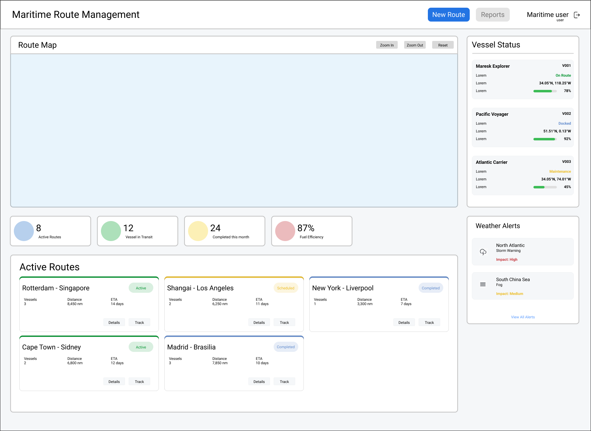

# **CAPÍTULO IV: PRODUCT DESIGN**

## 4.1. Style Guidelines

En esta seccion definiremos los estilos de diseño frontend que serán la base para dar forma a nuestro producto, utilizando patrones que consideren los aspectos de arquitectura de la información y accesibilidad necesarios para la implementación exitosa de UrProvider tanto en una Landing Page como en una Aplicación Web.

### 4.1.1. General Style Guidelines

**Branding:** El branding del logo de nuestra plataforma “Mushroom” es una combinación de elementos que transmiten una imagen sólida y confiable. Nos enfocamos en la confianza de nuestro clientes al momento de tomar un servicio prestado. El nombre “Mushroom” se presenta en una tipografía elegante y profesional, mientras que la paleta de colores crea un contraste visual claro y transmite una sensación de miminalismo y profesionalismo. En resumen, este logo tiene un enfoque clásico y profesional, y podría ser un elemento distintivo en nuestro sitio web.

**Typography:** Al seleccionar la tipografía para nuestro proyecto, hemos optado por utilizar Roboto siguiendo las pautas de estilo general. Ya que ofrece una combinación única de legibilidad, versatilidad y modernidad que se alinea perfectamente con la identidad visual y los objetivos de Mushroom. Su diseño limpio y contemporáneo proporciona una excelente lectura en una amplia gama de dispositivos, lo que garantiza una experiencia de usuario óptima para nuestros clientes, que incluyen tanto agencias de embarcaciones navieras como exportadores e importadores de alta rotacion.

**Colors:** Hemos escogido una paleta basada en colores suaves y elegantes, algo fríos para dar sensación de premium . De tal modo, estos generan un ambiente profesional y acogedor para el usuario final.
Los tonos más claros pueden ser utilizados para fondos o elementos de diseño amplios, mientras que los colores más oscuros serán para textos o detalles más específicos asegurando legibilidad y contraste entre ellos.

### 4.1.2. Web Style Guidelines

Para el Web Style Guidelines del sitio web "Mushroom" se utilizó con mayor presencia los colores pasteles en base a una paleta de colores que genere confianza y un ambiente acogedor para el usuario. El logo genera presencia por la combinación de elementos que transmiten una imagen sólida y confiable. A su vez, se ideó un estilo minimalista en el desarrollo del Landing Page para que el usuario tenga la facilidad de navegar y pueda observar las secciones con mayor orden. El tipo de Roboto combina con los colores anteriormente seleccionados, ya que brinda mayor flexibilidad y versatilidad. Para el desarrollo de los mockups y wireframes se utilizó en base a desarrollo web para pantallas de escritorio.

### 4.1.3. Mobile Style Guidelines
#### 4.1.3.1. iOS Mobile Style Guidelines
#### 4.1.3.2. Android Mobile Style Guidelines

## 4.2. Information Architecture
### 4.2.1. Organization Systems

- Sistemas de Organización Visual:
    - Organización secuencial: Se utilizará para explicar de manera consecutiva, la información sobre la plataforma web. De esta manera, el usuario podrá ir conociendo paso a paso el funcionamiento de la aplicación. Esto conectando desde la introducción de la aplicación web hasta la manera de contactarnos con nosotros mostrando información relevante como los beneficios que proporcionamos a partir de nuestros planes, e incluso una breve explicación del uso de la aplicación con testimonios de usuarios que ya la utilizaron. 
- Esquemas de Categorización de Contenido:
    - Por tópicos: Se utilizará para distribuir los diferentes temas a tratar de nuestra plataforma, presentando cada tópico de manera separada como una sección en donde se explicará de manera más detallada la información necesaria para el uso de la plataforma en diferentes aspectos. Esto permitira que los usuarios solo deban buscar el tópico en el que tienen dudas o directamente buscar la sección donde puede realizar estas mismas consultas con un contacto directo.

### 4.2.2. Labeling Systems

En la Landing Page, se hace uso de etiquetas que son cortas e indican con claridad al usuario la sección que van a ingresar para ver la información. Siendo las siguientes etiquetas:
- Home: Esta etiqueta indica la sección inicial donde está la información introductoria de la plataforma web.
- About: Esta etiqueta indica la sección donde se habla sobre quienes somos, nuestra misión, introducción a las suscripciones y miembros que conforman el startup.
- Subscriptions: Esta etiqueta indica la sección donde se muestra los planes disponibles para el uso de la plataforma web y sus beneficios.
- Customers: Esta etiqueta indica la sección donde se muestra los testimonios que iran haciendo los usuarios con respecto a nuestra aplicación.
- Contact: Esta etiqueta indica la sección donde se informará las maneras en las que nos pueden contactar para el feedback o por el plan Enterprise.
- Log In: Esta etiqueta indica la opción que permitirá a los usuarios ingresar a nuestra plataforma. 

### 4.2.3. SEO Tags and Meta Tags

Para la búsqueda eficiente de nuestra plataforma en los buscadores web se emplearon las siguientes tags:
- Title: Mushroom
- Meta Tags:
    - Description: Plataforma de optimización de rutas marítimas mediante tecnología inteligente.
    - Keywords: rutas marítimas, transporte de carga maritima, viajes maritimos, contenedores en embarcaciones de carga
    - Author: TEEMO-SOLUTIONS

### 4.2.4. Searching Systems

En esta parte, se indicarán los sistemas de búsqueda que se implementaran en la Landing Page, Web Applications y Mobile.

Landing Page:
- Para la búsqueda en esta sección, se utilizan las etiquetas y los sistemas de navegación que permiten la búsqueda de la información que requieren los posibles usuarios para la explicación de la misma. Esto mostrando un texto que redirige a la sección seleccionada facilitando la búsqueda.

Web Applications:
- Para la búsqueda en esta sección, se utilizan:
    - Las etiquetas y los sistemas de navegacion para la busqueda de la sección con la información que necesitan o la característica que necesitan utilizar accediendo a ellos mediante los textos.
    - La búsqueda de rutas utiliza el algoritmo de búsqueda A* para encontrar las rutas más cortas de recorrer en el medio marítimo. Esto se reflejará al momento de utilizar la búsqueda de rutas y mostrar los posibles caminos a recorrer.
    - El historial de rutas utilizadas en la aplicación permitirá llevar un registro de los recorridos que se pueden volver a utilizar. En esta sección, se puede realizar una búsqueda por fechas.

### 4.2.5. Navigation Systems

En esta parte, se indicará los sistemas de navegación que se utilizaron para la búsqueda rápida de las secciones que son de interés para los usuarios para el la landing page y la aplicación web.

Landing Page:
- Home: En esta sección, se lleva al usuario a la presentación de Mushroom.
- About: En esta sección, se lleva al usuario a la presentación del equipo, nuestra misión y una explicación breve de las suscripciones.
- Subscriptions: En esta sección, se lleva al usuario a los planes disponibles para el uso de la aplicación web.
- Customers: En esta sección, se lleva al usuario a los testimonios de usuarios que utilizaron la aplicación web.
- Contact: En esta sección, se lleva al usuario a las maneras en que puede contactarnos.
- Log In: Este botón cumple la función de ser un Call to Action que redirige a la aplicación web.

## 4.3. Landing Page UI Design

El desarrollo del UI Design de la Landing Page está en el siguiente link: https://www.figma.com/design/fRCN5nwxmvlgyTYYHrenag/TEEMOSolutions---Figma?node-id=0-1&p=f&t=xftwdiVWdTtj2j2G-0

### 4.3.1. Landing Page Wireframe

### 4.3.2. Landing Page Mock-up

## 4.4. Mobile Applications UX/UI Design
### 4.4.1. Mobile Applications Wireframes
### 4.4.2. Mobile Applications Wireflow Diagrams
### 4.4.3. Mobile Applications Mock-ups
### 4.4.4. Mobile Applications User Flow Diagrams

## 4.5. Mobile Applications Prototyping
### 4.5.1. Android Mobile Applications Prototyping
### 4.5.2. iOS Mobile Applications Prototyping

## 4.6. Web Applications UX/UI Design

El desarrollo del UI Design del Web Applications está en el siguiente link: https://www.figma.com/design/fRCN5nwxmvlgyTYYHrenag/TEEMOSolutions---Figma?node-id=0-1&p=f&t=xftwdiVWdTtj2j2G-0

### 4.6.1. Web Applications Wireframes

### 4.6.2. Web Applications Wireflow Diagrams

- Inicio de sesión: El usuario debe ingresar a la plataforma, en esa sección se le muestra la opción de inicio de sesión y registrarse, al iniciar sesión ingresa a la plataforma.

### 4.6.3. Web Applications Mock-ups

### 4.6.4. Web Applications User Flow Diagrams

- Inicio de sesión: El usuario debe ingresar a la plataforma, en esa sección se le muestra la opción de inicio de sesión y registrarse, al iniciar sesión ingresa a la plataforma.

## 4.7. Web Applications Prototyping

## 4.8. Domain-Driven Software Architecture
### 4.8.1. Software Architecture Context Diagram
### 4.8.2. Software Architecture Container Diagrams
### 4.8.3. Software Architecture Components Diagrams

## 4.9. Software Object-Oriented Design
### 4.9.1. Class Diagrams
### 4.9.2. Class Dictionary

## 4.10. Database Design
### 4.10.1. Relational/Non-Relational Database Diagram
