# Capítulo IV: Strategic-Level Software Design

En este capítulo describiremos en detalle el diseño de la solución software de Mushroom, trazando desde la arquitectura general hasta los componentes y las interacciones que permiten la gestión inteligente de los puertos y las rutas. Presentaremos el modelo de capas, incluyendo el servicio de adquisición y procesamiento de datos, la capa de negocio para la lógica y análisis de estado de los puertos, y la capa de presentación en la aplicación móvil y web, así como los patrones de diseño y las tecnologías seleccionadas para garantizar escalabilidad, fiabilidad y seguridad.

Además, se detallarán los flujos de datos y las interfaces de programación (APIs), junto con las consideraciones de usabilidad y experiencia de usuario que facilitarán un manejo intuitivo y eficiente de Mushroom. Por último, se abordarán aspectos claves como la integración con servicios en la nube, el manejo de eventos en tiempo real y las estrategias de despliegue continuo que soportarán la evolución continua de la plataforma.

## 4.1.	Strategic-Level Attribute-Driven Design

Attribute Driven Design (ADD) es una técnica sistemática para diseñar la arquitectura de software a partir de los atributos de calidad (también llamados requisitos de calidad o non-functional requirements) que son críticos para el sistema. A diferencia de enfoques centrados inicialmente en la estructura del dominio, ADD parte de los “drivers” arquitectónicos y usa esos drivers para guiar decisiones concretas sobre componentes, responsabilidades y patrones arquitectónicos (Bass et al., 2012).

El proceso ADD típicamente sigue pasos iterativos y replicables: identificar y priorizar los drivers arquitectónicos, elegir o derivar escenarios representativos que permitan medir esos atributos, seleccionar tácticas y patrones arquitectónicos que respondan a los escenarios, diseñar la estructura de componentes y sus responsabilidades que implementen las tácticas, y evaluar y refinar el diseño mediante escenarios adicionales y análisis de trade-offs (Bass et al., 2012). Este enfoque hace explícitas las decisiones que normalmente quedan implícitas y favorece trazabilidad desde los requisitos de calidad hasta las elecciones tecnológicas y de topología.

Entre las ventajas de ADD están la focalización en lo que realmente importa para los distintos stakeholders, la capacidad de justificar trade-offs técnicos y la generación de diseños orientados a pruebas y mediciones. Sus limitaciones principales son que requiere claridad previa sobre los atributos de calidad (si los drivers no están bien definidos, el diseño puede desviarse) y que focalizarse demasiado en atributos concretos puede llevar a sobredimensionar soluciones para condiciones extremas poco probables. Por eso es habitual combinar ADD con técnicas de priorización de requisitos y evaluación iterativa (por ejemplo análisis de riesgo arquitectónico y pruebas de carga tempranas).

### 4.1.1.	Design Purpose

El propósito del diseño de Mushroom, solución desarrollada por Teemo Solutions, es responder a la creciente complejidad del comercio marítimo internacional, marcada por disrupciones geopolíticas, cierres de rutas estratégicas y condiciones climáticas adversas. En este contexto, el diseño de la arquitectura de la solución se orienta a proporcionar un sistema robusto, escalable y adaptable, capaz de integrar fuentes de datos heterogéneas y ofrecer a los usuarios información confiable en tiempo real.

La finalidad central del proceso de diseño es alinear la solución con la problemática identificada: la falta de herramientas integradas que permitan a navieras, operadoras logísticas y exportadores/importadores tomar decisiones proactivas ante interrupciones de las rutas. A través de un enfoque predictivo y modular, el diseño busca minimizar riesgos operativos, optimizar recursos y garantizar la continuidad de las cadenas de suministro globales.

Asimismo, el diseño se orienta a satisfacer las necesidades específicas de los segmentos objetivo:

- Para las empresas navieras y operadoras logísticas, se prioriza la capacidad de simular rutas, gestionar riesgos y optimizar la eficiencia operativa.
- Para los exportadores e importadores de alta rotación, el diseño asegura visibilidad en tiempo real, confiabilidad de datos y previsibilidad en las entregas, aspectos clave para mantener su competitividad.

En términos de negocio, el diseño persigue consolidar a Mushroom como una plataforma SaaS diferencial en el mercado, ofreciendo un valor agregado basado en la integración de múltiples variables críticas (clima, conflictos, tráfico marítimo y cierres portuarios). De este modo, el propósito del diseño no solo radica en la creación de una solución tecnológica, sino en fortalecer la resiliencia del comercio internacional mediante decisiones más ágiles, informadas y sostenibles.

### 4.1.2.	Attribute-Driven Design Inputs

El proceso de Attribute-Driven Design (ADD) requiere identificar de manera explícita los insumos que guiarán las decisiones arquitectónicas de la solución. Estos inputs permiten alinear el diseño con la problemática detectada, garantizar el cumplimiento de los objetivos de negocio y atender de forma directa las necesidades de los segmentos objetivo.

En esta sección se presentan los tres tipos de insumos clave para el proceso de diseño:

#### 4.1.2.1.	Primary Functionality (Primary User Stories)

Las funcionalidades primarias de Mushroom se centran en garantizar que la solución cumpla con los requisitos funcionales más relevantes para la arquitectura y los segmentos objetivo. Estas funcionalidades fueron priorizadas porque representan la base para la planificación inteligente de rutas, el monitoreo en tiempo real, la gestión de riesgos, la interacción intuitiva del usuario y la generación de reportes operativos.

A continuación, se detallan los Epics y User Stories clave, con su respectiva relación a los objetivos arquitectónicos de la solución:

>Cabe señalar que este cuadro no constituye una duplicación del listado de User Stories del capítulo de Requirements. En este apartado se presentan únicamente aquellas Epics y User Stories cuya relevancia incide directamente en las decisiones de diseño arquitectónico.

###### Tabla 10
*Listado de User Stories principales y primarias que forman parte del Core de Mushroom*

| Epic / User Story ID | Título | Descripción | Criterios de Aceptación | Relacionado con (Epic ID) |
|----------------------|--------|-------------|--------------------------|---------------------------|
| **EPIC001** | Planificación Inteligente de Rutas Marítimas | Como desarrollador, quiero implementar un sistema que calcule rutas seguras y eficientes usando A*, considerando clima, cierres y peligrosidad. | Se debe garantizar que el sistema pueda calcular rutas seguras y eficientes considerando múltiples variables. | Epic principal (macro-funcionalidad) |
| **US001** | Sugerir ruta óptima | Como capitán, quiero que el sistema sugiera automáticamente la ruta más corta y segura según el algoritmo, para llegar eficientemente al puerto destino. | El sistema debe sugerir una ruta válida basada en los nodos del grafo considerando peligrosidad, clima y distancia. | EPIC001 |
| **US005** | Recalcular ruta dinámicamente | Como capitán, quiero que el sistema recalcule la ruta si hay cambios inesperados durante la navegación. | Ante cambio de estado en una arista del grafo (por cierre o clima), debe generarse una nueva ruta sin intervención manual. | EPIC002 |
| **US002** | Notificar eventos que afecten la ruta | Como capitán, quiero recibir alertas si una ruta se vuelve no viable, para evitar zonas bloqueadas o peligrosas. | Si una arista del grafo cambia a estado no viable, debe generarse una notificación y recalcular ruta automáticamente. | EPIC005 |
| **US006** | Visualizar posición actual del buque | Como empresario, quiero poder ver en tiempo real la ubicación del barco, para tener visibilidad del estado del envío. | La app debe mostrar la posición actual del buque usando coordenadas GPS integradas. | EPIC002 |

#### 4.1.2.2.	Quality attribute Scenarios
Esta sección describe los escenarios relacionados con los atributos de calidad que influyen significativamente en las decisiones de diseño arquitectónico del sistema. Dichos escenarios provienen de los requisitos no funcionales ya definidos y ejemplifican circunstancias importantes que el sistema debe afrontar de manera eficiente.

###### Tabla 11
*Listado de los Quality Attribute más importantes y relevantes para el desarrollo de Mushroom*

| **Atributo**     | **Fuente**        | **Estímulo**                                                                 | **Artefacto**                     | **Entorno**                              | **Respuesta**                                                                                       | **Medida**                                                                 |
|-------------------|-------------------|-------------------------------------------------------------------------------|-----------------------------------|-------------------------------------------|-----------------------------------------------------------------------------------------------------|-----------------------------------------------------------------------------|
| Fiabilidad        | Usuario / Sistema | Se realizan múltiples cálculos de rutas y estimaciones de riesgo.             | Motor de cálculo de rutas          | Operación continua                         | El sistema completa los cálculos con mínima tasa de error y genera alertas en caso de fallos.        | Error ≤ 0.5% mensual; alerta crítica e incidente si se supera.            |
| Seguridad         | Sistema externo / atacante | Se intenta acceder a información sensible o interceptar comunicaciones.       | Módulos de datos y comunicaciones | Entorno de red pública                     | El sistema protege datos sensibles y claves secretas mediante cifrado.                              | AES-256 aplicado a datos sensibles, TLS en comunicaciones, 0 contraseñas en texto plano. |
| Disponibilidad    | Usuario/Operador  | Se requiere utilizar las funciones principales (calcular ruta, ETA, puntaje) en cualquier momento. | Servicios principales              | Operación 24/7                             | El sistema mantiene los servicios disponibles sin interrupciones no planificadas.                   | ≥99% disponibilidad mensual.                                               |

**Tabla que fundamenta la selección de los atributos de calidad**

La siguiente tabla presenta los atributos de calidad considerados más relevantes para el sistema, junto con la justificación que explica su importancia y el impacto que tienen en el cumplimiento de los objetivos arquitectónicos y operativos de la aplicación.

###### Tabla 12
*Justificación del listado de los Quality Attribute más importantes y relevantes para el desarrollo de Mushroom*

| **Atributo**       | **Fundamentación / Relevancia**                                                                                                                                                                                                                                                                   |
| ------------------ | ------------------------------------------------------------------------------------------------------------------------------------------------------------------------------------------------------------------------------------------------------------------------------------------------- |
| **Fiabilidad**     | Los cálculos de rutas y estimaciones deben ser precisos y consistentes; cualquier error puede derivar en rutas inseguras o pérdidas operativas. La fiabilidad garantiza que el sistema cumpla consistentemente con su propósito principal.                                                        |
| **Seguridad**      | El sistema maneja datos críticos como posiciones GPS y contenido de carga. Una brecha de seguridad podría comprometer la integridad de las embarcaciones o exponer información sensible, por lo que la protección mediante cifrado y control de accesos es prioritaria.                           |
| **Disponibilidad** | La plataforma debe estar operativa en todo momento, especialmente durante la navegación. Una caída del sistema impediría recalcular rutas o emitir alertas, afectando directamente la seguridad y la confianza de los usuarios. Mantener ≥99% de disponibilidad asegura continuidad del servicio. |

#### 4.1.2.3.	Constraints
En esta sección se agrupan las condiciones obligatorias que surgen directamente de las exigencias del negocio. Estas limitaciones deben cumplirse para garantizar que la solución planteada sea factible y responda adecuadamente a lo esperado. Dentro de este marco de restricciones se define el espacio en el que se puede diseñar y desarrollar la aplicación. A continuación, se detallan los principales constraints representados como Technical Stories, los cuales funcionan como referencias prácticas para orientar el proceso de construcción del sistema.

###### Tabla 13
*Listado de Constraints más importantes y relevantes para el desarrollo de Mushroom*

| **ID**    | **Título**                                      | **Descripción**                                                                                                                                   | **Criterios de Aceptación**                                                                                                            | **Relacionado con (Epic ID)** |
|-----------|-------------------------------------------------|---------------------------------------------------------------------------------------------------------------------------------------------------|----------------------------------------------------------------------------------------------------------------------------------------|-------------------------------|
| TUS001    | Uso de Algoritmo A* para planificación de rutas | El sistema debe calcular rutas seguras y eficientes utilizando el algoritmo A*, combinando datos de clima, cierres portuarios y riesgos detectados. | Las rutas generadas deben provenir del algoritmo A*, validando resultados en al menos el 90% de los casos de prueba.                   | EPIC001                       |
| TUS002    | Plataforma SaaS en la nube                      | Mushroom debe desplegarse como solución SaaS basada en la nube para garantizar acceso global, disponibilidad continua y escalabilidad.              | El sistema debe estar accesible desde cualquier región con al menos 99% de disponibilidad mensual garantizada.                          | EPIC002 / EPIC004             |
| TUS003    | Integración con APIs externas                   | El sistema debe consumir datos en tiempo real de fuentes externas (clima, eventos maritimos) a través de APIs públicas o privadas.      | La plataforma debe integrarse exitosamente con al menos 3 fuentes externas verificadas durante pruebas de integración.                   | EPIC001 / EPIC005             |
| TUS004    | Cifrado de datos sensibles                      | Toda la información sensible y credenciales deben almacenarse cifradas con AES-256 y transmitirse con TLS 1.3.                                      | Ninguna contraseña debe almacenarse en texto plano; las pruebas de seguridad deben confirmar encriptación de datos sensibles.            | EPIC005                       |
| TUS005    | Compatibilidad Web y Móvil                      | La solución debe estar disponible como aplicación web y aplicación móvil (Android/iOS) con funcionalidades equivalentes en ambas plataformas.      | La interfaz debe superar pruebas de compatibilidad en Chrome, Firefox, Edge, Android e iOS con ≥90% de éxito en pruebas automáticas.     | EPIC004                       |
| TUS006    | Reportes descargables en PDF/Excel              | Los reportes de viaje y métricas operativas deben poder exportarse en formatos estándar (PDF y Excel) para uso empresarial.                         | El sistema debe generar archivos descargables correctamente formateados en ambos formatos.                                              | EPIC003                       |
| TUS007    | Notificaciones en tiempo real                   | Las alertas y notificaciones deben enviarse en tiempo real a los usuarios mediante la aplicación web y móvil.                                       | Los usuarios deben recibir notificaciones dentro de los 5 segundos posteriores al evento disparador.                                    | EPIC005                       |

### 4.1.3.	Architectural Drivers Backlog
El Architectural Drivers Backlog se construyó tras un proceso iterativo de priorización realizado en el Quality Attribute Workshop (QAW). En este taller se identificaron los Functional Drivers, los Quality Attribute Drivers y los Constraints más relevantes para Mushroom, considerando su impacto en los stakeholders principales (navieras, exportadores/importadores y operadores logísticos) y la complejidad técnica que representan en el diseño arquitectónico. 

###### Tabla 14
*Modelo de Architectural Drivers Backlog de Mushroom*

| Driver ID |	Título de Driver |	Descripción	| Importancia para Stakeholders (High, Medium, Low) |	Impacto en Architecture Technical Complexity (High, Medium, Low) |
|-----------|------------------|--------------|---------------------------------------------------|------------------------------------------------------------------|
| FD-01 | Planificación inteligente de rutas | Calcular rutas seguras y eficientes en tiempo real utilizando A* considerando clima, cierres portuarios y riesgos. | High | High |
| FD-02 | Monitoreo y recalculo dinámico | Permitir seguimiento de buques en tiempo real y recalcular rutas automáticamente ante eventos inesperados. | High | High |
| QAD-01 | Rendimiento en cálculo de rutas | Responder a solicitudes de cálculo de rutas bajo cargas concurrentes manteniendo baja latencia. | High | High |
| QAD-02 | Disponibilidad 24/7 | Garantizar que las funciones principales (cálculo, monitoreo, alertas) estén siempre disponibles. | High | High |
| CT-01 | Uso de algoritmo A* | La planificación de rutas debe basarse obligatoriamente en el algoritmo A*. | High | High |
| CT-02 | Plataforma SaaS en la nube | Mushroom debe desplegarse como SaaS global para garantizar acceso, disponibilidad y escalabilidad. | High | High |
| QAD-03 | Seguridad y cifrado de datos | Proteger credenciales y comunicaciones con cifrado AES-256 y TLS 1.3. | High | High |
| CT-03 | Integración con APIs externas | Consumo de datos en tiempo real (clima, eventos maritimos) mediante APIs externas. | High | High |
| FD-03 | Visualización y reportes de información | Mostrar rutas, métricas y generar reportes descargables en PDF/Excel. | High | Medium |
| FD-04 | Notificaciones y alertas | Enviar notificaciones proactivas sobre riesgos, cierres de rutas y cambios de ETA. | High | Medium |
| QAD-04 | Escalabilidad | Adaptarse a incrementos en usuarios, datos y peticiones sin degradar el rendimiento. | High | High |
| QAD-05 | Usabilidad y accesibilidad | La interfaz debe ser intuitiva, accesible (web/móvil) y usable por distintos perfiles. | High | Medium |
| CT-04 | Compatibilidad web y móvil | La aplicación debe ser funcional en navegadores y sistemas móviles (Android/iOS). | Medium | Medium |
| QAD-06 | Trazabilidad y explicabilidad | Explicar de manera comprensible las decisiones del motor de ruteo. | Medium | Medium |
| CT-05 | Reportes descargables | Generar reportes operativos exportables en PDF y Excel. | Medium | Low |

### 4.1.4.	Architectural Design Decisions

Durante el Quality Attribute Workshop (QAW) el equipo analizó los drivers de mayor prioridad y, en cada iteración, se identificó el driver crítico (funcional, de calidad o constraint), se seleccionaron los patrones candidatos que podían dar respuesta, se evaluaron sus pros y contras considerando el impacto en la arquitectura y la satisfacción de los stakeholders, y finalmente se tomó una decisión basada en los trade-offs entre complejidad, escalabilidad, rendimiento y facilidad de implementación.

###### Tabla 15
*Listado de decisiones de diseño más importantes para la arquitectura de software de Mushroom*

<table border="1" cellspacing="0" cellpadding="6" style="border-collapse: collapse; text-align: center; width: 100%;">
  <thead style="background-color: #333; color: #fff;">
    <tr>
      <th>Driver ID</th>
      <th>Título de Driver</th>
      <th colspan="2">Pattern 1</th>
      <th colspan="2">Pattern 2</th>
      <th colspan="2">Pattern 3</th>
    </tr>
    <tr style="background-color: #444; color: #fff;">
      <th></th>
      <th></th>
      <th>Pro</th>
      <th>Con</th>
      <th>Pro</th>
      <th>Con</th>
      <th>Pro</th>
      <th>Con</th>
    </tr>
  </thead>
  <tbody>
    <tr>
      <td rowspan="2">FD-01</td>
      <td rowspan="2">Planificación inteligente de rutas</td>
      <td>Flexibilidad para intercambiar algoritmos (A*, Dijkstra, ML)</td>
      <td>Complejidad en pruebas unitarias</td>
      <td>Separación clara de etapas (ingestión, cálculo, optimización)</td>
      <td>Posible latencia si no se optimizan colas</td>
      <td>Extensibilidad para agregar heurísticas</td>
      <td>Mayor overhead de arquitectura</td>
    </tr>
    <tr></tr>
    <tr>
      <td rowspan="2">FD-02</td>
      <td rowspan="2">Monitoreo y recalculo dinámico</td>
      <td>Reacción inmediata a eventos externos (clima, cierres)</td>
      <td>Mayor complejidad en debugging</td>
      <td>Notificaciones automáticas y desacoplamiento</td>
      <td>Difícil de escalar si hay muchos suscriptores</td>
      <td>Optimiza lectura/escritura y recalculo</td>
      <td>Mayor complejidad en sincronización</td>
    </tr>
    <tr></tr>
    <tr>
      <td rowspan="2">QAD-01</td>
      <td rowspan="2">Rendimiento en cálculo de rutas</td>
      <td>Reducción de latencia en consultas repetidas</td>
      <td>Riesgo de datos obsoletos</td>
      <td>Uso de threads para cálculos en paralelo</td>
      <td>Sobrecarga de coordinación</td>
      <td>Distribución de carga entre instancias</td>
      <td>Dependencia de infraestructura en la nube</td>
    </tr>
    <tr></tr>
    <tr>
      <td rowspan="2">QAD-02</td>
      <td rowspan="2">Disponibilidad 24/7</td>
      <td>Alta disponibilidad ante fallos</td>
      <td>Costos de infraestructura</td>
      <td>Aísla fallos en servicios externos</td>
      <td>Puede generar latencia inicial</td>
      <td>Recuperación automática ante caídas</td>
      <td>Configuración compleja</td>
    </tr>
    <tr></tr>
    <tr>
      <td rowspan="2">QAD-03</td>
      <td rowspan="2">Seguridad y cifrado de datos</td>
      <td>Cumple GDPR/IMO</td>
      <td>Penalización mínima en rendimiento</td>
      <td>Estándar y escalable</td>
      <td>Riesgo en manejo de expiración</td>
      <td>Máxima protección en red pública</td>
      <td>Complejidad de implementación</td>
    </tr>
    <tr></tr>
    <tr>
      <td rowspan="2">CT-02</td>
      <td rowspan="2">Plataforma SaaS en la nube</td>
      <td>Escalabilidad y despliegue independiente</td>
      <td>Mayor complejidad en orquestación</td>
      <td>Escala automática y pago por uso</td>
      <td>Menor control de rendimiento</td>
      <td>Simplicidad inicial para MVP</td>
      <td>Escalabilidad limitada a largo plazo</td>
    </tr>
    <tr></tr>
  </tbody>
</table>

### 4.1.5.	Quality Attribute Scenario Refinements

Al finalizar el Quality Attribute Workshop (QAW), el equipo priorizó los escenarios de atributos de calidad más críticos para el éxito de Mushroom. Se consideraron tanto los requisitos de negocio como las expectativas de los stakeholders, poniendo especial énfasis en la capacidad del sistema para mantenerse disponible 24/7, responder con baja latencia bajo cargas concurrentes, garantizar seguridad en la transmisión y almacenamiento de datos, y escalar conforme aumente la demanda.

###### Tabla 16
*Primer Scenario Refinement desarrollado para Mushroom*

<table border="1" cellspacing="0" cellpadding="6" style="border-collapse: collapse; width:100%; background-color:#1c1c1c; color:#fff;">
  <tr><th colspan="2" style="background-color:#333;">Scenario Refinement for Scenario 1</th></tr>
  <tr><td style="width:30%;">Scenario(s):</td><td>Cálculo de rutas bajo alta carga concurrente</td></tr>
  <tr><td>Business Goals:</td><td>Garantizar tiempos de respuesta rápidos para cálculos críticos, incluso bajo demanda elevada.</td></tr>
  <tr><td>Relevant Quality Attributes:</td><td>Rendimiento, Fiabilidad</td></tr>
  <tr><td>Stimulus:</td><td>Se reciben múltiples solicitudes de cálculo de rutas simultáneamente (≥100).</td></tr>
  <tr><td>Stimulus Source:</td><td>Usuarios concurrentes (capitanes/empresarios).</td></tr>
  <tr><td>Environment:</td><td>Operación normal con alta concurrencia.</td></tr>
  <tr><td>Artifact (if Known):</td><td>Motor de cálculo de rutas y predicciones.</td></tr>
  <tr><td>Response:</td><td>Procesar solicitudes sin degradación significativa del servicio.</td></tr>
  <tr><td>Response Measure:</td><td>Tiempo de respuesta ≤ 2 segundos para el 95% de las solicitudes.</td></tr>
  <tr><td>Questions:</td><td>¿Qué mecanismos de cache y paralelismo se aplicarán?</td></tr>
  <tr><td>Issues:</td><td>Posible saturación de infraestructura en picos de demanda.</td></tr>
</table>
 

###### Tabla 17
*Segundo Scenario Refinement desarrollado para Mushroom*

<table border="1" cellspacing="0" cellpadding="6" style="border-collapse: collapse; width:100%; background-color:#1c1c1c; color:#fff;">
  <tr><th colspan="2" style="background-color:#333;">Scenario Refinement for Scenario 2</th></tr>
  <tr><td style="width:30%;">Scenario(s):</td><td>Acceso continuo a funciones críticas del sistema</td></tr>
  <tr><td>Business Goals:</td><td>Asegurar continuidad operativa de la plataforma para usuarios globales.</td></tr>
  <tr><td>Relevant Quality Attributes:</td><td>Disponibilidad, Fiabilidad</td></tr>
  <tr><td>Stimulus:</td><td>Usuario intenta calcular ruta o consultar estado en cualquier momento.</td></tr>
  <tr><td>Stimulus Source:</td><td>Operadores y capitanes.</td></tr>
  <tr><td>Environment:</td><td>Entorno de operación productivo (24/7).</td></tr>
  <tr><td>Artifact (if Known):</td><td>Servicios principales (cálculo, notificaciones).</td></tr>
  <tr><td>Response:</td><td>El sistema mantiene los servicios activos sin interrupciones no planificadas.</td></tr>
  <tr><td>Response Measure:</td><td>≥ 99% de disponibilidad mensual garantizada.</td></tr>
  <tr><td>Questions:</td><td>¿Cómo se manejarán redundancias y failover?</td></tr>
  <tr><td>Issues:</td><td>Costos adicionales por infraestructura redundante.</td></tr>
</table>
 

###### Tabla 18
*Tercer Scenario Refinement desarrollado para Mushroom*

<table border="1" cellspacing="0" cellpadding="6" style="border-collapse: collapse; width:100%; background-color:#1c1c1c; color:#fff;">
  <tr><th colspan="2" style="background-color:#333;">Scenario Refinement for Scenario 3</th></tr>
  <tr><td style="width:30%;">Scenario(s):</td><td>Protección de datos sensibles y credenciales</td></tr>
  <tr><td>Business Goals:</td><td>Cumplir con regulaciones internacionales y generar confianza en clientes.</td></tr>
  <tr><td>Relevant Quality Attributes:</td><td>Seguridad, Privacidad</td></tr>
  <tr><td>Stimulus:</td><td>Intento de acceder o interceptar información sensible.</td></tr>
  <tr><td>Stimulus Source:</td><td>Atacante externo en red pública.</td></tr>
  <tr><td>Environment:</td><td>Comunicación a través de internet.</td></tr>
  <tr><td>Artifact (if Known):</td><td>Módulos de datos y comunicaciones.</td></tr>
  <tr><td>Response:</td><td>El sistema cifra datos y bloquea accesos no autorizados.</td></tr>
  <tr><td>Response Measure:</td><td>0 filtraciones de datos en pruebas de seguridad; cifrado AES-256 y TLS 1.3 activos.</td></tr>
  <tr><td>Questions:</td><td>¿Cómo se gestionarán las llaves de cifrado?</td></tr>
  <tr><td>Issues:</td><td>Posible impacto en rendimiento por encriptación.</td></tr>
</table>
 

###### Tabla 19
*Cuarto Scenario Refinement desarrollado para Mushroom*

<table border="1" cellspacing="0" cellpadding="6" style="border-collapse: collapse; width:100%; background-color:#1c1c1c; color:#fff;">
  <tr><th colspan="2" style="background-color:#333;">Scenario Refinement for Scenario 4</th></tr>
  <tr><td style="width:30%;">Scenario(s):</td><td>Aumento en volumen de datos y peticiones</td></tr>
  <tr><td>Business Goals:</td><td>Mantener el desempeño del sistema pese al crecimiento en uso.</td></tr>
  <tr><td>Relevant Quality Attributes:</td><td>Escalabilidad, Rendimiento</td></tr>
  <tr><td>Stimulus:</td><td>Incremento del 75% en peticiones y 50% en volumen de datos.</td></tr>
  <tr><td>Stimulus Source:</td><td>Usuarios y fuentes de datos externas.</td></tr>
  <tr><td>Environment:</td><td>Entorno de alta demanda.</td></tr>
  <tr><td>Artifact (if Known):</td><td>Capa de cálculo y predicción.</td></tr>
  <tr><td>Response:</td><td>El sistema escala horizontal y verticalmente según la carga.</td></tr>
  <tr><td>Response Measure:</td><td>Tiempo de respuesta ≤ 3 segundos pese al incremento de carga.</td></tr>
  <tr><td>Questions:</td><td>¿Qué balanceo de carga se aplicará?</td></tr>
  <tr><td>Issues:</td><td>Riesgo de costos altos en nube por escalado dinámico.</td></tr>
</table>

###### Tabla 20
*Quinto Scenario Refinement desarrollado para Mushroom*

<table border="1" cellspacing="0" cellpadding="6" style="border-collapse: collapse; width:100%; background-color:#1c1c1c; color:#fff;">
  <tr><th colspan="2" style="background-color:#333;">Scenario Refinement for Scenario 5</th></tr>
  <tr><td style="width:30%;">Scenario(s):</td><td>Interacción de un usuario con conocimientos básicos para calcular una ruta</td></tr>
  <tr><td>Business Goals:</td><td>Facilitar el uso de la aplicación incluso a usuarios sin experiencia técnica, reduciendo fricción en la adopción.</td></tr>
  <tr><td>Relevant Quality Attributes:</td><td>Usabilidad, Accesibilidad</td></tr>
  <tr><td>Stimulus:</td><td>Un usuario con conocimientos básicos interactúa con la aplicación para calcular una ruta.</td></tr>
  <tr><td>Stimulus Source:</td><td>Usuario final (capitán o empresario).</td></tr>
  <tr><td>Environment:</td><td>Operación normal en aplicación web/móvil.</td></tr>
  <tr><td>Artifact (if Known):</td><td>Interfaz web/móvil de Mushroom.</td></tr>
  <tr><td>Response:</td><td>El usuario completa la acción principal en pocos pasos sin dificultad adicional.</td></tr>
  <tr><td>Response Measure:</td><td>≥ 90% de los usuarios logran calcular una ruta en menos de 3 pasos durante pruebas de usabilidad.</td></tr>
  <tr><td>Questions:</td><td>¿Qué métricas de usabilidad se medirán (tiempo de tarea, tasa de éxito, errores)?</td></tr>
  <tr><td>Issues:</td><td>Necesidad de pruebas de UX iterativas y soporte multilenguaje.</td></tr>
</table>

## 4.2.	Strategic-Level Domain-Driven Design

Strategic Domain-Driven Design, o DDD estratégico es un enfoque arquitectónico que busca alinear la estructura del software con la lógica del negocio y la organización. Este enfoque es esencial para gestionar la complejidad en sistemas grandes y distribuidos, especialmente cuando múltiples equipos trabajan en diferentes partes del sistema.

Según Khononov (2021), el diseño orientado al dominio enfatiza la creación de contextos delimitados ("bounded contexts") que actúan como fronteras explícitas para mantener la coherencia del modelo en cada subdominio, así como el establecimiento de un lenguaje ubicuo ("ubiquitous language") compartido entre los equipos técnicos y los expertos del negocio para asegurar una comunicación precisa y libre de ambigüedades (Khononov, 2021).

Vernon (2016) propone una clara distinción entre dos espacios complementarios: el espacio del problema, dedicado a comprender en profundidad las necesidades y restricciones del negocio, y el espacio de la solución, enfocado en diseñar y aplicar patrones técnicos y arquitectónicos que respondan eficazmente a esos requerimientos. Esta división permite alinear la estrategia empresarial con las decisiones de diseño de software (Vernon, 2016).

Para abordar las decisiones estratégicas en el diseño de software utilizando Domain-Driven Design (DDD), el equipo ha implementado un proceso estructurado que combina técnicas colaborativas y herramientas visuales. Este enfoque facilita la identificación de límites naturales dentro del dominio del negocio, conocidos como Bounded Contexts, y promueve una comprensión compartida entre todos los participantes.

### 4.2.1.	EventStorming

En esta sección se describe el proceso llevado a cabo mediante la técnica de EventStorming para construir una visión compartida del dominio del problema y elaborar una primera versión del modelo del sistema. Siguiendo a Zimarev (2019), EventStorming consiste en un taller colaborativo en el que, a través de la identificación y secuenciación de eventos de negocio, expertos del dominio y miembros del equipo técnico pueden descubrir puntos críticos y dependencias ocultas dentro de procesos complejos (Zimarev, 2019). Además, Tune y Perrin (2024) resaltan cómo esta técnica no solo facilita la generación de requisitos claros, sino que también promueve la alineación socio-técnica al conectar las decisiones de arquitectura con la estrategia organizacional (Tune & Perrin, 2024).

Para ilustrar su alcance, Tune y Perrin definen EventStorming en términos prácticos:

“El EventStorming es un taller dinámico que alinea a los distintos actores, tanto de negocio como técnicos, mediante la identificación de eventos de dominio, permitiendo desentrañar la complejidad del sistema y sentar las bases para un diseño coherente” (Tune & Perrin, 2024).

Como objetivos de la sesión de EventStorming planteamos:

- Reconocer y catalogar los eventos de dominio más significativos, definiendo con precisión su naturaleza y alcance.
  
- Mapear las dependencias causales y la secuencia temporal entre esos eventos, para visibilizar flujos y puntos de decisión críticos.

- Identificar los procesos de negocio subyacentes, así como los comandos que los activan y los actores responsables de cada acción.

- Generar un insumo estructurado que facilite la posterior delimitación de Bounded Contexts y sirva de base para la definición del modelo de dominio.

**Desarrollo de la sesión**

**Step 1: Unstructured Exploration**

En esta etapa inicial, todos los participantes plasmaron en notas adhesivas los eventos más relevantes del sistema, redactados en pasado para enfatizar que son hechos consumados dentro del negocio. El objetivo fue generar una “fotografía” global de todos los sucesos críticos, sin filtrar o depurar, de modo que emergiera un panorama amplio de qué ocurre en el dominio.

###### Figura 18
*Primer paso del proceso de EventStorming de Mushroom*

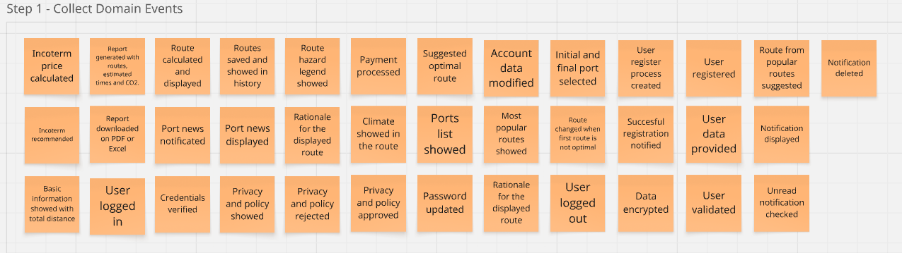

**Step 2: Timelines**

Los participantes revisan los eventos de dominio generados y los organizan en el orden en que ocurren en el dominio empresarial. Los eventos deben comenzar con el happy path: el flujo que describe un escenario empresarialexitoso. Una vez que se realiza el happy path, se pueden agregar escenarios alternativos.

###### Figura 19
*Segundo paso del proceso de EventStorming de Mushroom*

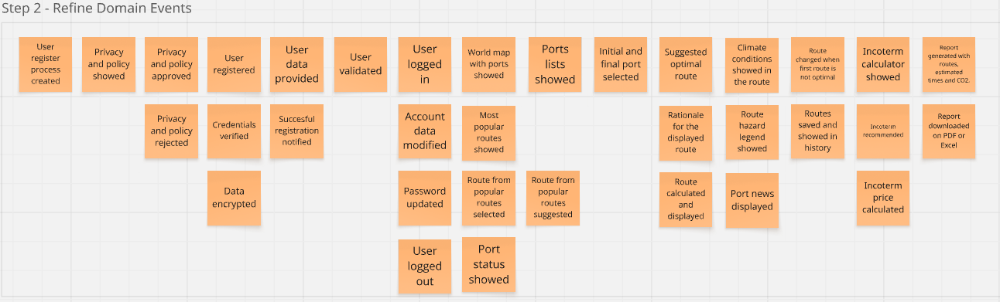

**Step 3: Paint Points**

Una vez que tenga los eventos organizados en una línea de tiempo, use esta vista amplia para identificar puntos en el proceso que requieren atención. Estos pueden ser cuellos de botella, pasos manuales que requieren automatización, documentación faltante o conocimiento de dominio faltante.

###### Figura 20
*Tercer paso del proceso de EventStorming de Mushroom*

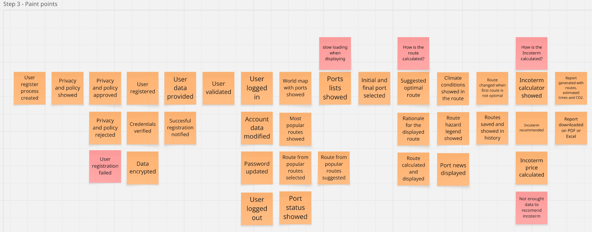

**Step 4: Pivotal Points**

Una vez que tenga una línea de tiempo de eventos aumentada con paint points, busque eventos comerciales importantes que indiquen un cambio en el contexto o la fase. Estos se denominan eventos fundamentales y están marcados con una barra vertical que divide los eventos antes y después del evento fundamental.

###### Figura 21
*Cuarto paso del proceso de EventStorming de Mushroom*

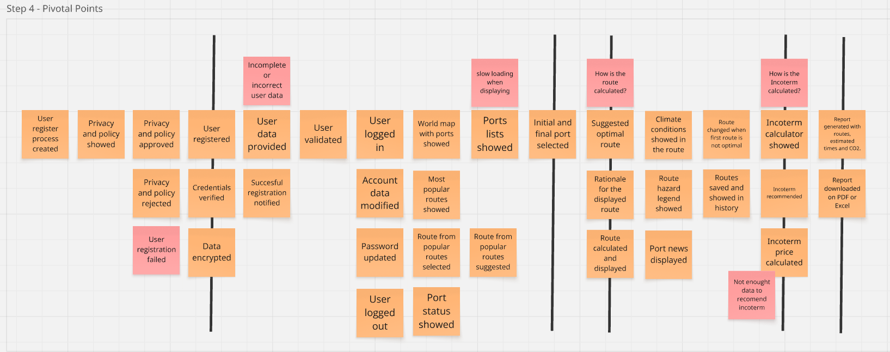

**Step 5: Commmands**

Mientras que un evento de dominio describe algo que ya sucedió, un comando describe qué desencadenó el evento o el flujo de eventos. Los comandos describen las operaciones del sistema y, contrariamente a los eventos de dominio, se formulan en imperativo.

###### Figura 22
*Quinto paso del proceso de EventStorming de Mushroom*

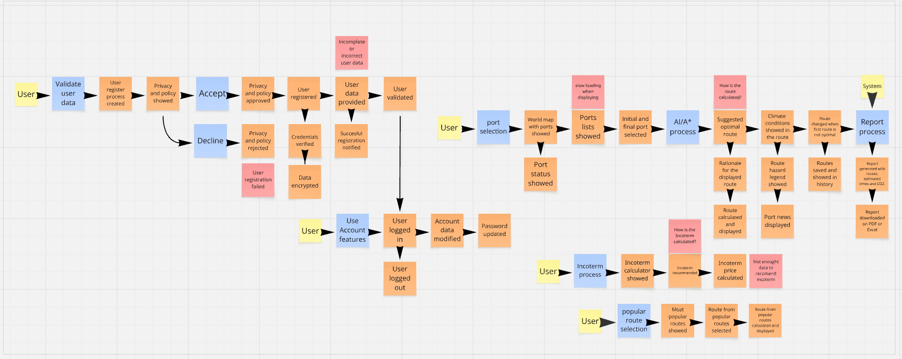

**Step 6: Policies**

Algunos comandos se agregan al modelo, pero no tienen un actor específico asociado con ellos. Durante este paso, busca automation policies que puedan ejecutar esos comandos. Una automation policy un escenario en el que un evento desencadena la ejecución de un comando. En otras palabras, un comando se ejecuta automáticamente cuando ocurre un evento de dominio específico.

###### Figura 23
*Sexto paso del proceso de EventStorming de Mushroom*

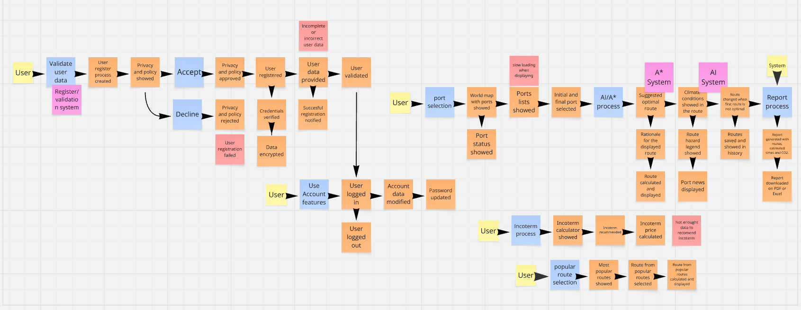

**Step 7: Read Models**

Un modelo de lectura es la vista de datos dentro del dominio que el actor usa para tomar la decisión de ejecutar un comando. Puede ser una de las pantallas del sistema, un informe, una notificación, etc..

###### Figura 24
*Séptimo paso del proceso de EventStorming de Mushroom*

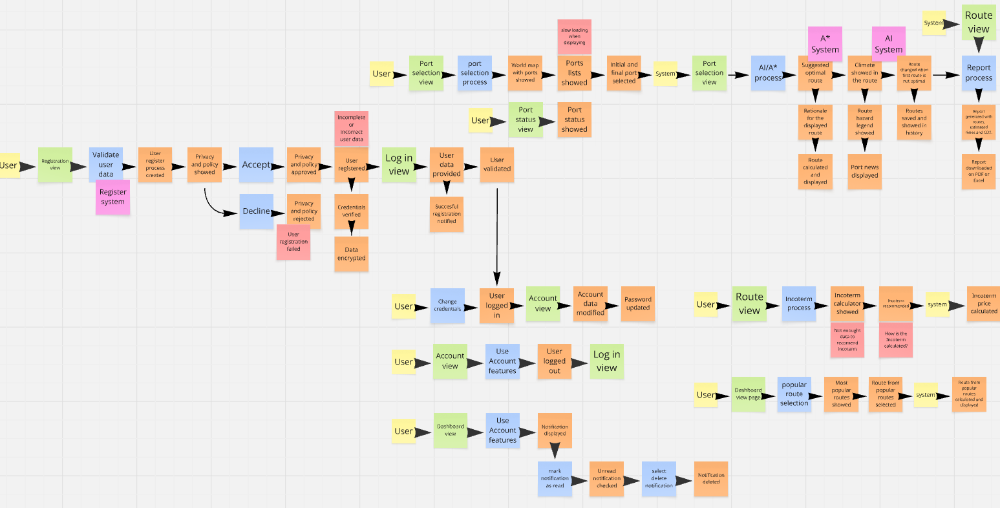

**Step 8: External Systems**

Este paso consiste en aumentar el modelo con sistemas externos. Un sistema externo se define como cualquier sistema que no forma parte del dominio que se está explorando. Puede ejecutar comandos (entrada) o puede ser notificado sobre eventos (salida).

###### Figura 25
*Octavo paso del proceso de EventStorming de Mushroom*

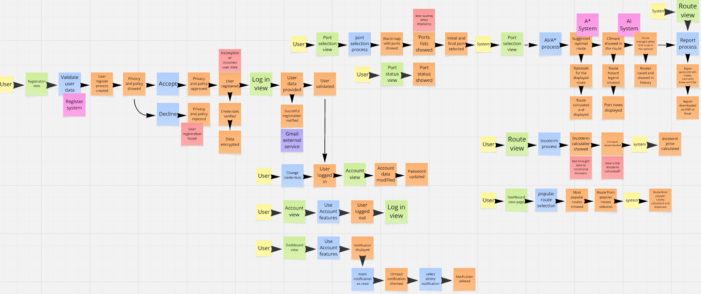

**Step 9: Aggregates**

Una vez que todos los eventos y comandos están representados, los participantes pueden comenzar a pensar en organizar conceptos relacionados en agregados. Un agregado recibe comandos y produce eventos.

###### Figura 26
*Noveno paso del proceso de EventStorming de Mushroom*

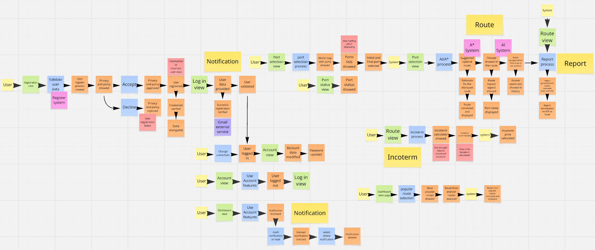

**Step 10: Bounded Contexts**

El último paso de una sesión de tormenta de eventos es buscar agregados que estén relacionados entre sí, ya sea porque representan una funcionalidad estrechamente relacionada o porque están acoplados a través de políticas. Los grupos de agregados forman candidatos naturales para los límites de los contextos delimitados.

###### Figura 27
*Décimo paso del proceso de EventStorming de Mushroom*

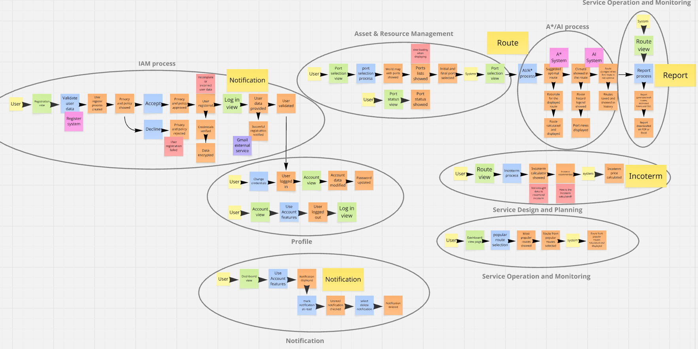

### 4.2.2.	Candidate Context Discovery

En esta sección, el equipo describe detalladamente el proceso seguido para la sesión de Candidate Context Discovery, partiendo del modelo de dominio previamente construido mediante EventStorming, con el propósito de identificar y delimitar los Bounded Contexts que compondrán la arquitectura de Mushroom. Según Khononov (2021), este enfoque estratégico de Domain‑Driven Design (DDD) requiere una combinación de análisis colaborativo y técnicas sistemáticas para aislar fragmentos del dominio que posean coherencia interna y aporten el mayor valor al negocio

Para asegurar una exploración efectiva de los límites contextuales, se combinaron tres técnicas complementarias, tal como recomienda Khononov (2021):

* **Start‑with‑Value:** consiste en identificar primero aquellos subdominios o flujos de negocio cuyo impacto en la propuesta de valor sea más significativo, de modo que las decisiones de acotamiento prioricen las funcionalidades críticas para el usuario y el negocio

* **Start‑with‑Simple:** implica descomponer el proceso principal en un conjunto mínimo de pasos secuenciales, desde el registro de usuario hasta la generación de recomendaciones, lo cual facilita la visualización y evita solapamientos entre candidatos de contexto

* **Look‑for‑Pivotal‑Events:** se centra en detectar aquellos eventos de dominio que representan cambios de estado fundamentales, ya que estos hitos indefectiblemente marcan fronteras naturales entre contextos

La sesión de Candidate Context Discovery, cuya duración no excedió las dos horas, se organizó como un taller interactivo en el que participaron todos los miembros de nuestro equipo de TEEMO Solutions, empleando una herramienta colaborativa de EventStorming, Miro. Durante la misma, se capturaron iterativamente pantallazos que documentan la evolución del modelo de eventos, desde la visión inicial hasta la estructuración final de los contextos. Estas imágenes se incorporarán en la sección para evidenciar la progresión metodológica y facilitar la trazabilidad de las decisiones tomadas.

A partir del modelo de dominio generado con EventStorming, el equipo explica y evidencia el proceso realizado para la sesión de Candidate Context Discovery, en la que se busca identificar los Bounded Contexts. Durante la sesión se siguieron estos pasos:

1. **Preparación y definición de alcance**

    Para garantizar una sesión estructurada y productiva, se llevaron a cabo las siguientes actividades previas:  

   * **Convocatoria y roles de los participantes**

      Se conformó un grupo interdisciplinario bajo la coordinación de TEEMO Solutions, integrado por:

      - Desarrolladores backend y frontend, responsables de la viabilidad técnica.
      - Diseñadores UX/UI, encargados de asegurar la coherencia en la experiencia de usuario.  

    * **Definición de objetivos y alcance**

       * **Propósito principal:** Descomponer el dominio de Mushroom, desde el registro inicial del usuario hasta la emisión de rutas óptimas.
       * **Alcance temporal:** Taller de mínimo dos horas y máximo tres horas en la plataforma Miro utilizando la técnica de EventStorming.  

     * **Herramientas y materiales de trabajo**

        * **Lienzo colaborativo en Miro:** para la colocación y organización dinámica de eventos y comandos.
        * **Post‑its codificados por color:** diferenciando eventos de dominio, comandos de acción e integraciones externas.
        * **Marcadores y cámaras:** para anotar aclaraciones y capturar iteraciones de la evolución del modelo.

     * **Asignación de responsabilidades**
        * **Facilitador:** orientó la dinámica del taller, gestionó los tiempos y promovió la participación activa.
        * **Escritor:** trasladó al lienzo digital las notas y agrupaciones, asegurando la trazabilidad de cada modificación.
        * **Expertos de dominio**: validaron definiciones, aclararon términos y garantizaron la precisión del lenguaje ubicuo.   

2.  **Técnica Start‑with‑Value**

      Con el fin de enfocar el análisis en las áreas de mayor impacto, se realizó:

      * **Identificación de “valores núcleo”**
         Cada integrante propuso los flujos de negocio que, a su juicio, aportan el mayor valor a usuario y organización:
          
           * Consulta de rutas entre dos puertos distintos y proceso de optimización usando el algoritmo A*
          * Identificación de riesgos en la ruta, tanto metereológicos como políticos, con el uso de Machine Learning.
          * Generación de reportes de rutas designadas por los usuarios, además de permitir el cálculo de Incoterms recomendados.

       * **Priorización de eventos**
        Se listaron todos los eventos detectados y se clasificaron según su impacto (alto, medio, bajo). Solo los catalogados como alto impacto se trasladaron a la siguiente etapa, garantizando que la sesión permaneciera centrada en las funciones críticas.  

3. **Técnica Start‑with‑Simple**

    Para clarificar la secuencia de operaciones esenciales, se procedió a:

    * **Modelado visual con post‑its**

      Cada uno de los pasos se representó con post‑its de un único color, evitando superposiciones y facilitando la delimitación de responsabilidades entre los distintos subdominios.

    * **Descomposición en pasos mínimos**

      Se esbozó un timeline básico que recogiera el flujo de valor, compuesto por:

###### Tabla 21
*Flujo de valor identificado en el proceso de EventStorming de Mushroom*

| Paso |	Descripción | Artefactos de Dominio / Evento Pivotal |
|-|-|-|
| 1 |	Registro del usuario en la plataforma (onboarding)| **Comando:** RegisterUser, **Evento:** UserRegistered|
|2	|Creación / actualización de perfil y aceptación de políticas (consentimiento)	|**Comando:** CreateOrUpdateProfile, AcceptPrivacyPolicy,  **Evento:** ProfileCreated / PrivacyPolicyAccepted|
|3|	Autenticación del usuario (login) y verificación de credenciales	|**Comando:** AuthenticateUser,  **Evento:** UserLoginSucceeded / UserLoginFailed|
|4|	Visualización del catálogo de puertos / selección de puertos para planificar|	**Comando:** RequestPortList, SelectPort,  **Evento:** PortListViewed / PortSelected
|5	|Consulta del estado del puerto (disponibilidad, avisos, port news)|	**Comando:** GetPortStatus, **Evento:** PortStatusViewed / PortStatusUpdated|
|6|	Solicitud de cálculo de ruta (inicia el proceso A*/AI) |	**Comando:** RequestRouteCalculation, **Evento:** RouteCalculationRequested|
|7	|Publicación de rutas sugeridas por el motor A*/AI y presentación al usuario	|**Comando:** (interno) PublishSuggestedRoutes, **Evento:** SuggestedRoutePublished
|8|	Selección de la ruta final por parte del usuario y guardado en historial	|**Comando:** SelectSuggestedRoute, SaveRoute,  **Evento:** RouteSelected / RouteSaved
|9|	Cálculo de Incoterm y estimación de precio asociado a la ruta seleccionada	| **Comando:** CalculateIncoterm, EstimatePrice, **Evento:** IncotermCalculated / PriceEstimated
|10	|Generación de reporte (PDF/Excel) y notificación al usuario; registro en historial de reportes	|**Comando:** GenerateReport, DownloadReport, **Evento:** ReportGenerated / ReportDownloaded|
|11	|Notificación in-app / email (registro, resultado de ruta, report listo, alertas)	|**Comando:** CreateInAppNotification, SendEmailNotification, **Evento:** NotificationCreated / NotificationSent|
|12|	Operación y monitorización: detección de fallos, reintentos y alertas de sistema	|**Comando:** ReportSystemHealth, RetryRouteCalculation, **Evento:** RouteCalculationFailed, ExternalServiceUnavailable, SystemHealthAlert

4. **Técnica Look‑for‑Pivotal‑Events**

    Con el propósito de delimitar con precisión los contextos, se identificaron eventos de transición. Un evento de transición, según Khononov (2021), no solo marca un cambio de estado significativo, por ejemplo el paso de “usuario anónimo” a “usuario registrado”, sino que también permite priorizar de forma rigurosa el modelado y el desarrollo. Al centrarse en aquellos eventos de mayor impacto, el equipo puede determinar con claridad qué áreas requieren atención inmediata y cuáles funcionalidades deben implementarse primero, garantizando así que las decisiones de diseño estén siempre alineadas con los objetivos de negocio y el valor aportado al usuario.

###### Tabla 22
*Lista de transiciones identificadas en el proceso de EventStorming de Mushroom*

|Transición	|Descripción|
|-|-|
|UserRegistered	|Un usuario anónimo se convierte en usuario registrado, creando una cuenta válida en el sistema.|
|PrivacyPolicyAccepted	|Un usuario sin consentimiento previo acepta los términos y políticas, quedando habilitado para el uso del sistema.|
|PrivacyPolicyRejected	|Un usuario que rechaza los términos y políticas no puede continuar con el registro, finalizando el proceso.|
|UserLoginSucceeded	|Una sesión no iniciada se valida exitosamente con credenciales correctas, permitiendo acceso al sistema.|
|UserLoginFailed	|Un intento de inicio de sesión falla debido a credenciales incorrectas o datos inválidos.|
|AccountUpdated	|Un perfil de usuario existente es modificado con nuevos datos o credenciales.|
|PortListViewed	|El usuario visualiza la lista de puertos disponibles en el sistema.|
|PortSelected|	Un puerto de la lista es seleccionado por el usuario para iniciar la planificación de ruta.|
|PortStatusViewed	|El usuario consulta el estado de un puerto específico (disponibilidad, avisos, posición.).|
|PortStatusUpdated|	El sistema actualiza la información de estado de un puerto en base a fuentes externas o monitoreo.
|RouteCalculationRequested	|Un usuario solicita el cálculo de una nueva ruta a partir de puertos seleccionados.|
|RouteCalculated	|Una ruta es generada por el motor de cálculo (A* o IA) y queda disponible para el usuario.|
|SuggestedRoutePublished|	El sistema publica una o varias rutas sugeridas al usuario para su evaluación.|
|RouteSelected	|El usuario elige una de las rutas sugeridas como la definitiva.|
|RouteSaved|	Una ruta seleccionada es almacenada en el historial del usuario.|
|IncotermCalculated|	Se calcula el Incoterm correspondiente a la ruta seleccionada, generando un resultado con base legal y comercial.|
|PriceEstimated|	El sistema calcula una estimación de costos para la ruta seleccionada.|
|ReportGenerated|	Se crea un reporte (PDF o Excel) a partir de una ruta seleccionada y su información asociada.|
|ReportDownloaded	|El usuario descarga un reporte previamente generado.|
|NotificationCreated	|El sistema crea una notificación (in-app o email) relacionada con un evento relevante (registro, ruta, reporte).|
|NotificationSent|	Una notificación es enviada al canal correspondiente (correo electrónico, aplicación).|
|NotificationDisplayed	|El sistema muestra una notificación en la bandeja del usuario.|
|NotificationRead	|El usuario marca una notificación como leída.
|NotificationDeleted	|El usuario elimina una notificación de su bandeja.|
|RouteCalculationFailed	|Un intento de cálculo de ruta falla debido a datos incompletos o indisponibilidad del motor de cálculo.|
|ExternalServiceUnavailable	|Un servicio externo requerido (IA, Incoterm, Gmail) no responde, quedando registrado como incidente.|

* **Agrupación por afinidad de eventos**

  Sobre el lienzo, los post‑its se reagruparon alrededor de cada evento pivotal, permitiendo visualizar con claridad los límites naturales entre posibles contextos.

5. **Visualización evolutiva**

    Con el objetivo de documentar de manera sistemática el avance del modelo y garantizar su trazabilidad, se implementó un proceso de registro visual en intervalos regulares:

   * **Capturas iterativas**
    
      Para conservar un historial detallado de la evolución del tablero, se generaron capturas de pantalla en Miro a lo largo de toda la sesión de trabajo, siguiendo estos hitos:

     * **Estado inicial:** todos los eventos recolectados, aún sin clasificar ni ordenar, reflejando la materia prima del modelado.
     * **Después de Start-with-Value:** se destacaron exclusivamente aquellos eventos con mayor repercusión en la generación de valor, lo que permitió centrar el análisis en los aspectos críticos del dominio.
     * **Después de Start-with-Simple:** se reorganizó el conjunto de eventos siguiendo un criterio cronológico básico, facilitando la comprensión del flujo secuencial de las interacciones.
     * **Después de Look-for-Pivotal-Events:** se identificaron y agruparon los eventos clave que actúan como puntos de inflexión, sentando las bases para la delimitación de subdominios.
     * **Versión final:** se plasmó la consolidación de los candidatos a contextos delimitados, incorporando agregados, políticas y responsabilidades, y validando la coherencia global del modelo.

   * **Registro meticuloso:**

      Cada imagen se anotó con fecha, hora y una breve descripción de los ajustes realizados, asegurando que el informe refleje con exactitud la evolución metodológica, y facilitando la inclusión de estas evidencias en la sección correspondiente.  

1. **Candidatos a Bounded Context**
A continuación presentamos la sección de Candidatos a Bounded Contexts, donde listamos todos los contextos identificados en la sesión inicial (incluyendo aquellos que finalmente no se consolidaron) y la justificación de su inclusión o exclusión en el conjunto definitivo.

###### Tabla 23
*Lista de candidatos a Bounded Context identificados en el proceso de EventStorming de Mushroom*

|Contexto	|Responsabilidades clave	|¿Pasa al diseño?
|-|-|-|
|IAM|	Registro de usuarios, validación de datos, login/logout, gestión de credenciales, aceptación/rechazo de políticas de privacidad, cifrado de datos.	|**Consolidado:** Este es transversal e indispensable. Centraliza seguridad, autenticación y ciclo de vida de usuarios. Garantiza cumplimiento de políticas y auditabilidad.|
|Profile & Preferences|	Creación y actualización del perfil de usuario, datos de contacto, credenciales, preferencias, actualización de contraseñas, cambio de configuración de cuenta.	|**Consolidado:** Permite desacoplar información personal del contexto de autenticación. Facilita personalización y cambios de perfil sin impactar IAM.
|Asset & Resource Management|	Gestión de puertos: catálogo de puertos, metadatos, visualización en mapas, estado de puertos y noticias relacionadas.|	**Consolidado:** Constituye una fuente de verdad para el dominio. Se mantiene independiente para alimentar Routing y Reporting.|
|A* / AI Process	|Cálculo de rutas mediante A* y sistemas de IA, publicación de rutas sugeridas, selección y guardado de rutas en historial, integración con datos de puertos y clima.|	**Consolidado:** Es el Core Domain de Mushroom. La lógica de negocio más diferenciadora. Debe aislarse claramente.|
|Service Design and Planning|	Cálculo de Incoterms y precios estimados para rutas seleccionadas. Interacción con sistemas externos de reglas comerciales.	|**Consolidado:** Soporta la toma de decisiones económicas y legales en la planificación. Mantener separado asegura flexibilidad ante cambios normativos.|
|Notifications|	Gestión de notificaciones in-app y vía email: creación, envío, visualización, marcado como leído o eliminado.|	**Consolidado:** Aunque transversal, es mejor mantenerlo separado por su naturaleza de canalización de eventos.|
|Service Operation & Monitoring	|Supervisión de estado del sistema, detección de fallos, desarrollo de reportes, alertas de indisponibilidad de servicios externos (IA, Gmail, Incoterm).|	**Consolidado:** Asegura confiabilidad del sistema. Centraliza observabilidad y reacción ante errores.|
|Hardware Device Management	|Administración de dispositivos físicos (sensores, gateways, calibración, mantenimiento).	|**Excluido:** Mushroom es una aplicación software, no gestiona hardware físico como IoT.|
|Payment & Subscription|	Gestión de planes de pago, pasarelas, facturación recurrente.	|**Excluido:** El modelo actual de Mushroom no contempla monetización vía suscripciones ni facturación directa, por lo que se descarta.|
|External Data Acquisition	|Módulo independiente para ingesta de datos climáticos y marítimos (APIs de terceros) con pipelines propios.	|**Excluido:** Aunque hay integración con datos de clima y noticias de puertos, se maneja dentro de Routing & Optimization y Port Catalog para simplificar.|

7. **Bounded Contexts finales**

    Como resultado de la sesión de Candidate Context Discovery y tras identificar los eventos cruciales (pivotal events), se definieron y refinaron siete Bounded Contexts a partir de los candidatos iniciales. Para cada uno se establecieron sus responsabilidades principales, su lenguaje ubicuo y los contratos de integración, garantizando así una delimitación clara y coherente entre dominios.

###### Tabla 24
*Lista de Bounded Context finales identificados en el proceso de EventStorming de Mushroom*
|Contexto|	Responsabilidades clave|	Ubiquitous Language|
|--|-|-|
|1. IAM	|- Registro y autenticación de usuarios: login/logout, validación de credenciales.  - Gestión de políticas de privacidad y cifrado de datos. - Emisión y validación de tokens de sesión.|	- User: persona que accede al sistema.  - Credentials: conjunto de datos secretos usados para autenticarse. - Session: período autorizado de interacción activa. - AccessToken: token de corta duración que permite acceso seguro a recursos. - RefreshToken: token usado para renovar la sesión.|
|2. Profile & Preferences	|- Creación y actualización de perfiles de usuario (nombre, email, contacto). - Configuración de preferencias: idioma, tema de la app. - Recuperación y actualización de contraseñas.	|- Profile: datos personales y de configuración de un usuario. - Preference: opciones personalizadas (idioma, tema). - PasswordRecoveryToken: token temporal para recuperación de cuenta.
|3. Asset & Resource Management |- Gestión de puertos: activación, actualización y desactivación de entradas. - Administración de metadatos: nombre, ubicación, estado. - Integración con noticias de puertos y datos contextuales.	|- Port: entidad que representa un puerto marítimo con su ubicación. - PortMetadata: atributos descriptivos del puerto (estado, noticias, coordenadas). - PortCatalog: colección de puertos gestionados en el sistema.
|4. A* / AI Process|	- Cálculo de rutas marítimas usando algoritmo A*. - Generación de rutas sugeridas según clima, puertos y preferencias mediante IA a través de Machine Learning. - Selección y guardado de rutas en historial.|	- Route: trayectoria calculada entre puertos. - RouteNode: punto intermedio o escala en la ruta. - OptimizedRoute: ruta sugerida tras aplicación de IA/A*. - RouteHistory: registro de rutas seleccionadas o usadas previamente.|
|5. Service Design and Planning |	- Cálculo de Incoterms aplicables a una ruta. - Estimación de precios de transporte. - Integración con reglas comerciales externas.|	- Incoterm: regla internacional que define responsabilidades de transporte. - PriceEstimate: costo calculado para una ruta. - CommercialRule: regla de negocio aplicada en el cálculo.
|6. Notifications |	- Creación, envío y recepción de notificaciones in-app con respecto a las funciones de recomendación de IA.|	- Notification: mensaje emitido al usuario. - NotificationChannel: medio de entrega (in-app, correo electrónico). - NotificationStatus: estado de la notificación (leída, pendiente, eliminada).|
|7. Service Operation & Monitoring	|- Definición de las rutas más populares usadas por los usuarios en la aplicación.   -Generación del reporte de emiciones como gases C02, información de la ruta, todo en PDF. |- Report: documentos generados para cada ruta escogida y asignada   - PopularRoute: rutas específicas que utilizan muchos usuarios de la plataforma y que se presentan como las rutas más populares para ayudar a otros usuarios. |

### 4.2.3.	Domain Message Flows Modeling

En esta sección, el equipo presenta y documenta de forma detallada el proceso seguido para ilustrar la colaboración entre los distintos bounded contexts al abordar los casos de uso planteados por los usuarios del sistema. A través de la aplicación de la técnica de visualización Domain Storytelling, se evidenciará cada interacción y flujo de información entre los contextos, apoyándose en capturas de pantalla que muestran los diagramas elaborados durante el ejercicio. Este enfoque colaborativo permite validar y ajustar las fronteras de los dominios, garantizando que el diseño del software refleje fielmente las necesidades del negocio y del usuario.

Domain Storytelling es una técnica visual y ágil que utiliza historias narradas y representadas gráficamente para describir cómo los distintos actores y componentes del sistema interactúan en situaciones reales. Cada flujo se descompone en pasos secuenciales que combinan narración textual y símbolos estandarizados (actores, mensajes y artefactos), facilitando la comprensión colectiva y la detección temprana de inconsistencias o vacíos en el modelo de dominio (Hofer & Schwentner, 2021).

###### Figura 28
*Domain Message Flow relacionado al creación de un perfil tras el primer inicio de sesión del usuario*

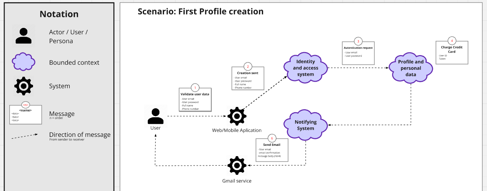

###### Figura 29
*Domain Message Flow relacionado al cálculo de rutas*
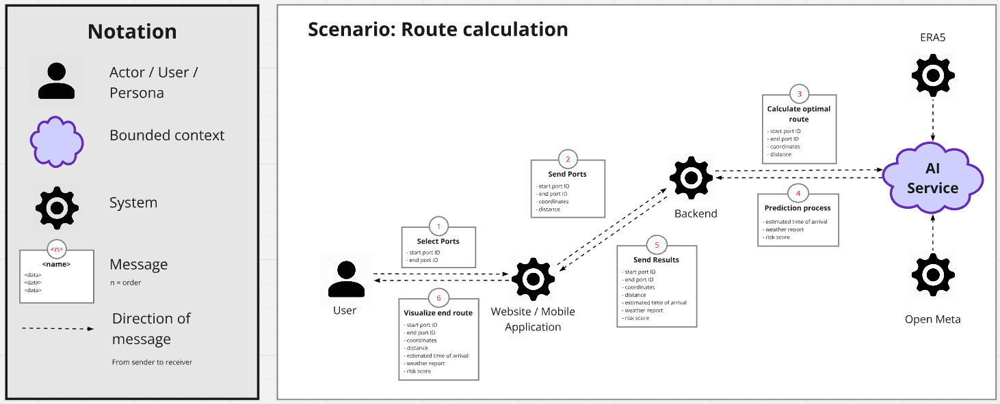

###### Figura 30

*Domain Message Flow relacionado al seleccion de rutas populares*
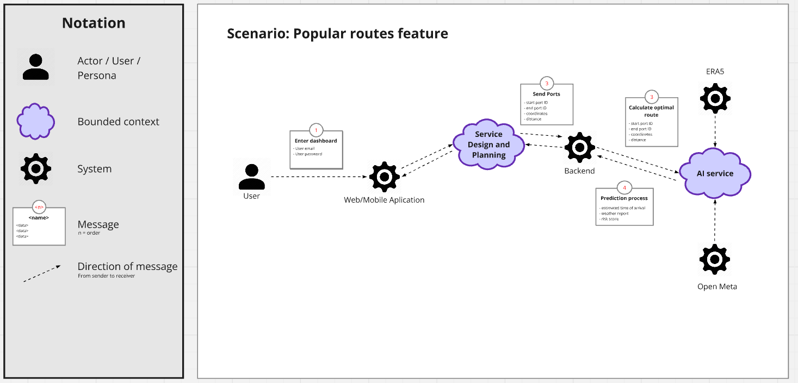

###### Figura 31

*Domain Message Flow relacionado al cálculo de incoterms*
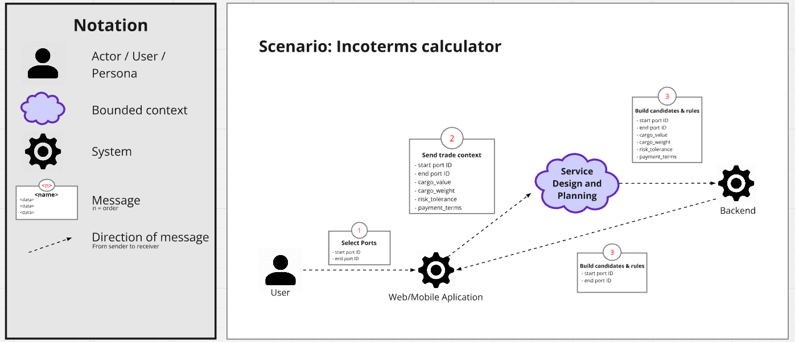

### 4.2.4.	Bounded Context Canvases

En esta sección, el equipo define y documenta sus candidate bounded contexts, aplicando criterios de diseño que priorizan su relevancia para los objetivos del proyecto. Mediante un enfoque iterativo, se selecciona cada bounded context por orden de importancia y se elabora su correspondiente Bounded Context Canvas. Cada canvas incluirá la descripción general del contexto, su lenguaje ubicuo, reglas de negocio, capacidades clave y dependencias, lo que permitirá visualizar de forma estructurada cómo encaja cada dominio dentro de la arquitectura global.

El Bounded Context Canvas es una herramienta que guía el diseño de dominios acotados mediante una serie de pasos sistemáticos: Context Overview Definition (visión general del contexto), Business Rules Distillation & Ubiquitous Language Capture (extracción de reglas de negocio y captura del lenguaje ubicuo), Capability Analysis (análisis de capacidades), Capability Layering (si aplica, para organizar las capacidades en capas), Dependencies Capture (identificación de dependencias con otros contextos) y Design Critique (revisión y refinamiento del diseño). Este proceso iterativo facilita la coherencia del modelo y la alineación con las necesidades del negocio, garantizando una arquitectura robusta y adaptable (Richards & Ford, 2025).

###### Figura 31

*Bounded Context Canvas relacionado al Bounded Context de IAM*

###### Figura 32

*Bounded Context Canvas relacionado al Bounded Context de Asset and Resource Management*

###### Figura 33

*Bounded Context Canvas relacionado al Bounded Context de A/AI*

###### Figura 34

*Bounded Context Canvas relacionado al Bounded Context de Profile and Preferences*

###### Figura 35

*Bounded Context Canvas relacionado al Bounded Context de Notifications*

###### Figura 36

*Bounded Context Canvas relacionado al Bounded Context de Service Design and Planning*

###### Figura 37

*Bounded Context Canvas relacionado al Bounded Context de Service Operation and Monitoring*

### 4.2.5.	Context Mapping
En esta sección, el equipo documenta el proceso de elaboración de varios context maps, diagramas que muestran las relaciones estructurales y de dependencia entre los bounded contexts definidos previamente. A partir de la información recolectada en las sesiones de Candidate Context Discovery y los Bounded Context Canvases, se generan diseños candidatos que permiten visualizar claramente los flujos de datos, las integraciones y los puntos de acoplamiento. El objetivo es iterar sobre estas propuestas hasta dar con la topología más coherente y sostenible para la arquitectura de Macetech.

**IAM process ➔ Profile**
Descripción: IAM actúa como proveedor de identidad y autenticación. El contexto de Profile consume esta información para validar usuarios y gestionar credenciales de forma segura.

**IAM process ➔ Notification**
Descripción: IAM publica eventos de registro, login y validación. Notification consume estos eventos para enviar alertas de confirmación o error al usuario.

**Profile ➔ Notification**
Descripción: Notification depende de cambios en los datos del perfil (ejemplo: actualización de correo electrónico) para redirigir notificaciones correctamente.

**Service Operation and Monitoring ➔ Notification**
Descripción: El contexto de Operación y Monitoreo genera eventos técnicos (fallos, desvíos de ruta, cambios de ETA) que Notification traduce en mensajes entendibles para los usuarios finales.

**Service Operation and Monitoring ➔ Report**
Descripción: Los datos operativos de rendimiento, métricas de viajes y estados de rutas son entregados al contexto de Report, que los transforma en documentos descargables.

**Asset & Resource Management ➔ A/AI process**
Descripción: La gestión de activos y recursos provee información crítica de puertos, restricciones y disponibilidad. El motor A*/AI consume estos datos para calcular rutas viables.

**Service Design and Planning ➔ A/AI process**
Descripción: El diseño de servicios utiliza el motor de rutas para evaluar tiempos, costos y riesgos, incluyendo procesos de cálculo relacionados con Incoterm.

**Service Design and Planning ➔ Asset & Resource Management**
Descripción: El contexto de planificación de servicios consume datos de puertos y recursos para garantizar la viabilidad de los cálculos de planificación.

**A/AI process ➔ Report**
Descripción: Los resultados del motor de rutas (tiempos, alternativas, riesgos) son consumidos directamente por Report para generar visualizaciones e informes.

**Service Design and Planning ➔ Report**
Descripción: Los cálculos de planificación (incluyendo costos y condiciones de servicio) se integran en Report para mostrar información consolidada al usuario final.

**Preguntas estratégicas de reflexión:**

¿Qué pasaría si separamos Incoterm en un bounded context independiente?
Se evaluó, pero se decidió mantenerlo dentro de Service Design and Planning porque sus reglas están fuertemente acopladas a la planificación de servicios y dividirlo generaría duplicación de lógica y mayor complejidad de sincronización.

¿Qué pasaría si Notification se integrara dentro de Profile?
Se descartó porque Notification tiene responsabilidades transversales que van más allá de cambios en el perfil (ejemplo: alertas de operación, seguridad, clima). Mantenerlo como contexto independiente facilita la escalabilidad.

¿Qué pasaría si Report se dividiera en dos contextos (operativo vs. estratégico)?
Aunque se analizó, se decidió mantenerlo unido dado que la escala actual del sistema no justifica la complejidad adicional.

¿Qué pasaría si Service Operation and Monitoring se integrara dentro de Asset & Resource Management?

No se consideró viable porque ambos contextos tienen responsabilidades distintas: Asset & Resource Management gestiona recursos estáticos (puertos, activos), mientras que Monitoring se centra en la operación dinámica de los viajes.

**Conclusión del análisis:**

No se crean nuevos bounded contexts adicionales. Se mantienen los 7 bounded contexts principales: IAM process, Profile, Notification, Service Operation and Monitoring, Asset & Resource Management, A*/AI process y Report.

* IAM actúa como Supplier de identidad y autenticación.
* Notification funciona como consumidor transversal de eventos generados por IAM, Profile y Monitoring.
* Report se comporta como Conformist, consumiendo resultados de A*/AI, Planning y Monitoring.

El diagrama de Context Mapping nos permite visualizar claramente las relaciones y dependencias entre los contextos delimitados del sistema, mostrando el flujo de datos y la responsabilidad de cada subdominio.

###### Figura 38

*Modelo de Context Mapping completo de todo el sistema de Mushroom en base a todos sus Bounded Context*

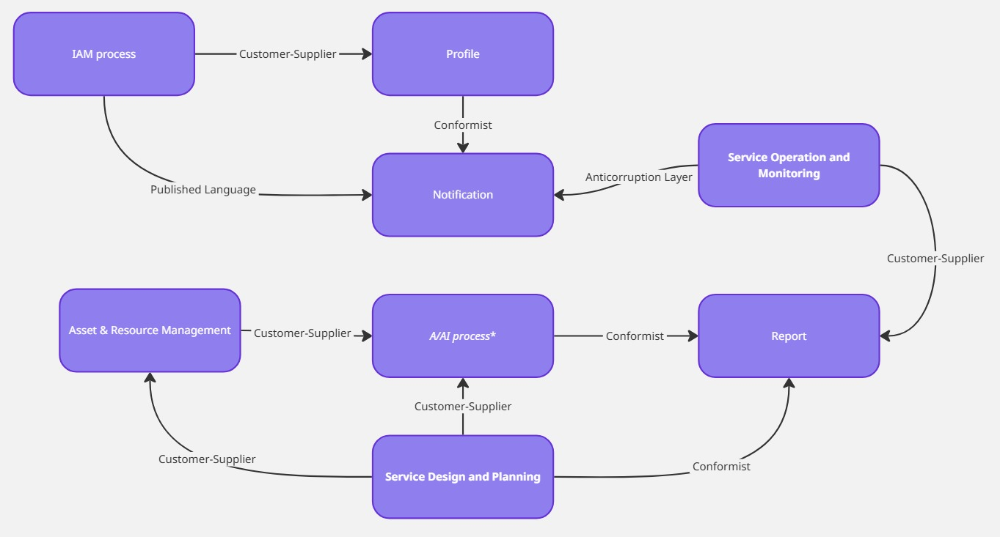

## 4.3.	Software Architecture

La visión general de la arquitectura describe la estructura fundamental de un sistema, abarcando sus componentes principales y la interacción entre ellos. En el contexto de desarrollo de aplicaciones móviles, una arquitectura sólida es esencial para garantizar que la aplicación sea escalable, segura y eficiente. Este enfoque permite una implementación ordenada, donde cada parte del sistema tiene una responsabilidad clara, y facilita la integración de nuevas funcionalidades o la modificación de las existentes sin afectar la estabilidad general de la plataforma (Richards & Ford, 2021).

El diseño arquitectónico de Mushroom se basa en una arquitectura modular, donde cada componente del sistema está desacoplado, permitiendo un desarrollo y mantenimiento más flexible. Además, se integra con servicios externos de autenticación, bases de datos en la nube, y plataformas de análisis, asegurando que la aplicación pueda manejar grandes volúmenes de datos de manera eficiente y con una alta disponibilidad.

La arquitectura también contempla la seguridad como un aspecto central, con la implementación de técnicas de cifrado para proteger los datos sensibles del usuario y garantizar que las comunicaciones dentro de la aplicación sean seguras. Además, se diseña para ser compatible con diversas plataformas móviles, adaptándose a las especificaciones de iOS y Android, lo que facilita una experiencia de usuario consistente y de alta calidad en ambos entornos.

De acuerdo con Brown (2023), el modelo C4 para la diagramación y esquematización de la arquitectura de software ofrece un enfoque estructurado y escalable que facilita la descripción clara de sus secciones y componentes. Al dividir la arquitectura en cuatro niveles, Contexto, Contenedores, Componentes y Código, permite una comprensión más accesible tanto para técnicos como para partes interesadas sin experiencia técnica. Esta estructura promueve una comunicación más fluida y efectiva entre los equipos de desarrollo y las partes involucradas, optimizando el proceso colaborativo y resultando en un desarrollo más eficiente y en una arquitectura de software más robusta y mantenible.

### 4.3.1.	Software Architecture System Landscape Diagram

El diagrama de landscape o paisaje del sistema corresponde al nivel organizacional del modelo C4 y ofrece una visión integral de todos los sistemas de software relevantes y sus interacciones dentro de un entorno empresarial o tecnológico más amplio. Este tipo de visualización resulta clave para comprender arquitecturas distribuidas, ya que permite mapear tanto sistemas internos como externos, así como los flujos de información que los conectan (Brown, 2023).

###### Figura 39

*System Landscape Diagram completo de Mushroom*

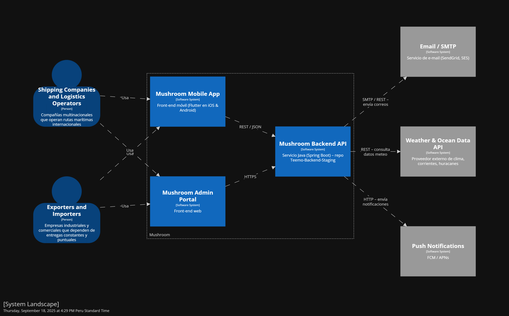

### 4.3.2.	Software Architecture Context Level Diagrams

El diagrama de contexto, como nivel más alto de abstracción del modelo C4, ofrece una visión global del sistema de Mushroom y su entorno externo, mostrando las interacciones de alto nivel con actores y servicios externos. Esta representación clarifica cómo la plataforma se vincula con usuarios, sistemas externos y otros subsistemas independientes que se pueda requerir, estableciendo los límites de responsabilidad de Mushroom (Brown, 2023).

###### Figura 40

*Context Level Diagram completo de Mushroom*

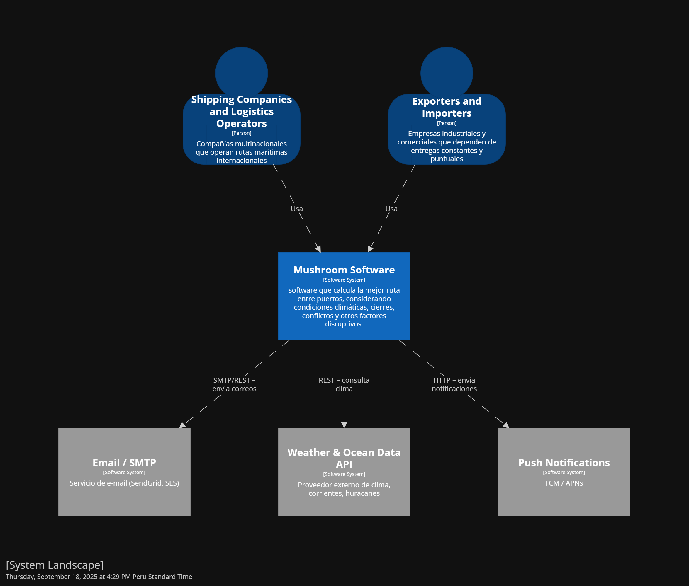

### 4.3.3.	Software Architecture Container Level Diagrams

El diagrama de contenedores, ubicado en un nivel intermedio del modelo C4, ofrece una visión detallada de la arquitectura interna de Mushroom, identificando los principales contenedores (aplicaciones cliente, servicios backend, bases de datos) y sus protocolos de comunicación. Esta representación facilita la comprensión de cómo cada pieza colabora para cumplir con los casos de uso del sistema, permitiendo al equipo técnico y a los stakeholders visualizar claramente responsabilidades, flujos de datos y tecnologías empleadas (Brown, 2023).

###### Figura 41

*Container Level Diagram completo de Mushroom*

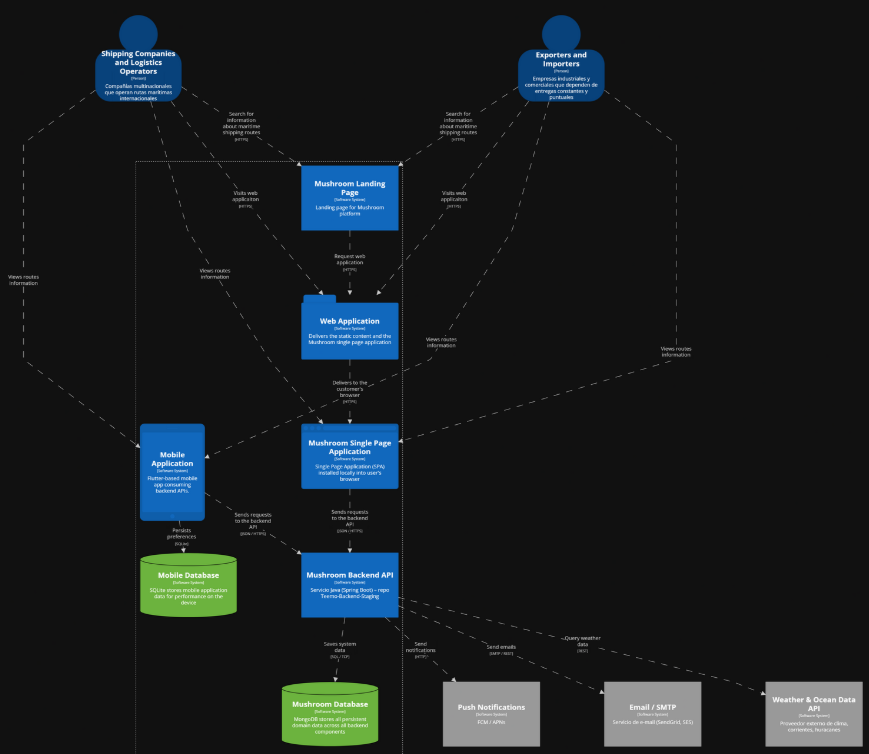

### 4.3.4.	Software Architecture Components Level Diagrams

El diagrama de componentes corresponde al siguiente nivel de detalle dentro del modelo C4 y descompone cada contenedor identificado en el diagrama de contenedores en sus componentes internos: módulos, servicios, librerías y adaptadores con responsabilidades bien definidas. Esta vista permite mostrar cómo se organizan las piezas dentro de un mismo contenedor, qué interfaces públicas exponen, qué dependencias internas tienen y qué tecnologías o protocolos emplean para comunicarse entre sí y con otros contenedores. Para Mushroom, el diagrama de componentes facilita a arquitectos y desarrolladores comprender la localización de la lógica de negocio, los puntos de integración (por ejemplo, handlers de comandos, query services, repositorios, adaptadores a feeds externos), las fronteras de transacción y los puntos críticos de rendimiento y resiliencia. Además, ofrece trazabilidad directa con las capas de aplicación y dominio, apoya la asignación de responsables por componente y orienta pruebas de integración y estrategias de despliegue. Finalmente, al documentar contratos, eventos de dominio y modelos de lectura asociados a cada componente, esta representación favorece decisiones de refactorización, escalado y observabilidad con un nivel de precisión útil para la implementación y mantenimiento (Brown, 2023).

###### Figura 42

*Components Level Diagram completo de Mushroom*

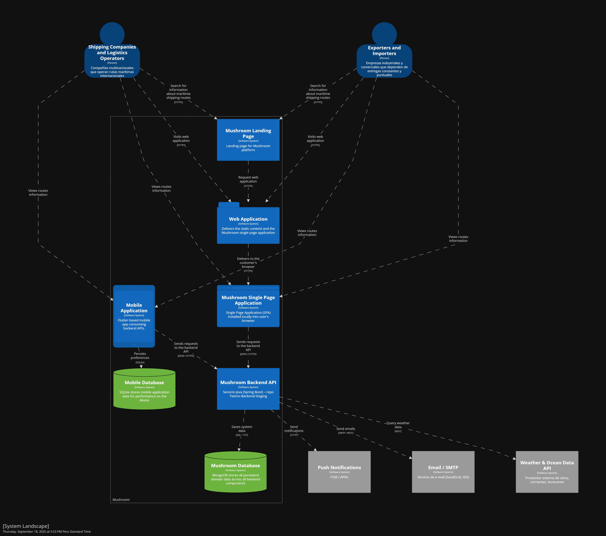

### 4.3.5.	Software Architecture Deployment Diagrams

El diagrama de despliegue muestra la distribución física de los contenedores de software sobre la infraestructura tecnológica, detallando nodos (servidores, gateways) y las conexiones de red que los interconectan. Este nivel del modelo C4 permite visualizar dónde se ejecuta cada componente, desde el backend y las bases de datos hasta la aplicación embebida y edge, así como los protocolos de comunicación, volúmenes de tráfico y requisitos de seguridad y redundancia (Brown, 2023).

###### Figura 43

*Deployment Diagram completo de Mushroom*

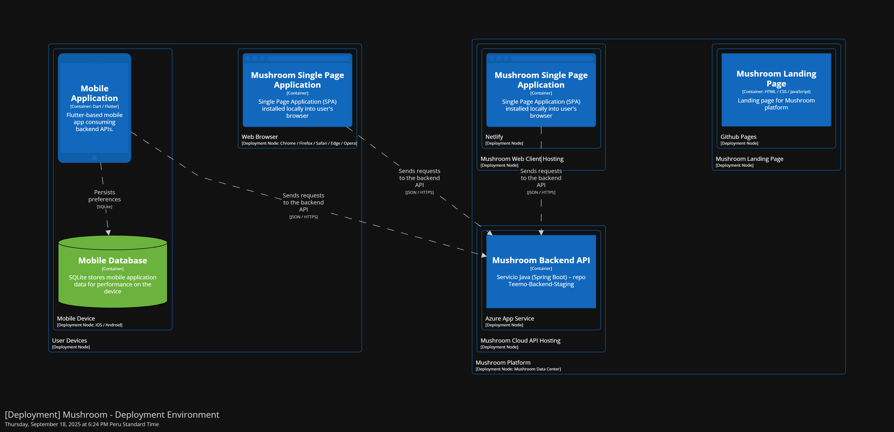

### 4.3.6. Entity-Relation Diagrams

El Diagrama Entidad-Relación Unificado del Sistema Teemo representa la integración de los siete bounded contexts que conforman la arquitectura del proyecto: IAM, Profiles and Preferences, Assets & Resource Management, A* / AI Process, Service Design & Planning, Notifications y Service Operation & Monitoring. Este modelo consolida las entidades principales, sus relaciones y restricciones clave, reflejando la estructura lógica del dominio. Su propósito es proporcionar una visión completa del ecosistema de datos, permitiendo comprender cómo interactúan los módulos de autenticación, perfiles de usuario, gestión de puertos y rutas, evaluación de servicios, notificaciones y monitoreo operacional dentro de una misma plataforma.

###### Figura 44

*Diagrama de Entidad-Relación de Mushroom*

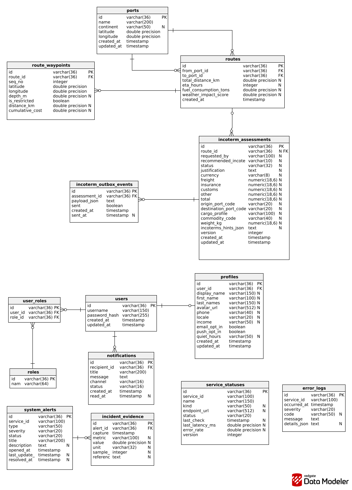

