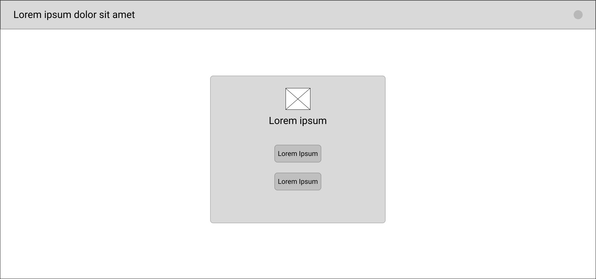
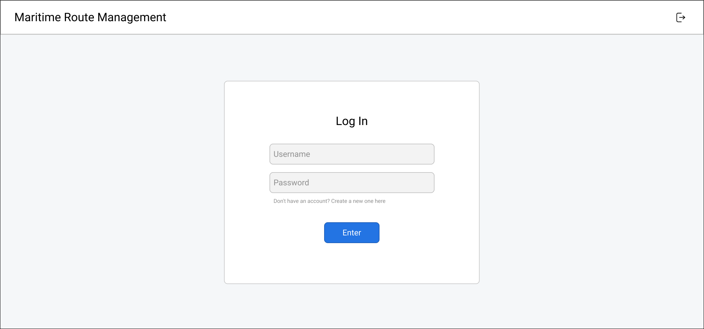
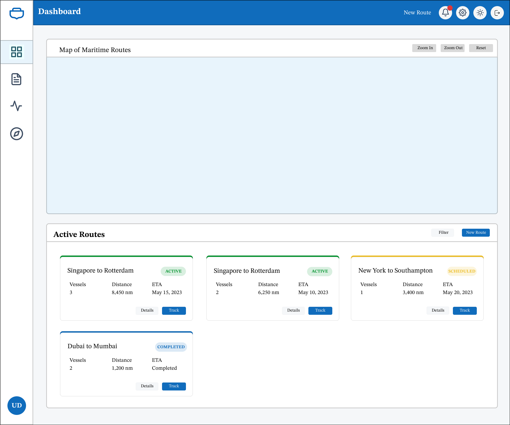
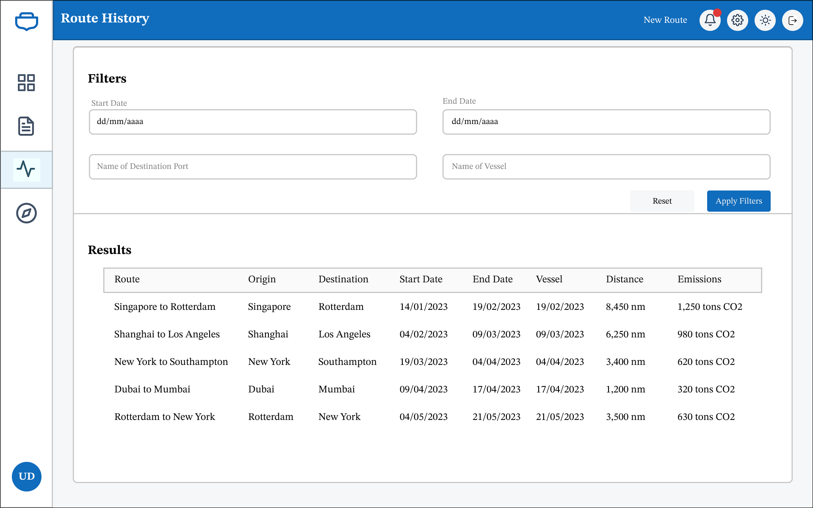
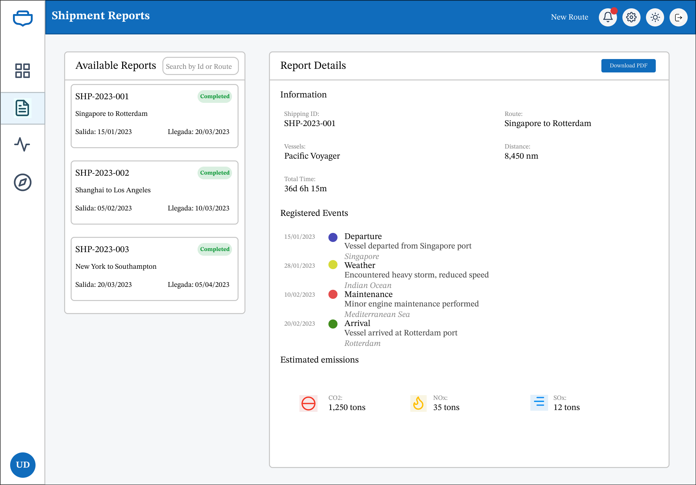
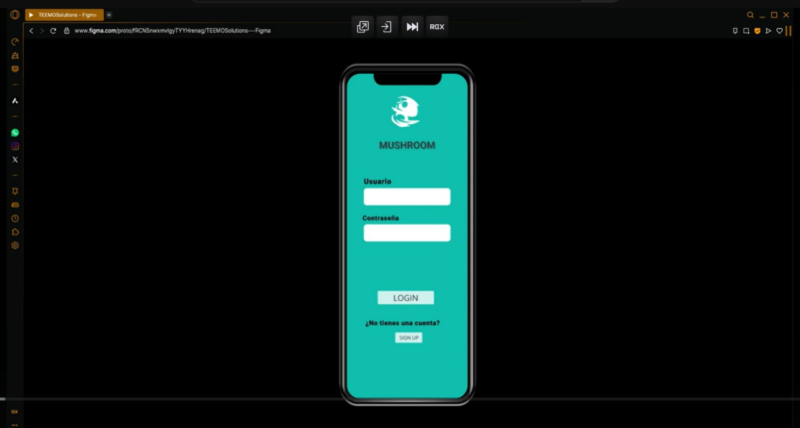
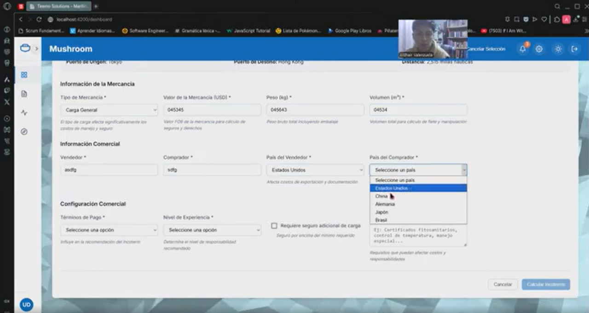

# **Capítulo VI: Solution UX Design**

En esta sección se presenta la propuesta integral de Diseño UX/UI destinada a optimizar la experiencia de los usuarios en todos los productos digitales que componen la solución. Se adoptará un enfoque centrado en las personas, partiendo del análisis detallado de los User Stories previamente identificados y del Impact Map, con el objetivo de garantizar que cada interacción responda de manera intuitiva y eficiente a las necesidades reales de nuestros usuarios. A través de una metodología basada en principios de usabilidad, accesibilidad y consistencia visual, se delinearán los lineamientos de navegación, estructura de contenidos y estilo gráfico que regirán tanto la interfaz de usuario como los flujos de interacción. De este modo, se busca no solo mejorar la satisfacción y el compromiso de los usuarios, sino también facilitar la consecución de los objetivos de negocio, asegurando una experiencia coherente, atractiva y alineada con la visión estratégica del proyecto.

### 6.1.	Style Guidelines
El Diseño de Producto representa un proceso integral y multidisciplinario que abarca desde la concepción inicial hasta la implementación y comercialización de una solución, combinando principios de ingeniería, diseño centrado en el usuario y estrategia de negocio. Su finalidad es desarrollar productos que no solo sean técnicamente robustos y comercialmente sostenibles, sino también profundamente alineados con las expectativas, hábitos y contextos reales de los usuarios. Este enfoque comienza con un análisis detallado de los problemas, motivaciones y puntos críticos en la experiencia del usuario, y avanza hacia la formulación de soluciones que equilibren funcionalidad, estética, viabilidad técnica y valor percibido. Se diseñan arquitecturas lógicas que conectan requerimientos funcionales con patrones de uso reales, definiendo experiencias intuitivas y eficientes.

En el ámbito digital, esto implica el desarrollo sistemático de la arquitectura de la información, la definición de flujos de interacción optimizados (UX), y la construcción de interfaces gráficas coherentes (UI), considerando principios como accesibilidad, consistencia visual, carga cognitiva y rendimiento del sistema. Según Zeldman (2024), esta integración no solo mejora la navegabilidad y la eficiencia en el consumo de recursos, sino que también garantiza productos escalables, sostenibles y preparados para adaptarse a entornos cambiantes y ciclos de mejora continua.

#### 6.1.1.	General Style Guidelines
**Branding:** El branding del logo de nuestra plataforma “Mushroom” es una combinación de elementos que transmiten una imagen sólida y confiable. Nos enfocamos en la confianza de nuestro clientes al momento de tomar un servicio prestado. El nombre “Mushroom” se presenta en una tipografía elegante y profesional, mientras que la paleta de colores crea un contraste visual claro y transmite una sensación de miminalismo y profesionalismo. En resumen, este logo tiene un enfoque clásico y profesional, y podría ser un elemento distintivo en nuestro sitio web.

**Typography:** Al seleccionar la tipografía para nuestro proyecto, hemos optado por utilizar Roboto siguiendo las pautas de estilo general. Ya que ofrece una combinación única de legibilidad, versatilidad y modernidad que se alinea perfectamente con la identidad visual y los objetivos de Mushroom. Su diseño limpio y contemporáneo proporciona una excelente lectura en una amplia gama de dispositivos, lo que garantiza una experiencia de usuario óptima para nuestros clientes, que incluyen tanto agencias de embarcaciones navieras como exportadores e importadores de alta rotacion.

**Colors:** Hemos escogido una paleta basada en colores suaves y elegantes, algo fríos para dar sensación de premium . De tal modo, estos generan un ambiente profesional y acogedor para el usuario final.
Los tonos más claros pueden ser utilizados para fondos o elementos de diseño amplios, mientras que los colores más oscuros serán para textos o detalles más específicos asegurando legibilidad y contraste entre ellos.

#### 6.1.2.	Web, Mobile & Devices Style Guidelines.
- Web Style Guidelines
Para el Web Style Guidelines del sitio web "Mushroom" se utilizó con mayor presencia los colores pasteles en base a una paleta de colores que genere confianza y un ambiente acogedor para el usuario. El logo genera presencia por la combinación de elementos que transmiten una imagen sólida y confiable. A su vez, se ideó un estilo minimalista en el desarrollo del Landing Page para que el usuario tenga la facilidad de navegar y pueda observar las secciones con mayor orden. El tipo de Roboto combina con los colores anteriormente seleccionados, ya que brinda mayor flexibilidad y versatilidad. Para el desarrollo de los mockups y wireframes se utilizó en base a desarrollo web para pantallas de escritorio.

- Mobile Style Guidelines
El diseño móvil debe mantener la identidad visual y la experiencia de usuario definidas en la guía de marca. La prioridad en plataformas móviles es la legibilidad, accesibilidad y rendimiento, garantizando una experiencia coherente tanto en iOS como en Android.

Los principios clave incluyen:

- Uso predominante de Roboto en todas las pantallas para una lectura limpia y moderna.

- Aplicación estratégica de la paleta de colores:

  - #10BEAE para elementos interactivos y destacados.

  -  #FFFFFF como fondo principal para asegurar limpieza y claridad.

  -  #000000 para textos principales y detalles de alto contraste.

- Espaciados amplios y márgenes consistentes para facilitar la navegación táctil.

- Iconografía clara y minimalista, preferentemente en línea con los colores definidos

- IOS Mobile Style Guidelines
En iOS se deben seguir los principios de Apple Human Interface Guidelines adaptados a la marca:

- **Tipografía:** Roboto Regular para cuerpo de texto, Roboto Medium para encabezados.

- **Tamaño de fuente recomendado:**

  - Título: 24 pt

  - Subtítulo: 18 pt

  - Cuerpo: 14-16 pt

- **Colores:**

  - Botones primarios: fondo #10BEAE con texto #FFFFFF.

  - Fondo general: #FFFFFF.

  - Textos: principalmente #000000.

- **Espaciado táctil:**  mínimo de 44x44 pt por elemento interactivo.

- **Esquinas redondeadas:** usar bordes suaves (4-8 pt) para botones y tarjetas, manteniendo la estética moderna.

- **Navegación intuitiva** con barras inferiores o pestañas según jerarquía de contenido.

- Android Mobile Guidelines
En Android se deben seguir las Material Design Guidelines personalizadas con el estilo propuesto por la empresa:

- **Tipografía:** Roboto Regular para cuerpo de texto, Roboto Medium para encabezados.

- **Tamaño de fuente recomendado:**

  - Título: 22-24 sp

  - Subtítulo: 16-18 sp

  - Cuerpo: 14-16 sp

- **Colores:**

  - Botones primarios: fondo #10BEAE con texto #FFFFFF.

  - Fondo general: #FFFFFF.

  - Textos: principalmente #000000.

- **Espaciado táctil:**  mínimo de 44x44 pt por elemento interactivo.

- **Elevaciones y sombras:** utilizar sombras sutiles para elementos flotantes como botones de acción (FAB).

- **Esquinas redondeadas:** usar bordes suaves (4-8 pt) para botones y tarjetas, manteniendo la estética moderna.

- **Navegación intuitiva** con barras inferiores o pestañas según jerarquía de contenido.

- **Seguir patrones de navegación** como Drawer, Bottom Navigation o Tabs dependiendo de la complejidad de la app.

### 6.2.	Information Architecture.
#### 6.2.2.	Labeling Systems.
En la Landing Page, se hace uso de etiquetas que son cortas e indican con claridad al usuario la sección que van a ingresar para ver la información. Siendo las siguientes etiquetas:
- Home: Esta etiqueta indica la sección inicial donde está la información introductoria de la plataforma web.
- About: Esta etiqueta indica la sección donde se habla sobre quienes somos, nuestra misión, introducción a las suscripciones y miembros que conforman el startup.
- Subscriptions: Esta etiqueta indica la sección donde se muestra los planes disponibles para el uso de la plataforma web y sus beneficios.
- Customers: Esta etiqueta indica la sección donde se muestra los testimonios que iran haciendo los usuarios con respecto a nuestra aplicación.
- Contact: Esta etiqueta indica la sección donde se informará las maneras en las que nos pueden contactar para el feedback o por el plan Enterprise.
- Log In: Esta etiqueta indica la opción que permitirá a los usuarios ingresar a nuestra plataforma.

#### 6.2.3.	Searching Systems.
En esta parte, se indicarán los sistemas de búsqueda que se implementaran en la Landing Page, Web Applications y Mobile.

Landing Page:
- Para la búsqueda en esta sección, se utilizan las etiquetas y los sistemas de navegación que permiten la búsqueda de la información que requieren los posibles usuarios para la explicación de la misma. Esto mostrando un texto que redirige a la sección seleccionada facilitando la búsqueda.

Web Applications:
- Para la búsqueda en esta sección, se utilizan:
    - Las etiquetas y los sistemas de navegacion para la busqueda de la sección con la información que necesitan o la característica que necesitan utilizar accediendo a ellos mediante los textos.
    - La búsqueda de rutas utiliza el algoritmo de búsqueda A* para encontrar las rutas más cortas de recorrer en el medio marítimo. Esto se reflejará al momento de utilizar la búsqueda de rutas y mostrar los posibles caminos a recorrer.
    - El historial de rutas utilizadas en la aplicación permitirá llevar un registro de los recorridos que se pueden volver a utilizar. En esta sección, se puede realizar una búsqueda por fechas.

#### 6.2.4.	SEO Tags and Meta Tags.
Para la búsqueda eficiente de nuestra plataforma en los buscadores web se emplearon las siguientes tags:
- Title: Mushroom
- Meta Tags:
    - Description: Plataforma de optimización de rutas marítimas mediante tecnología inteligente.
    - Keywords: rutas marítimas, transporte de carga maritima, viajes maritimos, contenedores en embarcaciones de carga
    - Author: TEEMO-SOLUTIONS

#### 6.2.5.	Navigation Systems.
En esta parte, se indicará los sistemas de navegación que se utilizaron para la búsqueda rápida de las secciones que son de interés para los usuarios para el la landing page y la aplicación web.

Landing Page:
- Home: En esta sección, se lleva al usuario a la presentación de Mushroom.
- About: En esta sección, se lleva al usuario a la presentación del equipo, nuestra misión y una explicación breve de las suscripciones.
- Subscriptions: En esta sección, se lleva al usuario a los planes disponibles para el uso de la aplicación web.
- Customers: En esta sección, se lleva al usuario a los testimonios de usuarios que utilizaron la aplicación web.
- Contact: En esta sección, se lleva al usuario a las maneras en que puede contactarnos.
- Log In: Este botón cumple la función de ser un Call to Action que redirige a la aplicación web.

### 6.3.	Landing Page UI Design.
El desarrollo del UI Design de la Landing Page está en el siguiente link: https://www.figma.com/design/fRCN5nwxmvlgyTYYHrenag/TEEMOSolutions---Figma?node-id=0-1&p=f&t=xftwdiVWdTtj2j2G-0

#### 6.3.1.	Landing Page Wireframe.

#### 6.3.2.	Landing Page Mock-up.

### 6.4.	Applications UX/UI Design.
#### 6.4.1.	Applications Wireframes.
- Mobile Applications Wireframes

- **El login y registro de usuarios:**

- **Todas los servicios que ofrece nuestra aplicacion:**

- **Todos los testimonios de otros usuarios:**

- **Seccion de contacto para con los administradores de la aplicacion:**

- Web Applications Wireframes

#### 6.4.2.	Applications Wireflow Diagrams.
- Mobile Applications Wireflow Diagrams

- **Usuario que desea saber en tiempo real cual será la mejor ruta para el viaje que desea hacer**

- **Usuario que desea saber algunas predicciones a posibles contratiempos que pueda sufrir la embarcacion:**
    

- **Usuario que desea recibir notificaciones o alertas de tormenta o problemas con el clima:**

- **Usuario que desea saber el costo posible del viaje para optimizar la ruta en base a costos:**

- **Usuario que ademas de la ruta principal desea una ruta alternativa para poder saber cual es el mejor planteamiento de ruta:**

- **Usuario que desea saber datos estadisticos de sus viajes:**

- Web Applications Wireflow Diagrams

- Inicio de sesión: El usuario debe ingresar a la plataforma, en esa sección se le muestra la opción de inicio de sesión y registrarse, al iniciar sesión ingresa a la plataforma.

#### 6.4.2.	Applications Mock-ups.
- Mobile Applications Mock-ups

- **El login y registro de usuarios:**

- **Todas los servicios que ofrece nuestra aplicacion:**

- **Todos los testimonios de otros usuarios:**

- **Seccion de contacto para con los administradores de la aplicacion:**

- Web Applications Mock-ups

#### 6.4.3.	Applications User Flow Diagrams.
- Mobile Applications User Flow Diagrams

- **User Flow Goal 1:** Como capitán, quiero que el sistema sugiera automáticamente la ruta más corta y segura según el algoritmo, para llegar eficientemente al puerto destino.

- **User Flow Goal 2:** Como capitán, quiero recibir alertas si una ruta se vuelve no viable, para evitar zonas bloqueadas o peligrosas.

- **User Flow Goal 3:** Como capitán, quiero que el sistema recalcule la ruta si hay cambios inesperados durante la navegación.

- **User Flow Goal 4:** Como capitán, quiero que se guarden los datos del viaje realizado, para poder revisarlos o reportarlos al finalizar.

- **User Flow Goal 5:** Como empresario, quiero ver un historial de rutas utilizadas en envíos pasados, para poder tomar decisiones basadas en evidencia. 

- Web Applications User Flow Diagrams
- Inicio de sesión: El usuario debe ingresar a la plataforma, en esa sección se le muestra la opción de inicio de sesión y registrarse, al iniciar sesión ingresa a la plataforma.

### 6.5.	Applications Prototyping.

- Mobile Applications Prototyping

https://www.figma.com/proto/fRCN5nwxmvlgyTYYHrenag/TEEMOSolutions---Figma?node-id=180-2173&p=f&t=gTWw4q4ijvLKKjSU-1&scaling=min-zoom&content-scaling=fixed&page-id=0%3A1&starting-point-node-id=206%3A40 

- Web Applications Prototyping

https://www.figma.com/proto/fRCN5nwxmvlgyTYYHrenag/TEEMOSolutions---Figma?node-id=180-2173&p=f&t=gTWw4q4ijvLKKjSU-1&scaling=min-zoom&content-scaling=fixed&page-id=0%3A1&starting-point-node-id=206%3A40 

