

# **CAPÍTULO VI: PRODUCT VERIFICATION & VALIDATION**

## 6.1. Testing Suites & Validation
### 6.1.1. Core Entities Unit Tests

Los Core Entities Unit Tests son esenciales en el desarrollo de software, ya que garantizan la calidad y correcto funcionamiento de las entidades centrales, previniendo errores y facilitando el mantenimiento del código.

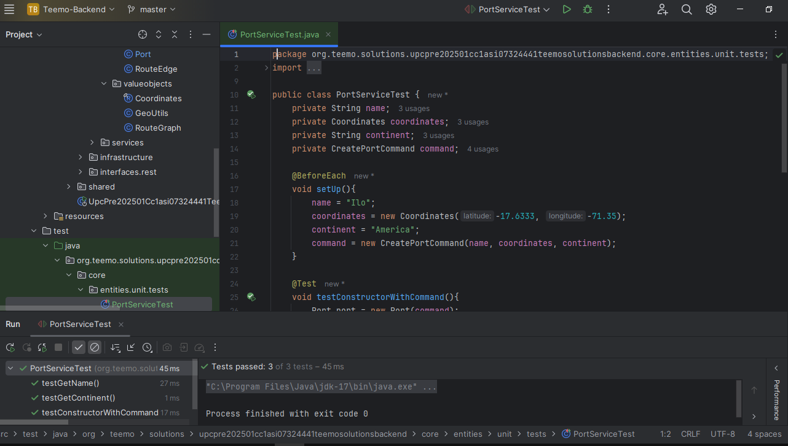

### 6.1.2. Core Integration Tests

Las pruebas de integración central (Core Integration Tests) son esenciales para verificar que los controladores se comuniquen de forma adecuada con otros elementos del sistema, como los servicios y las bases de datos. Al analizar situaciones de error, estas pruebas aseguran que el sistema responda correctamente ante eventos imprevistos, utilizando los códigos de estado apropiados. Esto no solo optimiza la experiencia del usuario, sino que también simplifica la depuración y favorece la creación de un software robusto y de calidad.

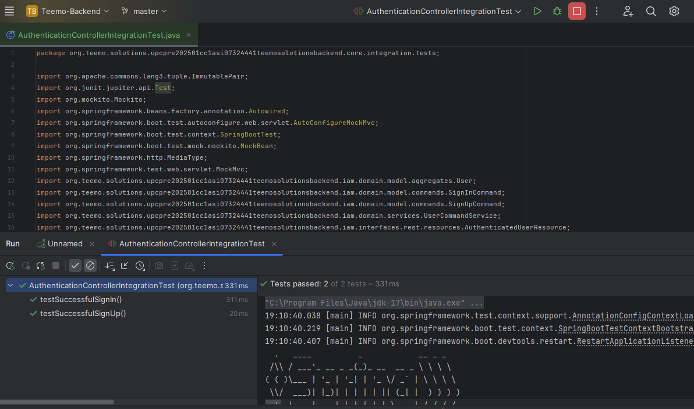

### 6.1.3. Core Behavior-Driven Development

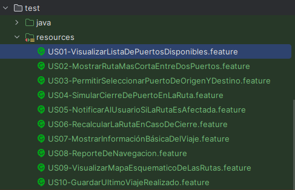

### 6.1.4. Core System Tests

US01

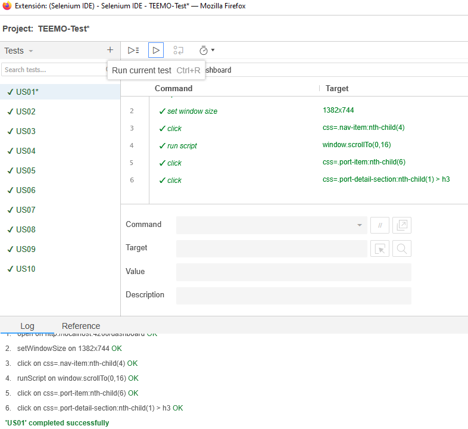

US02

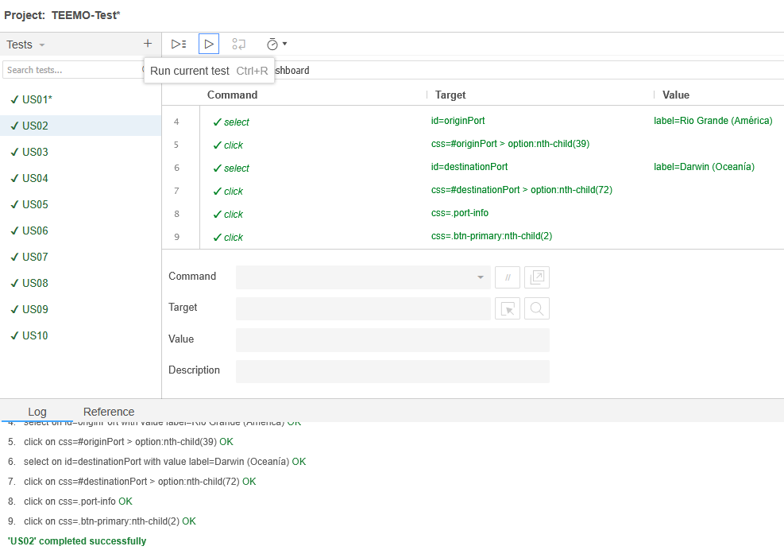

US03

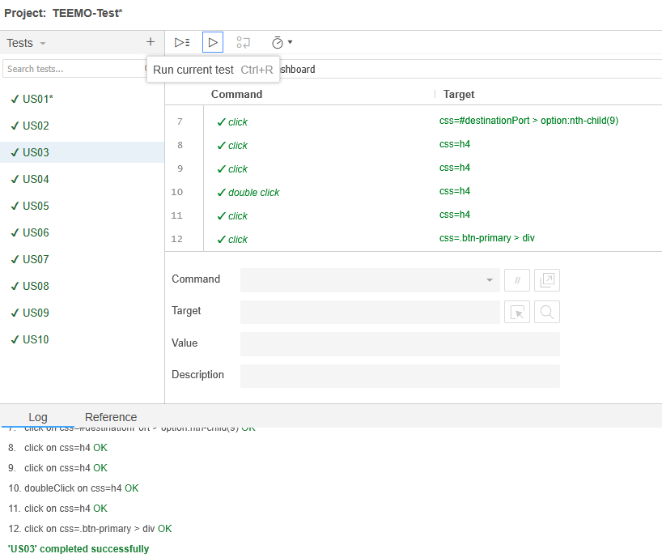

US04

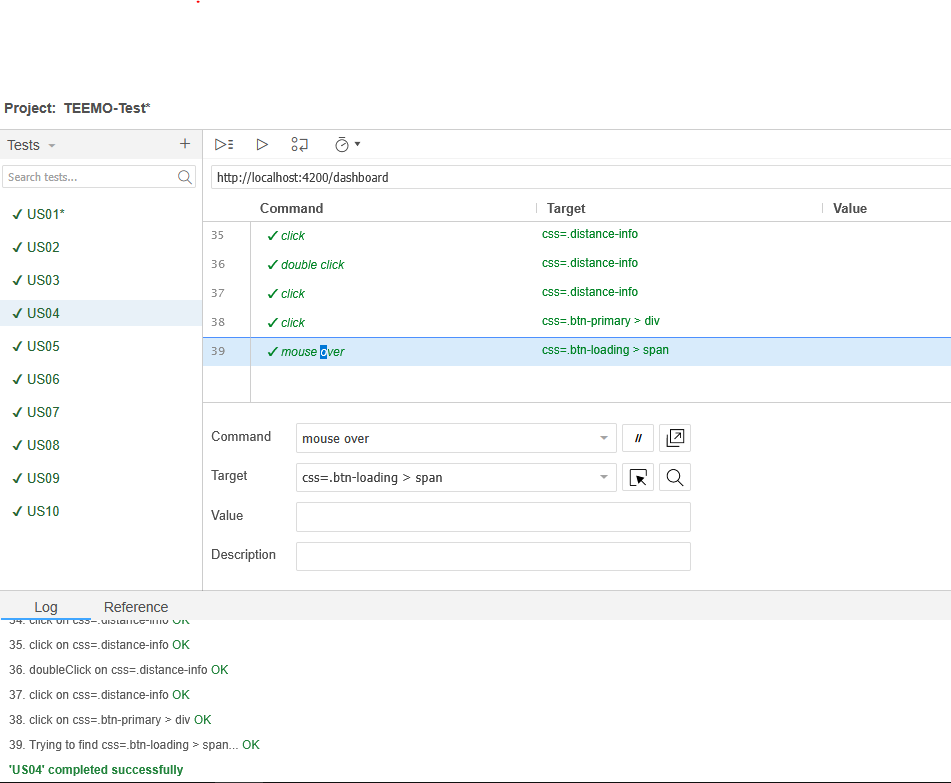

US05

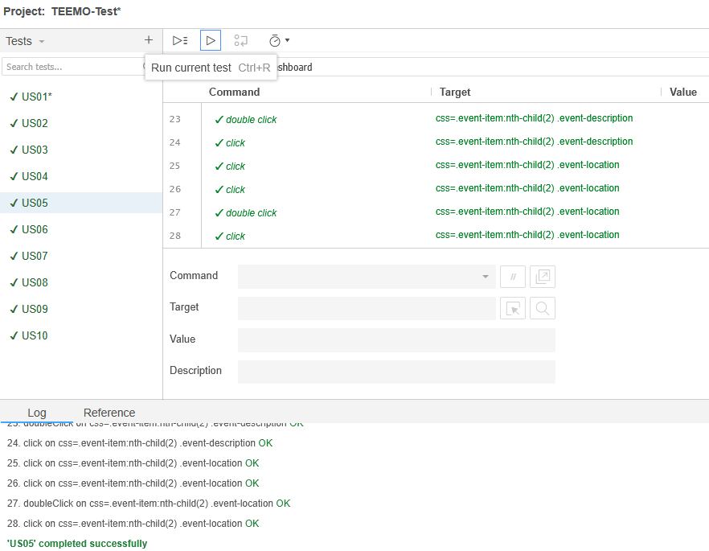

US06

US07

US08

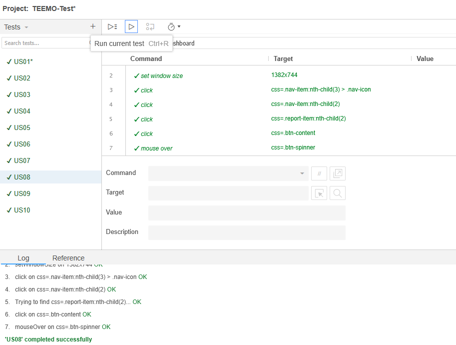

US09

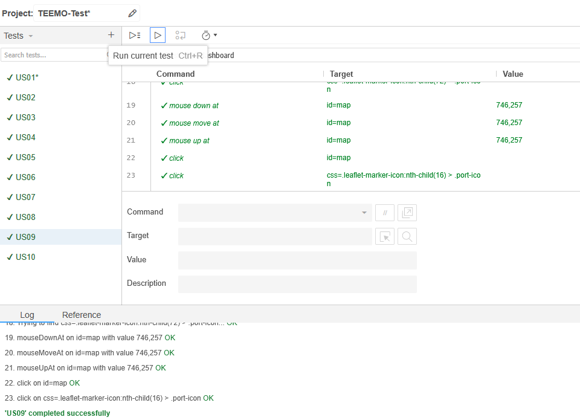

US10

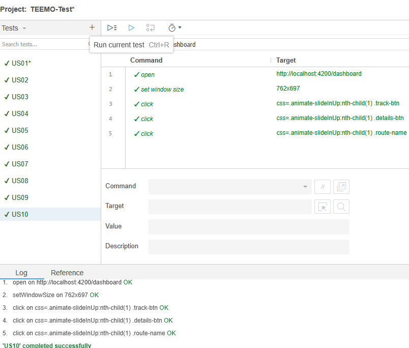

## 6.2. Static Testing & Verification
### 6.2.1. Static Code Analysis
Esta sección aborda las técnicas de prueba y verificación estática del código, con el objetivo de garantizar que el software cumpla con los criterios de calidad y seguridad antes de su ejecución. Estos métodos permiten detectar fallos desde las primeras etapas del ciclo de desarrollo.

El análisis estático consiste en examinar el código fuente sin necesidad de ejecutarlo, mediante herramientas automáticas y revisiones manuales. Este procedimiento facilita la identificación de errores, vulnerabilidades de seguridad y áreas de mejora, lo que favorece una mayor calidad del software y disminuye los costos asociados a correcciones en fases más avanzadas del proyecto.

#### 6.2.1.1. Coding Standard & Code Conventions
En el desarrollo de software moderno, mantener un código claro, coherente y alineado con los objetivos del negocio es esencial para asegurar la escalabilidad, la mantenibilidad y la colaboración efectiva entre equipos. Para lograrlo, es indispensable adoptar buenas prácticas de codificación que garanticen tanto la calidad técnica como la comprensión funcional del sistema. Dos enfoques fundamentales que contribuyen a este propósito son Clean Code y Domain-Driven Design (DDD).

- **Clean Code:**

El concepto de Clean Code se basa en escribir código que sea fácil de leer, entender y modificar. Esto implica utilizar nombres claros y significativos para variables, funciones y clases, escribir funciones cortas que cumplan con una única responsabilidad, y eliminar el código muerto y los comentarios innecesarios. Un código limpio no solo facilita el mantenimiento, sino que también mejora la colaboración entre desarrolladores, reduce la probabilidad de errores y acelera los procesos de revisión y depuración.

- **Domain-Driven Design (DDD):**

Domain-Driven Design es un enfoque centrado en modelar el software según el dominio del negocio. Para ello, se recomienda el uso de un lenguaje ubicuo que refleje con precisión los términos y conceptos del negocio en el código. El sistema debe dividirse en bounded contexts, lo que permite separar claramente diferentes áreas funcionales y evitar ambigüedades. Dentro de cada contexto, se utilizan entidades y objetos de valor de forma adecuada para representar los conceptos clave del dominio. Además, la lógica del negocio se organiza mediante servicios de dominio y repositorios, promoviendo una arquitectura más estructurada, comprensible y alineada con las necesidades reales del negocio.

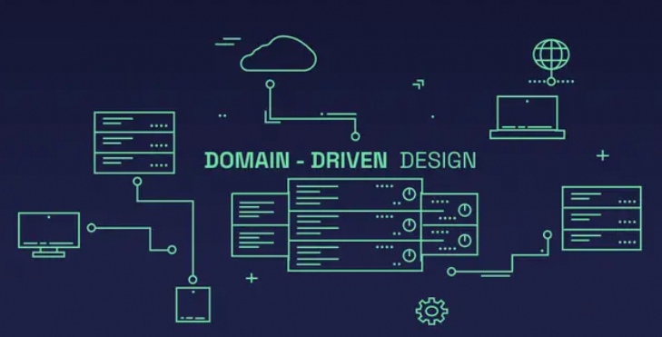

#### 6.2.1.2. Code Quality & Code Security
La calidad del código y la seguridad son pilares fundamentales para garantizar el desarrollo de software confiable y sostenible.

- **Calidad del Código:**
La evaluación de la calidad del código debe apoyarse en métricas objetivas como la cobertura de pruebas y la complejidad ciclomática. Para ello, es recomendable emplear herramientas como SonarQube, que permite realizar un monitoreo continuo de la calidad del código. Esta herramienta proporciona un análisis detallado, identifica defectos potenciales y ofrece sugerencias para optimizar el rendimiento y la mantenibilidad del software, asegurando el cumplimiento de los estándares definidos.

- **Seguridad del Código:**
La protección del sistema requiere detectar y prevenir vulnerabilidades comunes, como inyecciones SQL y cross-site scripting (XSS), mediante revisiones constantes del código fuente. Aplicar prácticas de codificación segura y validar correctamente las entradas del usuario son medidas clave para minimizar riesgos y fortalecer la integridad del software.

- **Herramienta de Apoyo – SonarLint:**
Para reforzar el enfoque en calidad y seguridad, se recomienda el uso de SonarLint, una herramienta que realiza análisis de código en tiempo real dentro del entorno de desarrollo. SonarLint se integra con IDEs populares como IntelliJ IDEA, Eclipse y Visual Studio, ayudando a los desarrolladores a detectar errores y vulnerabilidades mientras programan. Ofrece recomendaciones inmediatas, promoviendo una cultura de mejora continua desde las primeras etapas del desarrollo y evitando que los problemas lleguen a fases críticas como revisión o pruebas.

### 6.2.2. Reviews
Las revisiones de código representan una práctica esencial para asegurar tanto la calidad como la alineación del software con las normas definidas. Este proceso debe combinar revisiones manuales y automáticas, siguiendo una serie de lineamientos bien establecidos.

- **Tipos de Revisiones:**
  - Revisión por Pares: Un desarrollador examina el código de otro para verificar su claridad, funcionalidad y cumplimiento de los estándares del equipo.
  - Revisión Formal: Se realiza en un entorno más estructurado, a través de reuniones donde se analiza el código utilizando listas de verificación detalladas, lo que permite una evaluación grupal más rigurosa.
  - Revisión Automatizada: Herramientas como SonarLint y SonarQube se emplean para detectar fallos de calidad y errores en tiempo real, facilitando una revisión técnica continua.
 

- **Proceso de Revisión:**
  - Generación de Pull Requests: Los desarrolladores deben presentar sus cambios mediante un PR, describiendo de forma clara qué se modificó y qué pruebas se realizaron.
  - Lista de Verificación: Es indispensable utilizar un checklist que incluya criterios como legibilidad del código, cobertura de pruebas y tratamiento de errores.
  - Retroalimentación y Comentarios: Los revisores deben brindar observaciones precisas y útiles. Los problemas identificados deben ser resueltos antes de dar paso a la integración.
  - Validación del PR: Toda solicitud de incorporación de código debe ser aprobada por al menos un revisor antes de ser fusionada con la rama principal.
 

- **Criterios de Aceptación:**

  - Calidad y Seguridad: El código debe respetar los estándares definidos y no introducir riesgos de seguridad.
  - Cobertura de Pruebas: Se debe cumplir con una cobertura mínima de pruebas automatizadas (por ejemplo, al menos un 80%) para garantizar la confiabilidad del nuevo código.
 

- **Frecuencia de Revisión:**
  - Las revisiones deben llevarse a cabo de manera periódica, idealmente al final de cada sprint o en ciclos definidos, para evitar acumulaciones de código sin revisar y preservar la calidad del proyecto en el tiempo.

## 6.3. Validation Interviews
### 6.3.1. Diseño de Entrevistas

A continuación, se presentan las preguntas que se aplicarán durante las entrevistas de validación con el objetivo de evaluar la usabilidad de la aplicación. Estas interrogantes están orientadas a explorar principios clave de usabilidad y a recopilar información significativa sobre la experiencia del usuario.

1. ¿La aplicación te comunica claramente lo que está ocurriendo mientras la utilizas?
2. ¿Percibes de forma clara el avance de las acciones que realizas, como cargar información o enviar formularios?
3. ¿El lenguaje utilizado en la aplicación (palabras, frases, etiquetas) te resulta comprensible y natural?
4. ¿Has tenido problemas al intentar retroceder a una pantalla anterior o al cancelar una operación?
5. ¿Detectaste diferencias o incoherencias en el lenguaje, diseño o flujo de interacción a lo largo de la app?
6. ¿Hay elementos visuales o funciones que te generen confusión o no se comporten como esperabas?
7. ¿Te encontraste con fallos o errores durante el uso de la aplicación? ¿Podrías describir qué tipo fueron?
8. ¿Qué tipo de mensajes de advertencia o ayudas consideras útiles para prevenir errores al interactuar con la app?
9. ¿Puedes ubicar fácilmente las funciones de la aplicación sin necesidad de memorizar dónde están?
10. ¿Consideras que el diseño de la aplicación es organizado, simple y libre de elementos innecesarios?

Estas preguntas permitirán obtener una evaluación detallada sobre la experiencia de uso y señalar posibles oportunidades de mejora. Es importante fomentar un ambiente de confianza durante las entrevistas, donde los participantes se sientan cómodos para expresar sus opiniones y sugerencias con libertad.
### 6.3.2. Registro de Entrevistas

**Segmento 1: Empresas Navieras y Operadoras Logísticas Globales**

#### Entrevista 1:

**Nombre y Apellido:** Patricia Salas

**Edad:** 45 años

**Distrito:** Callao

**Screenshot de la Entrevista:** 
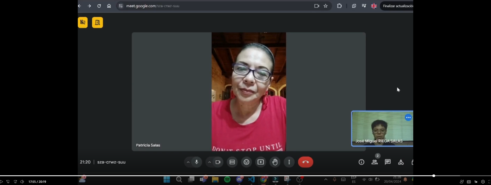

**Timelapse:** [Inicio: 14:45, Fin: 20:19]

**Resumen de la Entrevista:**

Patricia ocupa el rol de directora de planificación de rutas en una empresa de cruceros turísticos de alta gama. Cuenta con 22 años de experiencia coordinando rutas internacionales, especialmente en itinerarios de lujo por el Mediterráneo, Caribe y algunas travesías transatlánticas. Actualmente opera cruceros turísticos de lujo que ocasionalmente incluyen tramos por el Mar Rojo, aunque enfatizó que debido a los riesgos geopolíticos actuales, las rutas por esa zona han sido reducidas significativamente.
Para la planificación y monitoreo en tiempo real, su equipo utiliza una combinación de plataformas AIS, mapas satelitales interactivos y un software interno de optimización de rutas que les permite ajustar trayectos en función de condiciones climáticas y alertas de seguridad. En cuanto a decisiones de desvío, Patricia explicó que, aunque el capitán tiene la última palabra a bordo, todas las decisiones importantes se toman en coordinación con el centro de control en tierra, donde ella participa directamente.
El acceso a información crítica antes de cada travesía se realiza a través de briefings diarios, reportes meteorológicos internacionales, alertas geopolíticas emitidas por agencias de seguridad marítima y consultores externos especializados en riesgos marítimos. Patricia resaltó la importancia de mantener un flujo constante de información actualizada para garantizar tanto la seguridad de los pasajeros como la eficiencia de las operaciones.

**Segmento 2: Exportadores e Importadores de Alta Rotación**

#### Entrevista 1:

**Nombre y Apellido:** Arwen Vasquez

**Edad:** 40 años

**Distrito:** Callao

**Screenshot de la Entrevista:** 
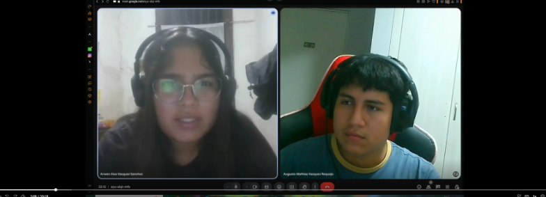

**Timelapse:** [Inicio: 00:00, Fin: 05:01]

**Resumen de la Entrevista:**

Arwen es capitana de embarcaciones pesqueras industriales. Tiene 20 años de experiencia en navegación de alta mar, en especial en el Pacífico Sur. Actualmente no trabaja con cruceros turísticos; opera embarcaciones de pesca de altura, pero conoce bien la planificación de rutas. No transita por el Mar Rojo, ya que su zona de operación está en aguas sudamericanas, pero comentó que entiende la importancia de esa región para el comercio mundial. Para planificar rutas, se apoya en sonares marinos avanzados, cartografía electrónica y informes de corrientes oceánicas. Ella misma, como capitana, decide cambios de ruta si la seguridad de la tripulación está en riesgo, actuando de forma autónoma en alta mar. Accede a informes meteorológicos de alta frecuencia, alertas de fenómenos climáticos, y a redes de información marina compartida entre capitanes pesqueros.

#### Entrevista 2:

**Nombre y Apellido:** Mariela Sanchez

**Edad:** 40 años

**Distrito:** Callao

**Screenshot de la Entrevista:** 
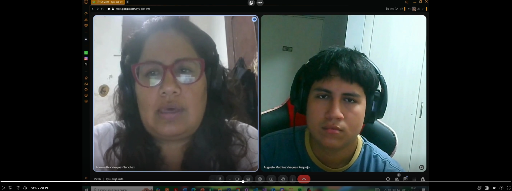

**Timelapse:** [Inicio: 05:01, Fin: 10:45]

**Resumen de la Entrevista:**

Mariela es jefa de operaciones navieras encargada de coordinar rutas para cruceros turísticos regionales. Tiene 16 años de experiencia en logística marítima. Actualmente opera principalmente cruceros turísticos y de lujo, orientados a recorridos en Sudamérica y el Caribe. Aunque su operación no es frecuente en el Mar Rojo, explicó que en temporadas especiales coordinan rutas alternativas que bordean África.
Utiliza plataformas de monitoreo AIS (Automatic Identification System) junto con softwares propios de planificación naviera. En caso de desvíos por riesgos, el capitán del barco tiene la última palabra, pero siempre con el respaldo del equipo de tierra. Mariela recurre a boletines meteorológicos internacionales, reportes de situación política y consultores de riesgos marítimos para cada travesía.

#### Entrevista 3:

**Nombre y Apellido:** Alejandro Rivas

**Edad:** 40

**Distrito:** Callao

**Screenshot de la Entrevista:** 
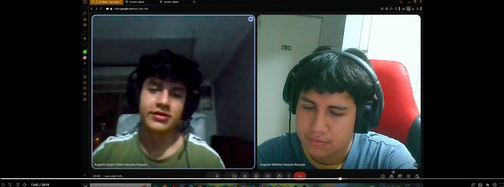

**Timelapse:** [Inicio: 10:45, Fin: 14:45]

**Resumen de la Entrevista:**

Alejandro es capitán de buque de carga internacional. Lleva 18 años navegando rutas tanto regionales como de larga distancia. Actualmente, opera principalmente cruceros de carga pesada, no turísticos. Respecto al Mar Rojo, comentó que transita la zona aproximadamente dos veces al año, y que debido a la situación geopolítica reciente, deben extremar precauciones. Para la planificación y monitoreo de rutas, utiliza sistemas ECDIS (Electronic Chart Display and Information System) combinados con radar de alta precisión. Cuando hay necesidad de desviar la ruta por seguridad, él mismo toma la decisión final, pero siempre consultando previamente con la compañía naviera. Sobre la información previa al viaje, accede a informes meteorológicos satelitales, briefings de inteligencia marítima y actualizaciones de tráfico marítimo en tiempo real.
### 6.3.3. Evaluaciones según heurísticas

## Escala de Severidad

| Escala | 1             | 2     | 3         | 4     | 5         |
|--------|---------------|-------|-----------|-------|-----------|
| Nivel  | No tan grave  | Leve  | Moderado  | Grave | Muy grave |

--------------------------------------------------------

| #Orden | Problema                                                                                         | Escala de Severidad | Heurística / Principio violado(a) |
|--------|--------------------------------------------------------------------------------------------------|---------------------|------------------------------------|
| #1     | No se muestra retroalimentación visual clara al iniciar sesión (ej. “Cargando” o validación visible).           | 4                   | Eficiencia de retroalimentación                  |
| #2     | La interfaz presenta botones sin etiquetas claras o íconos sin descripción visible. | 3                   | Eficiencia de reconocimiento visual             |
| #3     | No hay opción inmediata para deshacer acciones como cancelación o cambio de ruta.       | 3                   | Eficiencia de control del usuario                  |
| #4     | No se presenta resumen comprensible del motivo por el que se eligió una ruta sobre otra.           | 4                   | Eficiencia de interpretación de decisiones                  |
| #5     | Ausencia de mensajes proactivos o alertas sobre condiciones climáticas o bloqueos | 5                 | Eficiencia de prevención de errores
| #6     | 	No hay acceso claro o visual a un historial de rutas anteriores desde la interfaz inicial. | 3                  | 	Eficiencia de recuperación de información

**Heurísticas y Recomendaciones:**

- **Problema #1: Falta de retroalimentación al iniciar sesión**
  - *Heurística:* Visibilidad del estado del sistema
  - *Recomendación:* Agregar un spinner o mensaje tipo “Verificando credenciales…” durante el login. Esto evita que el usuario piense que la app está congelada o fallando.
 

- **Problema #2: Botones e íconos sin etiquetas claras**
  - *Heurística:* Reconocimiento antes que recuerdo
  - *Recomendación:* Añadir etiquetas debajo o junto a los íconos, especialmente en funciones críticas como recalcular ruta o ver reportes. También aplicar tooltips si es web.
 

- **Problema #3: No se puede deshacer acciones fácilmente**
  - *Heurística:* Control y libertad del usuario
  - *Recomendación:* Incorporar botones de "Deshacer" o "Confirmar antes de proceder" para evitar errores graves, especialmente en funciones de recalculo de ruta o cierre de sesión.
 

- **Problema #4: Ruta seleccionada sin justificación visible**
  - *Heurística:* Diagnóstico de errores / Explicabilidad
  - *Recomendación:* Mostrar siempre un resumen breve del porqué de la ruta seleccionada (ej: “ruta óptima por menor tiempo estimado y condiciones climáticas favorables”).
 

- ¨**Problema #5: Falta de alertas proactivas visibles**
  - *Heurística:* Prevención de errores
  - *Recomendación:* Implementar un panel o ícono de alerta que indique eventos en tiempo real (cierres de puertos, tormentas, etc.) y permita actuar de inmediato.
 

- **Problema #6: Historial de rutas poco accesible**
  - *Heurística:* Flexibilidad y eficiencia
  - *Recomendación:* Añadir en el menú principal un acceso directo a “Historial de rutas” con filtrado por fecha, destino y embarcación.

